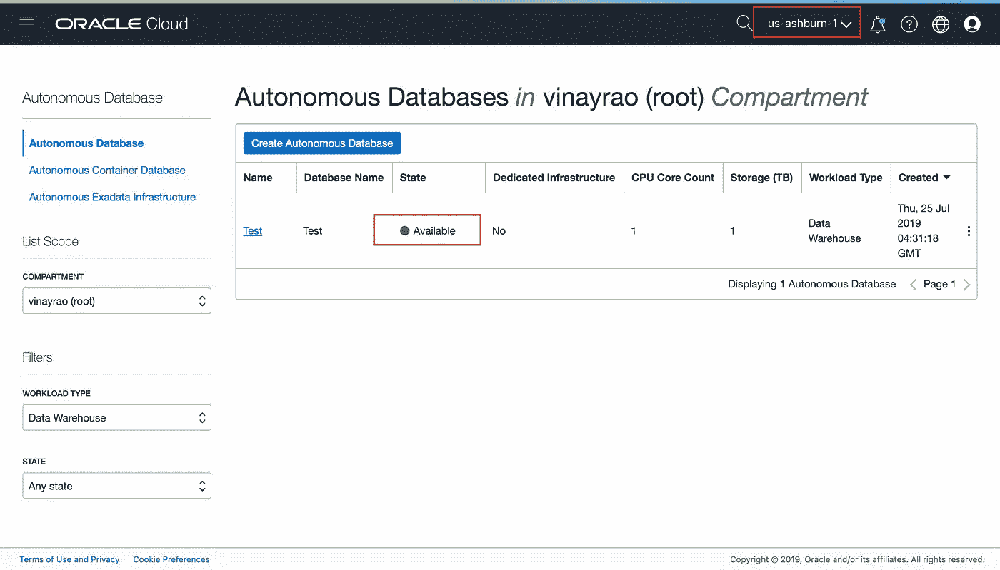

# 在 Microsoft Azure 和 Oracle 云基础架构上构建多云应用

> 原文：<https://medium.com/oracledevs/from-azure-to-autonomous-an-enterprise-multi-cloud-journey-an-enterprise-multi-cloud-journey-cc070a28cb10?source=collection_archive---------5----------------------->

特别鸣谢合著者[萨姆·沙阿](https://medium.com/u/63e06eaf11a4?source=post_page-----cc070a28cb10--------------------------------)

(Image credit: Image Credit: Everything Possible / Shutterstock)

随着多重云故事的展开，企业正在寻求构建跨越基础设施和云提供商的应用。[甲骨文和微软最近宣布云合作](https://blogs.oracle.com/cloud-infrastructure/oracle-microsoft-azure-alliance?source=post_page---------------------------)。这种合作关系支持跨云网络、统一身份&访问管理，以及跨微软 Azure 和甲骨文云基础设施(OCI)的协作和集成支持模式。跨云网络是一个安全的专用链路，在两个云提供商之间提供高带宽和低延迟。客户无需与第三方网络提供商合作来设置跨云连接。

跨云连接的力量支持许多用例。下面是一些使用案例:
1。Azure 上的 Web/App、Oracle Autonomous、OCI 上的 ExaCS 数据库
2。Oracle 上的 Java 和 Oracle 应用程序。Azure 上的. NET/SQL Server 应用程序
3。Azure
4 自治数据库中的数据挖掘。跨云的应用到应用的互操作性
5。跨多个云供应商的高可用性

最近 [Jamal Arif](https://medium.com/u/de35270dbab5?source=post_page-----cc070a28cb10--------------------------------) 发表了一篇 [**博客**](/@j.jamalarif/how-to-setup-the-interconnect-between-oracle-cloud-infrastructure-and-microsoft-azure-da359233e5e9) ，带领用户简单地在微软 Azure 和甲骨文云基础设施(OCI)之间创建一个端到端的云互联。

作为该系列的延续，通过这篇博客，我们([Sam Shah](https://medium.com/u/63e06eaf11a4?source=post_page-----cc070a28cb10--------------------------------)&[Vinay Rao](https://medium.com/u/67948792d94b?source=post_page-----cc070a28cb10--------------------------------))将带您了解构建一个简单的 2 层多云应用程序的过程，该应用程序可以帮助企业设想利用这两家云提供商的最佳服务的应用程序

在开始构建应用程序之前，让我们快速浏览一下架构

在上面的设置中，应用程序层驻留在 Azure 计算上，数据库层是 Oracle 自治数据库产品。应用程序层将使用[传输路由:对 Oracle 服务的私有访问](https://docs.cloud.oracle.com/iaas/Content/Network/Tasks/transitroutingoracleservices.htm)，通过安全的私有连接向/从自治数据库层写入/查询数据。

> **先决条件:**
> 
> 在开始部署应用程序之前，请阅读[如何设置 Oracle 云基础设施和 Microsoft Azure 之间的互连](/@j.jamalarif/how-to-setup-the-interconnect-between-oracle-cloud-infrastructure-and-microsoft-azure-da359233e5e9)博客，以设置 Oracle 云基础设施和 Microsoft Azure 之间的端到端连接。

**第一步:在 Oracle 上设置自治数据库**

登录到 OCI 控制台，选择 us-ashburn-1 区域，并在快速设置菜单上单击“创建自治数据仓库”选项以启动自治数据仓库服务。

现在，按照设置向导设置 ADW 服务实例所需的所有参数，并选择页面左下角的“创建自治数据库”按钮

一旦创建了自治数据库，数据库将需要 3-5 分钟的时间进行资源调配。

现在下载钱包文件(客户端凭证),因为我们将在后面的步骤 4 中用到它

从自治数据库控制台，您可以右键单击自治数据库并进入服务控制台

现在导航到管理部分并下载钱包文件

稍后将使用钱包文件

**第二步:在 Azure 上设置应用层**

现在登录到 Azure 门户网站，并在您按照先决条件步骤创建的网络中创建一个 Ubuntu 虚拟机

请确保将网络安全组配置为允许所需的数据库端口和其他连接

虚拟机启动并运行后，SSH 进入虚拟机并确保连接正常

**步骤 3:设置到 Oracle 服务的私有对等路由**

假设您已经完成了先决条件步骤，并且在 Oracle 云基础架构和 Microsoft Azure 之间建立了私有对等链接，那么这两个基础架构中的虚拟机现在可以通过私有连接安全地相互访问。

现在，为了通过安全的专用连接访问自治数据库，我们将利用最近发布的[Transit Routing:Private Access to Oracle Services](https://docs.cloud.oracle.com/iaas/Content/Network/Tasks/transitroutingoracleservices.htm)特性。

为了启用这个特性，让我们使用下面的文档创建一个服务网关: [OCI 服务网关](https://blogs.oracle.com/cloud-infrastructure/access-oracle-services-privately-with-a-service-gateway)

导航到虚拟云网络>虚拟网络详细信息，选择左下方的服务网关资源，然后单击创建服务网关按钮

现在，按照向导创建一个服务网关，以访问“Oracle 服务网络中的所有 IAD 服务”

现在，一旦创建了服务网关，我们将创建 2 个路由表: [DRG](https://docs.cloud.oracle.com/iaas/Content/Network/Tasks/managingDRGs.htm) 路由表和 [SGW](https://docs.cloud.oracle.com/iaas/Content/Network/Tasks/servicegateway.htm) 路由表

路由表 1: DRG 路由表

现在，让我们将该路由表与 DRG 相关联，以确保所有 Oracle 服务路由都由 DRG 通告

现在路由表与 DRG 相关联，DRG 将通过 Azure Express 路由通告 OSN 网络路由，并且这些路由在虚拟机的路由表上可见

现在，为了确保来自 Oracle 服务网络的流量能够到达远程 Azure 应用程序，让我们创建 SGW 路由表

路由表 2: SGW 路由表

并将 SGW 路由表关联到 SGW

**第四步:安装应用程序**

既然已经建立了连接。让我们安装将从自治数据库挖掘数据的应用程序

要安装该应用程序，请遵循以下步骤

步骤 1:在 Azure VM 中使用下面的[链接](https://gist.github.com/tcnksm/7316877)安装 Oracle 实例客户端

步骤 2:上传步骤 1 中提到的 Wallet 文件，解压缩文件夹，并使用这些文件访问自治数据仓库数据库中的数据。

步骤 3:从这个 [repo](https://github.com/sssshah) 中克隆应用程序代码。

步骤 4:运行应用程序

瞧啊。驻留在 Azure VNET 的简单 python 应用程序可以秘密地、安全地从 Oracle 自治数据库读取数据。

结论:

我们希望你喜欢阅读这个博客，示例 2 层应用程序只是一个概念证明，以帮助你建立你的想法和跨 Azure 和 OCI 的应用程序。

我们期待保持联系，并让企业从这种多云合作伙伴关系中受益。

> 视频博客即将推出