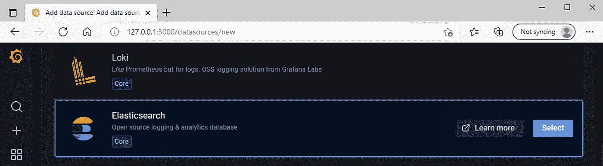

# 从黑鸭到格拉夫纳

> 原文：<https://medium.com/globant/from-black-duck-to-grafana-529bc83e4de6?source=collection_archive---------1----------------------->

# 介绍

Black Duck 是一个用于管理安全性、许可证合规性和代码质量风险的解决方案，这些风险来自于在应用程序和容器中使用开源。

它有一个很好的 web 界面，很酷的工具，很容易与 CI 系统集成，但是它缺少一个重要的东西:被扫描项目的漏洞演化历史。


Grafana 可以用我们的方式来帮助我们实现这一点，使用以下 3 个步骤，您也可以在您的环境中复制它。

本文将描述如何使用 Grafana 完成漏洞故事。

# 本文涵盖了以下几点:

如果你想简化这个过程，我建议在你的环境中安装 docker。在我们的例子中，我们将使用 Windows 机器来实现这一点，但是对于其他操作系统来说，这个过程几乎是相同的。

1.  **黑鸭子**:把黑鸭子的扫描结果放到易于解析和使用的地方。在我们的例子中是 CSV 格式。
2.  **弹性搜索**:将这些结果安装并导入到弹性搜索实例中。
3.  **Grafana** :安装 Grafana，使用弹性搜索里面存储的数据生成想要的图形。
4.  **参考文献**

# **第一部分:黑鸭子**

在这个 github 存储库中，您可以找到将黑鸭扫描结果导出为 CSV 格式的 python 代码。

在使用它之前，请转到黑鸭 web 界面->“我的访问令牌”并生成一个具有“读写访问权限”的新令牌。

克隆以下 github 库:[https://github.com/ciorceri/BlackDuckReporting](https://github.com/ciorceri/BlackDuckReporting)

按照 README.md 中的说明设置环境。

工具的使用:

```
usage: main.py [-h] -b BASEURL -t TOKEN [-v VERSION] 
               [-f FILTERPROJECT]BlackDuck reportingoptional arguments:
  -h, --help            show this help message and exit
  -b BASEURL, --baseurl BASEURL
                        Url to BlackDuck server
  -t TOKEN, --token TOKEN
                        Token used to connect to BlackDuck server
  -f FILTERPROJECT, --filterproject FILTERPROJECT
                        Filter project names
  -v VERSION, --version VERSION
                        Project version to scan
```

**-b** / **- baseurl** 和 **-t** / **- token** 参数是必需的，并且必须用 BlackDuck 基本 url 填充，其格式可以是“https://your _ name . app . black duck . com ”,并且 token 是 BASE64 字符串。

使用**-f**/**-filter project**参数，您可以过滤将要生成报告的项目。如果未提供，则将所有项目添加到报告中。

**-v** / **- version** 是一个可选参数，仅过滤指定版本的扫描。如果在扫描时没有指定版本，默认情况下 BlackDuck 将使用 git 标签/分支名称来检测版本。在我的例子中，默认版本是‘master’(与被扫描的存储库的分支名称相同)

报告的输出在**中。csv 格式**很容易解析，以后可以用它进行弹性搜索。

# **第 2 部分:弹性搜索安装**

为了测试 Elastic Search 是否已安装并运行，我建议使用本指南安装 ElasticHQ(或任何其他类似的工具):[http://docs . Elastic HQ . org/installation . html # running-with-docker](http://docs.elastichq.org/installation.html#running-with-docker)。

ElasticHQ 是一个监控和管理 Elasticsearch 集群的平台。

打开 ElasticHQ web ui，连接到您的弹性搜索实例。

注意:您不能使用“localhost:9200”进行连接，因为使用您的路由器为您的机器分配的 IP 地址。


我们可以看到，我们有一个节点和一个索引，名为**。橡皮筋**。

要将黑鸭扫描结果导入弹性搜索，我们必须运行一个简单的 Python 3 脚本

```
import csv
from elasticsearch import Elasticsearch, helpersdef main():
    es = Elasticsearch([{'host': 'localhost', 'port': 9200}])
    with open('black_duck_nodegoat_scan.csv') as f:
        reader = csv.DictReader(f)
        helpers.bulk(es, reader, index='nodegoat')if __name__ == '__main__':
main()
```

导入后，一个名为“nodegoat”的新索引出现在 ElasticHQ 界面中。


我们都很好，扫描结果被上传到弹性搜索，剩下的就是使用 Grafana 内部的这些数据。

# **第三部分:Grafana 安装**

使用什么样的图片并不重要，在我们的例子中，我使用的是 Ubuntu。

打开 Grafana web 界面: [http://127.0.0.1:3000](http://127.0.0.1:3000) /使用 admin:admin 登录并转到配置- >数据源


并添加了“弹性搜索”数据源。



更改配置:

```
HTTP -> URL : [http://10.18.21.47:9200](http://localhost:9200) (use your IP Address assigned to your machine by your router)
Elasticsearch details -> Index name : nodegoat
Elasticsearch details -> Pattern : Daily/Weekly
Elasticsearch details -> Time field name : Timestamp
Elasticsearch details -> Version : 7.0+
```

Grafana -> Create -> Dashboard，使用 Lucene 查询语言定制 Grafana 仪表盘。下面是几个例子:


配置 Grafana Dashboard 后，您应该有一些包含过去数据的图表，如下所示:


# 第 4 部分:参考

Grafana 官方指南:[https://grafana . com/docs/grafana/latest/installation/docker/](https://grafana.com/docs/grafana/latest/installation/docker/)

弹性官方指南:[https://www . elastic . co/guide/en/elastic search/reference/current/docker . html](https://www.elastic.co/guide/en/elasticsearch/reference/current/docker.html)

[全球网络安全](https://www.globant.com/studio/cybersecurity)