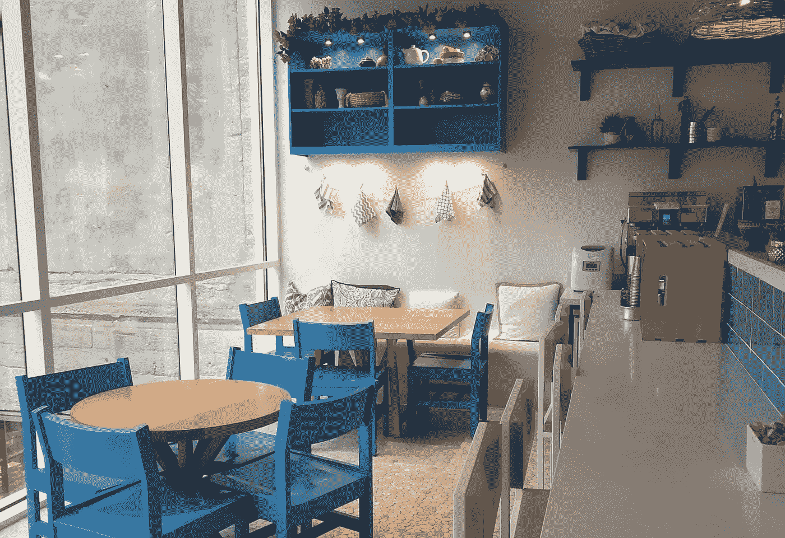

# 使用 Airbnb Plus 从数据到行动

> 原文：<https://medium.com/airbnb-engineering/from-data-to-action-with-airbnb-plus-54f4d8f80361?source=collection_archive---------0----------------------->

## Airbnb 数据科学实习生如何度过暑假的故事

A new “Plus” listing in Chicago offers a beautiful loft setting with a clean aesthetic

实习是学生在大学期间最有影响力的经历之一。很少有机会能让你在短短的 12 周内学习和成长这么多。最重要的是，参加实习有助于建立联系，改善团队合作，并学习如何驾驭组织。

今年夏天，我是 Airbnb Plus 新团队的数据科学(DS)实习生——我有出色的榜样，做了有意义的工作，发展了有价值的技能，交了很好的朋友。在这篇文章中，我希望回答一些关于 Airbnb 数据科学家的常见问题，并揭示一个 DS 实习生真正做什么。

# 角色

当查看整个行业中“数据科学家”的不同职位描述时，很容易感到困惑。任务和需求的范围可能从定义度量标准和提供产品建议，到精心制作复杂的实验来测量产品变更的影响，到构建复杂的模型来预测实施这些变更的结果。虽然所有这些都是数据科学家在公司可能做的事情的很好的例子，但并不是所有这些都适用于每个人。

在 Airbnb，我们在数据科学的保护伞下拥抱这种技能的多样性，但也明白某些味道的数据科学对不同背景的不同人有更大的吸引力。我们将数据视为大规模用户的声音，由我们的数据科学家来翻译，以便公司的每个人都能听到声音。为了确保人们致力于他们感到兴奋的问题，并确保每个员工都有明确的预期，Airbnb 为数据科学家设立了三个轨道:**分析**、**推理、**和**算法**。

**分析**路线专注于使用数据来讲述故事的人。分析数据科学家通过指标、仪表盘和创造性分析回答业务问题。**推理**路线更适合精通统计学的人，他们帮助 Airbnb 衡量和解释变化的影响，从而改善决策。**算法**赛道吸引了那些对机器学习充满热情并希望利用 Airbnb 的海量数据开发新方法来解决挑战性问题的人。

尽管在将技能和兴趣与数据科学家可以在 Airbnb 解决的问题相结合方面提供了支持，但轨道不是限制性的——可以根据团队需求和增长愿望开展所有三个领域的项目。这同样适用于实习生；我们加入 Airbnb 是在一个给定的轨道下，但我们在夏季从事的项目可以跨越多个领域。有关数据科学路线及其形成的更多详细信息，请查看我们的数据科学负责人 Elena Grewal 的[帖子](https://www.linkedin.com/pulse/one-data-science-job-doesnt-fit-all-elena-grewal/)。

# 该组织

Airbnb 的 DS 组织的一个特殊方面是我们在团队中的嵌入程度。一方面，我们在每个业务部门内部都有团队。例子可能包括致力于提高主机提供优质服务的能力，确保为商务旅行者提供方便的费用跟踪集成，或保证平台上提供的每种体验的质量。另一方面，我们有平台团队，这是 Airbnb 产品和服务的支柱。他们可能负责为支付处理提供强大、安全的 API，保护我们的社区和 Airbnb 的安全，或者构建支持我们分析工具的数据基础设施。

这些团队中的每一个，业务或平台，都将容纳数据科学家。这种分布式组织有助于更好地满足每个群体的需求和挑战。通过与工程、设计、运营、预防性维护、研究和许多其他职能部门密切合作，数据科学家能够更深入地了解他们寻求授权的业务和团队运营。这也使得数据更容易参与大多数决策 *—* ，不仅为整体战略提供信息，而且出现在每天的产品迭代中。

# 背景

作为一名计算机科学硕士学生，在加入 Airbnb 之前，我有一个先入为主的想法，即大多数技术职位都由计算机科学专业的学生担任。到达这里后，我惊喜地发现这里有更广泛的背景和技能。数据科学家的核心能力包括对数据和实验的熟悉程度、向不同技术水平的受众传达发现的能力、对细节和数据质量的关注、对统计数据的扎实理解以及构建可扩展解决方案的愿望。这些品质存在于无数的领域，从计算机科学和工程到统计学，从经济学和社会科学到物理科学等等。

在我看来，背景和专业知识的多样性是 Airbnb 数据科学的最大优势之一。我们有构建复杂学习算法的计算机科学专家，研究如何最大化我们在社区中的积极影响的经济学和政策研究人员，帮助团队衡量每一个产品变化的商业影响的精明的统计学家，等等。然而，归根结底，我们都是数据科学家。

# 使用 Plus

Airbnb Plus 是质量无可挑剔的房屋新选择，由以热情好客和注重细节而闻名的主人提供。此外，住宅配有一套标准的便利设施，并经过精心设计，展示了许多个性。因此，每个家庭都是独一无二的。为了提供始终如一的质量水平，Plus 计划中的每个家庭都会亲自接受全面检查。

我选择与 Plus 合作是经过深思熟虑的。我对技术的商业方面感兴趣，也喜欢快速移动的团队，我知道我会在 Plus 找到一个很好的对手。然而，无论你在哪里，团队和经理都非常愿意根据你的兴趣和技能来定制你的实习经历。加上这没有什么不同。

## 运营效率分析

在我的第一个项目中，我尝试了产品分析和运营效率。让新主人加入 Plus 计划并检查每一个家庭以确保所有质量和设计标准都得到满足的过程并非没有后勤挑战。我的工作包括与一名工程经理合作，并对入职流程特定阶段的人员行为进行深入分析。使用不同种类的平台日志，我调查了使用行为的趋势，通过有趣的维度来揭示潜在的问题。

在技术方面，数据科学工作有很大的灵活性。SQL(以及一般的查询语言)的基础知识对于理解和从存储数据的地方提取数据是必不可少的。分布式 SQL 查询引擎，如 [Presto](https://prestodb.io/) 和 [Hive](https://hive.apache.org/) ，有助于我们处理大规模的数据。对于分析本身，有更大的选择自由。虽然很多事情可以通过 SQL 使用工具来完成，比如我们的 Airbnb 构建的、现已开源的 [SQL 实验室](https://superset.incubator.apache.org/sqllab.html)，但一些数据科学家是超级粉丝，而其他人则是 Python[的铁杆用户。由于我们的团队多年来构建的所有内部工具和库，这些语言都得到了很好的支持，可以轻松地与我们的数据仓库连接，并可以产生随时共享的结果。](https://www.python.org/)

See SQL Lab in action.

最终，我的分析和建议被分享给了团队——主要是工程经理和产品经理——并被用来为产品决策提供信息。数据科学家在 Airbnb 做的大多数项目都记录在[知识库](https://github.com/airbnb/knowledge-repo)中。知识报告也是开源的，它促进了分析的文档化、发现和复制。任何调查特定问题并需要数据的员工都可以通过知识报告进行搜索，并找到全公司科学家在该主题上完成的所有工作数据。要了解更多关于知识回购是如何构思的，请查看本文。

## 度量定义

我的第二个项目最初看起来技术含量较低，但复杂程度要高得多。任务是定义一个顾客满意度的衡量标准，由团队在接下来的几年里进行跟踪。在我实习的后半段，我尝试了几个指标，并在这个过程中咨询了其他数据科学家和利益相关者。我学到了有效沟通的重要经验——特别是因为这个项目非常引人注目，需要领导的批准。在这篇文章中，我想分享一些我在今年夏天学到的关于定义一个指标的想法。

1.  **一个好的指标应该是稳定的**:如果你跟踪的指标有非常不可预测的行为，看似毫无理由地飙升和暴跌，它在实践中的适用性将会受到限制。团队将不知道如何利用它，以及如何利用它来引导他们的工作向前发展。
2.  **一个好的度量标准应该易于理解和测量**:在我的项目中，我尝试了不同的度量方法。有些非常复杂，涉及不同指标的加权分数。对于这些人来说，很容易忽略我们实际测量的内容。我经常发现自己在问:“这个值多少？”易于理解和衡量的指标有助于确保目标始终可见，并且我们知道自己一直做得有多好。
3.  **一个好的指标应该与业务目标一致，并激励团队**:与上一点相关，一个有明确含义的指标更有可能引起团队的共鸣。此外，它不应该测量任何东西，而主要是对团队和业务最重要的因素。
4.  一个好的度量标准应该是可操作的，并能被团队影响的:当一个度量标准有多个团队无法影响的组成部分时，它很容易被忽略。毕竟，我们为什么要跟踪一些并不真正反映我们所做工作的东西呢？类似地，度量标准的变化应该易于诊断和操作。结合这两个需求的方法是让度量由团队可以影响的因素组成，并且可以被单独分析以诊断变化并通知进一步的行动。
5.  **一个好的指标应该是可比较的**:在我们的案例中，在 Plus 团队之外，我们的指标也可以很容易地为产品的剩余部分进行计算，这一点非常重要。这将作为一个基准，告诉我们相对于我们所处的环境，我们做得如何。

在领导层输入、审核和批准后，该指标最终确定，并将作为衡量进展的一种方式进行跟踪。由于移动部件、利益相关者的数量和更高的可见性，这个项目比前一个项目更加细致和复杂。它还帮助我作为一名数据科学家和一名沟通者获得了巨大的成长。

# 体验

作为 Airbnb 的数据科学实习生度过这个夏天真是一件乐事。从一开始，我就感觉受到了周围所有人的欢迎和尊重，这才是真正的东道主精神。其中不乏有趣的项目或挑战。也许最重要的是，实习生与真正伟大的导师配对——个人贡献者，他们有着持续卓越的表现记录，并愿意让它发挥作用。

Santorini, a micro-kitchen inspired by Greece, where I had most of my meetings

当我回顾我在过去三个月的成就时，共同点是令人惊讶的敬业的人们不断的支持和鼓励。随着夏天的结束，我带着苦乐参半的感觉离开，完成了一个重要的章节，但希望更多。虽然我会怀念每天醒来为我们的客人和主人社区改善体验的日子，但我毫不怀疑 Airbnb 大家庭会好好照顾他们。

有兴趣利用数据解决 Airbnb 令人兴奋的项目吗？实习生和新毕业生数据科学职位将很快在[https://www.airbnb.com/careers/university](https://www.airbnb.com/careers/university)开始招聘