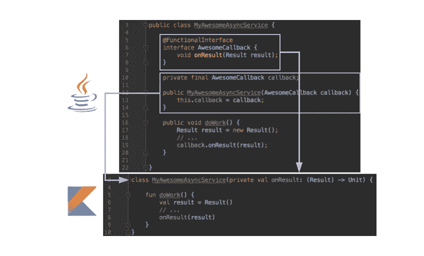

# 从函数式 Java 到函数式 Kotlin

> 原文：<https://medium.com/androiddevelopers/from-functional-java-to-functioning-kotlin-a4874a4a7a5?source=collection_archive---------5----------------------->

## 将@FunctionalInterface 转换为 Kotlin

Java 8 引入了一个名为`[@FunctionalInterface](https://docs.oracle.com/javase/8/docs/api/java/lang/FunctionalInterface.html)`的新注释。它的目的是能够用一个非默认的方法创建一个接口，这样这个接口就可以在一个面向对象的语言中模拟作为一等公民的函数。例如，`[Comparable](https://docs.oracle.com/javase/8/docs/api/java/lang/Comparable.html)`是一个有一个方法的`@FunctionalInterface`，`[compareTo(T o)](https://docs.oracle.com/javase/8/docs/api/java/lang/Comparable.html#compareTo-T-)`。

对于函数接口来说，回调是一种非常常见的情况。想象以下场景，我们希望执行一些异步工作，并在稍后将结果返回给客户端。在 Java 中，我们会有一个如下所示的类:

```
public class MyAwesomeAsyncService {

    @FunctionalInterface
    public interface AwesomeCallback {
        void onResult(Result result);
    } private final AwesomeCallback callback;

    public MyAwesomeAsyncService(AwesomeCallback callback) {
        this.callback = callback;
    } public void doWork() {
        ...
        callback.onResult(result);
    }
}
```

我们使用一个回调接口，它有一个客户端代码需要实现的方法。

在 Android Studio 中使用 Kotlin 转换器时，转换器没有优化转换`@FunctionalInterface`。

```
class MyAwesomeAsyncService(private val callback: AwesomeCallback) {

    @FunctionalInterface
    interface AwesomeCallback {
        fun onResult(result: Result)
    } fun doWork() {
        ...
        callback.onResult(result)
    }
}
```

转换器创建了一个用于一对一转换的接口，但是还可以进一步优化吗？在 Kotlin 中有一个概念叫做 [SAM 或者单一抽象方法](https://kotlinlang.org/docs/reference/java-interop.html#sam-conversions)。这正是 Java 8 中的`@FunctionalInterface`,但是文档中的部分没有给出如何创建 SAM 的例子，只有如何使用 SAM。

在将接口转换成构造函数中的函数后，围绕`@FunctionalInterface`柄的样板代码从 96 个字符变成了 38 个字符。那就是减少了 40%！

```
class MyAwesomeAsyncService(private val onResult: (Result) -> Unit) {

    fun doWork() {
        ...
        onResult(result)
    }
}
```

当检查 before 和 after 时，您可以看到代码是如何融入 Kotlin 的语法中的。



The before and after converting Java to Kotlin

如果你正在转换一个项目或用 Kotlin 写作，我很想听听你偶然发现和学到了什么。如果您想继续讨论，请在 [Twitter](https://twitter.com/benjamintravels) 上发表评论或与我交谈。