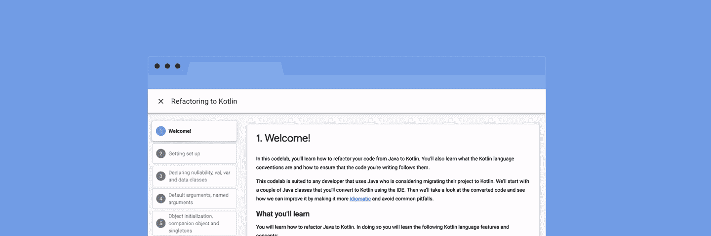

# 从 Java 编程语言到 kot Lin——惯用方式

> 原文：<https://medium.com/androiddevelopers/from-java-programming-language-to-kotlin-the-idiomatic-way-ac552dcc1741?source=collection_archive---------5----------------------->

[Refactoring to Kotlin](https://codelabs.developers.google.com/codelabs/java-to-kotlin/#0) codelab (English, [Chinese](https://clmirror.storage.googleapis.com/codelabs/java-to-kotlin-zh/index.html#0), [Brazilian Portuguese](https://codelabs.developers.google.com/codelabs/java-to-kotlin-pt-br/#0))

了解如何开始将 Java 编程语言代码转换为 Kotlin，使其更符合习惯并避免常见的错误，请跟随我们新推出的[重构到 Kotlin](https://codelabs.developers.google.com/codelabs/java-to-kotlin/#0) codelab，该软件有英文版🇬🇧、[中文版](https://clmirror.storage.googleapis.com/codelabs/java-to-kotlin-zh/index.html#0) 🇨🇳和[巴西葡萄牙文版](https://codelabs.developers.google.com/codelabs/java-to-kotlin-pt-br/#0) 🇧🇷.

当您第一次开始编写 Kotlin 代码时，您倾向于遵循 Java 编程语言的习惯用法。作为 Android Studio 和 Intellij IDEA 的一部分，[自动转换器](https://www.jetbrains.com/help/idea/converting-a-java-file-to-kotlin-file.html)可以很好地自动重构你的代码，但有时，它需要一点帮助。这就是我们对 Kotlin codelab 的新重构的用武之地。

我们将采用 Java 编程语言中的两个类(一个`User`和一个`Repository`)并将它们转换成 Kotlin，看看自动转换器做了什么以及为什么。然后我们进入下一个阶段——使它成为习惯用法，一路上教授最佳实践和有用的技巧。

对 Kotlin codelab 的[重构从基本主题开始——理解 Kotlin 中如何声明可空性，定义了什么类型的等式，或者如何最好地处理其角色只是保存数据的类。然后我们继续讨论如何在 Kotlin 中处理`static`字段和函数，以及如何在一个方便的关键字`object`的帮助下应用单例模式。我们将看到 Kotlin 如何帮助我们更好地建模我们的类，它如何区分类的属性和类可以做的动作。最后，我们将学习如何仅在具有作用域函数的特定对象的上下文中执行代码。](https://codelabs.developers.google.com/codelabs/java-to-kotlin/#0)

从对 Kotlin codelab 的[重构开始，学习惯用 Kotlin 的基础知识！](https://codelabs.developers.google.com/codelabs/java-to-kotlin/#0)

感谢[瓦尔米尔·卡瓦略](https://medium.com/u/68f2f1ed5a52?source=post_page-----ac552dcc1741--------------------------------)和[尼尔森·格劳伯](https://medium.com/u/f2a623389642?source=post_page-----ac552dcc1741--------------------------------)将 codelab 翻译成[巴西葡萄牙语](https://codelabs.developers.google.com/codelabs/java-to-kotlin-pt-br/#0)！