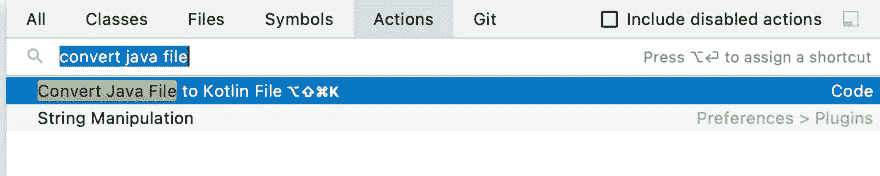
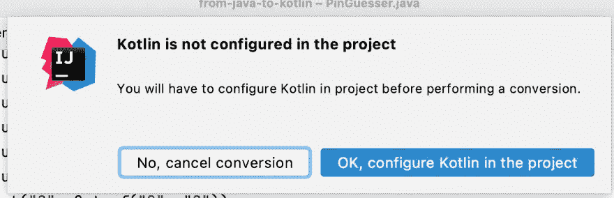
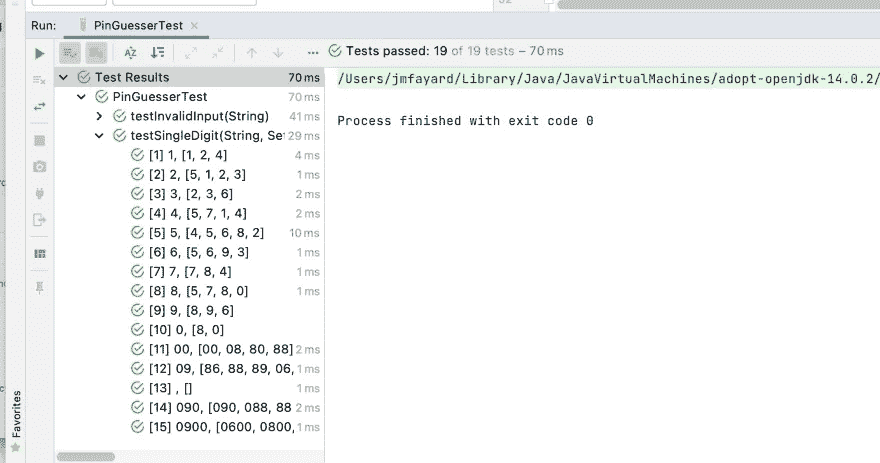
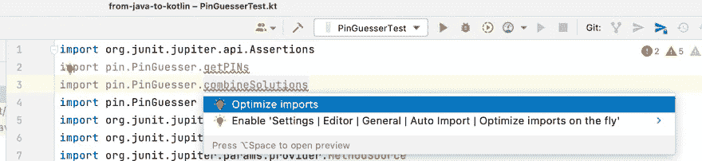
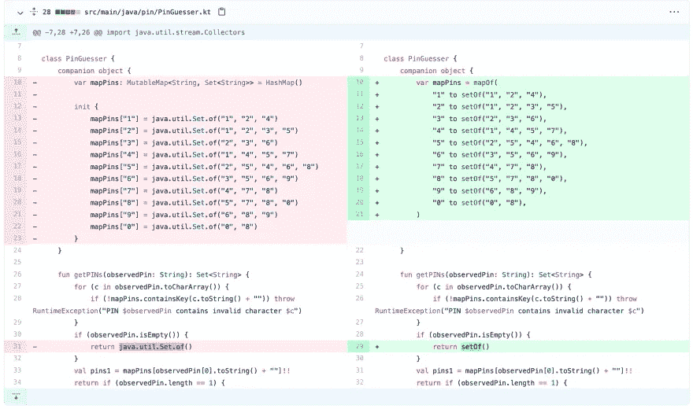

# 20 分钟内从爪哇到⚡️科特林

> 原文：<https://blog.kotlin-academy.com/from-java-to-kotlin-in-20-minutes-%EF%B8%8F-78ef76fa7691?source=collection_archive---------0----------------------->

作为一个 Java 开发者开始用 Kotlin 编程是什么样的体验？

Credits: Katerine Salazar Gonzalez

作为一个 Java 开发者开始用 Kotlin 编程是什么样的体验？

我不记得了，对我来说是好几年前的事了！

幸运的是，和同事们的一次编程会议让我有机会以一个初学者的心态重新审视事物。

# 给我看看代码！

要继续学习，请查看代码。你需要安装 [IntelliJ 社区版](https://www.jetbrains.com/idea)。免费的！代码驻留在****的`java`和`kotlin`分支中。**您可以在此拉取请求 中看到下面 [**描述的所有变更**](https://github.com/jmfayard/from-java-to-kotlin/pull/1)**

** [## 通过 jmfayard 从 Java 到 Kotlin 拉请求#1 jmfayard/from-java-to-kotlin

### 将此建议添加到可以作为单次提交应用的批处理中。此建议无效，因为没有更改…

github.com](https://github.com/jmfayard/from-java-to-kotlin/pull/1) 

先来解释一下我们故事的来龙去脉。

# 暴民编程

我的同事莎拉、彼得和我正在进行一次乌合之众编程。

目标是解决被观察针的[形，一个不可靠的间谍说他看到针 **1357** 被使用。但实际上，他不太确定。在键盘布局上，每个数字都可以是它的一个邻居。因此，实际的销可以是 **1357、**但也可以是例如 **2357** 或 **1368。**](https://www.codewars.com/kata/5263c6999e0f40dee200059d/train/java)

这个项目是用 Maven 构建的 Java 项目。它包含两个文件:`PinGuesser.java`和`PinGuesserTest.java`。它在几秒钟内编译并运行单元测试，而不是像许多 Android 应用程序那样需要几分钟。依我看，这有助于更好的开发者体验。

我们用 IntelliJ 的代码和我一起写代码。

我们做得很好，用 Java 解决了形，然后将其重构到一个令人满意的状态。

*   莎拉:还有什么我们可以改进的吗？
*   彼得:我不知道，我觉得不错。
*   我:好吧，我们还有 20 分钟，为什么不用科特林重写一遍呢？
*   莎拉:哦，我听说过科特林，但还没机会用它。尽管 20 分钟，你认为我们能做到吗？
*   *我*:让我们开始吧，看看它会把我们引向何方！

# `Tools > Kotlin > Configure Kotlin in project`

*   彼得:好吧，我这辈子都没做过科特林，告诉我该怎么做。
*   *Me* :有一个命令 IntelliJ 叫`Convert Java File to Kotlin File`。这是一个很好的起点！
*   彼得:让我们试一试。

*   *彼得* : IntelliJ 告诉我科特林没有配置，这是有道理的。如何在 Maven 中配置 Kotlin？
*   我:我不知道，我一直用 Gradle。就让 IntelliJ 去做吧！顺便说一下，它会做的事情和`Tools > Kotlin > Configure Kotlin in project.`是一样的
*   彼得:让我们开始吧。似乎奏效了。文件`pom.xml.`有更新
*   *彼得* : [第一次提交](https://github.com/jmfayard/from-java-to-kotlin/pull/1/commits/caaab696fa50e57e5bcb7c0a23f70de29b43b480)。

# 告诉 Java 那个`@ParametersAreNonnullByDefault`

*   我:在我们尝试 Java 到 Kotlin 的转换器之前，我们需要注意一些事情。如你所知，Kotlin 在类型系统中集成了可空性，而 Java 默认没有。因此，转换器将允许处处为空，这在技术上是正确的，但不是您想要的。
*   Sarah :但是 Java 里有注释来说明某个东西是否可以为空，对吗？
*   *我*:正是！我们想要的是默认情况下一切都是非空的。方便的是，在科特林也是如此。

[https://gist.github.com/jmfayard/d3a9518679e264a48ac7f2f22eae9492](https://gist.github.com/jmfayard/d3a9518679e264a48ac7f2f22eae9492)

# PinGuesser: `Convert Java File to Kotlin File`

*   彼得:我想我现在打开`PinGuesser.java`并重新启动转换器`Convert Java File to Kotlin File`。
*   *Me* :正确。
*   彼得:看来……成功了？有一个文件`PinGuesser.kt`。
*   我:但是，你怎么知道它有效呢？
*   莎拉:你应该运行单元测试。
*   彼得:对。

*   彼得:仍然是绿色的。令人惊讶的是，我已经写了我的第一个 Kotlin 代码，而且没有错误！
*   莎拉:干得好！
*   彼得:考试怎么样了？我们不应该也转换那些吗？
*   *我*:不需要。Java 和 Kotlin 可以在同一个代码库中和平共存。
*   莎拉:好吧，但是看起来很有趣，我也想试试！
*   *彼得*:首先让我[提交](https://github.com/jmfayard/from-java-to-kotlin/pull/1/commits/08f5f3d1d5f84a8746a671e3828c18d3d703ae06)。

# PinGuesserTest: `Convert Java File to Kotlin File`和手动修复

*   莎拉:所以我打开`PinGuesserTest.java`并运行命令。怎么叫？
*   *彼得* : `Convert Java File to Kotlin File`。
*   莎拉:我们走吧！…我现在有一个`PinGuesserTest.kt`。尽管它有一些错误。

*   彼得:也许应用这个建议来优化进口？
*   莎拉:好的……成功了。
*   我:正如你所看到的，它并不完美，但它是一个非常棒的学习工具:你从你已经知道的东西(用 Java)开始，然后看到它转化成你想要学习的东西(用 Kotlin)。
*   莎拉:让我运行单元测试……我有一些奇怪的 JUnit 错误。

*   我:好的，我明白了。Java 有**静态**方法，而 Kotlin 有[伴随对象{ … }](https://kotlinlang.org/docs/object-declarations.html#companion-objects) 的概念。它的方法*看起来像*静态方法，但是有点不同。这里 JUnit 真的想要静态方法，我们需要一个注释来让它开心。

[https://gist.github.com/jmfayard/4fdab0dfd6a4b403aac641c19c5237e9](https://gist.github.com/jmfayard/4fdab0dfd6a4b403aac641c19c5237e9)

*   莎拉:单元测试现在可以工作了！该项目现在 100%在科特林。
*   *莎拉* : [提交](https://github.com/jmfayard/from-java-to-kotlin/pull/1/commits/f4d60faa3949f21064edda02f69503d57e37941b)。

# 使用科特林标准库

*   彼得:接下来会发生什么？
*   *Me* :有可能用传统的 Java 方式创建`List`、`Set`和`Map`，但是 Kotlin 标准库包含了大量的小工具来简化它，这将是我的第一个改变。让我来做:

*   我:那更好看。单元测试还是绿色的吗？
*   *我*:他们是，咱们[提交](https://github.com/jmfayard/from-java-to-kotlin/pull/1/commits/1a5c8dbe3415be22713b3f765f4050515bb91b72)。

# 用 Kotlin 标准库替换 stream() API

*   Kotlin 标准库中包含的其他东西是函数式编程语言中的函数，如`.map()`、`.filter()`、`.flatmap()`等等。
*   Sarah :有点像我们正在使用的 Java Stream API？
*   我:是的，就像这样，但不那么罗嗦，在引擎盖下更有性能。

[https://gist.github.com/jmfayard/8e05e43c3784b1ffc719039b1874439e](https://gist.github.com/jmfayard/8e05e43c3784b1ffc719039b1874439e)

*   莎拉:单元测试仍然是绿色的。
*   *莎拉* : [提交](https://github.com/jmfayard/from-java-to-kotlin/pull/1/commits/82070f0b8e9a39c030da723ddb00f1510efb810c)。

# 默认为只读属性

*   接下来，在习惯的科特林风格中，我们倾向于使用`val property`而不是`var property`。
*   彼得:有什么不同吗？
*   *Me* : `val property`是只读的，它没有 setter，就像 Java 里的`final field`。
*   彼得:我明白了。所以，我只是用一个 val 来改变 var 属性？
*   我:差不多吧。
*   彼得:很简单。
*   彼得 : [提交](https://github.com/jmfayard/from-java-to-kotlin/pull/1/commits/33b089cad9c90996f2800a0657c0f38d57ba992b)。

# 快速失败

*   莎拉:有没有一种惯用的方法来验证函数的参数？PIN 应该类似于所有字符都是数字的`7294`。
*   我:是的，你用 T5。
*   莎拉:这里看起来怎么样？

[https://gist.github.com/jmfayard/84b3e41a385d2245ab07a2e26aff26f2](https://gist.github.com/jmfayard/84b3e41a385d2245ab07a2e26aff26f2)

*   莎拉:谢谢！
*   莎拉 : [提交](https://github.com/jmfayard/from-java-to-kotlin/pull/1/commits/2424c592495db6f444e30708b88d9b8e2d26cd5e)。

# 功能风格

*   莎拉:接下来是什么？
*   我:我想解放功能。
*   彼得:你是什么意思？
*   我:看，我们有这个`PinGuesser`类，但是它到底在做什么？它什么也不做，它是一个愚蠢的名称空间。这是一个**名词**，它阻止我们直接访问正在做实际工作的**动词**。我一直最喜欢的编程语言之一是 Steve Yegge 的《名词王国》中的 [Execution。](http://steve-yegge.blogspot.com/2006/03/execution-in-kingdom-of-nouns.html)
*   莎拉:我知道那个咆哮，纯粹的天才！那么，我们如何释放动词/函数呢？
*   Me:我们移除类并使用顶级函数。

[https://gist.github.com/jmfayard/2eeb485672dff3bdcf942dcdbdb2b2a2](https://gist.github.com/jmfayard/2eeb485672dff3bdcf942dcdbdb2b2a2)

*   *我* : [提交](https://github.com/jmfayard/from-java-to-kotlin/commit/76273f16bd754477c5a558c003d8434b2cb28c98)

# List.fold()

*   彼得:我们可以退一步吗？这样让代码变得更好会给我们带来什么？到头来，客户并不在乎。
*   我:嗯，我不认识你，但是我经常不太理解我应该做的代码。我倾向于努力简化它，在某些时候，它适合我的大脑，解决方案变得显而易见。
*   彼得:这里会是什么样子？
*   *Me* :现在代码已经在一个很好的函数式惯用 Kotlin 中，我意识到这个程序可以使用一个单独的函数构造来解决: **List.fold()。**
*   莎拉:给我看看代码。

[https://gist.github.com/jmfayard/32b93806f3a0406f4ea94cbf53cb7268](https://gist.github.com/jmfayard/32b93806f3a0406f4ea94cbf53cb7268)

*   *我* : [提交](https://github.com/jmfayard/from-java-to-kotlin/pull/1/commits/025fab52f042a3b077204594f8dd2237b8659304)。

# 我们结束了

我希望你喜欢这篇文章。

如果你想联系，欢迎你通过[https://jmfayard.dev/](https://jmfayard.dev/)联系

该代码可在 https://github.com/jmfayard/from-java-to-kotlin 获得。

从`java`分支开始，与什么是`kotlin`分支进行比较。 [**见此拉动——请求**](https://github.com/jmfayard/from-java-to-kotlin/pull/1) **。**

如果你有兴趣了解更多关于 Kotlin 的知识，我已经在这里写了。

 [## 如何学习 Kotlin:浏览器 vs IDE，书籍 vs 教程，适用于新手和 Java 开发人员

### 我是一个 Kotlin 爱好者，因为它在设计良好的语言的维恩图中，也是一个...标记为…

开发到](https://dev.to/jmfayard/best-ways-to-learn-kotlin-from-scratch-or-from-java-with-books-or-tutorials-online-or-in-the-ide-52cm) 

# 点击👏说“谢谢！”并帮助他人找到这篇文章。

了解卡帕头最新的重大新闻。学院，[订阅时事通讯](https://kotlin-academy.us17.list-manage.com/subscribe?u=5d3a48e1893758cb5be5c2919&id=d2ba84960a)，[观察 Twitter](https://twitter.com/ktdotacademy) 并在 Medium 上关注我们。

如果您需要 Kotlin 工作室，请查看我们如何帮助您: [kt.academy](https://kt.academy/) 。

**