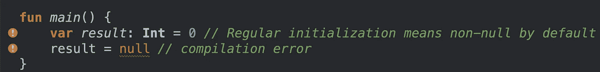
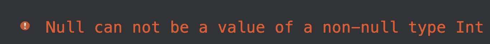

# 在 kot Lin-2 中从初级到高级(安全空)

> 原文：<https://medium.com/google-developer-experts/from-junior-to-master-in-kotlin-2-safe-null-188839da41ab?source=collection_archive---------2----------------------->

[](https://gelopfalcon.medium.com/from-junior-to-master-in-kotlin-1-basic-syntax-7b77e012b47f) [## Kotlin — 1 从初级到高级(基本语法)

gelopfalcon.medium.com](https://gelopfalcon.medium.com/from-junior-to-master-in-kotlin-1-basic-syntax-7b77e012b47f) 

默认情况下，Kotlin 不允许空初始化，除非您另外告诉它。就个人而言，我喜欢 Kotlin“讨厌”空值，它迫使我初始化并实现适当的策略来处理空值，如果我们不得不这样做的话。

许多编程语言中最常见的错误之一是当我们试图访问空引用的成员时，这将导致空指针异常或简称为 NPE。

让我向您展示如何声明一个不为空的变量，以及当我将空值赋给该变量时 Kotlin 如何抛出一个错误:



您运行代码:



太好了，出现了一个编译错误。老实说，我更喜欢这种错误，而不是运行时异常，当应用程序运行时，由于 NPE 崩溃，这似乎是应用程序没有仔细开发(我的观点)。

如果你需要你的代码允许空值(你很奇怪，但我们爱你，:D，这是一个笑话)你可以这样做:

```
var name: String? = “Gerardo” // can be set null
print(name) //Prints Gerardoname = null // ok
print(name) //Prints null
```

但是，如果您想访问“name”上的相同属性，那就不安全了，编译器会报告一个错误:

```
val length = name.length // error: variable ‘name’ could be null
```

但是，如果您需要访问可能为空的变量的属性或方法，该怎么办呢？有几种方法可以做到这一点。

# 安全通话

安全呼叫操作员是`?`。请参见以下示例:

```
val name= "Gerardo"
val lastName: String? = null
println(name?.length) // Unnecessary safe call
println(lastName?.length) 
```

safe 操作符首先检查值是否不为空，从而允许执行，否则返回空值。拜拜空指针异常…你是历史。所以关于这个例子，当 lastName 变量试图访问 length 属性时，编译器将返回一个 null，并且不会抛出错误。是啊，saaaafeeeee cooodeeeee。

# 的！！操作员

Kotlin 尊重所有开发人员的决定，不管是好是坏，但也尊重所有人。所以，如果你出于某种原因喜欢 NPE，科特林允许，但我想很好为什么我需要一个 NPE…如果你想允许 NPE，使用`!!`

```
val lastNameTemp= lastName!!.length
```

如果 lastName 为 null，那么将抛出一个 ungly NPE。

# Elvis 操作员

另一种选择是使用 elvis 操作员`?:`，如下所示:

```
**val** l = lastName?.length ?: "Falcon"
```

如果`?:`左边的表达式不是`null`，则运算符返回它，否则将使用您选择的默认值，在此上下文中为“Falcon”。不错。

# 结论

今天的信息已经够多了。在其他帖子中，我会谈到其他高级选择，如 lazy loading 和 lateinit…感谢您关注我并与您的朋友分享。

科特林万岁。