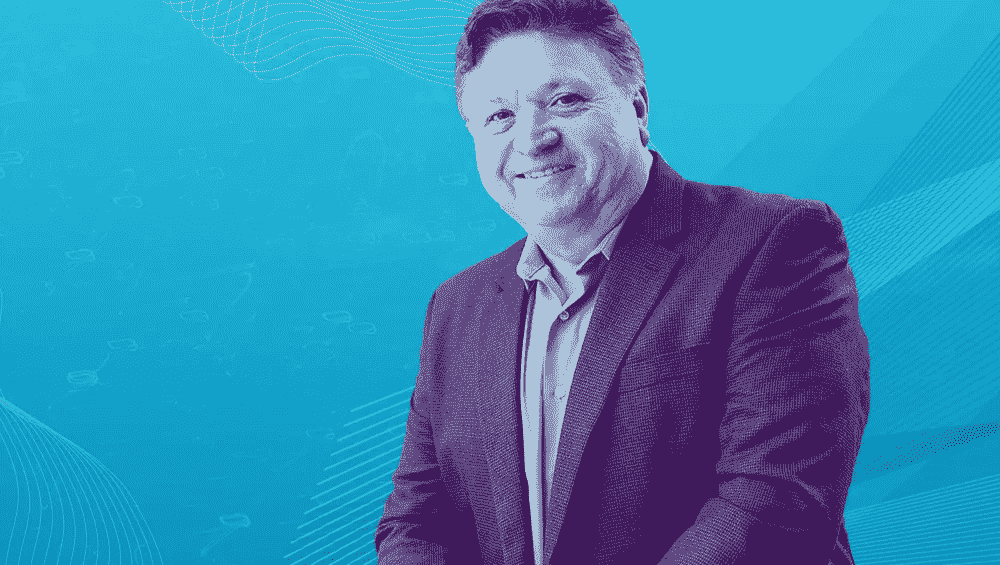

# 从发射卫星到银行安全创新

> 原文：<https://medium.com/capital-one-tech/from-launching-satellites-to-banking-security-innovation-dave-castillo-capital-one-eeefd2486832?source=collection_archive---------0----------------------->

## **戴夫·卡斯蒂洛对人工智能/人工智能的热情是如何让他进入 Capital One 的**

*David Castillo 博士今年夏天加入了 Capital One，担任我们新的机器学习执行副总裁。在这个职位上，Dave 将领导 Capital One 在人工智能和机器学习(AI/ML)方面的研究和战略创新计划，并研究如何在业务的不同领域使用 AI/ML，以使银行业务对客户来说更加人性化、直观和愉快。他还将致力于工具、技术、框架的开发，以及与工业界和学术界的合作。*

*我们和戴夫坐下来讨论他的背景，他对人工智能/人工智能的热情，以及他加入 Capital One 的决定。以下是我们谈话的摘录。*

## 你是人工智能和机器学习方面的专家，但你选择了在银行业工作，尤其是在 Capital One。这是为什么呢？

对我来说，这是显而易见的。银行业是人工智能/人工智能的下一个前沿领域，Capital One 以领先的创新者而闻名——不仅仅是在金融服务领域，而是在更广泛的科技领域。从识别不断发展的银行环境中的安全威胁，到改善呼叫中心的客户体验，他们都在使用 AI/ML。我知道这将是一个创造令人难以置信的产品的好机会，让客户的财务生活更加轻松愉快，到目前为止，这是一个爆炸。

就个人而言，来到首都一号是一个非常自然的过程。在我职业生涯的早期阶段，我曾在美国国家航空航天局(NASA)工作，并与摩托罗拉一起发射卫星，之后，我于 2015 年加入了预警服务公司，并与金融机构合作开发技术驱动的支付和风险解决方案。我是他们数据科学、数据管理平台和创新实验室小组的负责人。这包括与包括 Capital One 在内的一些美国大型银行组成的财团合作，我们还帮助建立了 P2P 支付平台 Zelle。

我与早期预警服务的 Capital One 密切合作，团队所做的一切——从他们的个性，到他们对数据创新的思考方式——都是如此先进，以至于他们给我留下了深刻的印象。我一直知道 Capital One 的创新速度可以与 Airbnb 和网飞等科技公司相媲美，团队中有像 Diane Lye(企业数据服务高级副总裁)这样有远见的技术领导者，他们帮助创建了 Capital One 的数据生态系统——我想成为团队正在做的事情的一部分，其中许多事情在业内以前都没有做过。

## 请告诉我们更多关于在 NASA 工作以及你在卫星方面的经历。

在完成我的工程本科学位后，我决定继续攻读以软件为重点的决策科学硕士学位。从那里，我开始探索博士项目，并最终获得了在美国国家航空航天局工作的机会。

我最初推迟了，想专注于攻读博士学位，但在他们邀请我去他们位于佛罗里达州的肯尼迪航天中心后，我完全被应用人工智能工作的可能性所诱惑。

作为 NASA 的一名年轻工程师，我使用了许多不同的系统，并在中佛罗里达大学获得了博士学位。这都是令人着迷的工作，但我变得不那么执着于学术界作为职业道路，而是对我所从事的项目的应用、部署和大规模采用更感兴趣。

在 NASA 工作也迫使我加快分布式计算的速度。

大约在这个时候，摩托罗拉宣布他们正在发射一个由 60 多颗卫星组成的网络，用于一个巨大的天文和陆地项目，该项目将利用流式数据。他们正在寻找一位首席软件工程师来领导这项工作。我申请了，并惊讶地得到了这份工作！这是另一个关键的机会，将我在 NASA、分布式计算和流数据方面的经验结合在一起。

## **关于人工智能和机器学习的世界，你个人最感兴趣的是什么？**

作为一名人工智能和机器学习*的实践者，我在职业生涯中花费了大量时间，这意味着我喜欢处理数据，构建解决方案，并使用人工智能/ML 解决问题。利用这种经验和对创新的热情，我期待着启用(并成为其中的一员)一个团队，在整个组织中提供增值的 AI/ML 解决方案。其中一个促成因素是我个人非常热衷的领域，我喜欢称之为*无人驾驶数据科学*。*

*无人驾驶数据科学最终是关于自我学习模型，从模型制定开始，直到模型交付，这使得整个机器学习过程的效率和速度更高。尽管我们在这方面取得了很大进展，但我们在机器学习环境的每一步中都有以人为中心的流程和控制，我很高兴能够在 Capital One 帮助推进这一点。*

## *在 Capital One 的新职位中，你将专注于什么？*

*我将寻找复杂的方法，继续在我们的业务流程中利用 AI/ML 和数据工程，同时创造一流的客户体验，超越我们今天的水平。*

*我还将关注我们如何不断地努力优化我们的工程和建模过程，以确保跨业务的团队可以将它们用于任何范围的用例。*

## *你曾经考虑在学术界谋职，但现在仍在做兼职教授。你将如何把对学术的兴趣与你在 Capital One 的工作联系起来？*

*保持在人工智能、机器学习和数据科学的前沿真的很重要。我们希望与顶尖大学合作，解决引人注目的高价值问题，推动行业向前发展。*

*一个例子是我们在可解释和公平的人工智能方面所做的工作。我们正在与各种大学合作伙伴合作，以便在我们为更多用例开发更高级的模型时，能够以道德和公平的方式保持最高的可解释性标准。我们认为，我们在研究可解释性和公平性方面的努力可以帮助提供信息，并有助于如何在整个行业开发和实施机器学习。*

*作为一名兼职教授，我可以随时了解自己的编程能力、学习新语言的能力，并掌握开源软件开发的最新动态——你真的需要投入到教学中去！我试图介绍一系列实用的、应用的用例及项目，所以也不全是理论。教学是一种很好的逃避，它满足了我对人工智能/人工智能热情的另一面。*

*结合起来，这些努力只能提高第一资本和整个行业的人工智能/人工智能的状态。当然，最终目标是创造直观的技术，给人们工具，使他们的财务生活更简单，更愉快，更容易管理。我很高兴能成为首都一号创新时刻的一部分。*

**声明:这些观点仅代表作者个人观点。除非本帖中另有说明，否则 Capital One 不属于所提及的任何公司，也不被其认可。使用或展示的所有商标和其他知识产权都是其各自所有者的所有权。本文为 2018 首都一。**