# 从本地运行的节点应用程序到基于云的 Kubernetes 部署

> 原文：<https://medium.com/oracledevs/from-locally-running-node-application-to-cloud-based-kubernetes-deployment-1fed34280952?source=collection_archive---------0----------------------->

在本文中，我将讨论我必须经历的步骤，以便获得我的本地运行的节点应用程序——具有各种硬编码，有时是秘密值——并将其部署在基于云的 Kubernetes 集群上。我将讨论应用程序的容器化、用对环境变量的引用替换硬编码值、Docker 容器图像操作、创建用于创建 Kubernetes 资源的 Kubernetes yaml 文件，以及应用程序的实际执行。

# 背景

几天前，在东京，我出席了当地的 J-JUG 活动，这是甲骨文亚太区开拓之旅的一部分。我准备了一个非常好的演示:一个基于云的 Oracle 数据库的更新被复制到另一个基于云的数据库——MongoDB 数据库。在这个演示中，我首先使用 Twitter 作为交换更新事件的媒介，然后使用 Oracle Event Hub(托管 Apache Kafka)云服务。

这张照片形象化了我想做的事情:

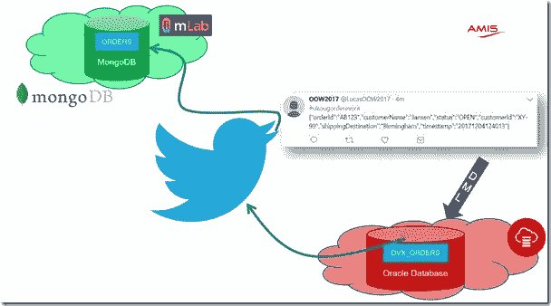

然而，我的演示失败了。我运行了一个本地节点(JS)应用程序，该应用程序将通过 HTTP 从 Oracle 数据库中调用，并发布到 Twitter 和 Kafka。当我在酒店房间里做演示的时候，一切都很好。我使用 ngrok 在公共互联网上公开我的本地运行的应用程序——这是在跨云演示中轻松集成本地服务的一个好方法。结果是，我做演讲的甲骨文日本办公室的网络配置不允许使用 ngrok。我无法让我的笔记本电脑创建到 ngrok 服务的隧道，以允许它传递来自 Oracle 数据库的 HTTP 请求。

这给了我一个教训。不管在本地运行有多方便，我真的应该能够让这个演示的所有组件都在云中运行。除了使用无服务器功能之外，最明显的方法是将该应用程序部署在 Kubernetes 集群上。尽管我知道如何到达那里——我意识到这些步骤并没有像应该的那样在我的头脑和手指中根深蒂固——特别是为了在不到 30 分钟的时间里让我的演示恢复往日的辉煌。

# 行动计划

我的演示应用程序——有些快速地组合在一起——包含相当多的硬编码值，包括机密设置，如 Kafka 服务器 IP 地址和主题名称，以及 Twitter 应用程序凭证。我需要采取的第一步是从应用程序代码中删除所有这些硬编码的值，并用对环境变量的引用来替换它们。

第二个重要步骤是为我的应用程序构建一个容器。这个容器需要提供节点运行时，拥有应用程序使用的所有 npm 模块，并包含应用程序代码本身。容器应该自动启动应用程序，并公开正确的端口。在这一步结束时，我应该能够在 Docker 容器中本地运行我的应用程序——用 Docker run 命令注入环境变量的值。

第三步是从容器创建一个容器映像——并将该映像(在有意义的标记之后)推送到容器注册中心。

接下来是 Kubernetes 资源的准备。我的应用程序由一个 Pod 和一个服务(用 Kubernetes 的术语来说)组成，它们组合在一个部署中，位于自己的名称空间中。部署使用了两个秘密——一个包含 Kafka 服务器的机密值(IP 地址和主题名),另一个包含 Twitter 客户端应用程序凭证。这些秘密的值用于设置一些环境变量。其他值在部署定义中是硬编码的。

在安排了对 Kubernetes 集群实例(运行在 Oracle 云基础设施中，通过 Oracle Kubernetes 引擎(OKE)服务提供)的访问之后，我可以部署 K8S 资源并使应用程序运行。现在，我终于可以将 Oracle 数据库触发器指向云中 Kubernetes 上的服务端点，并开始发布所有相关数据库更新的 tweets。

在这一点上，我应该——在阅读完本文的其余部分后，您也应该——对如何使节点应用程序 Kubernetalize 有一个很好的理解，这样我就不会在演示中被愚蠢的网络问题所困扰。我想毫不犹豫地将我的本地应用程序转换成运行在 Kubernetes 上的容器化应用程序。

注:本文讨论的来源可以在 GitHub 上找到:[https://GitHub . com/lucasjellema/ground breaker-japac-tour-cqrs-via-Twitter-and-event-hub/tree/master/d b-synch-orcl-2-MongoDB-over-Twitter-or-Kafka](https://github.com/lucasjellema/groundbreaker-japac-tour-cqrs-via-twitter-and-event-hub/tree/master/db-synch-orcl-2-mongodb-over-twitter-or-kafka)。

# 1.用环境变量引用替换硬编码值

我的应用程序包含 Kafka Broker 端点的硬编码值和我的 Twitter 应用程序凭据秘密。对于在本地运行的应用程序来说，这几乎是不可接受的。对于部署在云环境中的应用程序(其源代码发布在 GitHub 上)，这显然不是一个好主意。

任何硬编码的值都将从代码中删除，替换为对环境变量的引用，使用节点表达式:

变量的名称

或者

process.env['变量名称']

现在，让我们不要担心这些值是如何设置并提供给节点应用程序的。

我已经创建了一个通用代码片段，它将在启动应用程序时检查是否已经定义了所有预期的环境变量，如果没有，则在输出中写入一个警告:

```
const REQUIRED_ENVIRONMENT_SETTINGS = [{name:"PUBLISH_TO_KAFKA_YN" , message:"with either Y (publish event to Kafka) or N (publish to Twitter instead)"},{name:"KAFKA_SERVER" , message:"with the IP address of the Kafka Server to which the application should publish"},{name:"KAFKA_TOPIC" , message:"with the name of the Kafka Topic to which the application should publish"},{name:"TWITTER_CONSUMER_KEY" , message:"with the consumer key for a set of Twitter client credentials"},{name:"TWITTER_CONSUMER_SECRET" , message:"with the consumer secret for a set of Twitter client credentials"},{name:"TWITTER_ACCESS_TOKEN_KEY" , message:"with the access token key for a set of Twitter client credentials"},{name:"TWITTER_ACCESS_TOKEN_SECRET" , message:"with the access token secret for a set of Twitter client credentials"},{name:"TWITTER_HASHTAG" , message:"with the value for the twitter hashtag to use when publishing tweets"},]for(var env of REQUIRED_ENVIRONMENT_SETTINGS) {if (!process.env[env.name]) {console.error(`Environment variable ${env.name} should be set: ${env.message}`);} else {// convenient for debug; however: this line exposes all environment variable values - including any secret values they may contain// console.log(`Environment variable ${env.name} is set to : ${process.env[env.name]}`);}}
```

这个片段用于我的节点应用程序中的 [index.js](https://github.com/lucasjellema/groundbreaker-japac-tour-cqrs-via-twitter-and-event-hub/blob/master/db-synch-orcl-2-mongodb-over-twitter-or-kafka/index.js) 文件。该文件还包含对 process.env 的几个引用，这些引用曾经是硬编码的值。

使用 *npm start* 来运行应用程序似乎很方便——例如，因为它允许我们将环境变量定义为应用程序启动的一部分。当您执行 *npm start* 时，npm 将检查 package.json 文件中是否有带“start”键的脚本。该脚本通常包含类似“node index”或“node index.js”的内容。您可以在运行节点应用程序之前，使用要应用的环境变量的定义来扩展该脚本，如下所示(取自 package.json):

```
"scripts": { "start": "(export KAFKA_SERVER=myserver.cloud.com && export KAFKA_TOPIC=cool-topic ) || (set KAFKA_SERVER=myserver.cloud.com && set KAFKA_TOPIC=cool-topic && set TWITTER_CONSUMER_KEY=very-secret )&& node index", … },
```

注意:我们可能需要适应 Linux 和 Windows 环境，它们对环境变量的处理是不同的。

# 2.容器化节点应用程序

在我的例子中，我在我的 Windows 笔记本电脑上工作，从 Windows 命令行开发和测试节点应用程序。显然，这不是构建和运行 Docker 容器的理想环境。我所做的是使用流浪者运行一个虚拟机，里面有 Docker 引擎。所有 Docker 容器操作都可以在这个虚拟机中轻松完成。

查看指导 vagger 利用 VirtualBox 创建和运行所需虚拟机的 vagger 文件。请注意，本地目录包含了 travel file，并且从该目录执行了*travel up*命令，该目录被自动共享到 VM 中，挂载为/travel。

注意:我用这篇文章作为我文章的这一部分的灵感:[https://nodejs.org/en/docs/guides/nodejs-docker-webapp/](https://nodejs.org/en/docs/guides/nodejs-docker-webapp/)。

注意 2:我使用 dockerignore 文件来排除包含 Dockerfile 的根文件夹中的文件和目录。dockerignore 中列出的任何内容都不会添加到构建上下文中，也不会出现在容器中。

Docker 容器映像是使用 Docker 构建文件构建的。Docker 的起点是随后扩展的基础映像。在这种情况下，基本映像是 node:10.13.0-alpine，这是一个小型的最新节点运行时环境。我创建了一个目录/usr/src/app，并让 Docker 将这个目录设置为所有后续操作的焦点。

Docker 容器图像是分层创建的。docker 文件中的每个构建步骤都会添加一个层。如果重新运行构建，则仅重新运行 docker 文件中已更改的步骤的层，并且在推送映像时仅实际上载已更改的层。因此，将变化最大的步骤放在 Dockerfile 文件的末尾是明智的。在我的例子中，这意味着应用程序源代码应该在构建过程的后期复制到容器映像中。

首先，我只复制 package.json 文件——假设这个文件不会经常改变。在复制 package.json 之后，立即使用 *npm install* 将所有节点模块安装到容器映像中。

只有这样，应用程序源才会被复制。我选择从容器中公开端口 8080——这是一个非常武断的决定。然而，环境变量 PORT——其值是使用 process.env.PORT 在 index.js 中读取的——需要与我公开的任何端口完全对应。

最后，容器运行时运行节点应用程序的指令: *npm start* 传递给 CMD 指令。

以下是完整的 Dockerfile 文件:

```
# note: run docker build in a directory that contains this Docker build file, the package.json file and all your application sources and static files 
# this directory should NOT contain the node-modules or any other resources that should not go into the Docker container - unless these are explicitly excluded in a .Dockerignore file! FROM node:10.13.0-alpine# Create app directoryWORKDIR /usr/src/app# Install app dependencies# A wildcard is used to ensure both package.json AND package-lock.json are copied# where available (npm@5+)COPY package*.json ./RUN npm install# Bundle app source - copy Node application from the current directoryCOPY . .# the application will be exposed at port 8080ENV PORT=8080#so we should expose that portEXPOSE 8080# run the application, using npm start (which runs the start script in package.json)CMD [ "npm", "start" ]
```

运行 docker build —确切地说，我运行:docker build-t lucasjellema/http-to-Twitter-app。—给出以下输出:

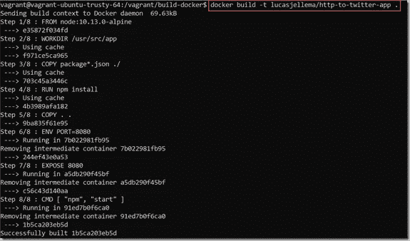

容器图像被创建。

我现在可以运行容器本身，例如:

```
docker run -p 8090:8080 -e KAFKA_SERVER=127.1.1.1 -e KAFKA_TOPIC=topic -e TWITTER_CONSUMER_KEY=818 -e TWITTER_CONSUMER_SECRET=secret -e TWITTER_ACCESS_TOKEN_KEY=tokenkey -e TWITTER_ACCESS_TOKEN_SECRET=secret lucasjellema/http-to-twitter-app
```

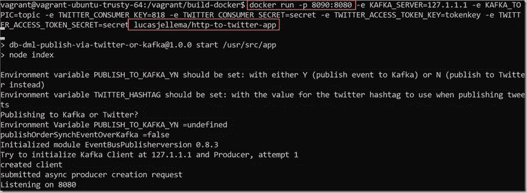

容器正在运行，应用程序正在运行，并且在 Docker 主机上的端口 8090，我应该能够访问应用程序:[http://192.168.188.120:8090/about](http://192.168.188.120:8090/about)(而不是:192 . 168 . 188 . 120 是由 vagger 管理的虚拟机暴露的 IP 地址)

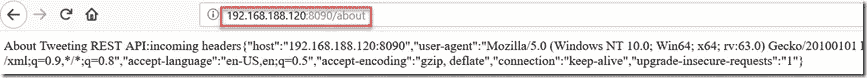

# 3.构建、标记和推送容器映像

为了在 Kubernetes 集群上运行一个容器——或者实际上是在构建它的机器上运行——这个容器必须被共享或发布。最简单的方法是使用容器(映像)注册中心，比如 Docker Hub。在这种情况下，我只是用当前适用的标签 lucasjellema/http-to-Twitter-app:0.9:

```
docker tag lucasjellema/http-to-twitter-app:latest lucasjellema/http-to-twitter-app:0.9
```

然后，我将标记的图像推送到 Docker Hub 注册表:(注意:在执行该语句之前，我已经使用 docker login 将我的会话连接到 Docker Hub):

```
docker push lucasjellema/http-to-twitter-app:0.9
```

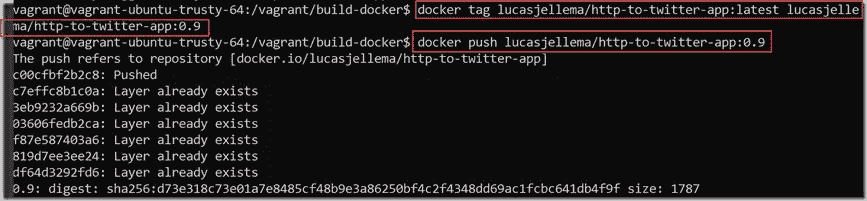

在这一点上，节点应用程序是公开可用的——并且可以在任何 Docker 兼容的容器引擎上运行。它不包含任何秘密——所有依赖项(比如 Twitter 凭证和 Kafka 配置)都需要通过环境变量设置来注入。

# 4.准备 Kubernetes 资源(Pod、服务、机密、名称空间、部署)

当节点应用程序在 Kubernetes 上运行时，它应该有许多组成部分:

*   一个名称空间 *cqrs-demo* 将其他工件隔离在它们自己的区间中
*   两个秘密提供了关于 Kafka 和关于 Twitter 客户端凭证的敏感的、动态的、特定于部署的细节
*   单个容器的 Pod 带有节点应用程序
*   服务—在(外部)可访问的端点上公开 Pod，并将请求导向 Pod 公开的端口
*   部署*http-to-Twitter-app*——通过用于扩展和重新部署的模板来配置 Pod

单独的名称空间 cqrs-demo 是用一个简单的 kubectl 命令创建的:

```
kubectl create namespace cqrs-demo
```

这两个秘密是两组敏感数据条目。每个条目都有一个键和一个值，当然这个值是敏感的。对于本文中的应用程序，我已经确保只有秘密对象包含敏感信息。任何其他工件中都没有密码、端点和凭证。所以我可以自由地分享其他文件——甚至在 GitHub 上。但不是秘密文件。它们包含有价值的货物。

注意:即使这些秘密看起来是加密的——在这种情况下，它们不是。它们只包含实际值的 base64 表示。这些 base64b 值可以在 Linux 命令行上使用以下命令轻松检索:

```
echo -n '<value>' | base64
```

这些秘密是从这些 yaml 文件中创建的:

```
apiVersion: v1kind: Secretmetadata:name: twitter-app-credentials-secretnamespace: cqrs-demotype: Opaquedata:CONSUMER_KEY: U0hhCONSUMER_SECRET: dT=ACCESS_TOKEN_KEY: ODk=ACCESS_TOKEN_SECRET: aUZv
```

和

```
apiVersion: v1kind: Secretmetadata:name: kafka-server-secretnamespace: cqrs-demotype: Opaquedata:kafka-server-endpoint: MTI5kafka-topic: aWRj
```

使用这些 kubectl 语句:

```
kubectl create -f ./kafka-secret.yaml kubectl create -f ./twitter-app-credentials-secret.yaml
```

Kubernetes 仪表盘显示了两个秘密:

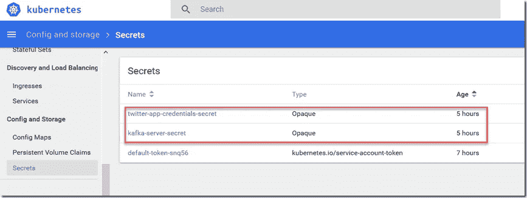

和一些细节(但不是敏感值):

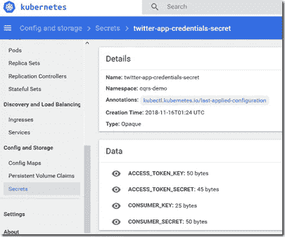

文件 k8s-deployment.yml 包含服务和部署的定义，并通过部署间接包含 pod。

该服务被定义为 LoadBalancer 类型。这导致 Oracle Kubernetes 引擎在一个特殊的外部 IP 地址上分配给这个服务。这可能被认为有些浪费。更好的方法是使用 Ingres controller——它允许我们在外部 IP 地址上处理多个服务。对于当前示例，LoadBalancer 就可以了。注意:当您在不支持 LoadBalancer 的环境(如 minikube)中运行 Kubernetes 工件时，您可以将 LoadBalancer 类型更改为 NodePort 类型。然后，将随机端口分配给该服务，该服务将在 K8S 集群的 IP 地址上的该端口上可用。

该服务在端口 80 对外公开——尽管其他端口也很好。该服务在 *cqrs-demo* 名称空间中使用逻辑名 *app-api-port* 连接到容器端口。这个端口是为 *http-to-twitter-app* 部署中的 *http-to-twitter-app* 容器定义而定义的。注意:对于此单个容器定义，可以启动多个容器，具体取决于部署中指定的副本数量，例如取决于正在进行的(重新)部署问题。服务机制确保流量在公开 app-api-port 的所有容器实例之间实现负载平衡。

```
kind: ServiceapiVersion: v1metadata:name: http-to-twitter-appnamespace: cqrs-demolabels:k8s-app: http-to-twitter-appkubernetes.io/name: http-to-twitter-appspec:selector:k8s-app: http-to-twitter-appports:- protocol: TCPport: 80targetPort: app-api-porttype: LoadBalancer# with type LoadBalancer, an external IP will be assigned - if the K8S provider supports that capability, such as OKE# with type NodePort, a port is exposed on the cluster; whether that can be accessed or not depends on the cluster configuration; on Minikube it can be, in many other cases an IngressController may have to be configured
```

创建服务后，需要一些时间(最多几分钟)才能将外部 IP 地址与服务(的负载平衡器)相关联。外部 ip 将显示为*待定*。下面是分配了外部 IP 地址时仪表盘中的样子，尽管我模糊了大部分实际 IP 地址)

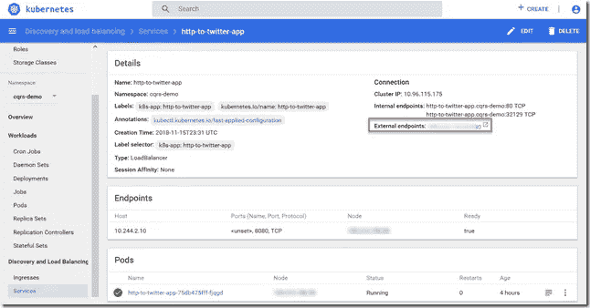

现在的部署只指定了一个副本。它指定了这个部署中的容器(实例)所基于的容器映像:lucasjellema/http-to-Twitter-app:0.9。这当然是我在上一节中推送的容器映像。容器公开了端口 8080(容器端口)，这个端口被赋予了逻辑名 *app-api-port* ，我们之前已经看到过。

我使用的 K8S 集群实例有一个从域名到 IP 地址的 DNS 转换问题。最初，我的应用程序不能工作，因为 URL api.twitter.com 不能被转换成 IP 地址。我没有试图修复这个 DNS 问题，而是利用了 Kubernetes 中一个名为 hostAliases 的内置特性。这个特性允许我们指定在运行时添加到容器中的 hosts 文件的 DNS 条目。在本例中，我指示 Kubernetes 将 api.twitter.com 及其 IP 地址之间的映射注入到容器的 hosts 文件中。

最后，容器模板指定了一系列环境变量值。这些在启动时被注入到容器中。te 环境变量的一些值是在部署定义中逐字定义的。其他包含对 secrets 中条目的引用，例如 TWITTER_CONSUMER_KEY 的值是使用 CONSUMER_KEY 密钥从 twitter-app-credentials-secret 派生的。

```
apiVersion: extensions/v1beta1kind: Deploymentmetadata:labels:k8s-app: http-to-twitter-appname: http-to-twitter-appnamespace: cqrs-demospec:replicas: 1strategy:rollingUpdate:maxSurge: 1maxUnavailable: 1type: RollingUpdatetemplate:metadata:labels:k8s-app: http-to-twitter-appspec:hostAliases:- ip: "104.244.42.66"hostnames:- "api.twitter.com"containers:-image: "lucasjellema/http-to-twitter-app:0.9"imagePullPolicy: Alwaysname: http-to-twitter-appports:-containerPort: 8080name: app-api-portprotocol: TCPenv:-name: PUBLISH_TO_KAFKA_YNvalue: "N"-name: TWITTER_HASHTAGvalue: "#GroundbreakersTourOrderEvent"-name: TWITTER_CONSUMER_KEYvalueFrom:secretKeyRef:name: twitter-app-credentials-secretkey: CONSUMER_KEY-name: TWITTER_CONSUMER_SECRETvalueFrom:secretKeyRef:name: twitter-app-credentials-secretkey: CONSUMER_SECRET-name: TWITTER_ACCESS_TOKEN_KEYvalueFrom:secretKeyRef:name: twitter-app-credentials-secretkey: ACCESS_TOKEN_KEY-name: TWITTER_ACCESS_TOKEN_SECRETvalueFrom:secretKeyRef:name: twitter-app-credentials-secretkey: ACCESS_TOKEN_SECRET-name: KAFKA_SERVERvalueFrom:secretKeyRef:name: kafka-server-secretkey: kafka-server-endpoint-name: KAFKA_TOPICvalueFrom:secretKeyRef:name: kafka-server-secretkey: kafka-topic
```

仪表板中的部署:

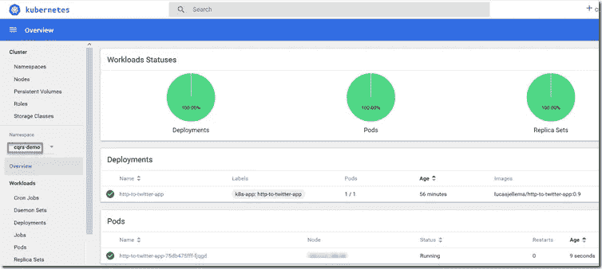

Pod 的详细信息:

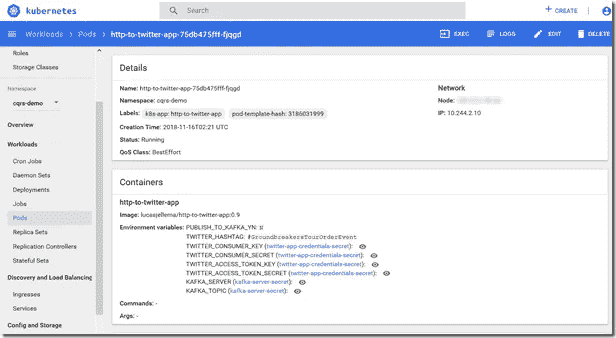

给定管理员权限，我可以检查从 secrets 派生的环境变量的真实值。

Pod 日志记录也很容易访问:

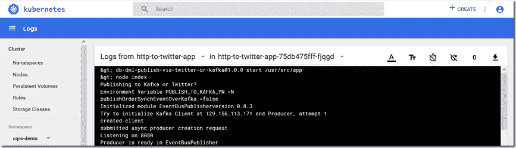

# 5.运行并试用该应用程序

当外部 IP 已经分配给服务并且 Pod 成功运行时，可以访问应用程序。从 Oracle 数据库，也可以从任何浏览器:

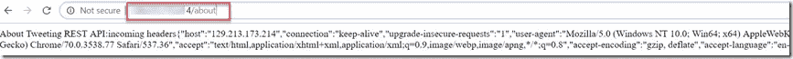

地址栏中的公共 IP 地址模糊不清。请注意，在 URL 中没有指定端口——因为端口将默认为 yo 80，而这恰好是服务中定义的端口，作为映射到容器的公开端口(8080)的端口。

当数据库发出 HTTP 请求时，我们可以在 Pod 日志中看到请求已被处理:

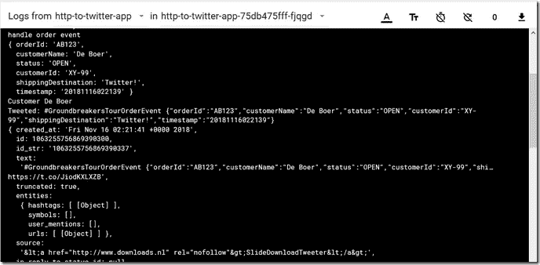

我甚至可以验证它已经完成了应用程序在日志中声明的工作:

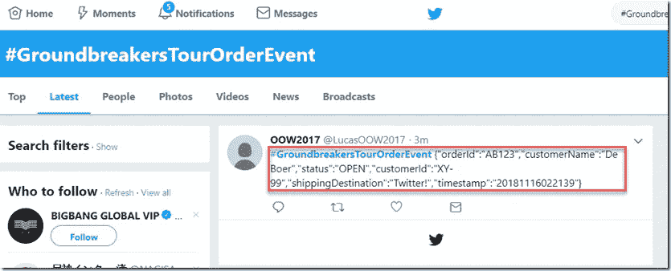

# 资源

GitHub 来源:[https://GitHub . com/lucasjellema/ground breaker-japac-tour-cqrs-via-Twitter-and-event-hub](https://github.com/lucasjellema/groundbreaker-japac-tour-cqrs-via-twitter-and-event-hub)

面向 Docker 开发者的 kubernetes cheat sheet:[https://technology . amis . nl/2018/09/26/from-Docker-run-to-kubectl-apply-quick-kubernetes-cheat-sheet-for-Docker-users/](https://technology.amis.nl/2018/09/26/from-docker-run-to-kubectl-apply-quick-kubernetes-cheat-sheet-for-docker-users/)

库伯内特关于秘密的文件:【https://kubernetes.io/docs/concepts/configuration/secret/ 

Kubernetes 关于主机别名的文档:[https://kubernetes . io/Docs/concepts/services-networking/add-entries-to-pod-etc-hosts-with-Host-Aliases/](https://kubernetes.io/docs/concepts/services-networking/add-entries-to-pod-etc-hosts-with-host-aliases/)

dockerrignore 上的 docker docs[https://docs . docker . com/engine/reference/builder/# dockerrignore-file](https://docs.docker.com/engine/reference/builder/#dockerignore-file)

Kubernetes 关于部署的文档:[https://kubernetes . io/Docs/concepts/workloads/controllers/Deployment/](https://kubernetes.io/docs/concepts/workloads/controllers/deployment/)

*原载于 2018 年 11 月 16 日*[*technology . amis . nl*](https://technology.amis.nl/2018/11/16/from-locally-running-node-application-to-cloud-based-kubernetes-deployment/)*。*