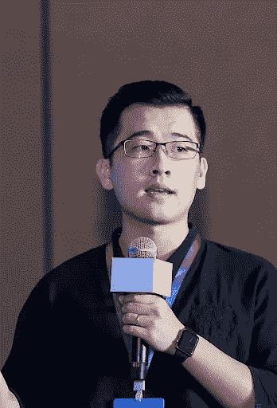

# 从后台到前台，我成为谷歌开发专家的经历

> 原文：<https://medium.com/google-developer-experts/from-offstage-to-onstage-my-experience-of-becoming-a-google-developer-expert-19abb7dabbb4?source=collection_archive---------2----------------------->

*作者:舒雨(Asher)郭，飞镖&扑中国*

2022 年 5 月底，经过一个多月的[谷歌开发者专家](https://developers.google.com/community/experts)面试，我终于成为国内第四个飘起的&飞镖 GDE。

我相信对于 Android 或者机器学习开发者来说，GDE 这个称号应该是非常熟悉的。如果你不熟悉，谷歌开发者专家计划是一个由经验丰富的技术专家、有影响力的人和思想领袖组成的全球网络，他们拥有谷歌技术的专业知识，是该领域的积极领导者，为更广泛的开发者和创业生态系统做出贡献。

# 我成为 GDE 的旅程

2013 年，Android Bus 是我第一次接触 Android 社区，也是在 ApkBus 大会上，我接触到了我见过的第一个 GDE。在那次会议上，我结交了 Android 开发者朋友，我也遇到了一些活动组织者，他们邀请我在未来的活动中发言。

会议结束后，我开始了我的公开演讲之旅，并谈到了 Flutter，因为来自网络和会见正确的人的机会。通过演讲在社区中更加活跃，我收到了成为 2020 年 GDE 的邀请。然而，我了解到申请过程是用英语进行的，因此，我最终没有完成申请过程。

2021 年，当我在谷歌 DevFest 大会上发言时，一位 GDE 朋友再次问我是否有兴趣成为 GDE，在一位来自谷歌的团队成员的鼓励下，我终于开始准备 GDE 的申请。

# 应用进程

在申请过程中，谷歌团队非常关注两个方面:

1.  技术能力:你在申请领域的技术专长
2.  技术影响:如公共演讲、文章和开源等领域的输出

我对用英语发言没有信心，所以我在面试前练习，我还翻译了一些我的文章，并用英语把它们张贴到媒体上。然后就开始了我的采访之旅。第一个面试者主要关注于 Flutter 和 Dart 的技术内容，尽管我对 Flutter 没有什么经验，我的第一个社区面试还是完成了。

在我完成初次面试的第二天，我收到了一个通知，我被分配了一个产品面试的面试官。产品访谈的内容主要围绕着我对颤振技术的一些体验。面试官对我写的书的内容和我获得的一些奖项很感兴趣，这些奖项碰巧就在我身后的书柜里，事实证明这是一个很好的谈话话题。第二天，我收到了一封电子邮件，通知我通过了面试——在我签署了各种协议和条款后，我与团队进行了最后一次会面，以成为 GDE！当我正式收到 GDE 项目的确认邮件时，我被拉进了不同的小组、空闲时间和项目。作为一名开发人员，我认为完成成为 GDE 的壮举是一个重要的里程碑。

无论是 GDE 社区还是主持采访的谷歌人，每个人都非常友好。在我成为 GDE 的过程中，我得到了很多支持，并向任何有兴趣加入该社区的人提供支持。请随时拨打[https://github.com/carguo](https://github.com/carguo)与我联系！