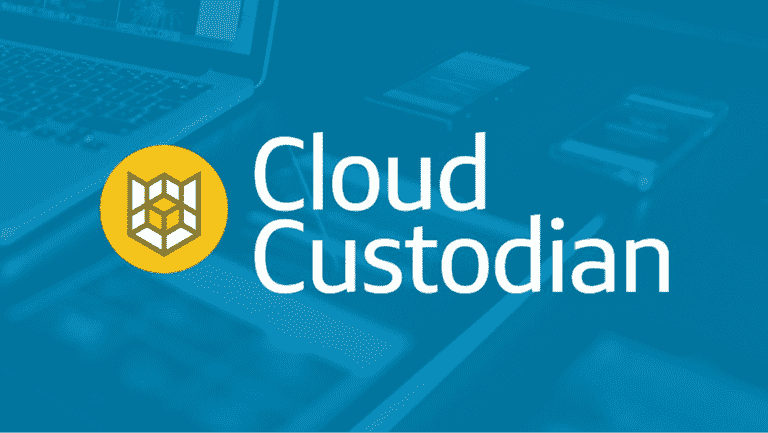

# 从我们的云专家到您的云专家—2019 年将会发生什么

> 原文：<https://medium.com/capital-one-tech/from-our-cloud-experts-to-yours-what-to-expect-in-2019-4f092780b676?source=collection_archive---------0----------------------->

2019 年会是云之年吗？大概不会。为什么？因为*每年*都是云年。这意味着现在是开始您的云采用之旅的最佳时机。无论您是刚刚起步还是已经起步，以下是我们在云采用之旅中获得的一些经验和形成的一些观点。

# 阅读

*   [云计算:一位专家对 2019 年前景的看法](https://www.capitalone.com/tech/cloud/cloud-computing-one-experts-view-on-what-to-expect-in-2019) — Capital One 云战略副总裁 Bernard Golden 以他对 2019 年云计算的想法和观点开始了新的一年。
*   [云计算和运营团队如何将云计算的采用从瓶颈变为工程成功](https://www.capitalone.com/tech/cloud/how-cloud-and-ops-teams-can-take-cloud-adoption-from-bottleneck-to-engineering-success) —您的组织正在向云过渡吗？如果是这样，不要让操作相关性与你擦肩而过！这是一个由三部分组成的解决方案，介绍了运营团队如何帮助推动云的采用。
*   [案例研究:无服务器的 Go 之旅](https://www.capitalone.com/tech/cloud/a-serverless-and-go-journey) —我们最近使用无服务器和 Go 重写了我们广受欢迎的信用优惠 API。了解我们看到的转换对绩效、成本和团队速度的影响。
*   [满怀信心地进行部署—借助 AWS 上的 canary 部署，最大限度地降低风险、提高弹性](https://www.capitalone.com/tech/cloud/deploying-with-confidence-minimize-risk-maximize-resiliency-with-canary-deployments-on-aws) —考虑 Canary 部署是否适合您的团队？以下是 AWS 服务(如 Route53、ESC 和 EC2)如何帮助您实施的。

# 听

在最近一期的 Architecht 节目中，播客主持人 Derrick Harris 主持了 Capital One 云战略副总裁 Bernard Golden 和 T2 AVOA 首席信息官战略顾问 Tim Crawford 之间的观点对比讨论。作为企业专家，他们研究云计算的现状以及迫使企业全力投入云计算的行业趋势。[在这里听播客。](https://architecht.io/iaas-edge-kubernetes-why-cloud-adoption-is-still-early-and-still-evolving-34be60080303)

# 学习

我们喜欢[云托管](https://www.capitalone.com/tech/solutions/cloud-custodian)，它是针对云安全、成本优化和治理的开源规则引擎。毕竟，我们赞助这个项目。但是我们不会自吹自擂，我们会让 AWS 开源博客告诉你关于云托管的最新集成。[宣布云托管与 AWS 安全中心集成](https://aws.amazon.com/blogs/opensource/announcing-cloud-custodian-integration-aws-security-hub/)

***披露声明:以上观点为作者个人观点。除非本帖中另有说明，否则 Capital One 不属于所提及的任何公司，也不被其认可。使用或展示的所有商标和其他知识产权都是其各自所有者的所有权。本文为 2019 首都一。***