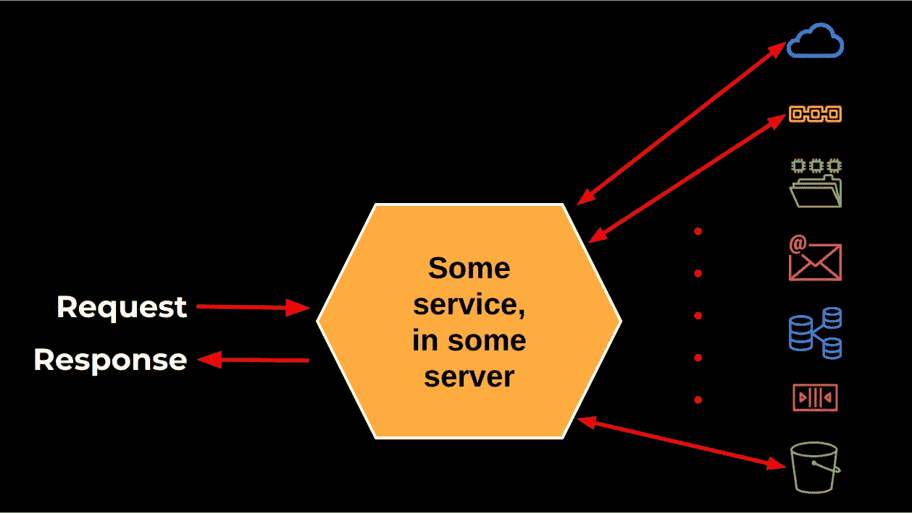
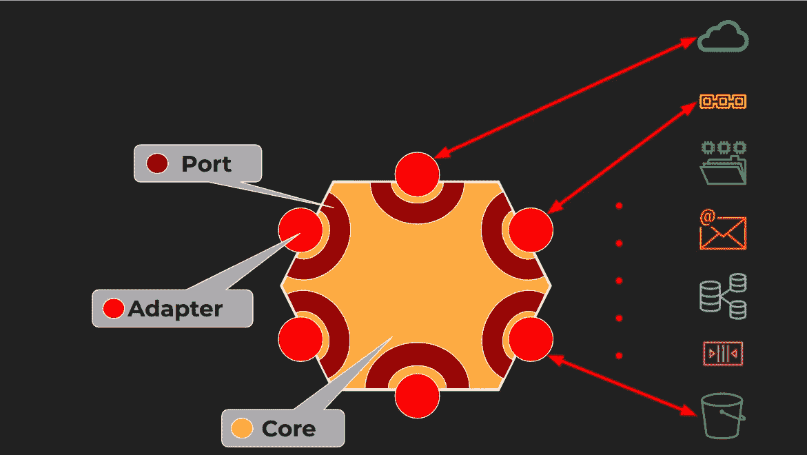
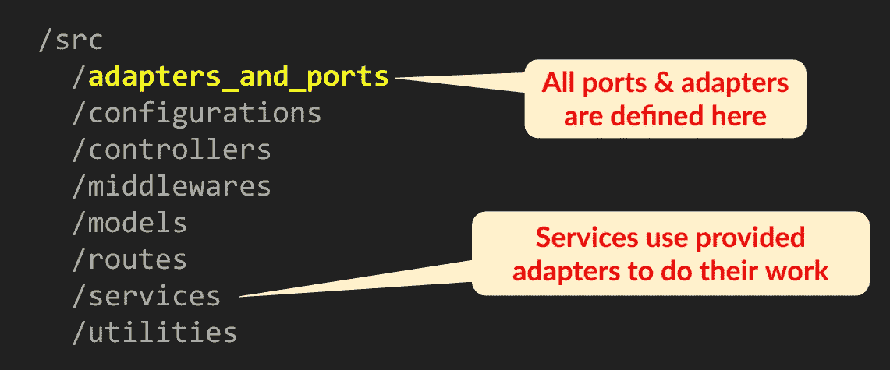

# 从图案到六角形

> 原文：<https://medium.com/globant/from-patterns-to-hexagons-ace6ce62351a?source=collection_archive---------1----------------------->

## 从基本原则出发导出软件架构


Photo by [Donny Jiang](https://unsplash.com/@dotnny?utm_source=medium&utm_medium=referral) on [Unsplash](https://unsplash.com?utm_source=medium&utm_medium=referral)

保持更新总是至关重要的，尤其是在技术领域。对我来说，重要的是不仅要知道新的算法、结构、设计原则等等。而且要充分理解我们如何获得它们，不仅仅是能够使用一种新工具，而是真正了解我们为什么应该应用它。

在本文中，我们将研究如何开发一个服务器。从像 SOLID、设计模式和函数式编程这样的基本原则开始，我们将得到一个具有一些好的特性的软件架构，重新发现一个强大的系统设计方法；激动人心的结果！

# 从一个问题开始

先说一个简单的问题…下图怎么了？我们有一个运行在服务器上的基本服务。服务接收请求，与其他实体交互(右边:更多云服务、区块链、文件系统、电子邮件服务、数据库、消息队列、文件桶等。)，并最终构建一个响应，将它发送回来。



A basic service receives requests, does some work, and sends back responses… what's wrong here?

这是一种相当普遍的情况，那么“*这幅图有什么问题呢？*”问题有一个简单的答案:“*没什么！*”。然而，如果我们再深入一点(并沉溺于一点夸张……)我们可能会把答案变成“*一切！*“—怎么会呢？

# 要问的三个问题

毫无疑问，这项服务是有效的，类似的实现随处可见。但是，我想问三个问题:

*   第一:理解代码有多容易？代码可能难以理解，因为它将业务逻辑问题与外部问题的实现细节混在一起，例如如何调用服务、更新数据库或访问消息队列。
*   第二:改代码有多简单？有多少改变的理由？如果我们谈论商业逻辑，必须改变它总是一种可能性。但是，如果我们谈论改变，比如说，数据库使用 Redis 代替呢？或者，如果我们选择将元组添加到数据库中，而不是将消息发送到队列中？并非所有变更的原因都与服务的实际业务目标相关，这是相关的。
*   第三，我们主要关心的是:测试代码有多简单？变化可能会出现，也可能不会出现，但是我们确实必须测试我们的代码，那么我们该如何着手呢？

最后一个问题是最有趣的一个，我们会回答它——但还不是时候；我们先绕道进入函数式编程(FP)来获得一些见解！

# 绕道进入 FP

在[函数式编程](https://en.wikipedia.org/wiki/Functional_programming)中，有一个重要的概念:*纯函数*。纯函数在某些方面与数学函数非常相似。让我们阐明一些性质，然后看一些例子。

*   如果给定相同的参数，纯函数总是返回相同的结果。如果您的代码依赖于数据库查询返回的内容，那么函数的行为方式每次都不一样；即使查询仍然相同，结果也可能不同。一个纯函数不会返回不同的结果。
*   纯函数没有副作用。副作用可能是修改系统全局状态的任何事情:向控制台写入消息、更新数据库、更改全局变量的值等。，都是副作用。
*   由于前面的两个属性，纯函数非常适合测试…但是在实际工作中很少使用！如果一个函数不被允许访问文件、发送消息或改变任何东西，那它还有什么用呢？

我们来看一个简单的纯函数和不纯函数的例子。下面我们有两个简单的函数。第一个函数接收两个参数并返回其和。如果您必须测试这个函数，那将是轻而易举的事情:用几个测试用例调用它，并验证结果是正确的。

```
const sum = (a, b) => { 
  return a+b;
}const sum = (a, b) => {
 **console.log("Sum", a, b); // side effect!**
  return a+b;
}
```

另一方面，第二个函数有一个副作用:它记录了一些东西。每次用一对参数调用它时，它都会进一步修改系统的全局状态——也就是说，控制台上会出现更多的消息。(记住这是一个简单的例子；该函数可以很好地修改数据库或完成任何其他状态更改。)

回到我们之前的问题:如何测试这个函数？现在事情没那么容易了。当然，您可以检查返回值，但是您如何验证某些东西被记录了呢？(对于更复杂的例子，如何确认数据库已经更新，远程服务已经调用，事件已经触发，等等。等。？)这是我们关心的问题。

让我们考虑测试一个不纯的函数，并尝试应用我们得到的任何答案来解决本文开始时测试服务的问题。我们如何测试一个不纯的功能——比如我们的服务？我想到了三种方法:

*   我们可以在完全不同的环境中工作。这要求每个开发人员拥有一个完整的环境(他自己版本的数据库、外部服务、队列、服务器等)。).在任何测试运行之后，他应该检查数据库是否被正确修改，消息是否被发送，等等。这当然是可能的，但是成本很高，很难设置，并且导致测试非常慢——在每次测试之前，您必须将环境重置为某个已知状态，并且在每次测试之后，您必须到处进行多次检查。
*   **或者，我们可以与完全模拟的外部实体合作**。诸如 [Jest](https://jestjs.io/) 或 [Jasmine](https://jasmine.github.io/) 之类的单元测试工具允许模仿实体，因此您可以建立一个模仿所需行为的模仿，而不是提供实际的数据库、外部服务或队列。这种方式效率更高——因为不需要更新实际的数据库，不需要调用服务，等等。—但是模拟行为仍然意味着大量的工作。
*   或者，我们可以先降低函数的不纯度！这是我们想要采用的方法。如果我们有办法从要测试的函数中去除杂质(这可能吗？？)写测试会容易很多。

让我们回到我们的副作用产生函数。我们可以重写如下。

```
const sum = (a, b, **logger=console.log**) => {
    **logger(a, b);**
    return a+b;
}
```

我们给这个函数添加了一个参数，默认情况下是`console.log`日志记录函数。如果我们像调用`sum(22,9)`一样调用这个函数，它将记录 22 和 9 并返回 31，就像之前一样。然而，有一个关键的区别:出于测试目的，我们可以提供一个不同的`logger`模拟函数，这将简化一切！

这种解决方案是众所周知的……但是我们是如何得到它的呢？答案需要谈论其他的原则:让我们再走一段弯路，讨论坚实的原则和设计模式。

# 第二个弯路:实体和设计模式

在 OOP (Object Oriented Programming)中， [SOLID](https://en.wikipedia.org/wiki/SOLID) 是首字母缩写，代表五个原则:[**S**single-respons ibility](https://en.wikipedia.org/wiki/Single-responsibility_principle)， [**O** pen-Closed](https://en.wikipedia.org/wiki/Open-closed_principle) ， [**L** iskov 替换](https://en.wikipedia.org/wiki/Liskov_substitution_principle)， [**I** 接口隔离](https://en.wikipedia.org/wiki/Interface_segregation_principle)，以及 [**D** 依赖倒置](https://en.wikipedia.org/wiki/Dependency_inversion_principle)我们不想深入讨论所有五个，相反，我们将只关注其中两个: **O** 和 **D** 。

*   **O** 代表“开-闭”，表示实体(函数、方法等。)应该是“对扩展开放，但对修改关闭”，这意味着我们应该能够扩展它的行为，而不必修改它的代码。对于我们不纯的`sum`函数来说，如果我们要改变一些东西被记录的方式，我们应该能够在不改变我们的原始函数的情况下实现它。
*   **D** 代表“依赖倒置”，要求较高层实体应该独立于较低层实体的实现细节。较高级别的实体不应该从较低级别的实体导入任何东西，而应该依赖抽象(接口)；具体的实现应该提供必要的细节来使事情运转起来。在我们的例子中，修改后的`sum`函数只需要知道如何使用提供给它的任何`logger`函数——也就是它的接口。具体的细节(比如，使用`console.log`来记录一些东西)不应该涉及我们的原始功能。

我们如何实现这些想法？一个[设计模式](https://en.wikipedia.org/wiki/Design_Patterns)会有所帮助——这就是我们已经做的！ [*依赖注入*](https://en.wikipedia.org/wiki/Dependency_injection) 模式是一个实体如何接收它所依赖的任何其他实体。在我们的不纯函数的情况下，我们提供(“注入”)了一个日志记录实体，将这个问题从原始函数中分离出来。我们可以实现我们的 **O** 和 **D** 原则:我们可以改变或扩展函数的行为，而不必重写它，函数本身完全独立于日志记录是如何完成的；它只是要求注入的日志记录器对应于一个特定的接口。

依赖注入是如何实现的？基本上有三种方法:通过类的构造函数，通过类中的 setter 方法，或者通过向函数或方法传递参数——这正是我们所做的，但是让我们先回到我们最初的服务！

# 关于架构和节点服务的一些思考

我们将通过应用我们在上一节中得到的解决方案来实现我们的服务。我们来看下图。



The "Ports and Adapters" -or "Hexagonal"- Architecture Pattern

我们仍然将我们的服务放在中心(“核心”)，但是它将指定“端口”(接口)并接收“适配器”(接口实现)，通过它们它将连接到外部实体。有了这个“端口和适配器”架构，我们将能够插入不同的模块来做不同的事情，就像我们能够为不纯的`sum`函数提供不同的`logger`参数一样。

对于正常工作，服务将被注入调用服务、与区块链交互、发送消息等功能。对于测试工作，服务将被注入模拟适配器，具有相同的端口规范，但只是一个简单的“什么都不做”的实现。

> “端口和适配器”架构更广为人知的名称是“[六角形架构](https://en.wikipedia.org/wiki/Hexagonal_architecture_(software))”，一个更吸引人的名字！

# 实现服务

让我们考虑一个简单的服务，我们希望在一个[节点](https://nodejs.org/en/) + [Express](https://expressjs.com/) 服务器中实现它，一个常见的组合:

*   端点响应`GET /client/:id`请求
*   该服务在数据库中搜索给定的客户端
*   该服务向队列发送消息

该服务需要两个端口和两个适配器；让我们用客户端数据库相关的一个，另一个将是类似的。节点项目的通常架构将会变成这样:



The basic structure of a Node project, with ports and adapters added in

大多数目录已经为开发人员所熟知；我们只是添加了所有端口和适配器将驻留的`adapters_and_ports`目录。`services`目录将有服务的实现，这将和以前一样，除了它们将被编码为与端口和适配器一起工作。让我们看看这在实践中是如何实现的，使用 TypeScript 可以更清楚地了解所涉及的数据类型。

首先，要在数据库中找到一个客户机，我们必须定义它的接口。在我们的例子中，我们定义了`FindClientPort`:一个接收数字`id`作为参数的函数，并返回一个承诺，该承诺要么返回一个客户端(如果找到的话)，要么返回`null`(否则)。

```
type FindClientPort = 
  (id:number) => Promise<ClientType | null>;const findClientFromDBAdapter: FindClientPort =
  async (id:number) => {
  // return a promise to get the client from DB
};
```

我们还可以看到一个特定的适配器:`findClientFromDBAdapter`是`FindClientPort`接口的具体实现，它恰好访问一个数据库。注意关于命名的一个重要细节:端口不*而*说客户机应该来自哪里，但是适配器说。不同的适配器可以在其他地方寻找客户端(文件系统？钥匙店？)，但是它们都会实现相同的接口。

我们将如何编写服务？代码如下所示。

```
function getClientService(id, 
  **{ findClient, sendMsg }** = 
 **{ findClient: findClientFromDBAdapter, 
    sendMsg: sendMsgAdapter }**) { 
  … 
}
```

工作方式类似于我们使`sum`函数不那么不纯的时候，我们为所需的适配器添加了一个(可选的)参数。如果省略该参数，我们将使用两个默认适配器来访问数据库并发送消息。在 Express 中，我们将如下使用`getClientService`。

```
app.get("/client/:id", 
  (req) => getClientService(req.params.id));
```

当我们收到对`/client/:id`端点的请求时，我们调用我们的服务代码而不提供任何适配器——这意味着将使用标准适配器，并且服务将按预期运行。关键区别在于测试；让我们来看看实际测试的一部分。

```
findClientMock = jest.fn().mockResolvedValue(...);  // [1]
sendMsgMock = jest.fn().mockReturnValue(...);result = await getClientService(22,                 // [2]
  { findClient: findClientMock, 
    sendMsg: sendMsgMock });expect(findClientMock).toHaveBeenCalledWith(22);    // [3]
expect(sendMsgMock).toHaveBeenCalledWith(...);
expect(result).toMatchObject(...);
```

我们首先定义[1]一对模拟函数；`findClientMock`将模拟它找到了某个客户端，而`sendMsgMock`将返回成功的消息发送操作将返回的任何内容。然后我们可以[2]调用`getClientService`，但是要提供我们的两个(模拟)适配器。最后[3],我们可以验证一个适配器被用来寻找正确的客户端，另一个适配器被调用以发送正确的消息，以及服务返回正确的答案。

# 摘要

我们在这里取得了什么成就？我们从一个(不太)简单的服务开始，担心它的维护和测试。然后，我们走了一些弯路，进入了关于纯函数的函数式编程概念、关于实体之间关系的坚实原则以及依赖注入设计模式，从中我们导出了一种使函数“不那么不纯”的方法……这使我们重新发明了“端口和适配器”(或“六角形”)架构！

你可以阅读关于架构的书籍，学习如何设计和实现它，但不知何故，我发现如果我能完全理解设计的所有动机和原因，并设法自己推导出它，我会更满意；希望你同意！