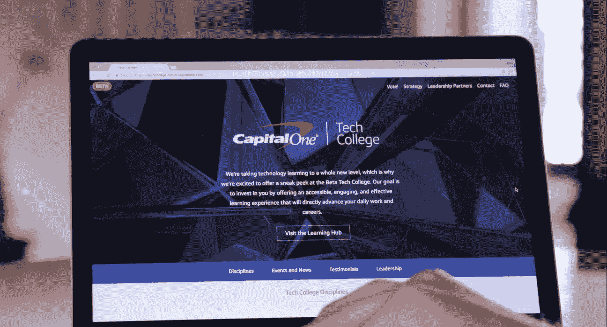
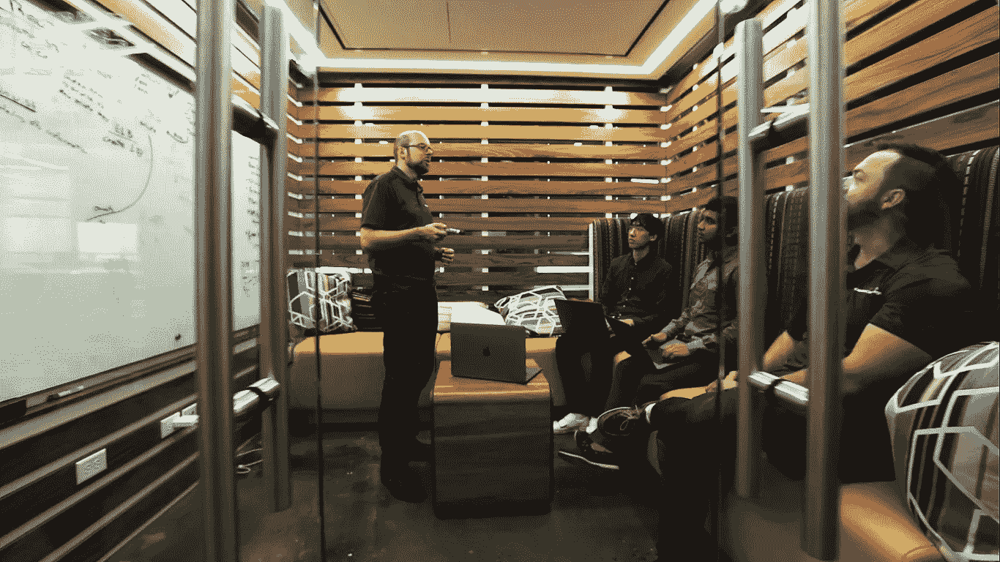

# 从首席信息官的角度看:建立一个敏捷的学习型组织

> 原文：<https://medium.com/capital-one-tech/from-the-cios-view-building-a-nimble-learning-organization-f0f2d64506a?source=collection_archive---------3----------------------->

*Capital One 首席信息官罗布·亚历山大*

技术和数据科学的进步每天都在颠覆行业并创造新的行业。没有走在变化前面并适应变化的公司比比皆是。

这种颠覆为金融服务业创造了巨大的机会，让他们重新思考通过数据、数字能力和客户体验可以实现什么。

在 Capital One，我们几年前就认识到，未来银行业的赢家将是那些理解并擅长管理业务复杂性，同时掌握数字渠道、机器学习和实时分析的人，这些对于提供新的解决方案和变革性客户体验至关重要。简而言之，这意味着像科技公司建立的银行一样投资和运营。

> 简而言之，这意味着像科技公司建立的银行一样投资和运营。

这一直是我们的动力。

对我们来说，技术是一种竞争优势，是我们业务战略的核心。在我们数字化转型的早期，我们承诺像最好的技术公司一样投资和发明，这意味着开发我们自己的软件，吸引和培养多元化、敬业和创新的软件工程人才团队，并重新构想传统的 IT 运营模式。

为了让人才茁壮成长并不断创新，你还需要在组织的各个层面营造一种支持不断学习和创新的文化。对我们来说，这意味着拥有一个灵活的学习型组织，让您带来的人才能够快速利用最新的技术，并获得试验、学习和推动我们的方法和实践不断改进的机会。

我们一直有一种支持测试和学习方法的文化，但随着我们雇佣了数千名工程师并更深入地利用机器学习，我们希望提供一种全面的技术课程，为我们所有的 50，000 名员工提供新的机会，让他们成长并学习他们的技术技能。

Capital One Tech College

# 技术学院成立

作为这一努力的一部分，我们创建了 Tech College，这是一个由工程师设计的学习计划，具有深入而全面的课程，侧重于最新的技术学科。

## **这个项目的独特之处:**

*   ***由工程师打造，面向工程师:*** 我们自己的工程师设计了课程——确保内容相关且有用。
*   ***广度和深度:*** 课程涉及 13 个与我们的业务需求一致的关键学科，包括软件工程、移动、机器学习/人工智能、云计算、网络安全和数据。
*   ***混合式学习:*** 该计划包括在线课程、现场研讨会、训练营，以及来自该领域知名合作伙伴(如 Udacity、General Assembly 和 Coursera)的培训。
*   ***向我们的领导者学习:*** 我们自己的技术学科专家教导并激励同事学习和探索最新的进展，以及我们如何利用它们来增强我们为客户开发的体验。

****

***Discussing cloud and CI/CD automation best practices with Tech College interns***

# **以下是帮助我们将该计划付诸实施的一些重要知识和原则。**

****1。为所有员工提供发展机会** 技术流畅是每个人的。不管是不是技术出身，是不是工程师，我们都需要了解技术的可能性和前景。它打开了沟通的渠道，并帮助我们的业务团队更灵活地行动和克服障碍。**

****2。包括基于项目的学习
机器学习和预测分析的未来进步将为我们打开机会，以我们今天甚至无法想象的方式帮助我们的客户改善他们的财务生活。****

**这就是为什么机器学习是我们在技术学院最受欢迎的话题之一。事实上，我们已经有 300 名学员注册了纳米学位试点项目，考虑到时间投入，这是一个重大的进步。当你注册时，你知道你将在 6 个月内每周学习 10 小时。它正在工作。我们的同事告诉我们，他们已经在课堂上和与同事的交谈中应用了他们所学的知识，以告知产品变化和他们团队今年的主要优先事项。**

****3。鼓励点对点的交流有很多信息来源，但要知道该相信谁并不容易。由于 70%的技术学院院长是工程师，而且课程部分是由我们的工程师设计的，学生们正在向专家学习，专家们也在学习他们的同行们正在寻求为他们的工作提供信息的东西。****

**最好的学习经历(就像最好的工作场所)是合作的。虽然在在线课程中很难感受到社区的一部分，但我们有导师主动联系参加课程的人，并鼓励员工组织小组学习会议。**

****4。设计多种形式的创新学习体验** 为了确保我们的员工尽可能方便地获得这些学习机会，我们提供了在线课程、现场研讨会、合作伙伴培训等多种形式。这些格式适应各种时间表，并支持一系列的学习风格。无论是在我们的大楼里还是在网上，专用的、先进的学习空间都表明该公司正在认真对待这项工作。**

**技术将在人们如何管理生活的各个方面发挥越来越重要的作用。作为一家基于信息的技术公司，我们知道我们必须在构建软件和提供持续更好的客户体验方面成为*伟大的*，这种体验是实时的、数字化的，并且能够预测他们的需求。有无数的机会可以做得更好。作为一家基于信息的技术公司，为了在这种动态环境中提供直观和卓越的客户体验，我们知道我们需要培养敏捷性、人才和能力。我们一直在寻找更好的方法，持续和严谨的学习文化将确保我们找到它。**

***以上观点为作者个人观点。除非本帖中另有说明，否则 Capital One 不属于所提及的任何公司，也不被其认可。使用或展示的所有商标和其他知识产权均为其各自所有者所有。本文为 2017 首都一。***