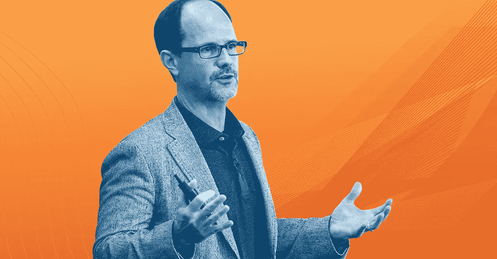

# 从首席信息官的角度来看:Capital One 的罗布·亚历山大谈论 2017 年的技术预测

> 原文：<https://medium.com/capital-one-tech/from-the-cios-view-capital-one-s-rob-alexander-talks-tech-predictions-for-2017-f9c834f2b109?source=collection_archive---------0----------------------->

## 在拉斯维加斯举行的 AWS re:Invent 大会上，我们采访了 Capital One 的首席信息官 Rob Alexander，并询问了他关于 Capital One 和亚马逊在大会上宣布的新闻以及他在未来一年的首要技术任务。

问:Capital One &亚马逊在 re:Invent 上宣布了一条消息——你能稍微介绍一下吗？

*答:* [*Capital One 宣布*](http://phx.corporate-ir.net/phoenix.zhtml?c=176060&p=irol-newsArticle&ID=2226331) *我们将采用云优先的方法进行所有开发，AWS 是我们云基础设施服务的主要供应商。我们真的认为这是我们公司现代技术方法的一个关键组成部分。AWS 云实现了快速、高效的软件开发和部署，并允许我们的团队专注于我们最擅长的领域——构建优秀的软件并为我们的客户提供创新体验。*

**问:2017 年，你最优先考虑的技术是什么？**

*答:招聘和留住人才对我来说是头等大事。比下一家银行好 10%是不够的。我们必须快速行动，构建我们自己的软件，并利用数据和分析来构建更好的客户体验，而这一切都始于我们的人才。我们已经雇佣了数千名工程师，并大量需要有技能和创造力的软件工程师、数据工程师、安全工程师、云工程师和其他人加入我们的协作和快节奏的技术团队。*  **问:银行业未来将会发生怎样的变化，科技在其中将扮演怎样的角色？**

*答:随着银行业变得更加实时、数字化，并且能够更好地预测客户需求，技术将在未来人们的银行业务中发挥核心作用。为了在数字化重新定义银行业的过程中获胜，并为我们的客户提供卓越的数字化体验，我们知道我们需要培养领先技术公司的人才和能力。*

问:2017 年最热门的科技预测是什么？

*答:我预计我们将继续看到机器学习的未来和跨行业应用的一些真正有趣的进步，这些进步将带来突破性的客户体验。这是我们在 Capital One 探索的一个领域——我们如何更好地负责任地利用数据和信息，以新的、强大的方式帮助我们的客户改善他们的财务生活。*

**问:随着这一年接近尾声，你有什么关于 2016 年的想法想要分享吗？**

答:我非常感激每天和我一起工作的有才华的人。无论我们是为客户开发新软件，还是在格蕾丝·赫柏计算机界女性庆典上搭建展台，我都被我们的员工在创造最佳体验方面投入的热情和才华所鼓舞。我很高兴看到我们在 2017 年可以一起完成的事情。

*欲了解更多关于 Capital One 的 API、开源、社区活动和开发者文化，请访问我们的一站式开发者门户 DevExchange。*