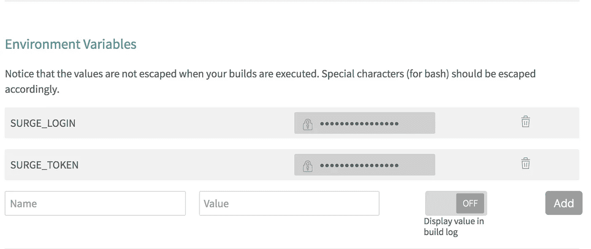

# 从零到部署 React、TravisCI 和 Surge

> 原文：<https://medium.com/quick-code/from-zero-to-deployed-with-react-travisci-and-surge-9be99350cf8b?source=collection_archive---------0----------------------->

**更新**:这篇文章是不久前写的，虽然一些概念仍然是可靠的，但从头到尾需要得到的确切代码已经改变，我近期没有时间更新它。我仍然希望它能够帮助一些读者看到这个过程一步一步地走过，尽管这些天像 [Netlify](https://www.netlify.com) 和 [Now](https://zeit.co/home) 这样的服务使这个过程更加容易。

如果你在过去的几年里做过网站开发，你就会知道建立网站是多么的耗时。不仅仅是内容的设计、编码和测试，还包括内容的实际部署和管理。通常，对于大多数静态内容网站，你最终会得到一个或多个 HTML 文档、一些 CSS、图片、字体和 JS 代码，需要通过 FTP 上传到某个地方的某个服务器上，整个过程可能有点痛苦。你可能知道也可能不知道，有一种方法可以用一些现代工具更简单地做到这一切。今天，我将向您展示如何利用`[create-react-app](https://github.com/facebook/create-react-app)`、 [TravisCI](https://travis-ci.org/) 和 [Surge](https://surge.sh) 通过几个简单的步骤快速启动、测试和部署一个自举项目到互联网。

这篇文章假设你至少听说过 React，你已经在你的机器上安装了 NodeJS，并且最近做了一些 web 开发。而且强烈推荐 2021 年[学 Javascript](https://blog.coursesity.com/popular-javascript-frameworks/) 编程。

# 入门指南

首先，您需要从命令行运行`npm install --global create-react-app`来获取`create-react-app`。之后，您可以通过导航到您想要创建应用程序的目录并键入`create-react-app myHelloWorld`来轻松启动项目。更新:看来`create-react-app`不再支持骆驼案了。对于这篇博客的剩余部分，假设无论你在哪里看到`myHelloWorld`都用`my-hello-world`代替。我会尝试更新所有参考资料，但我可能会错过一个或有一个过时的截图或一些分散的…

整个过程看起来有点像这样:

```
$ npm install --global create-react-app
$ cd /path/to/folder
$ create-react-app my-hello-world
```

现在您已经有了一个可以在文本编辑器中打开的 React 应用程序——我使用的是 [Visual Studio 代码](https://code.visualstudio.com/)。

`create-react-app my-hello-world`的输出会给你一些后续步骤，比如`cd my-hello-world`和`npm start`。当您在 VSCode 中打开这个项目时，您将会看到类似如下的内容:


The main App.js file in a bootstrapped create-react-app project

您可以看到，这个文件包含了我们应用程序的所有布局和内容。接下来，删除 App.js 中的所有内容，并添加以下内容:

```
import React from 'react';
import './App.css';export default () => (
  <div *className*="App">
    <header *className*="App-header">
      <h1 *className*="App-title">Welcome To My Hello World!</h1>
    </header>
    <p *className*="App-intro">
      My name is type_your_name_here. Welcome, and hello!
    </p>
  </div>
);
```

确保将`type_your_name_here`部分替换成你的名字，或者任何你想要的东西。这个例子是特意简化的，以便您可以继续下一步。因为这并不意味着是 React 的入门，我将跳过解释这一点，但足以说，如果你一直在用老方法做 web 开发，你会喜欢它，并想在 React 中做任何事情，因为它简化了很多。如果你需要这方面的速成课程，[这个](https://code.tutsplus.com/series/react-crash-course-for-beginners--cms-1204)似乎是一个很好的资源。

# 继续前进

在您可以设置一些奇特的自动化构建和部署之前，只需再多几个步骤。通过运行`npm install --global surge`安装浪涌。在等待安装的过程中，您可以观看此视频，快速了解什么是 Surge，以及它能做什么:

Surge introduction from [https://surge.sh](https://surge.sh) on how to deploy using Surge

安装完成后，你就知道 Surge 有多棒了，你可以运行以下命令来构建应用程序并设置你的 Surge 帐户:

```
$ npm run build && surge
```

在应用程序建立后，Surge 会要求你输入电子邮件和密码来建立你的账户。当到达`project path:`时，一定要把`/build`附加到末尾，因为那是`create-react-app`放代码的地方。下一个提示是`domain:`，输入`<your_name_here>.surge.sh`。

如果到目前为止您一直在学习，那么您将已经引导了一个 React 应用程序，构建了它，并且在运行上面的`surge`命令之后，实际上在`<your_name_here>.surge.sh`将它部署到了互联网上。请随意查看部署在 [shawnpetros.surge.sh](http://shawnpetros.surge.sh) 的 mine。对于静态网页内容的自动化部署来说，这是一个很好的开始，但是让我们更进一步，通过 GitHub 和 TravisCI 来实现它！

# GitHub 和 TravisCI

如果你从未使用过 TravisCI 或任何构建工具，那么你会喜欢这个。Travis 是一个很棒的工具，它简化了很多你以前不得不自己做的事情，或者为其编写脚本，比如将文件 FTP 到你的主机提供商。确保你进入 GitHub 并为`my-hello-world`创建新的回购协议，然后前往 [TravisCI](https://travis-ci.org) 并使用你的 GitHub 账户登录，这样你就可以很容易地整合这两者。Travis 应该有一个存储库列表，并允许您通过单击想要构建的存储库的开关来打开自动化。现在就为你的`my-hello-world`回购做吧。

现在回到代码中，在项目的根目录下创建一个名为`.travis.yml`的文件，并添加以下内容:

```
language: node_js
node_js:
  - "stable"
cache:
  directories:
    - node_modules
script:
  - npm test
  - npm run build
deploy:
  provider: surge
  skip_cleanup: true
  domain: <my_name_here>.surge.sh
  project: ./build/
on:
  branch: master
```

确保将`deploy`下的`domain`行更改为您在运行 Surge 时使用的域，这样自动化将在每次运行时将代码部署到相同的域。

文件的其余部分基本上告诉 Travis 使用最新的稳定节点包，缓存`node_modules`目录，运行内置于`create-react-app`中的测试和构建脚本，然后当对存储库上的主分支进行推送时，使用 Surge 部署提供程序将`build`文件夹推送到位于由 Surge 托管的`<my_name_here>.surge.sh`的互联网上。这基本上是魔术。

现在，我们需要回到特拉维斯和设置一些事情。Surge 将需要您的电子邮件地址和令牌，以便您从 TravisCI 构建工具登录。要获得这个令牌，在命令行中运行`surge token`,复制第二个令牌行的输出，显然我屏蔽了我的，但它看起来应该是这样的:

```
Surge - surge.sh email: [shawn.petros@gmail.com](mailto:shawn.petros@gmail.com)
              token: *****************
              token: <masked>                 <-- copy this
```

打开开关后，转到 Travis 并点击您的`my-hello-world`库的齿轮图标。如果您已经在之前的步骤中打开了它，那么您可以通过单击左侧面板中的 repo，然后单击右侧菜单中的“更多选项”>“设置”来找到设置。向下滚动页面到环境变量，并设置以下变量:



Environment variables for Surge deployments

其中`SURGE_LOGIN`是你设置 Surge up 时使用的邮箱，`SURGE_TOKEN`是你从`surge token`的输出中复制的令牌。

一旦你设置好了，现在你可以回到你的项目，设置你的 git repo，提交你的修改，然后把它们上传到 GitHub。

```
$ git init
$ git add .
$ git commit -m "first commit"
$ git remote add origin https://github.com/<username>/<reponame>.git
$ git push -u origin master
```

完成代码后，您应该会看到 Travis CI 正在构建您的应用程序:


Travis CI building your app

如果一切设置正确，您的构建应该通过，Travis 应该已经将您的应用程序部署到`<your_name_here>.surge.sh`。继续对您的`App.js`进行更多的更改，并将它们上传到 GitHub，以查看它们快速自动重新部署到您的网页。

# 后续步骤

使用这些工具还可以做更多的事情，比如使用 Surge 部署到一个自定义域——我的网站就是这样部署的。我希望这是对当前一些 web 开发工具的一个信息性的介绍，并且我能够向您展示如何利用这些工具来轻松快速地部署 web 应用程序和其他静态内容。

请点击👏按钮下面几下，以示支持！⬇⬇

谢谢！别忘了**关注下面的**快速码。

> 找到关于各种编程语言的[快速代码](http://www.quickcode.co/)的免费课程。获取 [Messenger](https://www.messenger.com/t/1493528657352302) 的新更新。