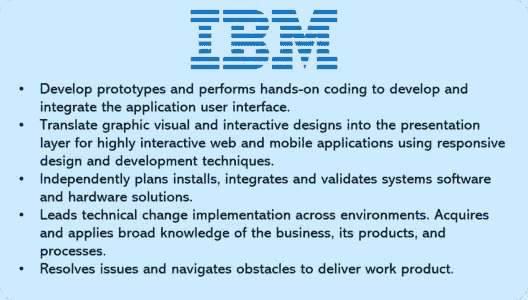
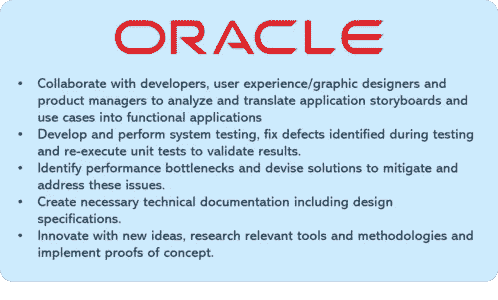
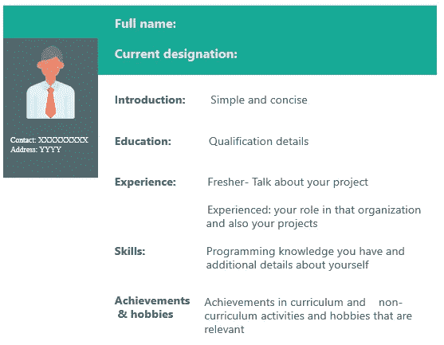

# 了解构建令人印象深刻的前端开发人员简历的途径

> 原文：<https://medium.com/edureka/front-end-developer-resume-c3d443f98296?source=collection_archive---------1----------------------->

Front End Developer Resume — Edureka

你可能听说过一句谚语“良好的第一印象可以创造奇迹”。你的简历通常是潜在雇主对你的第一印象。所以，要给人留下第一印象，你的简历必须从人群中脱颖而出。在这篇文章中，你将学会制作一份**前端开发人员简历**，这将帮助你在激烈的 Web 开发职位竞争中脱颖而出。

我们将在本文中讨论以下主题:

*   谁是前端开发人员？
*   前端开发人员工资
*   工作说明
*   角色和职责
*   所需技能
*   前端开发人员简历示例

# 谁是前端开发人员？

前端开发人员是通过编程语言如 **HTML、CSS 和 JavaScript** 实现网页设计的人。前端开发人员负责网站的设计和外观。然而，后端开发人员在后台工作，比如数据库。如果你去任何一个网站，你都可以在**导航、布局**中看到前端开发人员的工作，也可以看到一个与你的手机不同的网站。

网页设计是关于一个网站的外观，而前端开发是如何在网站上实现的。前端开发人员是负责实现的人。

# 前端开发人员工资

前端开发人员的平均工资是 **₹4,94,103** 印度**印度**。

谈到美国的薪资范围，一名高级前端开发人员平均收入为 101，747 美元。然而，初级前端开发人员的平均收入为 **$70，687** 。

前端 web 开发人员拥有当今就业市场上最受欢迎的技能之一。根据 Glassdoor 的数据，全国前端开发人员的收入中值超过了 7 万美元。在对顶尖技术人才竞争激烈的市场中，平均工资可以超过 10 万美元(T21)。

# 工作说明

制作简历的第一步是查看职位描述。那么，我们来看看 Glassdoor 中不同公司提供的一些职位描述。

# 角色和责任

以下是前端开发人员的一些常见角色和职责:

*   **管理**项目**的复杂细节，需要分析**设计需求**，推荐**技术方案**使项目可扩展，**可维护**，以及**高效**。**
*   解释需求并**创建项目计划**以满足进度和**质量目标**。
*   个人电脑等工具和流行软件的效率，如**文字处理器**或**记事本**、**编程语言编辑器**，以及跨平台检查网站错误的不同浏览器设置。
*   几种**编程语言**的工作知识，能够适应软件的新版本。
*   熟练使用 **Office** 应用程序，并具备**数据库和网络**方面的高级知识。

# 前端开发人员简历所需的技能

有些技术和知识是所有 web 开发人员工作所共有的。以下是前端开发人员角色所需的一组常见技能:

*   优秀的**口头**和**书面沟通技能**，包括流利的英语。
*   精通前端 **JavaScript** 客户端框架，如 **ReactJS、AngularJS、Vue、Knockout 和 Backbone。**
*   了解现代 web 工具和技术，如 **HTML 5.0、CSS、SASS、JavaScript (ES6+)、jQuery、TypeScript、Bootstrap、JSON、Grunt、NodeJS。**
*   精通代码版本控制工具，如 **Git** 和 **SVN。**
*   能够在没有指导或监督的情况下独立工作。
*   了解**网络标准**和可用性指南。
*   强大的**设计技能**和经验。
*   能够在快速开发环境中精心设计独特的**创造性解决方案**。
*   积极主动、精力充沛的团队成员，具有强烈的**职业道德**和**合作态度**。

您可以查看关于[前端开发人员技能](https://www.edureka.co/blog/front-end-developer-skills)的文章，深入了解这些技能，增加您在这些领域的知识。

# 前端开发人员简历示例

起草简历时，有些事情你应该注意。下面列出了一些简单的建议，可以帮助你把简历做得更好。

*   **介绍**应该非常**简单**并且应该切题。
*   你的**教育细节**应该有直到你最新学位的细节。
*   接下来你需要说明的是你的**经验**。可以是项目工作、实习或之前的工作经验。
*   如果你是大一新生，你可以提到你曾经参与的**项目**，并证明你在其中的角色。
*   如果你有经验，提及你在**最近的工作角色**和你在&以前的组织中做过的项目以及你的成就。
*   提及你的**技能**，具体说明你擅长的不同技术。
*   最后，但同样重要的是，提及你的**成就和爱好**。尽量不要夸大其词，因为这可能会分散面试官的注意力。保持简单。

到此，我们就结束了这个前端开发者简历博客。我希望你们喜欢这篇文章，并了解如何写一份有创意的简历来帮助你在职业生涯中取得进步。

如果你想查看更多关于人工智能、Python、道德黑客等市场最热门技术的文章，那么你可以参考 [Edureka 的官方网站。](https://www.edureka.co/blog/?utm_source=medium&utm_medium=content-link&utm_campaign=front-end-developer-resume)

请留意本系列中的其他文章，它们将解释 Web 开发的各个方面。

> 1.[前端开发者技能](/edureka/front-end-developer-skills-ebb32d19f488)
> 
> 2. [HTML vs HTML5](/edureka/html-vs-html5-83302f95652e)
> 
> 3.[网络开发项目](/edureka/web-development-projects-b01f0fe85d3f)

*原载于 2019 年 9 月 11 日*[*https://www.edureka.co*](https://www.edureka.co/blog/front-end-developer-resume/)T22。