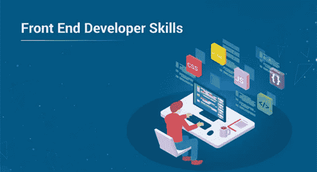
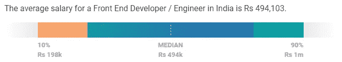
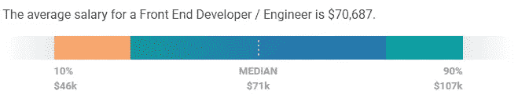
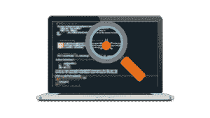

# 你需要知道的 10 大前端开发技能

> 原文：<https://medium.com/edureka/front-end-developer-skills-ebb32d19f488?source=collection_archive---------1----------------------->

Front End Developer Skills — Edureka

Web 开发包括两个重要的部分，每个部分都需要不同的技能和技术知识。前端开发人员处理用户交互的内容，后端则是幕后的一切，并使其发生。在本文中，我们将按以下顺序讨论您必须了解的前端开发人员技能:

*   什么是前端开发？
*   谁是前端开发人员？
*   工作和工资趋势
*   十大前端开发技能:技术
*   前端开发人员技能:非技术性

# 什么是前端开发？

你有没有看过一个网站，想知道它是如何运作的？所有你可以点击的按钮和你最喜欢的网站上的动作都是前端开发的一部分。基本上，所有可见的网站功能都是通过前端开发建立的。

前端层帮助您与网络交互、观看视频、执行诸如注册在线购物网站之类的操作。因此，网页的设计、外观和感觉是在 HTML、CSS 和 JavaScript 的帮助下完成的。

# 谁是前端开发人员？

前端开发人员是通过编程语言如 **HTML、CSS 和 JavaScript** 实现网页设计的人。前端开发人员负责网站的设计和外观。然而，后端开发人员在后台编程，如数据库。如果你去任何一个网站，你都可以在**导航、布局**中看到前端开发人员的工作，以及一个网站与你的手机不同的外观。

网页设计是关于一个网站的外观，而前端开发是如何在网站上实现的。前端开发人员是负责实现的人。

# 工作和工资趋势

据 [TechRepublic](https://www.techrepublic.com/) 报道，网页开发是 2019 年 10 大热门科技技能之一。美国劳工统计局最近的统计数据预测，到 2026 年**，与 2016 年**相比，网络开发职位的数量将增长 **15%** 。****

****前端开发人员的一些关键角色包括:****

*   ******前端工程师******
*   ******初级前端开发人员******
*   ******前端软件工程师******
*   ******前端开发人员******

****前端开发人员的平均工资是 **₹4,94,103** 印度**印度**。****

********

****资料来源:薪级表****

****谈到在美国的薪资范围，一名高级前端开发人员在 T2 的平均收入是 101，747 美元。然而，初级前端开发人员的平均工资为 **$70，687** 。****

********

****资料来源:薪级表****

****现在，您已经了解了前端开发人员的角色，让我们继续关注一些您必须了解的前端开发人员技能。****

# ****十大前端开发技能:技术****

****如果你看一下当前的前端开发人员的工作列表，你会看到有一个清晰和共同的技能池雇主正在寻找。让我们来看看前端开发人员必须具备的 **top** **10 项技能**:****

## ****1.HTML/CSS****

********

******超文本标记语言** (HTML)是用于创建网页的标准标记语言。它是开发网站所需的最基本的构建模块。 **CSS** (层叠样式表)是一种语言，用于呈现您用 HTML 创建的文档。****

****HTML 用于创建页面的基础。而 CSS 用于创建页面的布局、颜色、字体和样式。这两种语言对于成为前端开发人员是绝对必要的。****

## ****2.JavaScript/jQuery****

********

****前端开发人员的另一个重要工具是 **JavaScript** (JS)。如果你想在你的网站上实现交互式功能，比如音频和视频，游戏，滚动能力，页面动画，JS 是你需要的工具。****

****JavaScript 由像 **jQuery 这样的库组成。这是一个插件和扩展的集合，可以让你在网站上更快更容易地使用 JS。jQuery 接受需要多行 JS 代码的常见任务，并将它们压缩成一种可以用一行代码执行的格式。******

## ****3.结构****

******CSS** 和 **JavaScript 框架**是 CSS 或 JS 文件的集合，它们通过提供共同的功能来执行不同的任务。您不是从一个空的文本文档开始，而是从一个已经包含大量 JavaScript 的代码文件开始。****

****框架有它们的长处和短处，这使得为你正在构建的网站类型选择最好的框架变得很重要。例如，一些 JS 框架非常适合构建复杂的用户界面，而另一些则擅长显示站点的所有内容。****

## ****4.响应式设计****

****我们使用电脑、手机和平板电脑等不同的小工具来浏览网页。网页会根据您使用的设备进行自我调整，而无需您付出任何额外的努力。这要归功于**响应式设计**。前端开发人员的一个主要角色是理解响应式设计原则，以及如何在编码端实现它们。****

****它是 **CSS 框架**的固有部分，比如**引导**。这些技能都是相互关联的，所以当你学习一种技能时，你通常会同时在其他技能上取得进步。****

## ****5.版本控制/Git****

******版本控制**是跟踪和**控制对你的源代码的变更**的过程，这样你就不必在出错时从头开始。这是一个工具，你可以使用它来跟踪以前所做的更改，这样你就可以回到你的工作的以前版本，并找出哪里出了问题，而不用把整个东西拆掉。****

## ****6.测试/调试****

****测试是任何项目中防止错误的重要部分。因此，前端开发人员必须具备测试和调试代码的技能和能力。web 开发有不同的测试方法。功能测试关注你的网站上的一个特定的功能，并确保它按照代码做所有的事情。****

********

****单元测试是另一种方法，它测试最小的代码，并逐个检查它是否正确运行。测试是前端开发过程的一个重要部分，有一些框架可以帮助你。像**摩卡**和**茉莉**这样的程序旨在加速和简化你的测试过程。****

## ****7.浏览器开发工具****

****现代网络浏览器配备了**开发工具**用于测试和调试。这些工具允许你在浏览器中测试网页，并找出网页是如何解释代码的。****

****浏览器开发工具通常由一个检查器和一个 JavaScript 控制台组成。该检查器允许您查看页面上的运行时 HTML 是什么样子，页面上的每个元素与什么 CSS 相关联，还允许您编辑您的 **HTML 和 CSS** 并实时查看发生的变化。JS 控制台允许您查看浏览器试图执行 JS 代码时发生的任何错误。****

## ****8.Web 性能****

****重要的是要确保你的网站运行顺畅，没有任何故障。 **Web 性能**定义了**站点加载**所需的时间。如果你在性能时间上有问题，你可以采取一些措施来改善它们，比如优化图片和缩小 CSS 和 JavaScript。****

********

****像 **Grunt** 和 **gulp** 这样的程序可以用来自动化图像优化、CSS 和 JS 缩小以及其他网络性能杂务。这有助于提高网站的效率。****

## ****9.CSS 预处理****

******CSS 预处理器**是 CSS 的高级版本。这是用来增强 CSS 的初级类，以创建更好的网站版本。它不仅仅是一种改进样式元素的语言，它还帮助开发人员跳过像频繁编写 **CSS 选择器**和颜色字符串这样的任务。****

****有三种类型的预处理器可用，如 **Sass、LESS 和 Stylus** 。你应该编写代码来帮助预处理器，反过来，它会转换成 CSS，将网站的工作。****

## ****10.命令行****

****GUI 也是 web 开发和编码的重要部分。但是一个通用的 GUI 对于一些特定的应用程序来说会有它的局限性。有时，您可能需要打开计算机上的终端，在那里您可以输入键入的命令或命令行来获得您需要的内容。****

********

****尽管您的大部分工作都是通过 GUI 完成的，但是如果您掌握了命令行，您可以为您的前端技能增加重要的可信度。****

****这些是一些**技术前端开发人员技能**。除此之外，你还应该熟悉其他一些非技术领域**，这将有助于你的职业发展。******

# ******前端开发人员技能:非技术性******

******我们有一个误解，认为开发者只需要有效地创建用户界面。但是要做出高效的产品，和客户沟通，把握思路也很重要。你应该精通**语言和声音沟通技巧**。此外，要与团队合作，你还需要具备团队工作的基本经验。******

****有一点是所有前端开发人员都必须具备的，不管职位描述还是官衔，那就是优秀的**解决问题**技能。从弄清楚如何最好地实现一个设计，到修复突然出现的错误，到弄清楚如何使你的前端代码与正在实现的后端代码一起工作，开发都是关于创造性地解决问题。****

****如果你想在这个领域出类拔萃，这些是你必须掌握的一些重要的前端开发技能。说到这里，我们的文章就到此为止了。我希望在进入前端开发领域之前，您已经了解了需要掌握的不同技能。****

****如果你想查看更多关于人工智能、Python、道德黑客等市场最热门技术的文章，你可以参考 [Edureka 的官方网站。](https://www.edureka.co/blog/?utm_source=medium&utm_medium=content-link&utm_campaign=front-end-developer-skills)****

> ****1.HTML vs HTML5****
> 
> ****2.[前端开发者简历](/edureka/front-end-developer-resume-c3d443f98296)****
> 
> ****3.[网络开发项目](/edureka/web-development-projects-b01f0fe85d3f)****

*****原载于 2019 年 9 月 4 日*[*https://www.edureka.co*](https://www.edureka.co/blog/front-end-developer-skills)*。*****