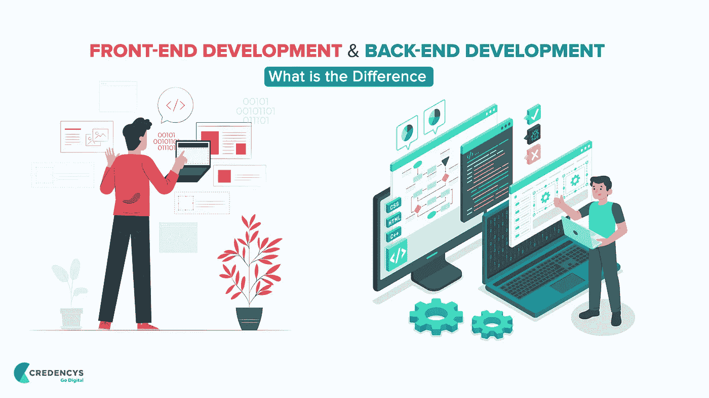

# 前端开发和后端开发——有什么区别？

> 原文：<https://medium.com/quick-code/front-end-development-and-back-end-development-what-is-the-difference-d84809f427ce?source=collection_archive---------0----------------------->

无论你是想构建一个 web 应用还是移动 app，前端和后端开发都是其中不可或缺的一部分。

如果你是非技术人员，那么你就无法理解前端开发和后端开发的区别。这两种开发都有一套不同的技术来构建一个健壮的工作 web 或移动解决方案。

您确定您能够为应用程序的前端和后端开发选择正确的技术吗？

似乎很有挑战性。我说的对吗？

不再是了！

我想通过向您详细介绍这两种类型的开发来帮助您。它将消除您的困惑，并帮助您理解前端和后端开发之间的衔接。

# 前端

当用户键入你的网站或网络应用程序的 URL 并下载你的移动应用程序时，他们看到的是一个超净布局的界面。这个面向用户的界面在技术领域被称为[前端](https://en.wikipedia.org/wiki/Front-end_web_development)。

这是一个非常重要的组成部分，因为只有当你拥有易于使用且功能齐全的界面时，用户才会对你的应用感兴趣。为了保持竞争力，非常有必要构建一个功能强大、运行完美的前端。

# 什么是前端开发？

我前面提到过，用户在你的网站上能看到和互动的一切都落在前端开发上。前端开发主要致力于为 web 和移动解决方案创建用户界面和用户体验。

所有的元素，如滑块，下拉菜单，布局，字体，颜色等。是前端开发的一部分。HTML、CSS 和 JavaScript 在创建引人注目的前端中起着至关重要的作用。

在设计最终的用户界面之前，创建模型、线框和可点击的原型是非常重要的。它帮助您识别应用程序的用户体验中的问题。而且，如果你知道这个问题，解决它并成为有影响力的前端变得很容易。

要为您的移动或 web 应用程序创建一个完美的前端，与了解您的特定需求、目标和机会并相应地提供前端开发的可靠 web 开发服务提供商合作是非常重要的。

# 前端开发语言有哪些？

# 超文本标记语言

HTML 是超文本标记语言的缩写。它用于使用标记语言设计网页。

它是超文本和标记语言的结合。超文本定义了页面之间的链接。另一方面，标记语言用于定义网页的结构。

# 半铸钢ˌ钢性铸铁(Cast Semi-Steel)

CSS 代表级联样式表。它是一种设计语言，通过允许开发人员对网页应用不同的样式，简化了使应用程序页面可呈现的过程。最重要的是，CSS 比 HTML 独立工作，弥补每个网页的不足。

# Java Script 语言

JavaScript 是一种非常流行的语言，有助于让应用程序与用户交互。它用于增强网站的功能，以运行基于网络的软件或酷游戏。

# 前端开发技术有哪些？

科技界有很多[前端技术](https://www.credencys.com/blog/front-end-technologies/)。我们将在这里讨论其中的几个。

# 安古拉吉斯

AngularJS 是一个开源的 JavaScript 框架，主要用于构建单页面 web 应用。它是不断发展的前端技术之一，使开发人员能够以更好的方式构建 web 应用程序。

它拥有将静态 HTML 转换成动态 HTML 的能力。作为一项开源技术，它可以被任何人修改并免费使用。

# 反应 JS

它是用于前端开发的灵活、有效和声明性的 JavaScript 库。它有助于开发出色的用户界面。ReactJS 是一个基于组件的开源库，是应用程序的一个负责任的视图层。由脸书发明和维护的技术。

# 引导程序

它是一个开源的免费工具，用于开发响应式 web 应用程序和网站。Bootstrap 是最流行的 JavaScript、CSS 和 HTML 框架，允许构建移动优先和响应迅速的网站。

# 后端

顾名思义，它是一套管理网站或 web 应用程序或移动解决方案的服务器端和数据库相关流程的技术。

# 什么是后端开发？

后端是软件开发过程中的服务器端开发。它存储和管理数据，并确保一切都在网站的客户端无缝运行。

这是软件开发过程的一部分，用户既不能看到它，也不能与之交互。它在前端处理用户采取的操作。因此，用户可以间接地访问用户的后端。

后端开发涉及一系列活动，包括在没有用户界面的情况下使用系统组件、编写 API、创建库、集成数据库等等。

# 后端开发语言有哪些？

说到后端开发，就编程语言而言，您有许多选项可供您的应用程序选择。让我们逐一检查后端开发语言。

# C++

C++是当今广泛用于竞争性编程的编程语言。作为后端语言，它也很受欢迎。

# 服务器端编程语言（Professional Hypertext Preprocessor 的缩写）

它是一种专门为 web 应用程序开发设计的服务器端脚本语言。由于 PHP 是在服务器端执行的，所以它作为一种服务器端语言很受欢迎。

# 节点. js

Node.js 是一个跨平台的开源运行时环境，允许在浏览器之外执行 JavaScript 代码。它既不是编程语言，也不是框架。

它用于开发后端服务，如移动或 web 应用程序的 API。Node.js 被优步、PayPal、沃尔玛、网飞等财富 500 强公司大量使用。

# Java Script 语言

它可以用作后端或前端编程语言。

# Java 语言(一种计算机语言，尤用于创建网站)

Java 是最流行的编程语言之一，被开发人员社区广泛使用。它是一个高度可扩展的平台，因为 Java 的组件很容易获得。

# 计算机编程语言

作为领先的编程语言之一，Python 允许开发人员高效地集成系统并快速工作。

# 有哪些后端技术？

如果我们谈论后端技术，它包含各种框架和库。有很多领先的后端技术，但这里我们只考虑一些使用频率很高的技术。

# 表达

Express 是 Node.js 的免费开源框架，用于构建 web 应用程序。它是在麻省理工学院许可下发布的。它允许构建 API 和 web 应用程序。

# 拉勒韦尔

Laravel 是一个免费的开源 PHP web 框架。它简化了大多数 web 开发中使用的常见任务，如缓存、路由、身份验证和会话。它简化了程序员的开发过程，而不影响应用程序的功能。

# C#

C#是一种灵活而强大的编程语言。它可用于构建广泛的应用程序。该技术用于各种项目，如开发工具、网站，甚至编译器。C#有助于创建面向对象的编程语言。

# 结论

要构建具有前端和后端的强大应用程序，您需要了解开发类型之间的差异。从众多技术中选择合适的技术是非常重要的。我希望这篇文章能为你提供关于前端和后端技术的见解。

尽管如此，如果您在选择正确的技术时有困惑，请咨询可靠的 web 开发服务提供商，他们会向您保证项目的成功开发和实现。