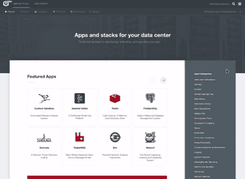

# 燃料企业大规模采用集装箱

> 原文：<https://medium.com/capital-one-tech/fueling-enterprise-adoption-of-containers-at-scale-1995edbc6f86?source=collection_archive---------7----------------------->

来自 Capital One 的 Critical Stack 联合创始人利亚姆·兰德尔

对于 Capital One 的 Critical Stack 团队来说，今天是激动人心的一天，因为我们发布了面向企业的安全容器编排平台 Critical Stack 的测试版。

**稍微介绍一下暴栈团队**

2014 年，当我和达斯汀·韦伯(Dustin Webber)共同创立 Critical Stack 时，我是带着在安全战壕中度过的职业生涯的视角。我们厌倦了被动的安全性方法，希望真正从根本上解决安全性、合规性和漏洞——在应用程序生命周期的上游，而不是在响应的下游。我们相信，如果我们能够让企业更安全地运营企业生命周期，我们就能极大地影响下游企业。

Critical Stack’s Dustin Webber (CTO) and Liam Randall (President)

我们的创业引起了我们客户群的共鸣，我们发展迅速。我们专注于接触那些具有前瞻性思维、已经致力于重用原则并正在向容器化微服务发展的公司。其中一个客户是 Capital One——随着我们与他们的合作，我们与他们的关系越来越密切。我们两个组织是如此天然的契合，以至于我们在 2016 年加入了 Capital One 大家庭。

**向容器化微服务的转变**

随着像 Capital One 这样的越来越多的组织认识到迁移到现代计算基础设施的自动化、速度和成本节约优势，企业基础设施中的容器化微服务正在发生越来越大的转变。

这种转变呼应了过去的架构中断——从大型机到 PC，PC 到虚拟机，现在虚拟机到弹性容器。与所有这些颠覆性时刻一样，企业在寻求架构转型时会面临新的挑战，而这正是关键堆栈的用武之地。

我们在设计关键堆栈时考虑到了企业客户，以帮助满足大型企业(尤其是那些处于高度监管行业的企业)在向云、容器和微服务迁移时所面临的需求。

社区已经团结起来，通过 Kubernetes 解决了迁移到容器化微服务的第一部分挑战。Critical Stack 和 Kubernetes 同时成立，我们从第一天起就致力于与 Kubernetes 兼容。我们努力打造真正的企业产品，因此我们专注于帮助企业在部署、配置、扩展、安全性和合规性方面实现自动化。

作为一家已经转向微服务和容器标准化的大型企业，我们对这些需求有着深刻的理解。我们相信 Critical Stack 将帮助更多公司迁移到集装箱化基础设施。

**让 App 成为一等公民**

Critical Stack 是一个独立的容器编排平台，兼容开源容器管理系统，如 Google 的 Kubernetes。

关键堆栈使企业能够做到的是:

*   自动化他们的安全性和合规性策略
*   协调容器部署和更新
*   针对性能、速度和成本优化应用和基础架构

*An interactive GUI with wizards, built in metrics, and more empowers novice operators while still assisting advanced users to operate and secure containerized infrastructure.*

关键堆栈首先使企业能够自动化其安全和合规性策略，并超越以下方面:

*   不仅支持安全执行策略，还支持利用最新内核安全策略的高级 CNI
*   强化的 RHEL 兼容操作系统
*   一个简单但功能强大的 GUI
*   推动重用和标准的内置市场

*The Critical Stack Marketplace increases reusability and standardization by including preconfigured and secured templates while allowing organizations to publish their own applications privately to their team.*

这意味着对于企业来说，应用程序成为环境中的一等公民，这样开发人员就可以花更少的时间来设置和操作容器基础设施，而有更多的时间来解决他们的难题。

很多人问我，为什么一家银行会推出这种企业科技产品，但在 Capital One，我们认为这是我们作为一家公司的自然延伸。Capital One 的成立基于信息和技术将彻底改变金融服务的信念。二十年后，我们的信念更加坚定。作为第一家将核心处理迁移到公共云的美国银行，Capital One 采用了云优先的软件开发方法，并在云中实现了 RESTful APIs、微服务和容器化的标准化。

作为一家已经迁移到云和容器化微服务的大型企业，我们了解企业在迁移到现代计算基础设施时的独特需求。我们相信 Critical Stack 可以帮助满足这些需求，这就是为什么我们很高兴将其引入测试版，向其他公司公开，并尽我们所能构建最好的安全容器编排平台。

有关 Critical Stack 以及如何注册测试版的更多信息，请访问[criticalstack.com](https://criticalstack.com/)查看我们的网站。

*以上观点为作者个人观点。除非本帖中另有说明，否则 Capital One 不属于所提及的任何公司，也不被其认可。使用或展示的所有商标和其他知识产权都是其各自所有者的所有权。本文为 2017 首都一。*