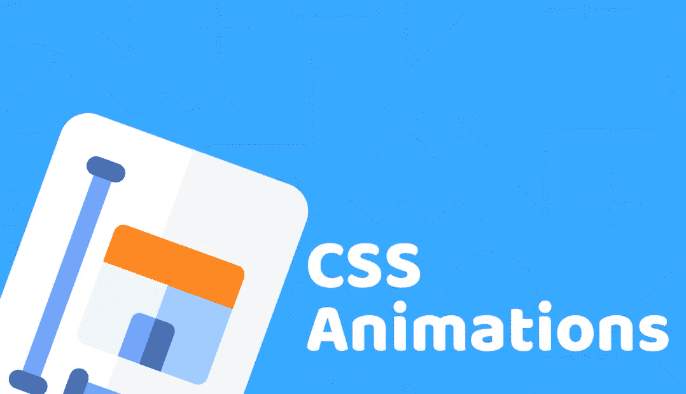

# 完整的 CSS 动画指南，你应该在创建下一个网站之前阅读

> 原文：<https://medium.com/duomly-blockchain-online-courses/full-css-animations-guide-which-you-should-read-before-creating-your-next-website-fcdfddb01ddd?source=collection_archive---------0----------------------->



Duomly — Programming Online Courses

本文最初发布在 https://www.blog.duomly.com/css-animations-cheatsheet[的](https://www.blog.duomly.com/css-animations-cheatsheet)

既然我们可以用 CSS 创建动画，那么构建一个具有平滑过渡和漂亮移动元素的令人惊叹的网站应该不难。这是一个很好的机会，可以给你的网站设计添加一些惊人的效果，让客户或招聘人员记住它。从其他开发者的投资组合中脱颖而出总是一个很好的选择。

你不必重建一半的网站；有时候，加一两个效果就够了，让设计更生动，更刺激。但是记得找到一个甜蜜点，以避免从你的网站创建一个小的，缓慢的怪物。

在这篇文章中，我将介绍在 CSS 中创建动画的最关键的方面。我还使用 CSS 动画构建了一个小的奖励项目，我将在本文末尾添加它。

在本指南中，我将介绍以下几个方面:

1.  动画属性
2.  关键帧
3.  在 CSS 中创建动画
4.  装载机项目

我们开始吧。

## 动画属性

设置动画是通过在设置元素或其子属性的样式时分配 animate 属性来完成的。这就是为什么要开始在 CSS 中创建令人惊叹的动画，你必须知道如何设置持续时间、定时、延迟等等。要熟悉他们，了解他们负责什么，我们一个一个来:

**动画-持续时间** —定义动画单个循环的时间，通常以秒或毫秒为单位设置，例如:`animation-duration: 4s`

**animation-delay** —定义元素加载结束和第一个动画周期开始之间的时间，也可以设置为 s 或 ms，例如:`animation-delay: 2s`

**动画-迭代-计数** —定义动画循环重复的次数，可以设置为`infinite`如果你想有一个永无止境的动画，可以用数字设置，例如:`animation-iteration-count: 3`

**动画方向** —定义动画是否应该在每次运行序列时改变方向，或者在每次复位后在相同的位置开始。它可以设置为以下关键字之一:

正常(缺省)-动画在从头开始的一个周期后从 0%到 100%向前播放，这意味着 0%状态

交替(alternate )-动画在每个循环中改变方向，因此它从 0%到 100%开始，下一个循环从 100%到 0%

反向-每次动画从结尾开始，所以它重置为 100%并向后

交替-反转—动画交替并立即反转，这意味着第一个循环从 100%播放到 0%，第二个循环将从 0%播放到 100%

**动画名称** —定义动画中使用的@关键帧的名称

我上面描述的那些属性是最受欢迎和最常用的。但是也有一些不太流行的属性用于设置动画。让我们也浏览一遍:

**动画-定时-功能** —定义动画的定时，这意味着建立加速曲线来定义通过关键帧的过渡

**动画填充模式** —定义在动画执行之前和之后应用于元素的值

**动画播放状态** —允许暂停和重启动画序列

现在你已经知道动画属性是做什么的了，那么我们可以进入下一步，也就是`@keyframe`。

## 键架

要为元素定义自定义行为，您必须设置一个序列，为此，您将使用@keyframe 规则。在@keyframe 中，我们在特定的渲染时间指定元素的样式。

我们为至少两个步骤定义了样式，0%是开始状态，100%是最终状态。我们可以用别名`from`改变 0%，用别名`to`改变 100%。当然，有可能定义两个以上的步骤，所以我们使用百分比来定义动画循环的每个部分的样式。

让我们来看一下代码示例，其中我定义了一个关键帧，它改变了元素的高度:

```
@keyframe grow {
  0% { height: 20px }
  50% { height 60px }
  100% { height 100px }
}
```

因此，在上面的代码中，我创建了一个名为 grow 的关键帧。它将元素的高度从开始的 20px 更改为动画中间的 60px。最后到 100px。
下一步，让我们试着给元素添加动画。

## 创建动画

我们可以使用速记或给每个属性赋值来创建动画。为了使它成为一行，让我们来看看哪个属性占据哪个位置:

动画:动画名称、动画持续时间、动画计时功能、动画延迟、动画迭代计数、动画方向、动画填充模式、动画播放状态

如果你是初学者，我觉得给每个子属性分别赋值会容易很多。
此外，值得记住的是，必须设置动画持续时间以使动画工作。不做，那就看不到效果。

让我们尝试设置上例中的动画:

```
div {
  height: 10px;
  width: 20px;
  animation-name: grow;
  animation-duration: 5s;
  animation-delay: 2s;
  animation-iteration-count: infinite;
}
```

在上面的代码中，我只是给 div 元素分配了一个动画`grow`。动画将在每个周期持续 5s，并将在加载元素后 2 秒开始。当设置为无限迭代时，它会一直重复。很简单，对吧？

## 装载机项目

在上面的步骤中，你已经学会了如何设置动画。我想向你展示如何在一个真实的例子中使用动画。我创造了一个每个网站和应用都需要的元素，loader。使用 CSS 动画创建一个漂亮、多彩的加载器有很多种可能性，通常你可以根据徽标或公司品牌来调整加载器。

例如，我用四个正方形创建了一个动画标志，改变了它们的高度。我想把重点放在 animation-delay 上，向您展示如何将相同的动画添加到几个元素中，并在不同的时间运行它。

正如你所记得的，动画延迟决定了动画加载后要等待多长时间。请看看这个例子，看看它是如何在真实元素上工作的。

Loader

## 结论

在这篇文章中，我介绍了最重要的信息，这些信息是你只使用 CSS 就能制作出好看的动画所需要的。我解释了动画的每个子属性的作用，让你理解应该为一个特定的结果设置什么。

最后，为了向您展示一个真实的例子，我附上了一个从四个 quarts 构建的简单加载器，并用 CSS 制作了动画。

我希望你会发现这篇文章很有用，并以此为基础来制作你的第一个动画。如果你已经熟悉了这些动画，并且做了一些好事，请在评论中与我们分享。

如果你想了解更多关于 CSS 的知识，请加入我们的 [Duomly](https://www.duomly.com) ！

感谢您的阅读，
来自 Duomly 的安娜


[Duomly — Programming Online Courses](https://www.duomly.com)