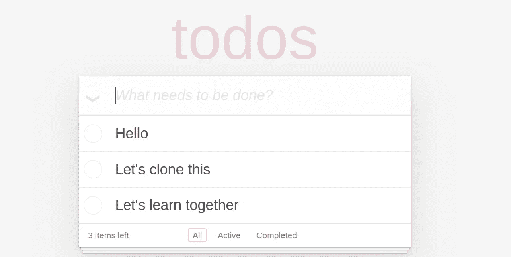
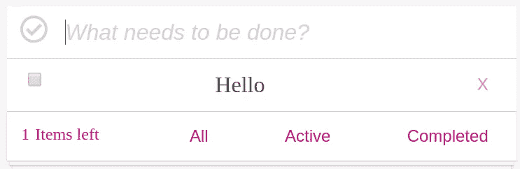
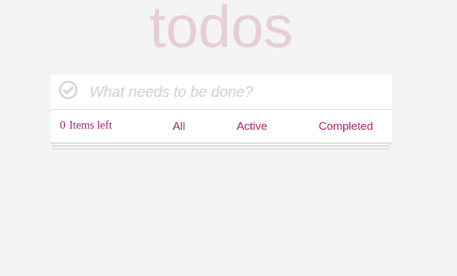
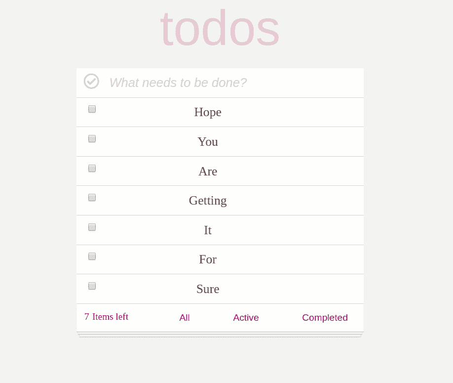

# 带有普通 js 的全功能 Todo 应用程序

> 原文：<https://medium.com/quick-code/fully-functional-todo-app-with-vanilla-js-dc7f972e398a?source=collection_archive---------0----------------------->

> *使用 HTML、CSS 和 JavaScript 创建全功能 todo 应用程序的分步指南*

看看我们要做什么。

 [## 香草* TodoMVC

todomvc.com](http://todomvc.com/examples/vanillajs/) 

是的，我们将克隆它，我将一步一步地教，不跳过任何一步。



我建议你去拿**的启动包**，我已经在里面做了基本的 HTML 和 CSS，这样我们就可以直接学习如何使它功能化。

[](https://github.com/puneettiwari61/lets-make-todo) [## puneettiwari 61/let-make-todo

### 此时您不能执行该操作。您已使用另一个标签页或窗口登录。您已在另一个选项卡中注销，或者…

github.com](https://github.com/puneettiwari61/lets-make-todo) 

所以，不浪费任何时间。我们开始吧。

# 理解方法。

我们将应用[类](https://javascript.info/class)的概念。我们将采用一个名为 TODOS 的类，我们不需要构造函数中的参数。

Declare a class

就数据而言，我们需要一个空数组，在这个数组中，我们将把所有的 todo 作为一个对象保存。我们把它的名字叫做托多。

如果你对我们为什么把 [**这个**](https://javascript.info/object-methods) 放在 todo 的左边感到困惑。

这里我们需要两个方法，一个用于 *addTodo* ，另一个用于渲染*。*

让我们看看这两个方法如何帮助我们完成任务。

在 *addTodo 中，*我们将创建一个带有 Todo 细节的对象，如 todo 的文本，它是否已完成或必须以布尔和唯一 id 完成我们的每个 todo。正如我们在下面看到的

addTodo method

在 *render* 方法中，我们将创建我们将要显示的 dom 元素。

render method

让我们一行一行地去理解*渲染*的方法。

```
Whenever we will invoke render method, there will be some li in ul , so everytime we render we have to clear the innerHTML of ul in order not to get same todo again and again many times.
```

清除 ul 后，下一步是在 todo 上放置一个 forEach 循环，我们将它作为一个数组。每当我们要添加任何 todo 时，都会有一系列的步骤发生，包括创建一个新的“li”、“input”、“paragraph”和“button”元素。



```
As we can see in above pic 
'li' contains 'input' type checkbox, a 'p' which is actually a paragraph, and 'deleteit' a button with a text content of X.so, as it is in forEach loop , it gonna create every single time, whenever we will call render.And offcourse yes we gonna invoke render after adding each todo.
```

*输入*将被检查或不检查，它将从 todo 属性中取值，该属性以布尔形式完成，默认情况下我们将其设置为 false。

*   *需要注意和理解的重要一点是，我们向“input”和“delete”元素添加了一个 data-key 属性，该属性相当于 todo 的“id”属性。

为了反映显示中的一切，我们在“li”中附加了“input”、“p”和“delete”元素，然后在 ul 中附加了“li”。

是时候在 *new* 关键字的帮助下创建一个对象了。

```
let newtodo = new Todos;*newtodo is our brand new object with an empty array of key todo.
```

让我们在应用程序中添加第一个功能，在按下 enter 后添加 todo。

首先，让我们使用查询选择器来选择几个重要的元素。

我已经选择了代码中需要的所有重要元素。

# **添加待办事宜，第一功能**

```
First step is to subscribing our main input box with an event listener of 'keyup' event and adding a callBack function enterTodoIn enterTodo function , we are only concern about 'enter' key event.
Whenever user will press enter we are calling our method which we created earlier i.e. *addTodo.*
```

*   *addTodo* 方法将创建一个具有 name、completed 和 id 属性的对象。
*   *名称*将是文本，用户将在主输入框中输入。
*   *完成的*开始会是假的。
*   我们将通过调用我们的随机 id 生成器函数来获取 id。

```
function randomGen(str = 'qwertyuio') {return str.split('').sort(() => Math.random() - 0.5).join('') + '_' + Math.floor(Math.random() * 1000)}In case you are wondering about it, this is how we can  make our random id generator. 
```

*   一旦用户按下回车键，这个新对象将与我们已经存在的数组连接，即 todo。
*   最后一步是调用 render 方法，以便在我们的显示中反映这一点。
*   显然，你也可以添加一个本地存储，就像我添加的那样。

Wooooooooooooooooooooooo！！！！！！！！！！！！！

刚才我们已经完成了 todo 应用程序的第一个主要功能。

让我们进入下一步。

# 删除待办事项，第二个功能

```
First step gonna be is to subscribe a 'click' event to the deleteit button, with a callBack function deleteTodo.
```

*   每当用户点击 *deleteit* 按钮时，就会向我们的回调函数 *deleteTodo* 发送一个事件，我们只对事件的目标感兴趣。
*   在 *deleteTodo* 中，我们在数组上放置了一个过滤器，该过滤器将为我们提供一个新数组，该数组仅包含那些与用户单击的“deleteit”按钮的数据集关键字不具有相同“id”属性的 Todo。
*   然后用获得的新数组替换我们的旧数组。
*   我们肯定会通过调用 newtodo.render(ul)再次呈现这个新对象。
*   是的，我们也应该在这里添加本地存储。

```
***Important thing to keep in mind while writing deleting functionality, we should call our 
deleteit.addEventListener(‘click’, deleteTodo)
function inside our render method , even inside forEach method which is already in render.
***
```

【Woooooooooooouuuuuuuu！！！！！！！！

删除待办事项功能也完成了。

让我们进入下一个功能

# 完成任务后，将待办事项标记为已完成

**这是我们的第三个也是最重要的功能之一**

```
Here, our first step gonna be is to subscribe a 'click' event to the checbox, which we named as input, with a callBack function toggle.
```

*   每当用户点击一个复选框，它就会向我们的*切换*功能发送一个事件。
*   在 *toggle，*中，我们将一个映射放在我们的数组上，条件是如果目标的数据集键等于 todo 的“id”属性，那么它将把它的 completed 属性更改为与它已经完成的属性相反的属性。
*   如果它是真的，我们将使它假，反之亦然。
*   同时，我们要用新得到的数组替换旧的数组。
*   并且通过调用我们的 render 方法并更新本地存储来呈现它是强制性的。

```
***Its imporatnt to call this function inside our forEach method which is already inside our rendor method.
```

为了保持我们的复选框总是更新，每当我们刷新时，不要忘记在我们的渲染方法中添加它

万岁！！！！！！

我们已经完成了 todo 应用程序的三个主要功能。

我们再给它增加几个特性吧。

# 剩余项目，第四个功能

这不完全是一个功能，但它将是我们的 todo 应用程序的一个功能，它将显示我们没有标记完成的剩余项目的数量。



看看上面的图片，这是我们要做的，是的，我已经做了所有的造型部分，并给出了文章开始的链接。

相信我，这很简单。我们只需要用数组的长度来更新它，只包括那些属性为 false 的。

是的，使用过滤方法将是一个好主意。

让我们开始吧。

是的，代码真的很小，只需放一个过滤器获取长度并更新它。

```
***Dont forget to invoke the function in rendor method. 
```

是的，连第四个功能都做好了，再来看三个功能。



从上图中，很容易理解我们接下来的三个功能。

# 活动按钮

每当用户点击活动按钮时。它只会向他显示那些未标记为完成的待办事项。

*   首先，我们必须订阅活动按钮来点击事件。
*   点击激活按钮将触发 *activeFunc。*
*   在 *activeFunc* 函数中，我们使用帮助构造函数 TODOS 创建了一个名为 newtodoActive 的新对象。
*   这个新对象将只包含未标记为完成的待办事项。
*   如上图所示，使用过滤方法，我们得到了新的数组。
*   是的，最后一步是在新对象上调用 render 方法。
*   是的，就这么简单。

# 全部按钮

这个按钮只是显示所有待办事项的列表。无需任何努力，只需用 click 事件订阅它，然后在对象上调用 render 方法。

```
const allFunc = function(event){newtodo.render(ul);}all.addEventListener('click', allFunc);yes this much easy :)
```

**完成按钮**

这将做完全相反的活动按钮。

*   当用户点击完成按钮时，它将调用 *completedFunc* 。
*   我们将在构造函数 TODOS 的帮助下创建一个新的对象，即 newtodoCompleted。
*   它将仅由标记为已完成的待办事项数组组成。
*   是的，下一步是渲染我们的新对象。

**就这样，我们的全功能 todo 已经准备好上线了:)**

我把我所有的 js 代码放在这里，以防有人需要。

希望，会有帮助。

虽然我们还可以在 todo 应用程序中添加更多的功能，但我将这留给你的创造力:)