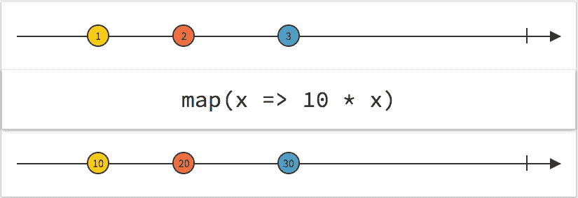

# 适用于 Android 开发人员的函数式响应式编程 — 第 3 部分

> 原文：<https://medium.com/google-developer-experts/functional-reactive-programming-para-desenvolvedores-android-part-3-461c2f558565?source=collection_archive---------2----------------------->

您好,首先祝贺您观看本系列的前两篇文章,我首先介绍了在[首篇文章](/google-developer-experts/reactive-programming-para-desenvolvedores-android-part-i-53788a4fbc9f#.ds3wsaxim)中响应式编程背后的概念和理论,然后是第二篇文章更具技术性的文章,重点是配置 RxJava 库和创建简单的 Observable 以发送数据流和观察者(订阅者),该观察者将监听并响应接收数据的步骤。

在这篇文章中,我将谈论:

*   RxJava 中的函数或运算符以及可以用它们做什么。

# 函数或操作员

正如我在第一个 post-reactive programming 中解释的那样,它就像是 Observer Pattern 的升级,而不是只有一个组件发出数据流,另一个组件接收和响应数据流,有一组函数(运算符),允许您根据您希望数据流在接收观察者时的形式以各种方式操纵数据流。

为了从事件、数据流和应用于此流的函数的角度来理解它是什么以及实际发生的事情,我将使用一个称为*大理石图(T5)的表示来解释。*

## 大理石图(Marble Diagram,T7)

简单来说,大理石图表允许您表示异步数据流。

如下图所示,水平线上的两条线代表**时间。**在此期间,数据流从左向右输出,垂直于时间线(有时为“x”)的最右侧的小线表示数据流的结束。

两条线之间的矩形表示一个函数,该函数将应用于数据流中要发出的每个元素。

要解读大理石图,需要:

*   查看函数之前的第一个时间线;
*   抓住正在发出一次一个元素;
*   应用矩形中表示的函数
*   最后,将转换后的元素放入函数中,与该函数在输出时间轴中通过该函数的时刻相同。

因此,取下图中的第 2 号元素:

该元素由源发出,并通过一个函数(在本例中将其值乘以 map 函数中的 10) 将其转换为值为 20 的新数字。



Marble Diagram, Map Function from [http://rxmarbles.com/#map](http://rxmarbles.com/#map)

*提示:* **大理石图是一种非常实用的*方式*来理解操作员的工作方式,只要它的实现或文档不是很清楚。
Reactive Streams 的官方网站和* [*RxMarbles*](http://rxmarbles.com/#map) *包含了很多很好的表示形式,可以帮助您在通过操作员后查看输出流。(T16)**

# ***有趣的运算符(在我看来很重要)***

*在 [ReactiveX](http://reactivex.io/documentation/operators.html) 网站上有大量的运算符和最佳实践。*

*在这篇文章中,我将只关注那些我认为很重要的,并且在 Android 应用程序开发中反复使用的内容。*

***map —** 如上所示,map 运算符是最简单的运算符之一,因为它的工作是接收数据流中发出的每个项目,并根据定义的函数将其转换为另一个项目(相同类型或不同类型)。
如下面的例子所示,Observable 发出一个名称,但使用函数**map,**字符串“Dario”被转换为“Hello I am Dario”,并发给订阅者。*超级简单=**

```
*Observable.*just*(**"Dario"**).map(**new** Func1<String, String>() {
    @Override
    **public** String call(String name) {
        **return** String.*format*(**"Hello I am %s"**, name);
    }
});*
```

***flatMap —** 平面映射运算符的工作方式类似于映射运算符,它将每个输出的项目转换为数据流,只不过返回一个新的可观察的数据流而不是一个项目。*

*虽然有一个运算符可以帮助对数据流中的项目进行排序,如下面的代码所示,但我使用了 flatMap 运算符将电影列表转换为按字母顺序排列的电影列表,只需在 flatMap 中执行排序操作并发出一个新的 observable,该命令将电影列表按标题排序。*

*flatMap 的一个有趣的用例可以在需要对一个 API 进行两次调用时找到,其中一个依赖于另一个来启动。*

*例如,如果您需要加载喜爱的电影列表,然后获取每部电影的详细信息,则可以创建一个 Observable(调用 API 加载喜爱的电影的 id),该 API 将发送由电影的 id 组成的数据流,并在每个流元素上使用 flatMap 运算符返回另一个 Observable(调用 ID 加载电影的数据),以构成仅能播放电影和详细信息的单个流。*

*要实现这一目标,需要编写大量代码,使用回调在第一个调用返回电影 id 后立即启动第二个调用。*

```
***public** Observable<List<Movie>> loadMovies() {
    **return service**.loadMovies().flatMap(**new** Func1<List<Movie>, Observable<List<Movie>>>() {
        @Override
        **public** Observable<List<Movie>> call(List<Movie> movies) {
            MovieUtils.*sortByTitleAsc*(movies);
            **return** Observable.*just*(movies);
        }
    });
}*
```

## *订阅 VS ObserveOn*

*这两个运算符是反应式编程的宝石,因为它们在并发编程中非常容易,其中多个线程用于并行执行不同的任务。*

*回到 Android 开发的基础,一个启动的应用程序在主线程(UI Thread)上运行,它负责执行诸如管理图形界面,监听用户事件等任务,以确保应用程序始终响应用户。
执行无限期结束的任务,例如在互联网上调用 API 或从本地数据库加载数据等,会阻止主线程继续执行其工作,从而导致应用程序崩溃并向用户返回错误。*

*从 Android 的早期,像 AsyncTasks,Loaders 这样的框架解决方案允许创建一个新的线程来执行这些任务,并最终将响应发送回主线程。*

*最大的问题是,像依赖于 Activity 的 AsyncTask 这样的解决方案不是很灵活,特别是如果您考虑编写易于维护和测试的代码(任何使用过 AsyncTasks 和 Loaders 的人都知道代码有多复杂)。*

## ***subscribeOn***

*查看本系列文章中编写的所有示例,所有创建的 Observable 都会在主线程中发出数据流,其中订阅者调用了 [ **subscribe** 方法给 Observable。*

*因此,如果数据流的任何生产者执行具有无限终止时间的操作(API 调用),他们肯定会遇到与阻止线程(如 Android 的主线程)相关的问题。*

*使用 subscribeOn 运算符,您可以指定生产者将使用哪个线程来发送数据流。
此运算符接收一个 Scheduler 作为参数,该 Scheduler 负责创建和管理线程,如下面的代码所示,调用 API 以加载显示的电影将在由 **Schedulers.newThread 创建的新线程上执行。***

```
***public** Observable<List<Movie>> getShowingMovies(){
    **return** Observable.*just*(loadShowingMovies())
            .subscribeOn(Schedulers.*newThread*());
}

**public** List<Movie> loadShowingMovies(){
    List<Movie> showingMovies = **new** ArrayList<>();
    *//load from network and return list* **return** showingMovies;
}*
```

## *(T8) ObserveOn (T9)*

*使用 subscribeOn 操作符创建另一个线程来加载显示的电影后,您可能需要指定订阅者将接收数据流的线程。对于上面的例子,您很可能希望订阅者在应用程序的主线程中接收数据流,但如果需要,您可以使用 observeOn 操作符定义另一个线程。*

*与 subscribeOn 操作符类似,observeOn 接收一个 Scheduler 作为参数,该 Scheduler 将定义和管理订阅者将接收数据流的线程。*

*要设置订阅者接收 Android 主线程中的数据流,需要传递调度器 **AndroidSchedulers.MainThread** 作为参数,该参数是 [RxAndroid](https://github.com/ReactiveX/RxAndroid) 库的一部分(RxJava 库扩展指定的 Android),如下面的代码所示:*

```
***public** Observable<List<Movie>> getShowingMovies(){
    **return** Observable.*just*(loadShowingMovies())
            .subscribeOn(Schedulers.*newThread*())
            .//outros operadores flatMap, map, etc
            .observeOn(AndroidSchedulers.mainThread());
}

**public** List<Movie> loadShowingMovies(){
    List<Movie> showingMovies = **new** ArrayList<>();
    *//load from network and return list* **return** showingMovies;
}*
```

## *需要考虑的几件事*

*   *subscribeOn 运算符只能对每个 observable 使用一次,所有在 observable 中定义的运算符,取消 observeOn,将在定义的线程上执行它们的工作。*
*   *如果多次定义 onSusbscribeOn 运算符,则仅使用第一个定义(最接近流源的定义)。*
*   *可以多次使用 observeOn 运算符,并且在使用它后立即定义的所有运算符将在它指定的线程上执行其功能。(不建议这样做,因为有可能需要处理***backpressure***的情况下,一个线程上的 observable 发送数据的速度比另一个线程上的 observable 可以处理的更快)*

*我希望你现在已经了解了反应式编程的力量,以及这种模式如何帮助你在开发高质量的应用程序时变得更好。*

*如果您有任何疑问,请不要犹豫,添加评论,以便我们可以进行对话:)*

**如果您发现这篇文章很有趣,请点击下面的心脏点击并与朋友分享!(T9 )**

*吃下一个,*

*dm=)*