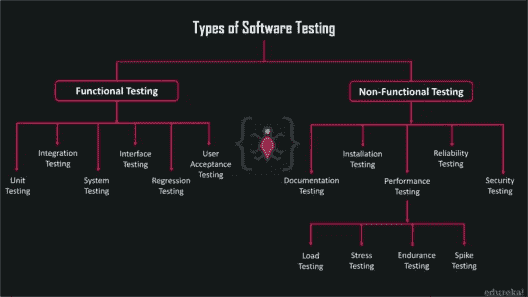

# 功能测试与非功能测试——有什么区别？

> 原文：<https://medium.com/edureka/functional-testing-vs-non-functional-testing-a08bc732fbdd?source=collection_archive---------0----------------------->

Functional vs Non-Functional Testing — Edureka

测试是软件行业的一个时髦词。据***Frost&Sullivan***预测，随着敏捷测试和 DevOps 的兴起， ***软件测试*** 市场有望在未来几年以 14%的 CAGR 速度增长。整个软件完全依赖于过程的这个阶段。系统需要定期测试，以确保它无缺陷地执行流程。因此，在本文中，让我们基于某些参数来比较两种主要类型的软件测试。

下面是我将在这篇功能测试与非功能测试文章中讨论的主题:

*   什么是软件测试？我们为什么需要它？
*   软件测试的类型
*   不同参数下的功能性与非功能性测试
*   结论

在比较功能测试和非功能测试之前，让我们了解一下软件测试的过程。

# 什么是软件测试？

近来科技进步如此之大，以至于我们的大部分日常活动都是用机器来完成的，这些机器需要定期测试，以便降低工作成本。 [*软件测试*](https://www.edureka.co/blog/what-is-software-testing?utm_source=medium&utm_medium=content-link&utm_campaign=functional-testing-vs-non-functional-testing) 是评估软件应用程序的功能，以发现软件中是否存在任何缺陷的过程。它检查开发的软件是否满足指定的要求，并检测软件中的任何缺陷，以便生产出高质量的产品。测试是对系统进行评估，以识别任何差距、错误或与实际需求相反的缺失需求。

# 为什么我们需要软件测试？

如果任何组织使用的软件运行良好，没有任何缺陷，那么用户和组织都会因提供有价值的应用程序而受益。因此，组织开发的所有应用程序都应该定期测试，以验证它是否按照用户要求运行。

*   软件测试是测试人员执行的智力任务。
*   提高开发产品的质量。
*   需要较低的维护成本，因此结果更加准确、一致和可靠。
*   有助于为软件应用程序或产品提供有效的性能。
*   它确保应用程序不会导致失败。

# 软件测试的类型

软件测试是一个知识和认可的汇集，它是一个在全世界广泛使用的过程。你可能想知道存在哪些不同的类型。

测试是任何成功的软件项目不可或缺的一部分。软件测试的类型取决于各种因素，甚至包括项目需求、预算、时间表、专业知识和适用性。不同类型的软件测试在测试人员为适当的应用程序确定正确的测试中起着关键的作用。

软件测试大致分为两大类:功能性测试和非功能性测试，非功能性测试又进一步分为各种类型。下面我们来详细了解一下其中的每一个。

# 功能测试

功能测试是一种软件测试，根据功能要求或规格，如技术细节、数据操作和处理以及其他特定功能，对系统进行测试。你可能会想，功能测试只是指测试你的模块或任何类的一个功能(方法),但这不是它所做的。它测试整个系统的一部分功能。

*   它也是一种黑盒测试，根据被测软件组件提供的规范来保存测试用例。
*   黑盒测试是一种软件测试方法，它有助于检查任何应用程序的功能，而无需查看其内部结构或实现过程。这意味着用户不知道测试用例时发生的内部过程。
*   这种类型的测试检查应用程序是否按照用户的需要/要求工作。
*   通过输入和检查系统的输出来测试功能(特性)。
*   当用户根据业务需求创建测试条件时，功能测试会更加有效。
*   这种类型的测试有助于确定软件预期执行的功能，根据系统的功能规格创建输入数据，根据需求确定输出，执行测试用例，并比较实际和预期输出。

# 功能测试的类型

让我们来看看不同类型的功能测试。它们是:

1.  单元测试
2.  集成测试
3.  系统试验
4.  接口测试
5.  回归测试
6.  用户接受测试

现在，让我们来详细了解一下它们

> **单元测试:**单元是任何软件中最小的可测试部分。它通常有一个或几个输入和一个输出**。**这是软件测试的一个级别，其中测试软件的单个单元/组件。主要目的是验证软件的每个单元，按设计执行。
> 
> 集成测试:这是软件测试的一个层次，将单个单元组合起来，作为一个组进行测试。这种测试的主要目的是暴露集成单元之间交互的故障。
> 
> **系统测试:**这是软件测试的一个层次，对完整集成的软件进行测试。该测试的目的是评估系统是否符合规定的要求。这是一系列不同的测试，其唯一的目的是锻炼系统。
> 
> **接口测试:**验证两个不同软件之间的通信是否正确的软件测试级别。
> 
> **回归测试:**回归测试验证软件中的代码变化不会对产品的现有功能产生影响。
> 
> 用户接受测试:这是软件测试的一个层次，测试系统的可接受性。该测试的唯一目的是评估系统对其业务需求的符合性，并评估其是否可接受交付。它检查软件是否能够处理真实世界场景中所需的任务。

现在，让我们看看什么是非功能性测试，看看它到底对软件测试做了什么。

# 非功能测试

非功能测试是另一种类型的软件测试，用于检查非功能方面，如性能、可用性、可靠性等。未使用功能测试进行测试的软件应用程序。

*   非功能测试有助于测试系统的就绪性。
*   它定义了系统运行的方式，而不是系统的特定行为。这与功能测试完全相反，功能测试根据描述系统功能的功能需求进行测试。
*   基本上，非功能性测试是为了检查和评估功能性测试中没有包括的所有非功能性参数。
*   非功能测试和功能测试同样重要。
*   所有非功能性参数，如速度、可伸缩性、安全性、可靠性和应用程序的效率，都在非功能性测试下进行测试。
*   它使应用程序变得健壮，并针对某些漏洞做好准备。

# 非功能测试的类型

让我们看看有哪些不同的**类型的非功能测试**。它们是:

1.  文档测试
2.  安装测试
3.  性能试验
4.  可靠性测试
5.  安全测试

让我们详细了解其中的每一个

> **文档测试:**它有助于估计所需的测试工作并跟踪需求。软件文档包括测试计划、测试用例以及需求部分。它测试记录的工件。
> 
> **安装测试:**这是软件行业中的一种质量保证工作，集中在客户需要做什么来成功地安装和设置新软件。它检查软件应用程序是否成功安装并按预期工作。测试过程可能包括全部、部分或升级安装/卸载过程。
> 
> **性能测试:**它被定义为一种软件测试，用于确保软件应用程序在预期的工作负载下运行良好。*性能测试*被认为是非功能测试的核心。它又分为几种类型。

## 性能测试的类型:

*   ***负载测试*** 是一种性能测试，用于评估系统在不断增加的工作负载下的行为。
*   **压力测试**是一种性能测试，旨在评估系统在达到或超过预期工作负载极限时的行为。
*   **耐久性测试**是一种性能测试，用于评估系统在持续承受大量工作负载时的行为。
*   **峰值测试**是一种性能测试，用于评估负载突然大幅增加时系统的行为。

这是关于性能测试的。现在，让我们看看其他类型的非功能测试。

> **可靠性测试:**确保产品无故障，并且对其预期目的而言是可靠的。它是对应用程序进行测试，以便在部署系统之前发现故障。
> 
> **安全测试:**它是软件测试的一种变体，确保组织的系统和应用程序没有漏洞。安全测试是为了找到系统中所有可能导致信息丢失的弱点。

这是关于不同类型的非功能测试。现在让我们前进，在各种参数上比较功能性和非功能性测试。

# 比较功能测试和非功能测试的参数

为了指出主要软件测试类型之间的区别，我们将基于一些参数对它们进行比较，比如它们的

1.  目标
2.  重点领域
3.  易用性
4.  功能
5.  执行

让我们清楚地看看这些参数，并理解这些类型的软件测试基于它们有什么不同

> **目的:**功能性测试主要是为了验证和确认软件的行为，如登录功能，而非功能性测试有助于验证和确认软件的性能。
> 
> **关注领域:**功能测试集中在**用户需求**上，比如系统在给定情况下应该做什么，它定义了发生的过程，而非功能测试集中在**用户期望**上，比如系统如何构建，它如何与用户交互等等。
> 
> **易用性:**功能测试易于执行，即用户不知道内部实现的黑盒测试，而非功能测试易于执行白盒测试，即用户知道内部结构/实现过程，并且操作透明。
> 
> 功能性:功能性测试有助于描述系统应该做什么，而非功能性测试有助于描述系统应该如何工作。这意味着功能测试提供了系统中所有功能的答案，而非功能测试提供了系统中所有问题的答案。
> 
> **执行:**功能测试发生在非功能测试执行之前。这是因为功能测试定义了所有的过程，并且这是首先执行的，而非功能测试的执行仅在功能测试执行之后发生，因为只有当系统被定义时，你才能进一步进行并相应地定制它。

所以，这些是功能测试和非功能测试彼此不同的参数。

# 结论

功能测试和非功能测试是在软件测试中起主要作用的两种最重要的测试类型。通过将功能测试纳入测试应用程序的等式中，人们可以测试在任何给定的环境下，流程要做什么，系统要做什么。如果非功能性测试被优先考虑，它处理系统的性能，并描述系统在任何给定环境下的表现。两者各有利弊，受限于一些约束。它的完成取决于用户想如何测试系统。

现在到此，我们结束这篇文章。如果你想查看更多关于 Python、DevOps、Ethical Hacking 等市场最热门技术的文章，你可以参考 [Edureka 的官方网站。](https://www.edureka.co/blog/?utm_source=medium&utm_medium=content-link&utm_campaign=functional-testing-vs-non-functional-testing)

请留意本系列中的其他文章，它们将解释软件测试的各个方面。

> 1.[移动应用测试](/edureka/mobile-application-testing-51140ebe4a87)
> 
> 2.[软件测试工具](/edureka/software-testing-tools-ebd9ebac6f29)
> 
> 3.[软件测试的种类](/edureka/types-of-software-testing-d7aa29090b5b)
> 
> 4. [Appium 教程](/edureka/appium-tutorial-28e604aebeb)
> 
> 5. [Appium 工作室教程](/edureka/appium-studio-tutorial-8a13ee9662d6)
> 
> 6. [JMeter 教程](/edureka/jmeter-tutorial-774856163ee9)
> 
> 7.[使用 JMeter 进行负载测试](/edureka/load-testing-using-jmeter-3da837c11a02)
> 
> 8.[自动化测试教程](/edureka/automation-testing-tutorial-157d269e60db)
> 
> 9. [JMeter vs LoadRunner](/edureka/jmeter-vs-loadrunner-c1ab63acd935)
> 
> 10.[回归测试](/edureka/regression-testing-b913b7064824)
> 
> 11.[性能测试生命周期](/edureka/performance-testing-life-cycle-d4242d39a5aa)
> 
> 12. [JMeter 插件](/edureka/jmeter-plugins-1bceec7f6226)
> 
> 13. [Appium 建筑](/edureka/appium-architecture-505f70bf3484)
> 
> 14.[如何在网站上使用 JMeter 进行压力测试？](/edureka/stress-testing-using-jmeter-e6b3c64299d0)

*原载于 2019 年 3 月 28 日*[*www.edureka.co*](https://www.edureka.co/blog/functional-testing-vs-non-functional-testing/)*。*