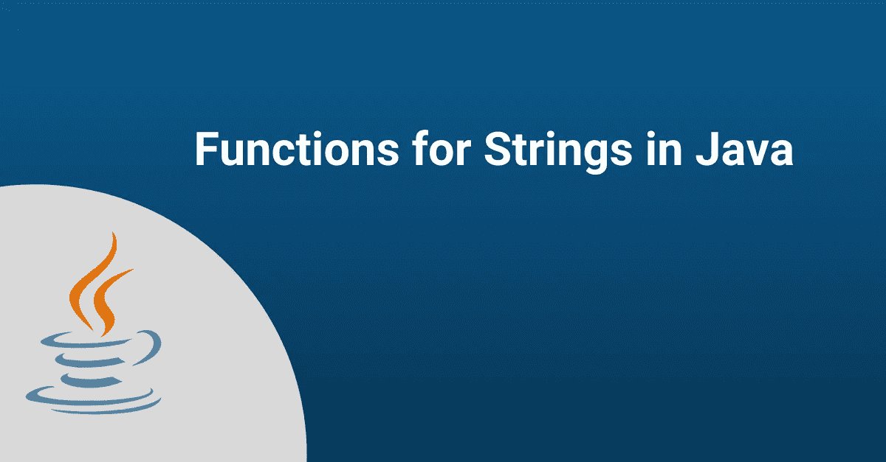

# Java 中的字符串函数

> 原文：<https://medium.com/quick-code/functions-for-strings-in-java-91c63c6f23ab?source=collection_archive---------6----------------------->

## 通过这篇文章了解 Java 中字符串函数的更多信息。

# **什么是 Java 字符串？**

字符串是 Java 中的一个类，它包含一个字符列表或一个序列。我们可以在 Java 中使用字符串对象。我们将在下一节研究所有重要的字符串方法。我们还将对每一个进行简要描述。

因为 Java String 类是不可变的，所以在创建后不能对其进行任何更改。这就是为什么 StringBuffer 和 StringBuilder 被创建为可以在创建后修改的可变类。

# **Java 中字符串的功能:**

Java 提供了多种处理字符串的方法，如下所示。

**长度函数:**一个字符串的长度就是字符的个数。在 Java 中，字符串中的字符由单个字符表示。length()方法返回字符串中的字符数。

**例子:**

你可以在 [**Interviewbit**](https://www.interviewbit.com/online-java-compiler/) 编译器上运行你的代码。

**串联函数:**在 Java 中，+运算符用于组合两个或多个字符串，但 concat()方法可用于字符串串联。

**示例:**

**String to Chararray 函数:**通过将一个字符串的所有字符转换成一个数组来创建一个字符数组。这在字符串操作应用程序中经常使用。

**示例:**

函数:返回指定索引处的字符。在 0 和 length()-1 之间(包括 0 和 1)，指定的索引值必须是一个数字。如果 index 小于 0 或大于 length()，则会引发 IndexOutOfBoundsException。

**例子:**

**CompareTo 函数:**要比较两个字符串，使用此方法。如果一个字符串在字典中位于另一个字符串之前，则它小于另一个字符串。例如，如果字典中字符串“abc”位于字符串“def”之前，“abc”小于“def”。一般来说，如果一个字符串在字典中位于另一个字符串之前，那么它就小于另一个字符串。

**例子:**

**Contains()函数:**我们可以通过这个方法来判断一个特定的子串是否是原串的一部分。返回值是布尔类型的。

**示例:**

**Split Function():**Split()方法将一个字符串拆分成多个子字符串，用特定的分隔符(“”、“”等)分隔。示例代码中的括号将字符串拆分为由拆分括号分隔的子字符串。(thexyzwebsite xyzisxyzinterviewxyzbit)。已经存在于主字符串中的字符串 xyz 块用于拆分字符串。

**例子:**

**Indexof 函数:**在这个方法中，我们在字符串上寻找一个特定的字符或子串。indexOf()用于首先搜索该字符，而 lastIndexOf()用于查找该字符的最后一次出现。如果要搜索特定的字符或子字符串，可以使用 indexOf()方法。但是，如果要查找特定字符或子字符串的最后一个匹配项，可以使用 lastIndexOf()。这两种方法都是常用的。

**例子:**

**toString 函数:**该方法返回对象的字符串形式。此方法没有参数。下面的代码向我们展示了如何获得一个对象的字符串表示。

**示例:**

**reverse()函数:**String buffer reverse()方法对字符串中的字符进行逆序重新排序。

**示例:**

**replace()函数:**String 对象的 replace()方法将一个字符替换为另一个字符。

**示例:**

**subString 函数:**subString()方法返回给定字符串从指定索引开始到结束的子串。

**示例:**

# 常见问题

## Java 中的 String 是什么？

字符串是 Java 中的一种类。它是字符的集合或它们的序列。字符串在 Java 中被用作对象。

## 如何在 Java 中获取字符串列表？

下面列出的过程演示了如何在 Java 中获得字符串列表。这里，我们创建了一个 ArrayList，并使用 split 变量作为分隔符来分隔字符串。然后，我们使用 join()方法连接列表值。由于这里的分隔符是空的，所以字符串之间没有任何分隔符。

## 如何在 Java 中更改字符串值？

字符串不能被修改，因为字符串是不可变的类。您可以使用 StringBuilder 或 StringBuffer(可变类)来修改字符串值。

## 如何在 Java 中去掉字符串的一部分？

该示例提供了使用 replace()函数在 Java 中删除字符串的一部分的过程。

## 什么是 Java 字符串 API？

Java 字符串是类。API 在 Java 语言中被称为应用程序编程接口。然而，String 类及其所有函数总是被称为 Java String API。

## 如何在 Java 中增加字符串大小？

StringBuilder 可用于增加 Java 中字符串的大小。StringBuilder 包含一个名为 setLength()的方法，该方法设置已经初始化的字符串的长度。

## Java 中如何获取字符串的第一个索引？

在 Java 中可以使用 charAt()方法获取字符串的第一个索引。String 类的字符串变量可以用特定的值初始化，然后如下例所示使用:String variablename . charat(0)；

# **结论:**

在本教程中，我们已经学习了字符串方法的基础知识，包括如何使用和每个方法的例子。我们希望所提供的细节有助于您更好地理解字符串方法。