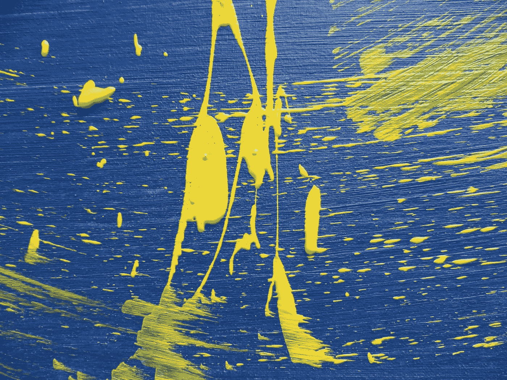

# 融合第八壁和反应三纤维

> 原文：<https://medium.com/globant/fusing-8th-wall-and-react-three-fiber-ac617186c9cd?source=collection_archive---------1----------------------->

## 构建 AR Web 应用程序的强大组合。


构建 Web 增强现实体验的一个强大组合是在 8 号墙平台上使用 ThreeJS 框架。

[**第八壁**](https://www.8thwall.com/docs/web/) 是一个非常强大的平台，帮助你快速编写 AR 应用。它的 AR 引擎在网络浏览器中为你提供图像检测、表面检测、人脸检测等**功能。**

[**ThreeJS**](https://github.com/mrdoob/three.js/) 另一方面是流行的 Javascript 3D 库**。**它使您能够在 web 应用程序中创建 3D 对象。

需要注意的是，ThreeJS 是一个**命令式 javascript API** 。我更像是 ReactJS 的粉丝，喜欢用声明式语法进行开发。

这就是[**做出反应的地方——三纤【R3F】**](https://github.com/react-spring/react-three-fiber)**前来救援。这是一个针对三个 j**的 React 协调器。它使你能够构建三个 JS 对象作为声明性的可重用组件。所有酷且强大的 React 生态系统都会为您解锁，并且它还支持开箱即用的交互性。****

**要继续这篇文章，你需要对第八墙平台、ThreeJS 和 R3F 有一个基本的了解**

**当我开始用 ThreeJS 探索第八堵墙时，所有的例子或讨论都是命令式的。他们工作得非常出色，令人惊叹。但是我很想用声明的方式重写它们。**

**我试图查找是否有任何现有的实现可以一起使用第八墙和 R3F，但找不到一个。**

**嗯，然后我决定自己来做🚀**

**下面是一个基本的实现，在这个实现中，我试图呈现一张卡片的相关细节。起初，它是以命令的方式实现的，然后我能够以声明性的方式重写它**，而不会失去任何能力**。事实上，它使我能够用更好的控制和更干净的方式来写它。**

**这里第八面墙帮助我检测卡片和它的位置。基于这些信息，我正在渲染围绕它的三个 JS 对象，它们是用 R3F 实现的。**

*   **这是一个网络应用程序。**
*   **每个元素都是一个反应成分。**

****

# **我的项目需要两个主要的改变。**

## **1.画布组件的使用。**

****

**所有的 Web AR 应用都在 *< canvas / >* 标签上工作。**

**第八面墙也需要一个。**

**所有第 8 个 Wall 示例都有一个 *< canvas / >* 标签，当应用程序初始化时，它会获取这个 canvas 的一个引用，以开始绘制相机馈送。**

****但是当你想使用 R3F 的时候，你不需要自己写 *<【画布】/ >* 标签。****

**它附带了一个画布组件，这是我们进入 ThreeJS 的门户。**

**这个组件负责呈现我们所有的声明性 ThreeJS 组件。**

**您的组件将如下所示:**

```
**import { Canvas } from 'react-three-fiber'**return ( **<Canvas>

    </Canvas>**)
```

****这个 Canvas 组件在内部呈现一个 *< canvas / >* 标签。****

**因此，作为我们集成的一部分，我们需要将这个 *< canvas / >* 标签的引用附加到第 8 个 Wall 实现。**

**最简单的方法是抓取 *<画布/ >* 元素的引用如下:**

```
// grabbing reference of canvas
let canvasEl = document.getElementsByTagName(‘canvas’)[0]//attaching canvas reference to 8th Wall
XR8.run({ canvas: canvasEl})
```

**为了使这一步正常工作，您可能需要使用 *XRExtras 来**避免** **。在你的第八层墙设置中使用 fullwindowcanvas . pipeline module()***，并**设置 canvasEl** 的样式，使其全屏显示。**

## **2.在第八墙和 R3F 之间共享三个 JS 资源。**

****

**这是集成的主要部分。**

**一个 ThreeJS 应用程序处理关键对象，如场景、相机和渲染器。**

**8 号墙初始化了自己的一组资源来和 ThreeJS 一起工作，R3F 也创建了自己的资源。因此，在这一步中，我们希望能够让它们在同一组资源上工作。我们在步骤 1 中让它们在同一个 *<画布/ >* 标签上工作的方式。**

**我观察到第八道墙没有自己的资源无法工作，因此我们将要求 R3F 使用第八道墙的资源。**

**第八堵墙的 ThreeJS 资源集可通过以下方式生成:**

```
*const { camera, scene } = XR8.Threejs.xrScene()*
```

**现在，我们将把这些资源传递给画布中的应用程序组件:**

```
import { Canvas } from 'react-three-fiber'return ( <Canvas>
        <App
            **scene={scene}
            camera={camera}**
        />
    </Canvas>)
```

****App.js** 是我们进行整合的地方 **:****

```
import React, { useRef, useEffect } from ‘react’
import { useThree } from ‘react-three-fiber’const App = (props) => {
    const { scene, camera } = props
    const { setDefaultCamera } = useThree() // ref to root of our ThreeJS app
    const appRef = useRef() // add our app to 8thWall's ThreeJS scene
    useEffect(() => {
        if(scene) {
            **scene.add(appRef.current)**
        }
    }, [scene]) // set 8thWall's ThreeJS camera as default camera of 
    // react-three-fiber
    useEffect(() => {
        if(camera) {
            **setDefaultCamera(camera)**
        }
    }, [camera, setDefaultCamera]) return (
        <group **ref={appRef}** visible={true}>
            {... your R3F components}
        </group>
    )
}
```

**现在我们的 R3F 应用程序将开始出现在第八墙的三个 j 世界中。**

# **好处？**

**一旦这种集成成功了，我就能够以声明的方式用更少的代码很快地重写我的第 8 墙项目。**

**现在，我可以更专注于在第八墙世界中编写快速而又酷的 ThreeJS 对象，而不是对命令式代码的复杂性感到沮丧。**

**希望这篇文章对你有帮助。编码快乐！**