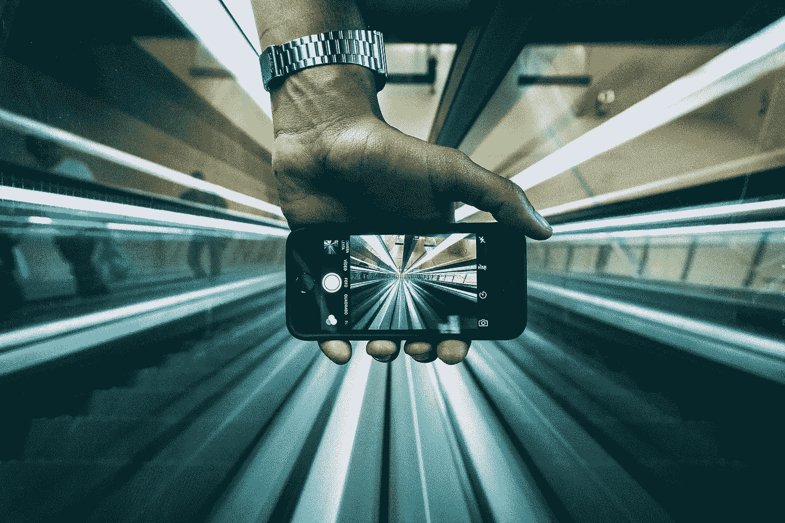

# 移动支付和集成商务的未来

> 原文：<https://medium.com/capital-one-tech/future-of-mobile-payments-and-integrated-commerce-d8c5df813e6?source=collection_archive---------3----------------------->

我喜欢我的快餐连锁店了解我的想法。好吧，我喜欢它的移动应用读取我的想法。如果你在附近，它会在你的手机上弹出你的最后一个订单和应用程序通知。

坦白时间到了:我总是得到一份加了额外辣酱的玉米煎饼。一直都是。

这就好像应用程序在说*‘好吧，让我们一起承认这一点，我们可以让这一切变得非常简单。’*它不会让我面对 2000 种墨西哥卷饼组合或数百种我从未尝试过的墨西哥玉米卷组合。我可以用我存储的支付信息立即支付，跳过排队，走来走去取。太棒了。

这一经历只是商业世界正在演变的一个例子。旧的秩序被分割了:你要么在商店里买了东西，在你的桌面上四处搜索，然后在一个网站上支付，要么你在优步有一个更纯粹的纯移动体验。现在，这些界限正在变得模糊。越来越多的手机钱包在简化在线购物和为消费者提供强大、个性化的购物体验方面发挥着关键作用，无论他们身在何处。

对于消费者来说，这带来了一系列好处，使支付东西更快更容易，更安心。你可以提前预订，在最喜欢的午餐地点付款并提货，或者通过订阅音乐或视频流媒体服务来设置并忘记它。但这也带来了更快的交易流量。

> 在 Capital One，我们专注于提供简单直观的产品和工具，帮助我们的客户在这个新的随时随地的世界中充满信心地管理他们的账户和财务生活。我们的目标不仅是减少摩擦，让事情变得更容易，而是让我们的顾客成为更明智的购物者。我们认为我们的角色不仅仅是提供丰厚回报和出色客户服务的塑料条，但也仅限于此。

[例如，Capital One Wallet](https://www.capitalone.com/applications/mobile/wallet/) 为移动支付增加了一个新的维度，这符合我们成为消费者冠军的愿景。
有了钱包，顾客可以安全、无缝、便捷地直接在手机上使用信用卡或借记卡，在喜欢的商店购物。

作为一款旨在帮助客户控制消费并充分利用信用卡奖励的移动应用程序，它提供了一种简单的方式来管理奖励，获得实时消费提醒以了解您的卡何时被充值，并查看详细的购买信息，使您能够深入了解特定交易，以获得关于钱被花在哪里的实时详细信息。

我们的客户喜欢这种保证。这涉及到我们内心深处的恐惧，有人在我们不知情的情况下，对我们不想要的东西收费。

作为银行，这是我们必须为客户发挥更大作用的地方。客户将他们的数据委托给我们。他们与我们分享他们购买的一切；从每天一杯咖啡到大屏幕电视，再到订阅电影流媒体。我们有机会让这些交易的管理变得更容易，让每一个客户都能够很好地了解他们辛苦赚来的钱的去向。我们可以实时传递这些信息，并在出现任何异常时采取控制措施。

正是这种个性化客户寻求让支付世界变得更简单、更顺畅。对 Capital One 来说，这才是真正的目标:让一家银行融入你的生活，而不是相反。毕竟，如果订购你最喜欢的玉米煎饼碗就像点击一个按钮一样简单，那么你的银行应该能够将压力和担忧转移到更有价值的东西上:你的钱。

*欲了解更多关于 Capital One 的 API、开源、社区活动和开发者文化，请访问我们的一站式开发者门户 DevExchange。*[*https://developer.capitalone.com/*](https://developer.capitalone.com/)