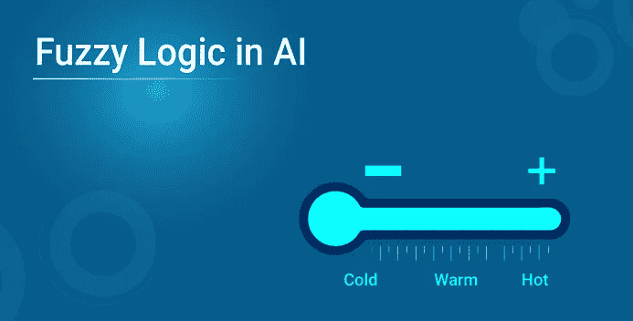
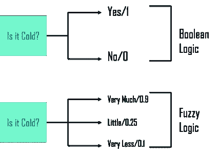
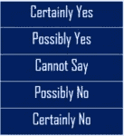
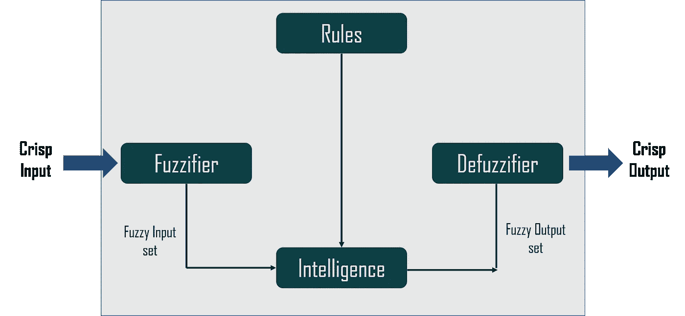
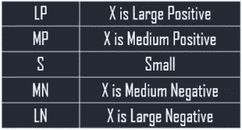
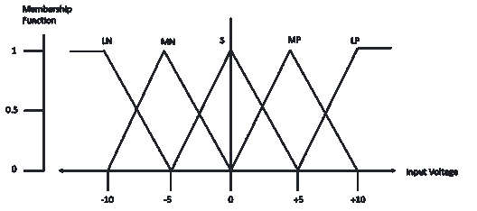
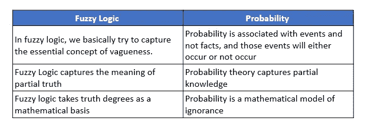
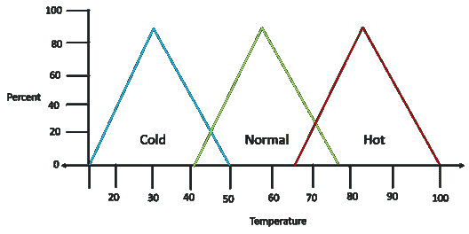
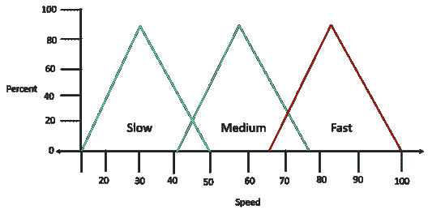
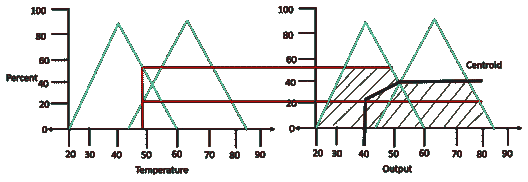

# 人工智能中的模糊逻辑

> 原文：<https://medium.com/edureka/fuzzy-logic-ai-4adc696d1b8d?source=collection_archive---------0----------------------->

在我们的日常生活中，我们可能会面临无法确定状态是真还是假的情况。Fuzzy 指不清楚或模糊的东西。人工智能中的模糊逻辑为推理提供了宝贵的灵活性。在本文中，我们将按以下顺序了解这一逻辑及其在人工智能中的实现:

*   什么是模糊逻辑？
*   我们为什么要使用模糊逻辑？
*   体系结构
*   隶属函数
*   模糊逻辑与概率
*   模糊逻辑的应用
*   优点和缺点
*   人工智能中的模糊逻辑:例子

# 什么是模糊逻辑？

**模糊逻辑** (FL)是一种类似于**人类推理**的推理方法。这种方法类似于人类做决策的方式。并且涉及到**是**和**否**之间的所有中间可能性。

计算机理解的常规逻辑块**接受精确的输入，并产生确定的输出，如真或假，相当于人类的是或否。模糊逻辑由**洛特菲·扎德**发明，他观察到与计算机不同，人类在是和否之间有不同的可能性范围，例如:**

模糊逻辑在输入的可能性水平上工作，以获得确定的输出。现在，谈论这个逻辑的实现:

*   它可以在不同大小和功能的系统中实现，例如**微控制器、大型网络、**或**基于工作站的系统。**
*   此外，它可以在**硬件、软件、**或两者的组合**中实现。**

# 我们为什么要使用模糊逻辑？

通常，我们将模糊逻辑系统用于商业和实际目的，例如:

*   它**控制机器**和**消费品**
*   如果推理不准确，它至少提供了**可接受的推理**
*   这有助于处理工程中的不确定性

所以，现在你知道了人工智能中的模糊逻辑，以及我们为什么实际使用它，让我们继续前进，理解这个逻辑的架构。

# 模糊逻辑体系结构

模糊逻辑架构由四个主要部分组成:

*   **规则** —它包含所有的规则和专家提供的 if-then 条件，以控制决策系统。模糊理论的最新进展为**模糊控制器**的设计和调整提供了不同的有效方法。通常，这些发展减少了模糊规则的数量。
*   **模糊化** —该步骤将输入或清晰的数字转换成模糊集合。您可以通过传感器测量清晰的输入，并将其传入**控制系统**进行进一步处理。它将输入信号分成五个步骤，例如

*   **推理机** —决定模糊输入与规则的匹配程度。根据输入字段，它将决定要触发的规则。结合触发的规则，形成控制动作。
*   **去模糊化** —去模糊化过程将模糊集转换成清晰的值。有不同类型的技术可用，你需要选择一个最适合的专家系统。

这是关于人工智能中模糊逻辑的架构。现在，让我们来理解隶属函数。

# 隶属函数

隶属函数是一个**图**，它定义了**输入空间**中的每个点如何映射到 0 和 1 之间的隶属值。它允许你**量化语言术语**并图形化地表示一个模糊集合。论域 X 上模糊集 A 的隶属函数定义为 **μA:X → [0，1]**

它量化了 X 中的元素对模糊集 a 的隶属度。

*   **x 轴**代表话语的宇宙。
*   **y 轴**表示[0，1]区间的隶属度。

可以有多个适用于模糊化数值的隶属函数。使用简单的隶属函数是因为复杂函数不会增加输出的精度。 **LP、MP、S、MN 和 LN** 的隶属函数是:

三角形隶属函数形状是各种其他隶属函数形状中最常见的。这里，5 级模糊器的输入从 **-10 伏到+10 伏**变化。因此相应的输出也会改变。

# 模糊逻辑与概率

在模糊逻辑中，我们基本上试图捕捉模糊的基本概念。

这就是人工智能中模糊逻辑和概率之间的一些区别。现在，让我们来看看这个逻辑的一些应用。

# 模糊逻辑的应用

模糊逻辑被用于各种领域，例如汽车系统、家用物品、环境控制等。一些常见的应用有:

*   它用于大公司业务中的**决策支持系统**和个人评估。
*   它还控制化学工业中的 pH 值、干燥、化学蒸馏过程。
*   模糊逻辑用于**自然语言处理**以及人工智能中的各种密集型应用。
*   它广泛应用于**现代控制系统**如专家系统。
*   模糊逻辑模仿人如何做决定，只是更快。因此，您可以将它用于神经网络。

这些是模糊逻辑的一些常见应用。现在，让我们来看看在人工智能中使用模糊逻辑的优缺点。

# 模糊逻辑的优缺点

模糊逻辑提供了类似于人类推理的简单推理。使用这种逻辑还有更多这样的**优势**，比如:

*   模糊逻辑系统的结构**简单易懂**
*   模糊逻辑广泛用于**商业**和**实用目的**
*   它帮助你**控制机器**和消费产品
*   它帮助你处理工程中的**不确定性**
*   大部分**鲁棒**，因为不需要精确输入
*   如果反馈传感器停止工作，您可以**对其**进行编程
*   你可以很容易地修改它来提高或改变系统性能
*   可以使用便宜的传感器，这有助于降低整个系统的成本和复杂性

这些是模糊逻辑的不同优势。但是，它也有一些缺点:

*   模糊逻辑并不总是准确的。因此，这些结果是基于假设的，可能不会被广泛接受
*   它**不能识别**机器学习以及神经网络类型的模式
*   **基于模糊知识的系统的确认和验证**需要**大量的硬件测试**
*   设置精确的模糊规则和隶属函数是一项困难的任务
*   有时，模糊逻辑会将和**概率论**混淆

这就是在人工智能中使用模糊逻辑的一些优点和缺点。现在，让我们举一个真实世界的例子来理解这个逻辑的工作原理。

# 人工智能中的模糊逻辑:例子

模糊逻辑系统的设计始于每个输入的一组隶属函数和每个输出的一组隶属函数。然后将一组规则应用于隶属函数，以产生清晰的输出值。让我们举一个过程控制的例子来理解模糊逻辑。

## 第一步

这里，**温度**为输入，**风扇转速**为输出。您必须为每个输入创建一组隶属函数。隶属函数是模糊变量集的简单图形表示。对于这个例子，我们将使用三个模糊集，**冷、**和**热**。然后，我们将为三组温度中的每一组创建一个隶属函数:

## 第二步

下一步，我们将使用三个模糊集进行输出，**慢速、**和**快速**。正如为输入集一样，为每个输出集创建一组函数。

## 第三步

现在我们已经定义了我们的隶属函数，我们可以创建规则来定义如何将隶属函数应用到最终的系统中。我们将为这个系统创建三个规则。

*   如果热，那就快
*   如果温暖，那么中等
*   如果冷，那就慢

这些规则应用于隶属函数，以产生清晰的输出值来驱动系统。因此，对于输入值 **52 度**，我们对隶属函数进行相交。这里，我们应用两个规则，因为交集发生在两个函数上。您可以将交点扩展到输出函数以生成交点。然后，您可以在交点的高度截断输出函数。

这是模糊逻辑系统如何工作的一个非常简单的解释。在一个真实的工作系统中，会有许多输入，也可能有几个输出。这将导致一组相当复杂的函数和更多的规则。

这样，我们就结束了我们在 AI 文章中的模糊逻辑。我希望你明白什么是模糊逻辑以及它是如何工作的。

如果你想查看更多关于 Python、DevOps、Ethical Hacking 等市场最热门技术的文章，那么你可以参考 [Edureka 的官方网站。](https://www.edureka.co/blog?utm_source=medium&utm_medium=content-link&utm_campaign=fuzzy-logic-ai)

请留意本系列中的其他文章，它们将解释数据科学的各个方面。

> *1。* [*机器学习在 R 初学者*](/edureka/machine-learning-with-r-c7d3edf1f7b)
> 
> *2。* [*数据科学的数学与统计*](/edureka/math-and-statistics-for-data-science-1152e30cee73)
> 
> *3。*[*R 中的线性回归*](/edureka/linear-regression-in-r-da3e42f16dd3)
> 
> *4。* [*机器学习算法*](/edureka/machine-learning-algorithms-29eea8b69a54)
> 
> *5。*[*R 中的逻辑回归*](/edureka/logistic-regression-in-r-2d08ac51cd4f)
> 
> *6。* [*分类算法*](/edureka/classification-algorithms-ba27044f28f1)
> 
> *7。* [*随机森林中的 R*](/edureka/random-forest-classifier-92123fd2b5f9)
> 
> *8。* [*决策树中的 R*](/edureka/a-complete-guide-on-decision-tree-algorithm-3245e269ece)
> 
> 9。 [*机器学习入门*](/edureka/introduction-to-machine-learning-97973c43e776)
> 
> *10。* [*朴素贝叶斯在 R*](/edureka/naive-bayes-in-r-37ca73f3e85c)
> 
> *11。* [*统计与概率*](/edureka/statistics-and-probability-cf736d703703)
> 
> *12。* [*如何创建一个完美的决策树？*](/edureka/decision-trees-b00348e0ac89)
> 
> *13。* [*关于数据科学家角色的十大误区*](/edureka/data-scientists-myths-14acade1f6f7)
> 
> *14。* [*顶级数据科学项目*](/edureka/data-science-projects-b32f1328eed8)
> 
> *15。* [*数据分析师 vs 数据工程师 vs 数据科学家*](/edureka/data-analyst-vs-data-engineer-vs-data-scientist-27aacdcaffa5)
> 
> *16。* [*人工智能的种类*](/edureka/types-of-artificial-intelligence-4c40a35f784)
> 
> *17。*[*R vs Python*](/edureka/r-vs-python-48eb86b7b40f)
> 
> *18。* [*人工智能 vs 机器学习 vs 深度学习*](/edureka/ai-vs-machine-learning-vs-deep-learning-1725e8b30b2e)
> 
> *19。* [*机器学习项目*](/edureka/machine-learning-projects-cb0130d0606f)
> 
> *20。* [*数据分析师面试问答*](/edureka/data-analyst-interview-questions-867756f37e3d)
> 
> *21。* [*面向非程序员的数据科学和机器学习工具*](/edureka/data-science-and-machine-learning-for-non-programmers-c9366f4ac3fb)
> 
> *22。* [*十大机器学习框架*](/edureka/top-10-machine-learning-frameworks-72459e902ebb)
> 
> 23。 [*统计机器学习*](/edureka/statistics-for-machine-learning-c8bc158bb3c8)
> 
> *24。* [*机器学习面试问答*](/edureka/machine-learning-interview-questions-a5aef8a3ca60)
> 
> *25。* [*广度优先搜索算法*](/edureka/breadth-first-search-algorithm-17d2c72f0eaa)
> 
> 26。[*R 中的线性判别分析*](/edureka/linear-discriminant-analysis-88fa8ad59d0f)
> 
> *27。* [*机器学习的先决条件*](/edureka/prerequisites-for-machine-learning-68430f467427)
> 
> 28。 [*互动 WebApps 使用 R 闪亮*](/edureka/r-shiny-tutorial-47b050927bd2)
> 
> *29。* [*十大机器学习书籍*](/edureka/top-10-machine-learning-books-541f011d824e)
> 
> 30。 [*无监督学习*](/edureka/unsupervised-learning-40a82b0bac64)
> 
> *31.1* [*0 最佳数据科学书籍*](/edureka/10-best-books-data-science-9161f8e82aca)
> 
> *32。* [*监督学习*](/edureka/supervised-learning-5a72987484d0)

*原载于 2019 年 12 月 10 日*[*https://www.edureka.co*](https://www.edureka.co/blog/fuzzy-logic-ai/)*。*