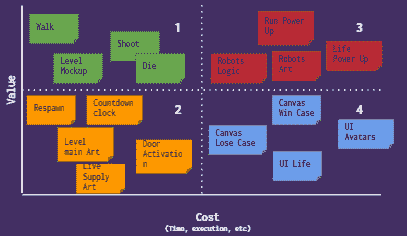
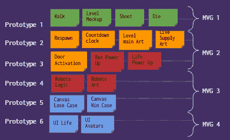
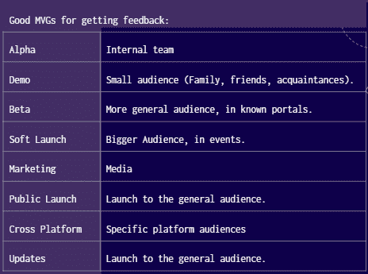

# 游戏:交付一个成功的游戏，具有 MVP (MVG)的定义

> 原文：<https://medium.com/globant/gaming-deliver-a-successful-game-with-mvp-mvg-definition-ff5b75da50d8?source=collection_archive---------0----------------------->

游戏行业分为制作 AAA 游戏的公司(像 EA 或育碧这样的大公司)和独立开发者(开发独立游戏的小公司或团体)。这两种方法对整个行业都有很大的影响，我们现在可以看到独立游戏是如何像 AAA 游戏一样成功的。

保证游戏产品成功的一个方法，特别是作为一个独立开发者，是通过计划、构建和发布 MVP(最小可行游戏的 mvg ),并从中学习，以构建一个真正在市场上工作的游戏。以下是定义和启动 mvg 的 6 个简单步骤，目的如下:

**1-定义游戏特性:**在开始的时候，你可以有一组你想在你的游戏中拥有的特性，而那些特性是在一组假设上得到支持的。

**2-对游戏特性进行分类:**记住每个特性对游戏来说都有不同的价值(比如核心机制或故事情节)以及不同的构建成本(努力、时间、工具等)，这一点很重要。).记住这一点，你可以根据每一项的价值和成本，将所有这些特性放入如下图表中。

Features map: Value Vs. Cost

**3-根据优先级规划 mvg:**上图中显示的象限为您提供了如何规划 mvg 并确定其优先级的提示。您可以构建如下图所示的结构来定义每个 MVG 版本。

Prototype definition and prioritization

**4-开始构建:**这里大部分情况下使用敏捷框架。在一个迭代和增量的过程中，你在几周内就完成了 MVG 的构建。

**5-向观众发布:**你的第一个 MVG 可能会有很多不确定性，但好消息是，向一小部分观众发布这个会给你提供有价值的信息来调整你的范围。观众的性质和规模可以因阶段而异。请参考下图:

Audience by stage

**6-获得反馈并从中学习:**你的听众已经发言了！收集反馈，并用它来验证你的假设。这些假设正确吗？反馈是否显示了与你假设完全相反的观点？现在，是时候带着这些问题，产生新的想法，并调整功能，以规划下一个 MVG。

这是一个基于构建-测量-学习的精益概念的持续练习。根据需要进行尽可能多的迭代，以确保最终满足玩家观众的期望。考虑你的观众的反馈总是很重要的，因为他们最终会为你的产品买单。

在 Julia Naomi Rosenfield Boeira 所著的《精益游戏开发》一书中了解更多信息。