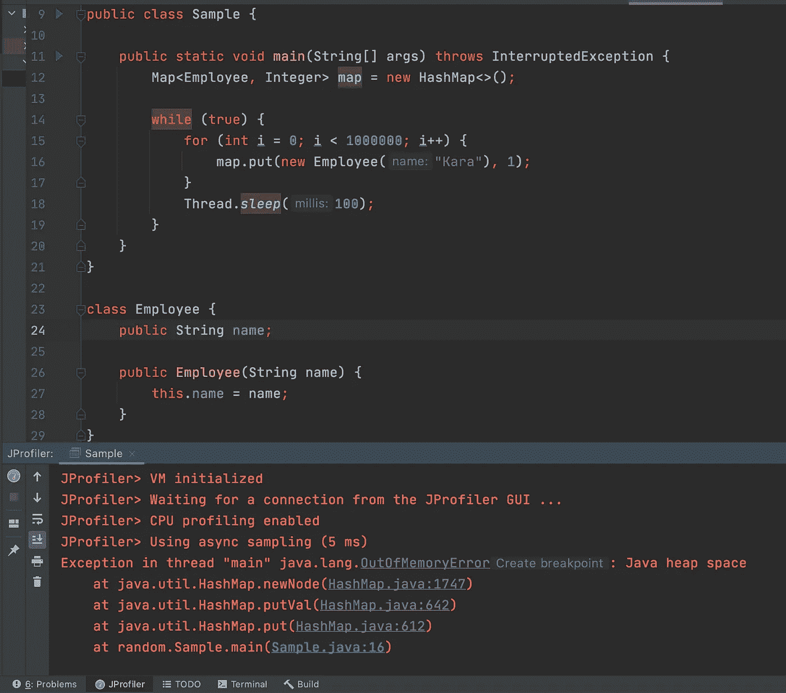
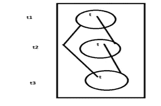

# 垃圾收集器在工作

> 原文：<https://medium.com/walmartglobaltech/garbage-collector-in-action-7b6d03b100a1?source=collection_archive---------0----------------------->


Photo by [Steve Johnson](https://unsplash.com/@steve_j?utm_source=unsplash&utm_medium=referral&utm_content=creditCopyText) on [Unsplash](https://unsplash.com/s/photos/garbage-bin?utm_source=unsplash&utm_medium=referral&utm_content=creditCopyText)

# 你遇到过 OutOfMemoryError 吗？？

在我做程序员的早期，我经常在 java 应用程序中遇到内存错误。为了解决这个问题，我曾经增加 JVM 堆的大小。在遇到很多次之后，我意识到从资源利用的角度来看，在不知道根本原因的情况下增加堆的大小并不是一个好主意。我们在这里讨论一下为什么会遇到这个问题。

**内存泄露？？**符合垃圾收集(GC)条件并且确实存在于我们的程序中的对象是内存泄漏。

是的，像 C，C++一样，我们在 java 中也有内存泄漏。Java 垃圾收集器是 Java 中的一个进程，它代表开发人员处理内存泄漏。Java 开发人员也会遇到“java.lang.OutOfMemoryError”异常。这种异常是由什么造成的？这是内存泄漏。
它向我们指出了一个事实，即检测和处理内存泄漏是至关重要的。有工具可用于此目的。JProfiler 就是这样一个工具。JProfiler 可以与不同的集成开发环境(ide)相结合。在博客的其余部分，我将使用一个名为 IntelliJ 的 IDE。

让我们举一个简单的例子，假设 Java 垃圾收集器会处理内存泄漏，那么向 map 添加 Employee 对象会消耗大量堆。

```
public class Sample {

    public static void main(String[] args) throws InterruptedException {
        Map<Employee, Integer> map = new HashMap<>();

        while (true) {
            for (int i = 0; i < 1000000; i++) {
                map.put(new Employee("Kara"), 1);
            }
            Thread.*sleep*(100);
        }
    }
}

class Employee {
    public String name;

    public Employee(String name) {
        this.name = name;
    }
}
```

在运行应用程序一段时间后，我们会发现自己处于 OutOfMemoryError 异常中，因为在一种特定的情况下，java 堆中没有剩余空间来分配 Employee 的对象。这是一个内存泄漏，因为对象正在被创建，但没有被 GC 收集。增加堆大小是一个补丁，但不是解决方案。因此，我们应该通过某种方法或其他方式使映射对 GC 可用。



code

现在这只是一个类应用程序，但它也可能是一个有 100 个类的应用程序。要确定内存泄漏发生的确切位置，可以使用 JProfiler。它告诉消耗最高内存并可能导致内存泄漏的类。堆遍历器是告诉我们内存泄漏的部分。我们可以看到 Heap Walker(JProfiler snip)显示(红色标记)消耗大量内存的是 HashMap 和 Employee 类。


JProfiler

避免这种情况是程序员的责任。为了做到这一点，你必须知道 Java 垃圾收集器是如何工作的。人们还应该知道一个对象如何成为垃圾收集的合格对象。

本文主要关注开发人员编写代码时利用 GC 的实用方法。

要进一步了解，请参考本文末尾列出的链接。

# **Java 垃圾收集器**

Java 垃圾收集器是一个守护线程，它总是在后台运行。它位于 Java 虚拟机内部，负责销毁未使用的对象。垃圾收集器基本上执行三个任务，即

1.  标记要清理的对象
2.  做实际的清理工作
3.  压缩内存空间以实现连续内存分配。

有许多 GC 算法，如串行 GC，并行 GC，并发标记，清扫(CMS)，G1 和大多数 JVM 遵循标记和清扫算法。为了提高性能，堆被进一步分解成更小的部分或称代，如年轻、年老和永久代。次要和主要的 GC 由 GC 不时地在堆上执行。所有次要和主要的垃圾收集都是“停止世界”事件，不是本质上的，而是一般意义上的。

# **使对象可用于垃圾收集的方法**

1.  **取消参考变量**

```
Object redShirt = new Object();
redShirt = null; //now redShirt is eligible for garbage collector
```

**2。重新分配参考变量**

```
Object redShirt = new Object();
Object blueShirt = new Object();
redShirt = blueShirt;
```

**3。在方法内创建的对象**

**例 1**

```
public class StudentOperation {
    public static void main(String[] args) {
        Student s = *createStudent*(); 
    }
    public static Student createStudent() {Student s1 = new Student();
        Student s2 = new Student();
        return s1;
    }
}
class Student {
}
```

*s1 将被移除，但在此之前，它将在 main 方法中传递对 s 的引用。所以这个对象没有资格进行 GC。一旦 createStudent()方法完成，s2 指向的对象将有资格进行 GC。* `s = *createStudent*()`持有对象，因为我们有一个占位符 s。如果学生`s = *createStudent*()` 被替换为`*createStudent*()`，那么 s1 和 s2 对象都有资格进行 GC。因此，如果对象不是在全局级别处理，我们应该将对象的范围限制在一个方法中。

**例 2**

```
public class StudentOperation {
    static Student *s1*;
    public static void main(String[] args) {
        *createStudent*();
    }
    public static void createStudent() {
        *s1* = new Student();
        Student s2 = new Student();
    } 
} 
class Student {
}
```

因为 s1 是静态变量，所以它的生存期贯穿于整个程序，甚至在调用 createStudent()之后。所以这里只有 s2 有资格做 GC。

**4。孤岛**

```
class Student {
    Student t;
    public static void main() {
        Student t1 = new Student();
        Student t2 = new Student();
        Student t3 = new Student();
        t1.t = t2;
        t2.t = t3;
        t3.t = t1;
        t1 = null;
        t2 = null;
        t3 = null;
    }
}
```

直到行`t2 = null;` 没有对象适合 GC。在第`t3 = null;`行，所有三个对象都有资格进行 GC，因为所有对象都与堆外的任何外部引用相隔离。



即使对象有一个引用变量，它有时也可能适合 GC(如果所有引用都是内部引用)

# 请求 JVM 运行 GC 的各种方法

**功能**:每当我们让一个对象符合垃圾收集器的条件时，这是否意味着这个对象会立即被 JVM 销毁？

不要！！我们不知道 JVM 什么时候会运行它的垃圾收集器。我们可以请求 JVM 运行它的垃圾收集器，gc()方法就是一种方法。同样，不能保证我们的请求是否被接受，但是大多数情况下，如果有空间不足，JVM 会接受我们的请求。

1.  **系统类**:包含一个静态方法 gc()

```
System.gc();
```

2.**运行时类**:运行时类的对象使 java 能够与 JVM 通信。存在于 java.lang 包中，它是一个单例类，提供静态工厂方法来创建对象，然后调用实例 gc()方法。

```
Runtime runtime = Runtime.*getRuntime*().gc();
```

如果我们谈论性能，`Runtime.*getRuntime*().gc()`比`System.gc()`好，因为`System.gc()`只在内部调用运行时的类 gc()方法。

```
public final class System {
    public static void gc() {
        Runtime.*getRuntime*().gc();
    }
}
```

例子

```
class GCDemo {
    public static void main(String[] args) {
        Runtime runtime = Runtime.*getRuntime*();
        System.*out*.println("Total memory "+ runtime.totalMemory());
        System.*out*.println("Free memory before running counter " + runtime.freeMemory());
        for (int counter = 0; counter < 100000; counter++) {
            Date date = new Date();
            date = null;
        }
        System.*out*.println("Free memory after running counter " + runtime.freeMemory());
        System.*gc*();
        System.*out*.println("Free memory after running gc " + runtime.freeMemory());
    }
}
```

输出

```
Total memory 257425408
Free memory before running counter 25**4741016**
Free memory after running counter 25**1575920**
Free memory after running gc 25**5567128**
```

# 定稿

*   就在销毁对象之前，垃圾收集器调用对象类 finalize()方法来执行资源释放活动。对象上的 finalize()仅作为 gc()进程的一部分被调用。可以根据需要在自己的类中重写该方法。显式调用 finalize()方法有什么不同吗？不，它将被视为一个常规的用户定义的方法调用。每当 JVM 运行垃圾收集器时，这个方法将在 gc()方法调用发生之前被自动调用。

```
class GCFinalizeDemo {
    public static void main(String[] args) {
        GCFinalizeDemo gcFinalizeDemo = new GCFinalizeDemo();
        gcFinalizeDemo.finalize();
        gcFinalizeDemo.finalize();
        gcFinalizeDemo = null;
        System.*gc*();
        System.*out*.println("GCFinalizeDemo work finished");
    }

    public void finalize() {
        System.*out*.println("GCFinalizeDemo class's finalize method is called");
    }
}
```

输出

```
GCFinalizeDemo class's finalize method is called
GCFinalizeDemo class's finalize method is called
GCFinalizeDemo work finished
GCFinalizeDemo class's finalize method is called
```

*   这里将调用属于特定类的对象(GC eligible)的 finalize()方法。例如，在第`anotherObject = null;`行，String 类的对象符合 GC 条件，因此将调用 String 类的 finalize()方法，而不是 GCFinalizeDemo 的 finalize()方法。

```
class GCFinalizeDemo {
    public static void main(String[] args) {
        String anotherObject = "eligibleforGC";
        anotherObject = null;
        System.*gc*();
        System.*out*.println("GCFinalizeDemo work finished");
    }

    public void finalize() {
        System.*out*.println("GCFinalizeDemo class's finalize method is called");
    }
}
```

输出

```
GCFinalizeDemo work finished
```

*   **当一个开发者调用 finalize()方法时，JVM 变成了局部的。**在显式 finalize()调用执行期间，如果出现未捕获的异常，程序将会突然终止。当 JVM 内部进行这样的调用时，它忽略异常并正常运行程序。
*   垃圾收集器对任何对象只调用 finalize()一次，即使它可以多次进行 GC，如下例所示。

```
public class FinalizeWorld {
    static FinalizeWorld *world1*;

    public static void main(String[] args) throws InterruptedException {
        FinalizeWorld world2 = new FinalizeWorld();
        System.*out*.println(world2.hashCode());
        world2 = null;
        System.*gc*();
        Thread.*sleep*(5000);
        System.*out*.println(*world1*.hashCode());
        *world1* = null;
        System.*gc*();
        Thread.*sleep*(5000);
        System.*out*.println("End of main method");
    }

    public void finalize() {
        System.*out*.println("Finalize method called");
    }
}
```

输出

```
621009875
Finalize method called
621009875
End of main method
```

# JVM 行为

这是随机的，因为我们无法预测垃圾收集器如何识别要销毁的对象，垃圾收集器销毁对象的顺序，是否销毁所有符合条件的对象，以及垃圾收集器运行的确切时间。在下面的例子中，如果我们做`counter < 100000`可能 JVM 运行 GC，但是有多少对象将被破坏是不可预测的。

```
class GCDemo {
    static int *count* = 0;

    public static void main(String[] args) {
        for (int counter = 0; counter < 10; counter++) {
            GCDemo gcDemo = new GCDemo();
            gcDemo = null;
        }
    }
    public void finalize() {
        *count*++;
        System.*out*.println("finalize method called:" + *count*);
    }
}
```

# 这里有一些有趣的链接，可以找到更多关于 GC 的信息

[](https://www.oracle.com/webfolder/technetwork/tutorials/obe/java/gc01/index.html) [## Java 垃圾收集基础知识

### 本 OBE 涵盖了 Java 虚拟机(JVM)垃圾收集(GC)的基础知识。在出窍的第一部分…

www.oracle.com](https://www.oracle.com/webfolder/technetwork/tutorials/obe/java/gc01/index.html)  [## Java 编程语言中垃圾收集器的比较- IEEE 会议出版物

### IEEE Xplore，提供世界上最高质量的工程和…

ieeexplore.ieee.org](https://ieeexplore.ieee.org/document/8400277)