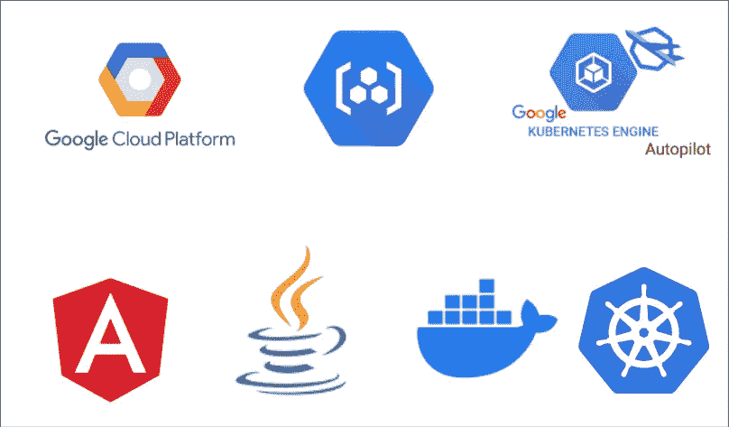

# GCP——在 GKE 自动驾驶仪上部署带有 Java 后端的 Angular 应用

> 原文：<https://medium.com/bb-tutorials-and-thoughts/gcp-deploying-angular-app-with-java-backend-on-gke-autopilot-85ca6a9b1512?source=collection_archive---------0----------------------->

## 包含示例项目的逐步指南

在这篇文章中，我们将部署一个带有 Java 后端的 Angular 应用程序。首先，我们对我们的应用程序进行 dockerize，并将该图像推送到谷歌容器注册表，并在谷歌 GKE 自动驾驶仪上运行该应用程序。我们将看到如何在谷歌 GKE 上建立 Kubernetes 集群，访问…