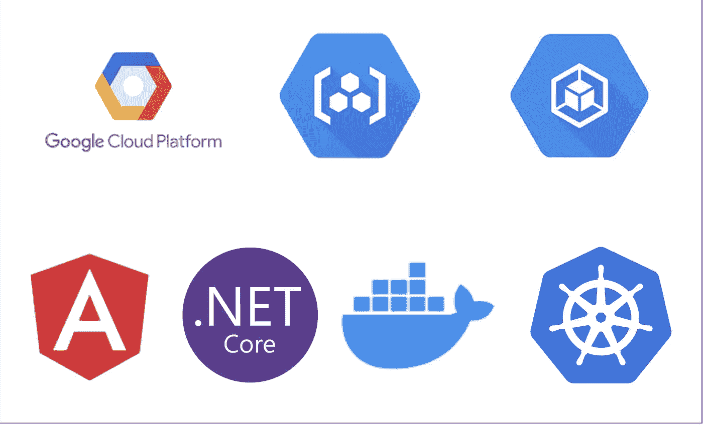

# GCP —部署 Angular 应用程序。GKE 上的. NET Web API

> 原文：<https://medium.com/bb-tutorials-and-thoughts/gcp-deploying-angular-app-with-net-web-api-on-gke-8fd316e3d38f?source=collection_archive---------0----------------------->

## 包含示例项目的逐步指南

在这篇文章中，我们将使用. NET web API 部署一个 Angular 应用程序。首先，我们对我们的应用程序进行 dockerize，并将该图像推送到谷歌容器注册表，并在谷歌 GKE 上运行该应用程序。我们将了解如何在谷歌 GKE 上构建 Kubernetes 集群，从外部访问集群…