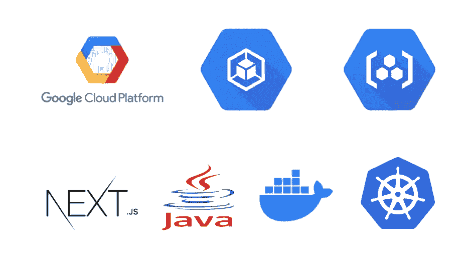

# GCP——在 GKE 部署带有 Java 后端的 Next.js 应用

> 原文：<https://medium.com/bb-tutorials-and-thoughts/gcp-deploying-next-js-app-with-java-backend-on-gke-b688422b1e0f?source=collection_archive---------0----------------------->

## 包含示例项目的逐步指南

GKE 是谷歌的托管 Kubernetes 解决方案，让你在云中运行和管理容器化的应用程序。由于这是一项托管的 Kubernetes 服务，您可以通过单击集群快速启动，利用包括多区域和区域性集群在内的高可用性控制平面…