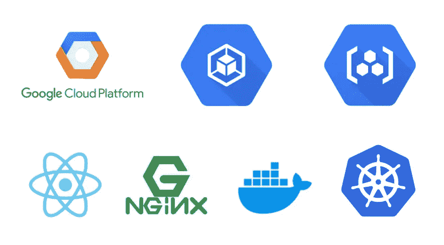

# GCP——在 GKE 使用 NGINX 部署 React 应用

> 原文：<https://medium.com/bb-tutorials-and-thoughts/gcp-deploying-react-app-with-nginx-on-gke-466e9a465516?source=collection_archive---------0----------------------->

## 包含示例项目的逐步指南

GKE 是谷歌的托管 Kubernetes 解决方案，让你在云中运行和管理容器化的应用程序。由于这是一项受管理的 Kubernetes 服务，您可以通过单击式集群快速启动，利用包括多区域和区域性集群在内的高可用性控制平台，消除运营…