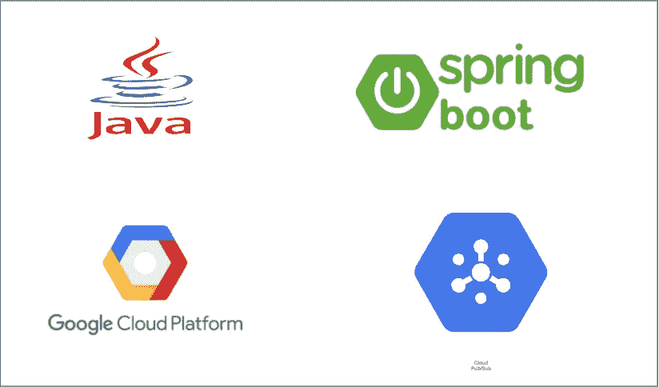

# GCP —如何在 Spring Boot 应用程序中订阅和发送 PubSub 消息

> 原文：<https://medium.com/bb-tutorials-and-thoughts/gcp-how-to-subscribe-and-send-pubsub-messages-in-spring-boot-app-b27e2e8863e3?source=collection_archive---------0----------------------->

## 一步一步的例子项目

Google Pub/Sub 是一个异步消息服务，它将产生事件的服务与处理事件的服务分离开来。云发布/订阅可以集成 GCP 的许多组件。我们有如此多的使用案例，您需要在您的组件之间放置云发布/订阅，以便…