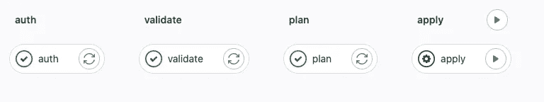

# Gitlab 上的 GCP 工作负载身份联合通过作业之间的身份验证

> 原文：<https://medium.com/compendium/gcp-workload-identity-federation-on-gitlab-passing-authentication-between-jobs-ffaa2d51be2c?source=collection_archive---------2----------------------->



git lab(2022 年末)对于工作负载身份联合来说是一个相对较新的东西，目前还没有太多好的模板或指南。官方指南解释了如何设置联合池并使用它进行认证，但没有真正解释如何在企业管道中使用它。一个经常出现的基本问题是如何将身份验证传递给管道中的其他作业。

例如，假设您正在将基础架构作为代码进行开发，并且有一个相对简单的工作流，如下所示:

认证→验证→计划→应用

[一种简单的方法](https://stackoverflow.com/questions/74505435/403-trying-to-run-terraform-from-gitlab-without-json-file)是验证并假设验证/计划/应用也知道上下文。它不…

如果您将凭证作为一个秘密，那么它将对所有 4 个作业都可用，一个常见的做法是将 GOOGLE_APPLICATION_CREDENTIALS 设置为该 JSON，然后默认情况下所有作业都将被认证。

但是，当我们使用工作负载身份联合时，我们不再拥有那个秘密，事实上，我们在进行身份验证时创建了那个秘密！如果你已经习惯了 Github 的动作，这就是他们如何做的，在 Gitlab 上做应该很简单…对吗？

不完全是。

在撰写本文时，还没有 stackoverflows、博客帖子或指南来说明如何以一种好的方式做到这一点。[官方的 Gitlab 例子非常简单，假设你应该在每一步进行认证](https://gitlab.com/guided-explorations/gcp/configure-openid-connect-in-gcp)。

那么我们如何解决这个问题呢？

概念是这样的:当我们通过 gcloud 使用 workload identity federation 进行身份验证时，我们实际上获得了一个 JSON(就像一个服务帐户)和一个令牌，我们可以在我们的管道下游使用它。我们需要做的是将 JSON 和令牌作为工件向下游传递。

1.  鉴定—使用 gcloud Docker 映像，将文件写入共享文件夹
2.  验证—使用 Terraform Docker 映像，使用来自共享的凭据
3.  计划—使用 Terraform Docker 映像，使用来自共享的凭据
4.  应用—使用 Terraform Docker 图像。，使用共享中的凭据和计划

为此，我定义了一个 _auth/ shared 文件夹来在作业之间传递(Gitlab 术语—工件)。

# 证明

我创建了一个使用 gcloud 进行身份验证的身份验证作业。

这项工作需要 3 个参数(环境变量)

服务帐户电子邮件—是服务帐户的电子邮件地址(如 name@gcp-project.iam.gserviceaccount.com)

WORKLOAD_IDENTITY_PROVIDER —在此表单上:projects/PROJECT _ NUMBER/locations/global/workloadIdentityPools/POOL _ NAME/providers/PROVIDER _ ID

GOOGLE _ CLOUD _ PROJECT 要设置为默认值的 GCP 项目 id。

```
.gcp-auth:
  image: "google/cloud-sdk:slim"
  artifacts:
    paths:
      - _auth/
  script:
    - |
      if [ -z "${SERVICE_ACCOUNT_EMAIL}" ]; then
        echo "MISSING SERVICE_ACCOUNT_EMAIL variable. (expected: full email of service account)"
        exit 1
      fi      
      if [ -z "${WORKLOAD_IDENTITY_PROVIDER}" ]; then
        echo "MISSING WORKLOAD_IDENTITY_PROVIDER variable (expected: projects/PROJECT_NUMBER/locations/global/workloadIdentityPools/POOL_NAME/providers/PROVIDER_ID)"
        exit 1
      fi      
      if [ -z "${GOOGLE_CLOUD_PROJECT}" ]; then
        echo "MISSING GOOGLE_CLOUD_PROJECT variable.  (expected: gcp project id)"
        exit 1
      fi      
      mkdir -p _auth 
      echo "$CI_JOB_JWT_V2" > $CI_PROJECT_DIR/_auth/.ci_job_jwt_file
      echo "$GOOGLE_CLOUD_PROJECT" > $CI_PROJECT_DIR/_auth/.GOOGLE_CLOUD_PROJECT
      gcloud iam workload-identity-pools create-cred-config \
      $WORKLOAD_IDENTITY_PROVIDER \
      --service-account=$SERVICE_ACCOUNT_EMAIL \
      --service-account-token-lifetime-seconds=600 \
      --output-file=$CI_PROJECT_DIR/_auth/.gcp_temp_cred.json \
      --credential-source-file=$CI_PROJECT_DIR/_auth/.ci_job_jwt_file
      gcloud config set project $GOOGLE_CLOUD_PROJECT
    - !reference [.gcp_ensure_auth_script, before]
    - "gcloud auth login --cred-file=$GOOGLE_APPLICATION_CREDENTIALS"
```

如您所见，它将 _auth/ folder 设置为工件，在作业之间传递，并将项目 id、令牌和 JWT 转储到这个文件夹中。

# 将（行星）地球化（以适合人类居住）

为了简化 Terraform 步骤，我为 Terraform 创建了一个基本作业，它知道 gcp 身份验证状态，我只需要在我的主管道中扩展它。这给了我在 Terraform 脚本中做任何事情的灵活性。例如，我可以创建一个一步到位的计划&申请，而不是像我现在这样分成 3 个部分。

```
 .terraform:
  extends: .gcp-auth
  image:
    name: hashicorp/terraform:1.3.5
    entrypoint:
      - '/usr/bin/env'
      - 'PATH=/usr/local/sbin:/usr/local/bin:/usr/sbin:/usr/bin:/sbin:/bin'
  artifacts:
    paths:
      - planfile
      - _auth/
  before_script:
    - !reference [.gcp_ensure_auth_script, before]
    - *tf_before_script
```

# 示例管道

如果您已经设置了工作负载身份联邦，那么这个示例应该或多或少是现成的。用适合你的用例的东西替换变量！

```
include:
  - local: '/.gitlab-gcp-auth.yml'

stages:
  - auth
  - validate
  - plan
  - apply

auth:
  extends: .gcp-auth
  stage: auth
  variables:
     SERVICE_ACCOUNT_EMAIL: "terraform@foo.iam.gserviceaccount.com"
     WORKLOAD_IDENTITY_PROVIDER: "projects/123123/locations/global/workloadIdentityPools/gitlab-pool/providers/gitlab-provider"
     GOOGLE_CLOUD_PROJECT: "example"

validate:
  extends: .terraform
  stage: validate
  variables:
     TF_BACKEND_CONFIG: "bucket=yoursecretstatebucket"
  script:
    - terraform validate
  only:
    refs:
      - main

plan:
  extends: .terraform
  stage: plan
  variables:
     TF_BACKEND_CONFIG: "bucket=your-terraform-state"
  script:
    - terraform plan -out ../planfile -input=false -var-file=env/main.tfvars
  dependencies:
    - validate
  only:
    refs:
      - main

apply:
  extends: .terraform
  stage: apply
  variables:
     TF_BACKEND_CONFIG: "bucket=your-terraform-state"
  script:
    - terraform apply -input=false ../planfile -var-file=env/main.tfvars
  dependencies:
    - plan
    - auth
  when: manual
  only:
    refs:
      - main
```

# 。gitlab-gcp-auth.yml

为了方便起见，我在这里包含了完整的文件。随意剪切粘贴，随心所欲使用。

```
.gcp_ensure_auth_script:
  before:
    - |
      if [ ! -d "$CI_PROJECT_DIR/_auth" ]; then
         echo "Missing auth folder, please make sure your job defines _auth as an artifact!"
         exit 1
      fi
    - export GOOGLE_APPLICATION_CREDENTIALS=$CI_PROJECT_DIR/_auth/.gcp_temp_cred.json
    - export CLOUDSDK_AUTH_CREDENTIAL_FILE_OVERRIDE=$CI_PROJECT_DIR/_auth/.gcp_temp_cred.json
    - export GOOGLE_GHA_CREDS_PATH=$CI_PROJECT_DIR/_auth/.gcp_temp_cred.json
    - export GOOGLE_CLOUD_PROJECT=$(cat $CI_PROJECT_DIR/_auth/.GOOGLE_CLOUD_PROJECT)
    - export CLOUDSDK_PROJECT=$(cat $CI_PROJECT_DIR/_auth/.GOOGLE_CLOUD_PROJECT)
    - export CLOUDSDK_CORE_PROJECT=$(cat $CI_PROJECT_DIR/_auth/.GOOGLE_CLOUD_PROJECT)
    - export GCP_PROJECT=$(cat $CI_PROJECT_DIR/_auth/.GOOGLE_CLOUD_PROJECT)
    - export GCLOUD_PROJECT=$(cat $CI_PROJECT_DIR/_auth/.GOOGLE_CLOUD_PROJECT)

.gcp-auth:
  image: "google/cloud-sdk:slim"
  artifacts:
    paths:
      - _auth/
  script:
    - |
      if [ -z "${SERVICE_ACCOUNT_EMAIL}" ]; then
        echo "MISSING SERVICE_ACCOUNT_EMAIL variable. (expected: full email of service account)"
        exit 1
      fi      
      if [ -z "${WORKLOAD_IDENTITY_PROVIDER}" ]; then
        echo "MISSING WORKLOAD_IDENTITY_PROVIDER variable (expected: projects/PROJECT_NUMBER/locations/global/workloadIdentityPools/POOL_NAME/providers/PROVIDER_ID)"
        exit 1
      fi      
      if [ -z "${GOOGLE_CLOUD_PROJECT}" ]; then
        echo "MISSING GOOGLE_CLOUD_PROJECT variable.  (expected: gcp project id)"
        exit 1
      fi      
      mkdir -p _auth 
      echo "$CI_JOB_JWT_V2" > $CI_PROJECT_DIR/_auth/.ci_job_jwt_file
      echo "$GOOGLE_CLOUD_PROJECT" > $CI_PROJECT_DIR/_auth/.GOOGLE_CLOUD_PROJECT
      gcloud iam workload-identity-pools create-cred-config \
      $WORKLOAD_IDENTITY_PROVIDER \
      --service-account=$SERVICE_ACCOUNT_EMAIL \
      --service-account-token-lifetime-seconds=600 \
      --output-file=$CI_PROJECT_DIR/_auth/.gcp_temp_cred.json \
      --credential-source-file=$CI_PROJECT_DIR/_auth/.ci_job_jwt_file
      gcloud config set project $GOOGLE_CLOUD_PROJECT
    - !reference [.gcp_ensure_auth_script, before]
    - "gcloud auth login --cred-file=$GOOGLE_APPLICATION_CREDENTIALS"

.gcp-ensure-auth:
  artifacts:
    paths:
      - _auth/
  before_script:
    - !reference [ .gcp_ensure_auth_script, before ]

.tf_before_script: &tf_before_script
  - |
    if [ -z "${TF_BACKEND_CONFIG}" ]; then
       echo "Missing TF_BACKEND_CONFIG, expected bucket=value"
       exit 1
    fi
  - rm -rf .terraform
  - terraform --version
  - terraform init -backend-config="$TF_BACKEND_CONFIG"

.terraform:
  extends: .gcp-auth
  image:
    name: hashicorp/terraform:1.3.5
    entrypoint:
      - '/usr/bin/env'
      - 'PATH=/usr/local/sbin:/usr/local/bin:/usr/sbin:/usr/bin:/sbin:/bin'
  artifacts:
    paths:
      - planfile
      - _auth/
  before_script:
    - !reference [.gcp_ensure_auth_script, before]
    - *tf_before_script
```

注意，这个例子只知道一种环境，所以您必须针对真实的用例进行调整。您可能还想设置 _auth 工件的生命周期。

如果这对你有用，请鼓掌，或者如果有更好的方法，请给出评论！

# 我检查的链接:

在写我自己的文章之前，我做了很多谷歌搜索，所以所有这些链接都在某种程度上启发了我。

[](https://stackoverflow.com/questions/74505435/403-trying-to-run-terraform-from-gitlab-without-json-file) [## 403 试图在没有 json 文件的情况下从 Gitlab 运行 terraform

### 经过一堆故障排除，我设法让我的 gitlab CICD 管道连接到 GCP，而不需要我的…

stackoverflow.com](https://stackoverflow.com/questions/74505435/403-trying-to-run-terraform-from-gitlab-without-json-file)  [## 使用 GCP 工作负载身份联盟| GitLab 配置 OpenID 连接

### GitLab 社区版、GitLab 企业版、Omnibus GitLab 和 GitLab Runner 的文档。

docs.gitlab.com](https://docs.gitlab.com/ee/ci/cloud_services/google_cloud/) [](https://cloud-architecture-design.medium.com/using-gitlab-ci-with-gcp-workload-identity-federation-8b80bec99c0b) [## 将 GitLab CI 用于 GCP 工作负载身份联盟。

### 工程师面临的挑战之一是服务帐户密钥的管理、保护、分发和更新。

cloud-architecture-design.medium.com](https://cloud-architecture-design.medium.com/using-gitlab-ci-with-gcp-workload-identity-federation-8b80bec99c0b) [](/google-cloud/gitlab-and-workload-identity-federation-on-google-cloud-a0795091e404) [## Google Cloud 上的 Gitlab 和工作负载身份联盟

### 您可以轻松使用 Workload Identity Federation 从 Gitlab CI 管道中安全地使用 Google Cloud APIs，用于…

medium.com](/google-cloud/gitlab-and-workload-identity-federation-on-google-cloud-a0795091e404) [](https://dev.to/gbostoen/integrate-gitlab-with-google-cloud-workload-identity-federation-3041) [## 将 Gitlab 与 Google 云工作负载身份联盟集成

### 在 Gitlab 14.7 中，连接到 AWS、GCP 和 vault 以及其他云服务现在是可能的，通过引入…

开发到](https://dev.to/gbostoen/integrate-gitlab-with-google-cloud-workload-identity-federation-3041)