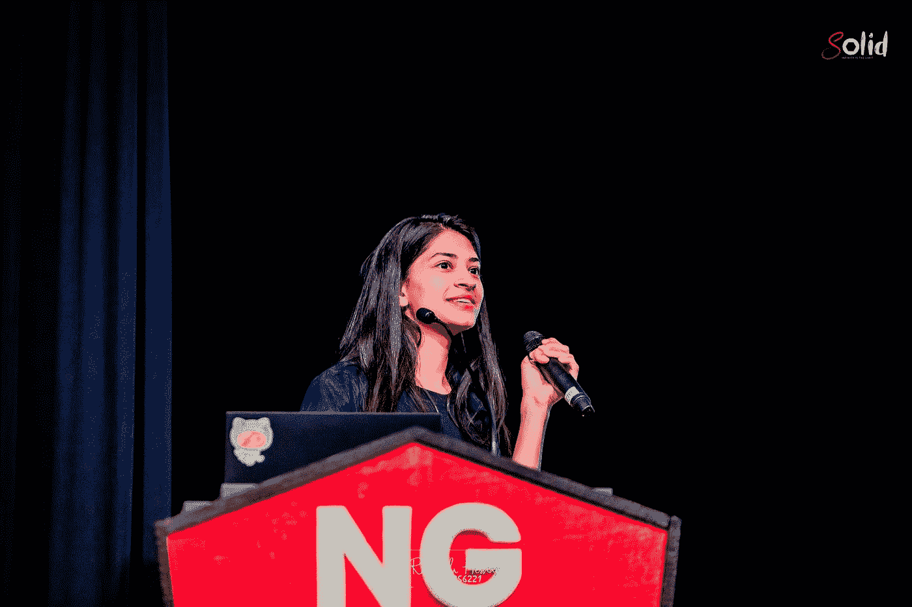
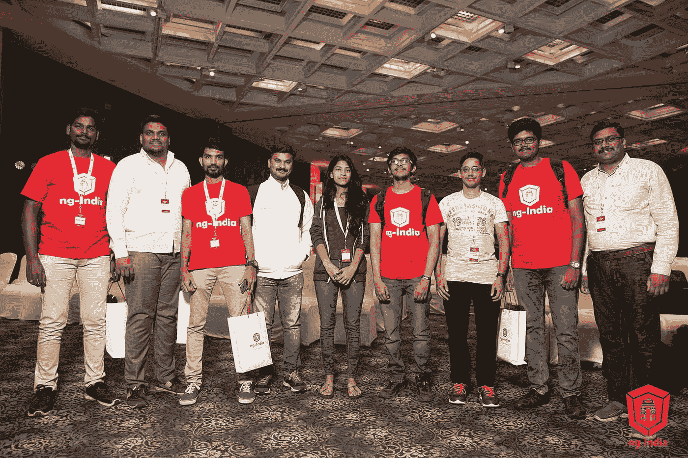
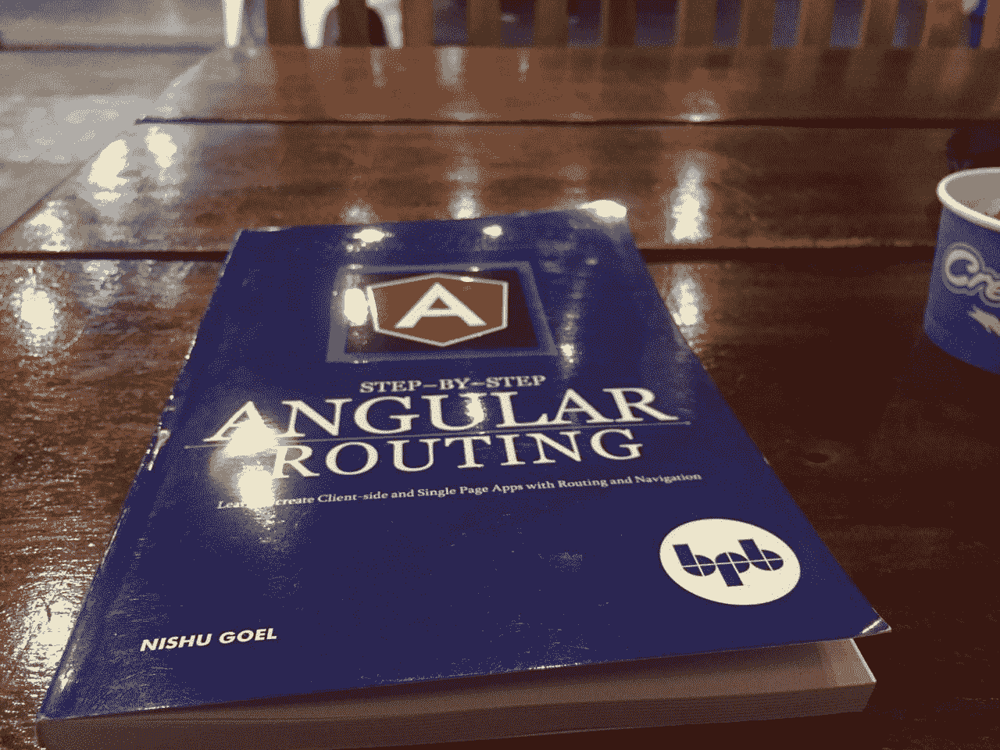

# GDE 社区亮点:尼舒·戈尔

> 原文：<https://medium.com/google-developer-experts/gde-community-highlight-nishu-goel-c5e00ad63f03?source=collection_archive---------0----------------------->

Nishu Goel 是一位来自印度的著名 web 工程师，是 Angular 和 web 技术的 Google 开发专家。她向我们讲述了她的社区参与、职业规划以及学习 web 开发的最佳方法。

*作者*[莫妮卡【贾诺塔】作者 ](https://web.dev/authors/monikajanota/)

Nishu Goel 是来自印度的著名 web 工程师，Angular 和 web 技术的 Google 开发专家，微软最有价值的专家。她是《一步一步的角度路线》(BPB，2019 年)和《角度实践指南》(教育版，2021 年)的作者，也是《网络年鉴 2021》JavaScript 章节的作者。Nishu 目前在 epilot GmbH 担任全栈工程师。她向我们讲述了她的社区参与、职业规划以及学习 web 开发的最佳方法。

莫妮卡:先从你的故事开始吧。是什么激励你成为一名开发人员并在开发社区中扮演积极的角色？

**Nishu** :我拿到了计算机科学的学士学位，我们学的是数据结构，对编程的兴趣就是从这里开始的。在工程专业的第三年，我参加了微软创新杯全国比赛，在比赛中我们通过代码展示了解决方案，从而与开发人员社区建立了联系。我们构建应用程序的目的是为当地学生，尤其是女孩，带来教育机会。在这段旅程中，我遇到了一些非常鼓舞人心的人，无论是参赛者还是组织者。

2018 年，我的职业生涯起飞了，我开始和 Angular 合作。Angular 成为将我与 GDE 项目联系起来的主要技术。大约在同一时间，我开始写博客，围绕我正在研究和学习的主题创作内容。Dhananjay Kumar 帮助我开始了这一旅程，并确保我走上正轨。我的第一篇文章解决了 Angular 的基本问题。在我开始在活动中演讲后不久——第一个是 ngNepal，尼泊尔的 Angular Conference。这导致了更多关于角度和网络技术的演讲邀请。

莫妮卡:你在技术方面有什么职业经验？

前两年都是关于角度和网页组件。我使用 Angular 构建 web，但很快我决定超越它，探索其他领域。我不想限制自己，以防不得不转换项目。这就是我开始用 Angular 创建 web 组件以便在其他框架中使用的方法。

我做的第一件事是用 Angular 创建 web 组件。我将它发布到 npm，并在 React 项目中用作演示。我在后来的一些演讲和陈述中讨论过这个问题。我的下一份工作需要使用 React 和 Typescript。现在，因为我在使用 React，我不再仅仅使用一个框架，而是使用整个网络。那一刻，我学到了很多关于网络的知识，尤其是网络性能。这时，我不得不开始考虑[最大内容绘制(LCP)](https://web.dev/lcp/) 或[第一内容绘制(FCP)](https://web.dev/fcp/) ，这意味着加载应用程序需要多长时间，或者页面呈现的最长时间是多少。我一直致力于选择最佳实践和提高应用程序的性能。

因为对网络性能的兴趣，我参与了网络年鉴并写了 JavaScript 章节。网络年鉴是一份关于网络总体状况的年度报告——它告诉我们人们如何使用不同的功能。去年，我们对 860 万个网站进行了筛查，并对数据进行了分析，在报告中进行了呈现。该报告包括统计数据，如`<script>`元素中`async`和`defer`属性的使用情况。有多少网站在正确使用它们，有多少网站根本没有使用它们，有多少网站与 2020 年相比有所改进。上一份 Web Almanac 报告提到，大约有 [35%的网站在同一个脚本](https://almanac.httparchive.org/en/2021/javascript#fig-9)上使用了两个属性，这是一种反模式，降低了性能。去年已经指出了这一点，今年我们试图看看情况是否有所改善。我还在 ngConf 和 Reliable Dev 峰会上发言，重点讨论了 web 的性能。

莫妮卡:你也非常积极地回馈社区。最近你在乌干达非政府组织 YIYA 做志愿者——这是如何开始的，合作的要点是什么？

一开始是 GDE 团队通知我们关于 YIYA 的志愿者机会。乌干达非政府组织正在寻找工程师来帮助他们准备内容或技术功能。该计划旨在增强乌干达学龄儿童的能力，并利用当地可用的技术为他们提供教育机会——不是电脑或教科书，而是基本的键盘电话和收音机。孩子们会拨一个特定的号码并接收一组信息，拨另一个号码以获得更多的见解，等等。在疫情时期，它变得更加有用。

由于我一直参与社区和可持续发展目标，我决定伸出援手。在与 YIYA 团队会面后，我主动提出帮助解决 Python 脚本或他们提出的任何 bug，以及门户网站的任何问题。我们一起工作了一小段时间。

**莫妮卡**:2022 年你有什么计划？有什么是你特别关注的吗？

**霓裳**:我要换工作，搬到另一个国家去。我将在网站上工作，提高网站性能，也在后端，使用 Golang。我将继续关注 web 性能领域，因为它非常有趣和复杂，并且有很多需要理解和优化的地方。即使是现在，在我花了很多时间在这上面之后，仍然有很多东西要学。例如，我很想了解如何使用 CDN 作为我的图像资源来帮助我使我的应用程序更快。我想成为网络性能专家——我逐渐达到了，我愿意相信:)

莫妮卡:你提到过在你不是专家的时候开始写作，你只是在写你学到的东西。对于新来的开发者，如果他们觉得没有什么可以分享的，你有什么建议？

尼舒:这正是我开始写作时的感受。我想也许我不应该把这个拿出来？也许只是错了？我担心我的作品对读者没有帮助。但重要的是我的写作帮助了我。一段时间后，我会忘记一些事情，然后回到我之前写的东西上。把事情写下来是个好主意。

所以我建议每个人——无论在什么阶段，都要写作。即使你只完成了你正在经历的课程的一部分，你也是通过写下来来学习的。你在某个时候知道的一条信息可能对其他还不知道的人有用。你不需要成为专家。写作会帮助你。任何人在职业生涯的任何阶段。

莫妮卡:最好跟随那些刚刚学到东西的人，因为他们知道所有他们需要弄清楚的事情。一旦你成了专家，就很难记得你刚来的时候是什么样子了。对刚进入 web 开发的人有什么建议吗？

**Nishu** :很多人问他们在开始时应该选择哪个框架，但我认为这不是一个正确的问题。我们在任何时候学到的任何东西在以后的阶段都应该是有用的。我建议任何人放弃限制，从 HTML 或 JavaScript 开始——这在未来是有利可图的。

然后抓住你遇到的任何机会。当我偶然发现网络年鉴寻找作者的信息时，我就遇到了这种情况。我只是想，“哦，这很有趣，这可能有助于每个人的性能方面的事情”。这就是我如何成为 JavaScript 章节的内容负责人的，我花了六个月的时间来写它。所以我觉得就是要抓住机会，努力工作。

**莫妮卡**:你对网络技术的未来有什么预测或想法吗？下一个热门话题会是什么？什么会快速增长？

我很高兴我们现在能够在浏览器中运行服务器，这是一个很大的进步。例如，最近引入了从浏览器运行 Node.js，而在过去，如果我们的系统中没有安装 Node.js，我们就无法运行任何东西。现在我们可以在浏览器上做任何事情。这是网络生态系统向前迈出的一大步。还有 OMT——脱离主线。线程方面的工作也将得到很大的改进。Web Assembly 正在进步，它使开发人员能够做到这一点，我认为这是 Web 生态系统的未来。