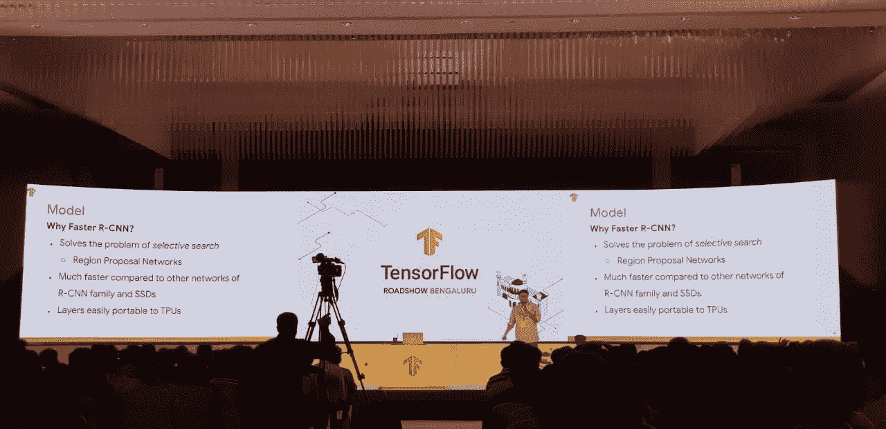
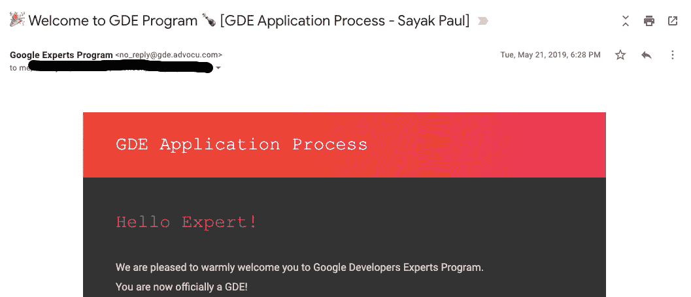
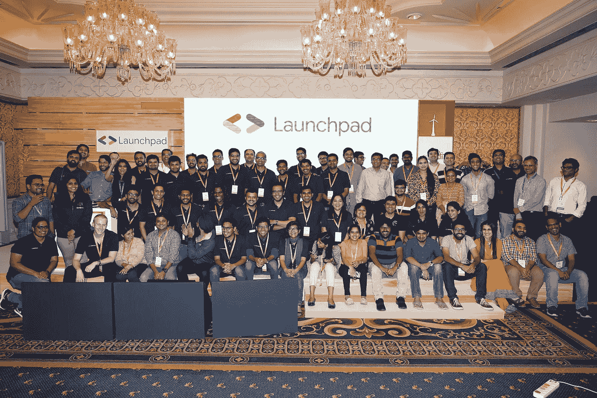
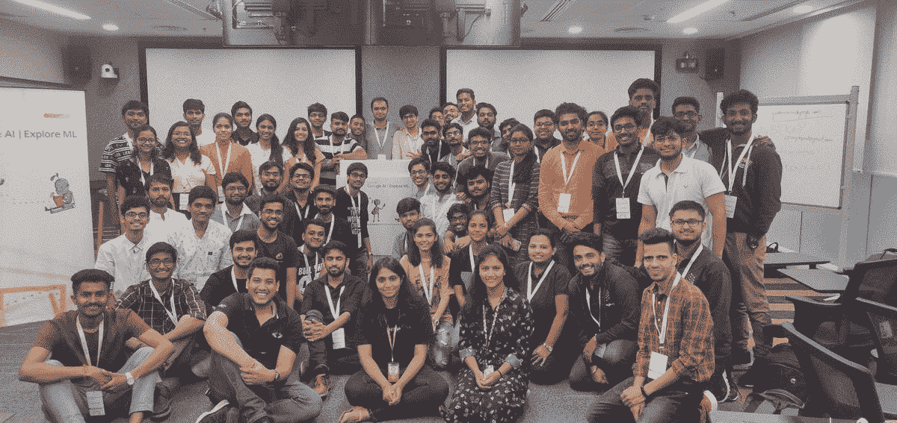

# GDE 之旅— Sayak Paul

> 原文：<https://medium.com/google-developer-experts/gde-journey-sayak-paul-531c3a5ac7ec?source=collection_archive---------5----------------------->

## 我是 GDE 人

## 关于我在整个 GDE 项目中一年内收集的经验的重点。

[**TensorFlow Roadshow Bengaluru 2019**](https://events.withgoogle.com/tensorflow-roadshow-bengaluru/) **(Source: Unknown)**

我第一次遇到“谷歌开发者专家”(GDE)这个词是在 2018 年的加尔各答发展节(T0)上，一位 GDE 人在 T2 做了一次演讲。在了解了[项目](https://developers.google.com/programs/experts/)的细节后，我产生了极大的兴趣加入其中。人们加入这个项目的原因各不相同，以下是真正激励我的原因—

*   学习和分享绝对是我生活中的决定性特征之一。这是我在 TCS 工作期间灌输给我的价值观。GDE 项目在很大程度上促进和鼓励了这种文化，甚至为此给予奖励。
*   *我对各个谷歌产品领域的反馈*(对于一个 ML-GDE 来说，这主要是 TensorFlow，但它也对许多不同的 GCP 人工智能相关产品开放)可能会对产品的未来发展产生真正的影响。[ML —机器学习]
*   *指导不同的技术创业公司*帮助他们最大限度地利用技术来解决现实世界中具有挑战性的问题。

回到 2018 年 12 月左右，我第一次申请该计划，不知道我还没有达到成为 GDE(在机器学习方面)的要求。你可能在你的领域技术上非常好，但是让 GDE 与众不同的最重要的事情是他们在内容、开源项目、演讲等方面的社区贡献。一个 GDE 人应该真实地展示和练习这个角色。

没有抑郁症困扰我(我比单纯的精神状态更强大)，我开始锻炼自己，锻炼自己，磨练自己的技能，以不同的方式回报社区。我鼓起很大的勇气，再次申请，但这次也一样，我没有达到要求。

这只是一个信号，告诉我我需要更多的改进，更多的自我反省。我尽了最大努力，我会继续让自己变得更好，我会一直这样做。请记住，我比任何消极的心态都要坚强，我需要更加努力地工作，不仅是为了破解这个程序，也是为了提高自己作为一名专业人士，最重要的是作为一个人。

我们仍然在 2019 年 3 月**日**左右，让我快进到 2019 年 5 月**日**。

**May 21, 2019 — I got accepted as an ML-GDE**

最后，我准备祝贺我自己，感谢我的父母，以及我把这种接受归功于的社区成员。今天，我很高兴完成了一年的课程。如果说这次旅行像过山车一样，那是一种保守的说法。时至今日，我要一劳永逸地大声声明以下几点

> 我感激并谦卑每一天，能够活出我的激情。

我认为被这个项目录取只是冰山一角。是你的行为将你定义为一个 GDE 人，也将你清晰地分开。参加这个项目后，我的个人目标之一是在技术和社交方面都有所成长。为此，我谦卑地列举了几件事——

*   我是一个思想的坚定信徒——“**行动胜于雄辩！**“所以，我会在下面留下一个我个人网站的链接(它包含我主持的[采访系列](https://sayak.dev/interviews/)、我写的博客文章[、我参加的](https://sayak.dev/authoring/)[会议](https://sayak.dev/talksseminarsworkshops/)以及其他内容)—

 [## 萨亚克·保罗

### 我是 Sayak Paul。这是我的个人网站，它包括我的博客帖子，坐标，采访，以及类似…

sayak.dev](https://sayak.dev/) 

*   [**Google for Startups**](https://startup.google.com/)是一个无股权计划，支持致力于解决现实世界问题的技术型初创公司。它通过提供 GCP 学分、在技术和非技术领域提供指导等方式提供支持。我很高兴能成为谷歌的创业导师；我接触了许多非常聪明的机器学习实践者，他们解决挑战性问题的方式让我在这个过程中学到了很多东西。得知一家加入该计划的初创公司能够利用我分享的建议，提高他们的机器学习模型的性能，这也是非常令人欣慰的。

**Google for Startups was previously known as Launchpad. Spot me if you can in the picture (it’s from** [**Launchpad Accelerator 2019 Batch III**](https://india.googleblog.com/2019/08/inviting-applications-for-class-3-of.html)**).**

*   [**探索 ML**](https://events.withgoogle.com/explore-ml-in/) 和 [**打造数字印度**](https://events.withgoogle.com/buildfordigitalindia/) 学院和训练营也是 2019 年和 2020 年非常重要的亮点。我在这两个项目中担任演讲者和导师，最重要的是，我从优秀的学生身上学到了很多东西。无论是一个很酷的新模型架构，无论是一个有趣的增强技术，无论是关于问题本身，都有如此多的生产力摆在桌面上。退一步说，这对我来说是一次光荣的学习经历。

**Two of the most important highlights for me between 2019 and 2020: Explore ML and Build for Digital India**

*   我一直喜欢与学生互动，向他们学习，并在必要时提供指导。**(GCI)Google Code-in 是一个鼓励学校学生在开源技术的美丽世界中启动他们的旅程的程序。我作为 TensorFlow 的导师参与了这个项目，并为优秀的学生提供指导。可以肯定地说，他们的编码技能和思维过程给了我一个可靠的验证检查。请看看 Rick(tensor flow 的 GCI 奖获得者)的以下博客文章，以了解更多关于 GCI 的整体体验:**

** [## 2019/2020 年谷歌代码(TensorFlow) -综述

### 谷歌每年都会组织一次谷歌代码(Google Code-In ):面向 13 至 17 岁青少年的编程竞赛。不同的…

rickwierenga.com](https://rickwierenga.com/blog/gci/GCI.html) 

我很高兴为 TensorFlow 辅导 [**GSoC** 2020 届学生。除了上面提到的所有东西，我在 2019 年 5 月之后的生活充满了代码、代码审查、技术文章、合作项目、导师、产品审查、会议等。对于所有这些约定，我再高兴不过了。以下是一些我非常自豪能参与的合作项目(排名不分先后)](https://summerofcode.withgoogle.com/organizations/5907771876179968/)

*   [深度学习图像修复](https://github.com/ayulockin/deepimageinpainting)(由[阿尤什·塔库尔](https://twitter.com/ayushthakur0)完成)
*   [一款实时检测车牌的手机应用](https://devmesh.intel.com/projects/license-plate-detection-and-recognition)(由[阿里特拉·罗伊·戈斯蒂帕蒂](https://twitter.com/ariG23498)完成)
*   [面向网络的 Python 深度学习实践](https://www.packtpub.com/data/hands-on-python-deep-learning-for-web)(与[阿努巴夫·辛格](https://twitter.com/xprilion)一起完成)

在过去的一年里，我有幸与一些志同道合的人一起工作，他们是来自 FloydHub 的 Alessio，来自 Weights and Biases 的 Lavanya。发生在我身上最美的一件事，绝对是[**PyImageSearch**](http://pyimagesearch.com)。我感谢每天和我一起工作的团队(阿德里安、霍夫曼、阿布舍克、麦克杜菲和祖拜尔)。

Taken from [here](https://gph.is/2PpnZvi)

与其他了不起的曼梯-格德斯分享我的位置，像[迪潘詹·萨卡尔](https://www.linkedin.com/in/dipanzan/)、[索拉迪·查克拉博蒂](https://www.linkedin.com/in/souradip-chakraborty/)、[阿卡西·纳因](https://twitter.com/A_K_Nain)、[阿克谢·巴哈杜尔](https://twitter.com/AkshayBahadur3)、[玛格利特](https://twitter.com/margaretmz)、[奥雷连恩](https://twitter.com/aureliengeron)总是让我受到鼓舞并超越我的舒适区。我真诚地感谢你们所有人。还有，这些人是我在成为 GDE 之前就一直钦佩的人。

我总是从社区中受益，我认为自己是有意义的社区参与的副产品。在 GDE 项目中，我学会了尊重和适应的一件非常重要的事情是对其他开发者的同理心。当我开始在[**PyImageSearch**](http://pyimagesearch.com)工作时，这变得更加重要。对于那些围绕我感兴趣的领域寻求讨论的人，这是我的推文—

最后，也是最重要的一点，我要感谢 GDE 计划本身为技术开发提供了资源(无论是以 GCP 积分的形式，还是以参与产品评论的机会的形式，还是以独家内容的形式，等等)，让我能够以更有意义的方式参与进来。我要用莱昂纳多·迪卡普里奥的话来总结—

> 让我们不要认为这个星球是理所当然的。我不认为今晚是理所当然的。

感谢您的时间，感谢阅读:)**