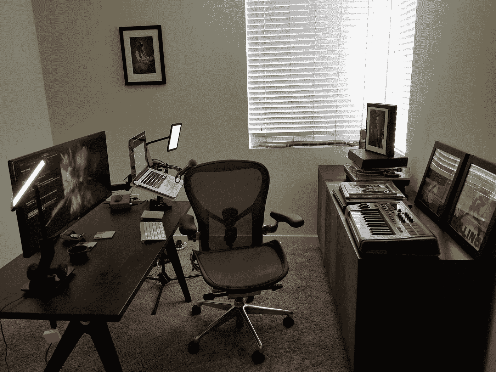

# 为远程工作做好准备

> 原文：<https://medium.com/javascript-scene/gear-up-for-remote-work-d93cf61300f?source=collection_archive---------1----------------------->

## 远程办公人员的家庭办公设备指南

Home Office

最近更新:【2020 年 12 月

设置您的远程工作空间可能会令人望而生畏。你将面临几十个购买决定，你可能会觉得你需要做很多研究。作为我日常工作的一部分，我组建远程开发团队并为其提供建议，从 2014 年开始我就一直这么做。我已经查看了所有的麦克风、耳机、家具和配件，所以你可以快速准备好，马上开始工作。

以下是我目前的推荐。

> **注意:**购买使用这些链接支持更多伟大的，免费的内容。

**一台快速电脑**

远程软件开发是 CPU 和内存密集型的。您经常会在编译和与 web 浏览器交互时录制和转码视频剪辑、共享屏幕或视频聊天。

许多计算机将难以满足这些需求。您将启动一个`npm install`，视频将会丢帧。获取至少 16 GB 的内存以获得最佳效果。32 GB 更好。当前的 MacBook Pro 会做得很好。

我最近购买了 16 英寸 8 核 i9。这是一台伟大的机器。它更轻、更小，但仍然设法在紧凑的包装中增加了一英寸的屏幕空间。我喜欢新的键盘、touch bar 和 touch ID，也不怀念旧的功能键。苹果公司最近宣布了新的 M1 笔记本电脑。

新款 MacBooks 只有 USB-C 兼容的雷电 3 端口。你可能需要连接 USB 3、HDMI 和存储卡。你可以得到[一个内置了所有这些功能的连接器集线器](https://amzn.to/33j48l7)。

*   [苹果 MacBook Pro 16 寸，8 核 i9，16GB RAM，1TB 存储，太空灰](https://www.amazon.com/Apple-MacBook-16-Inch-Storage-2-3GHz/dp/B081FV1Y57/ref=as_li_ss_tl?ref_=ast_sto_dp&linkCode=ll1&tag=eejs-20&linkId=737ce037467f9a765952d453975cd658&language=en_US)
*   [Lenton USB-C 集线器，带 HDMI、USB 3、读卡器](https://amzn.to/2Wbzngm)

## 外置键盘、触控板、鼠标

理想情况下，您会希望将笔记本电脑安装在一个高支架上，使您的屏幕和摄像机与眼睛齐平。这样做会让你更舒服，让你可以轻松地调整视频会议的摄像头，并可能改善你的健康，但它也会让内置的键盘和触控板变得触手可及。

在我看来，在生产力方面，没有什么能比得上[苹果神奇键盘](https://amzn.to/3aZmNoI)和[苹果神奇触控板](https://amzn.to/2TQjYAy)。同步很容易。不需要担心更换电池。使用随附的电缆将它们插入，您就可以在工作时为它们充电。

如果你打算在不工作的时候玩游戏放松一下，你会想要一个真正的鼠标。触控板就是不行。最好的鼠标是为游戏玩家设计的。看看[罗技 G Pro 无线](https://amzn.to/2INs4nh)。

*   [带数字键的苹果魔法键盘](https://amzn.to/2INamzY)
*   [苹果魔力触控板](https://amzn.to/3b0mWb8)
*   [罗技 G Pro 无线游戏鼠标](https://amzn.to/2INs4nh)

## 好的麦克风

内置麦克风也可以，但不适合视频聊天。首先，它离扬声器太近，所以如果扬声器声音太大，它会拾取你同事的声音并反射回来，这会非常分散注意力。第二，它不太擅长拒绝更远的声音，所以它会拾取所有的背景噪音。

如果你想让你的同事真正清楚地听到你的声音，请选择一个更好的外置麦克风。选择动圈话筒，而不是电容话筒。你需要直接对着动圈话筒说话，它才能很好地拾取声音。这是一件好事，因为它会自动过滤掉大部分背景噪音。

这些年来，我尝试了很多话筒，我一直想回到舒尔 Beta 58A。这是专业音乐人在舞台上常用的专业麦，也就是说不是 USB 麦。没关系。

你需要一个 USB 音频接口。我最喜欢的是[猩红 2i2](https://amzn.to/2wXKezH) 。当你这样做的时候，拿起一个可调节的麦克风支架。有好的可以夹在你的桌子上。

*   [舒尔 Beta 58A 话筒](https://amzn.to/33lvuXD)
*   [Focusrite Scarlet 2i2 USB 音频接口](https://amzn.to/33k0vv6)
*   [吊杆臂台式安装话筒支架](https://amzn.to/2WfgRDL)

## 一个好的显示器

MacBook Pro 显示器很棒，但即使是 16 英寸的显示器也有点小。当我编码时，我通常在一个屏幕上有一个浏览器和终端，在另一个屏幕上有一个 IDE。拥有充足的屏幕空间可以帮助你提高 20%的工作效率。值得花钱买一辆漂亮的超宽汽车。当你这样做的时候，拿起一个可安装在桌子上的可调节支架。我最喜欢的是 [VARIDESK Vari 显示器臂+笔记本电脑支架](https://amzn.to/2IHvNm6)。

*   [LG 34WN80C-B 34 英寸 21:9 曲面超宽 WQHD IPS 显示器](https://amzn.to/2w98YVP)
*   [VARIDESK VARI 显示器臂+笔记本电脑支架](https://amzn.to/2IHvNm6)

## 耳机

如果你周围的声音很大，首先，记住你的同事，当你不说话的时候把自己静音。第二，你可能想为自己屏蔽噪音。一副舒适的耳挂式封闭式耳机可能会派上用场。很难做到比[拜尔动力 DT 1770 Pro](https://amzn.to/2xCvIxS) 更好。

如果你在一个特别嘈杂的环境中，你可能想要一些带主动降噪功能的罐子。其中许多还提供无线连接。[森海塞尔 Momentum 3](https://amzn.to/39Uef2a) 提供一流的声音，更自然的声音信号帮助您避免耳朵疲劳。它还提供了一种透明模式，这样你就可以进行对话或听到周围的声音，而无需摘下它们。

有时你可能想收听会议，而不要看起来像是藏在巨大的耳挂式耳机里。森海塞尔为您配备了 [Momentum True 无线耳塞](https://amzn.to/39SiyuJ)。我觉得这些比无处不在的苹果 AirPods 舒服多了。尽管 AirPods 很受欢迎，但它并不能舒适地适应所有的耳朵，不提供不同的大小或耳朵形状选择，并且在舒适度或音质上无法与森海塞尔相提并论。

如果你不需要噪音隔离， [AKG K 701](https://amzn.to/38Sy5JM) 将让你的耳朵呼吸，并提供比这里任何其他选项更透明，更详细，更广阔的声音。如果你正在寻找最好的音质，以便在工作时欣赏一些美妙的音乐，非常舒适，质量上乘，这些是值得购买的。

厌倦了耳机？看看这个 [Beats Pill+蓝牙音箱](https://amzn.to/33riFer)。很难相信这么小的包装能发出这么好的声音。紧凑、响亮、有力。

*   [拜尔动力 DT 1770 Pro 闭耳耳机](https://amzn.to/2IQNO1i)
*   [森海塞尔 Momentum 3 降噪无线耳机](https://amzn.to/38TkCBw)
*   [森海塞尔动力真无线耳塞](https://amzn.to/39SiyuJ)
*   [AKG K 701 开耳耳机](https://amzn.to/2w9qOYM)
*   [Beats Pill+蓝牙音箱](https://amzn.to/33riFer)

## 光

为了获得最佳效果，你不希望有一扇大窗户，明亮的阳光直射在你的背后。你的室内照明将无法与阳光竞争，你的脸将在视频通话中消失在阴影中。相反，你需要良好的照明。我以前用的是一对[亮度和颜色可调的 LED 面板台灯](https://amzn.to/2voUkcK)，我把它立在我桌子的左右两边。现在，我使用[桌面安装 LED 面板](https://www.amazon.com/Dazzne-Photography-3000K-8000K-Conference-Streaming/dp/B089K24NVF/ref=as_li_ss_tl?ie=UTF8&linkCode=ll1&tag=eejs-20&linkId=4c3a365d63fc7862e64ef09aaefb258f&language=en_US)来释放桌面空间。

面板更大，因此可以将它们放在稍远的地方，同时保持柔软度。它们也变得比灯更亮，所以它们更容易与明亮的背景竞争，比如窗户。

许多人犯了错过红绿灯的错误。不要犯那个错误。良好的照明是大幅改善视频通话体验的一种廉价方式。即使是一盏不贵的灯也能带来巨大的变化。

*   [LED 面板台灯](https://amzn.to/2INtoGB)
*   [Dazzne D50 桌面可安装 LED 面板](https://www.amazon.com/Dazzne-Photography-3000K-8000K-Conference-Streaming/dp/B089K24NVF/ref=as_li_ss_tl?ie=UTF8&linkCode=ll1&tag=eejs-20&linkId=4c3a365d63fc7862e64ef09aaefb258f&language=en_US)

## 一把好椅子

你要花很多时间坐着。你需要一把好椅子。我最喜欢的是赫曼米勒 Aeron 椅。我会说它是办公椅中的劳斯莱斯，但它与奢华无关。它关乎姿势、舒适和健康。一把便宜的椅子可能会导致昂贵得多的背部疾病。此外，它看起来比[的游戏椅](https://amzn.to/2xCKjJI)要专业得多。

*   [赫曼米勒 Aeron 椅](https://store.hermanmiller.com/office/office-chairs/aeron-chair/2195348.html?lang=en_US)
*   [GT Omega Pro 游戏椅](https://amzn.to/39U5rcG)(真的，选赫曼米勒椅)

## 一张好桌子

你会想要一个有空间放双显示器的桌子。额外收获:坐或站的能力。我们喜欢高度可调的立式书桌。如果你经常站着，你会想要一个[抗疲劳站立垫](https://amzn.to/2WfweMs)。

*   [坐/站桌](https://www.amazon.com/TechOrbits-Electric-Standing-Frame-Tabletop/dp/B0849Q5SCB/ref=as_li_ss_tl?ie=UTF8&linkCode=ll1&tag=eejs-20&linkId=88fa124c63d77ae4898bce57f5f181d0&language=en_US)
*   [抗疲劳站立垫](https://amzn.to/2WfweMs)

***埃里克·艾略特*** *是一位科技产品和平台顾问，《 [*【作曲软件】*](https://leanpub.com/composingsoftware)*[*【EricElliottJS.com】*](https://ericelliottjs.com)*[*devanywhere . io*](https://devanywhere.io)*的联合创始人，以及 dev 团队导师。他曾为 Adobe Systems、* ***、Zumba Fitness、*** ***【华尔街日报、*******【ESPN、*******【BBC】****等顶级录音艺人和包括* ***Usher、【Metallica】********

*他和世界上最美丽的女人享受着与世隔绝的生活方式。*