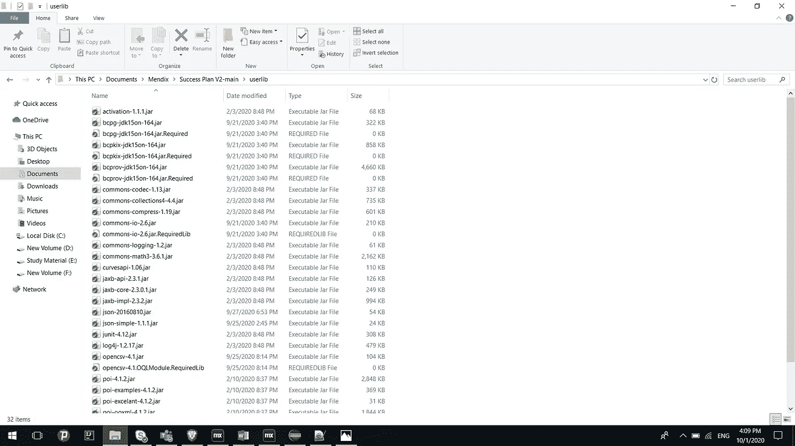

# 使用 Java 在 Mendix 中集成 PowerPoint

> 原文：<https://medium.com/mendix/generate-powerpoints-in-mendix-using-java-42c08ca894b4?source=collection_archive---------1----------------------->

在这个博客中，我将向您展示如何生成 Power Point 文件 Mendix。这可以使用 Apache POI 库和一个简单的 Json 库来完成。应该进入 PowerPoint 的数据以 Json 格式传递给 java 操作，在这里 Apache POI 将被用来以表格格式在 PowerPoint 中填充这些数据。

## **简介:**

为了在 PowerPoint 文档中生成结果，我们需要添加 java 动作，因为 Mendix 目前只支持 Java 动作。html，。pdf，。docx，。doc，。rtf 和。仅 odc 类型的文档。创建一个 PowerPoint 需要做以下三个步骤。

下载依赖 jar

创建 Java 操作

创建一个微流

## **1)下载依赖 jar**

现在让我们添加所需的 jar 文件。你可以从 https://mvnrepository.com/.[下载它们](https://mvnrepository.com/.)在这个例子中，我们下载了 Apache POI (4.1.2)、json-simple jars (1.1.1)和 org.json.jar (20160810)。我将那些下载的 jar 放在项目的 userlib 文件夹中(如下图所示)。

## **2)创建 Java 动作:**

右键单击模块并创建 Java 操作，或者可以直接从微流中创建。

打开新的 java 操作，单击“Add”添加输入参数。要生成 PowerPoint 文档需要通过一个系统。Filedocument 对象和 Json 数据(名为 Json data)作为一个字符串，以 java action 作为输入参数。这将返回一个布尔值，表明是否生成了 PowerPoint。

## **3)创建一个微流:**

创建一个微流，并在需要创建文件对象后从 REST Api 获得响应。

全微流图像。

将 java 动作添加到微流后，需要将所有输入参数映射到 java 动作。

在我们添加了 java 动作之后，我们需要将这个项目部署到 Eclipse。默认情况下，Mendix 支持 Eclipse，但是任何 java 开发 IDE 都可以用来编写定制的 Java 代码。

部署完 Eclipse 的应用程序后，我们需要导入现有的项目并浏览到 Mendix 应用程序文件夹。如果您不知道您的项目是在哪里创建的，那么您可以从 Mendix Studio pro 中找到答案。只需点击项目>在浏览器中显示项目目录。在 Eclipse 中打开项目后，在 Project Explorer 中展开项目，然后展开 javasource 文件夹。在里面你必须打开 myfirstmodule.actions(在我的应用程序模块中名字是 myfirstmodule)文件夹，在里面你会找到 java_action.java 文件，只要打开它(这个文件是由 Mendix 创建的)。

第 58 行和第 63 行变量是我们在 Mendix studio pro 中创建 Java 动作时已经声明的输入参数。

开始编写 java 代码，但是一定要写在第 66 行和第 69 行之间(注释之间-//开始用户代码和//最终用户代码)，否则会出现不必要的错误。您可以在第 80 行和第 81 行之间(注释之间// BEGIN EXTRA CODE // END EXTRA CODE)编写额外的方法/函数。

Java 代码示例:

完成 java 代码后，保存项目并关闭 Eclipse。返回 Mendix studio pro 并添加下载文件活动。在本地运行应用程序并检查 PowerPoint 文件。

在本地运行应用程序，并检查下载的 PowerPoint 文件。

其他提示:

需要根据 JSON 结构修改 java 代码。

在上面的例子中，我将 JSON 数据作为一个字符串传递到输入参数中。

如果你有任何疑问，请联系我。编码快乐！！！