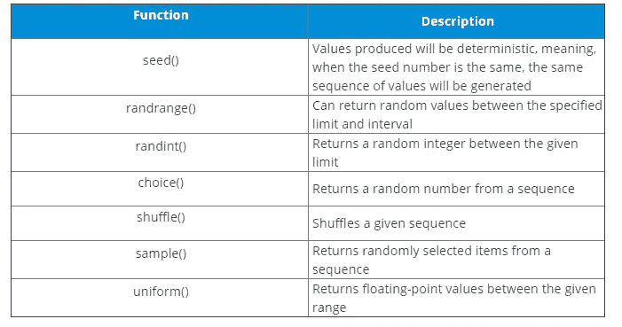

# Python 中的随机数生成器是什么，怎么用？

> 原文：<https://medium.com/edureka/generate-random-number-in-python-7cba851864fe?source=collection_archive---------1----------------------->


在创建软件时，我们的程序通常需要产生各种项目。这在游戏、OTP 生成、赌博等应用中最为常见。Python 通过其内置函数使生成这些值的任务变得毫不费力。在这篇关于 Python 中随机数生成器的文章中，您将学习如何使用各种内置函数生成数字。

在继续之前，让我们看一下本教程中讨论的主题:

*   Python 中的随机数生成器是什么？
*   生成整数
*   生成浮点数
*   从序列中返回值
*   其他功能

让我们开始吧。:)

# Python 中的随机数生成器是什么？

生成器是无论何时被调用都会产生项目的函数。Python 中的随机数生成器是一个内置函数，可以帮助您在需要时生成数字。这些函数嵌入在 Python 的随机模块中。

请看下表，其中包含一些重要的随机数发生器函数以及随机模块中对它们的描述:



现在让我们更深入地了解一下其中的每一项。

# 生成整数:

可以使用 randrange()和 randint()等函数生成随机整数。

让我们先来看看 randint()。

**randint():**

这个函数在给定的范围内产生整数。它有两个参数，第一个参数指定下限，第二个参数指定上限。 *randint(a，b)* 开始从 a 到 b 生成值，使得:

一个<= x <= b (includes a and b)

**的例子:**

```
import random
random.randint(2,9)
```

**输出:5 个**

上面的代码可以生成从 2 到 9 的数字，包括极限。如果您想在此范围内生成几个值，您可以如下使用 *for* 循环:

**示例:**

```
import random
for x in range(2):
 print(random.randint(2,9))
```

**输出:2 6**

如果您想生成区间数，可以使用 randrange()函数。

**randrange():**

如前所述，randrange()函数允许用户通过步进间隔计数来生成值。

**例如:**

```
import random
for x in range(5):
print(random.randrange(2,60,2))
```

**输出:**

如你所见，这里生成的所有数字都是介于 2 和 6 之间的偶数。

还可以使用 random 模块的内置函数生成浮点值。

# 生成浮点值:

要生成浮点数，可以利用 random()和 uniform 函数。

**随机():**

这个函数产生 0.0 到 1.0 之间的浮点值，因此不需要参数。请注意，不包括上限。所以最大值将是 9.999。

**例如:**

```
import random
for x in range(5):
 print(random.random())
```

**输出:**

0.18156025373128404

## 制服():

与 random()函数不同，该函数采用两个参数，分别确定下限和上限。

**举例:**

```
for x in range(5):
 print(random.uniform(6))
```

**输出:**

2.3135197730563335
5.752723939 3254545 697
4.561236 813447 408
3.35366

Python 还允许您从给定的序列中生成随机值。

## 从给定序列生成值:

这可以使用 choice()和 sample()函数来完成。

## choice():

这个函数基本上以一个序列作为参数，并从中返回随机值。

**示例:**

```
for x in range(3):
print(random.choice([1,2,3,4,5,6,7,8,9]))
```

**输出:**

正如您所看到的，在上面的输出中，使用 for 循环返回了三个值，所有的值都是从给定的列表中随机选取的。

## 示例():

sample()函数从给定的序列中选取一个随机序列，并将其作为输出返回。它有两个参数，第一个参数是一个序列，第二个参数是一个整数值，指定输出中需要返回多少个值。

**例如:**

```
print(random.sample([1,2,3,4,5,6,7,8,9],4))
```

**输出:**【1，4，5，9】

正如您所看到的，上例中产生的输出列表由从给定序列中随机选择的四个值组成。

## 其他功能:

**种子():**

seed()函数将一个称为种子的数字作为参数，并在每次使用该数字调用该函数时产生相同的随机数。

**例如:**

```
random.seed(2) print(random.random(),random.random(),random.random(),end='nn') random.seed(3) print(random.random(),random.random(),random.random(),end='nn') random.seed(2) print(random.random(),random.random(),random.random())
```

**输出:**

```
0.9560342718892494 0.9478274870593494 0.05655136772680869 0.23796462709189137 0.5442292252959519 0.36995516654807925 0.9560342718892494 0.9478274870593494 0.05655136772680869
```

在上面的例子中，每次调用 seed(2)时，它的输出都是相同的。在需要将相同的随机数传递给不同测试用例的实验中，这个函数非常有用。

**洗牌():**

这个函数用于随机打乱一个给定的序列。

**例如:**

```
mylist=[1,2,3,4,5,6,7,8,9]
random.shuffle(mylist)
print(mylist)
```

**输出:**【6，8，2，4，3，7，1，5，9】

这就把我们带到了“Python 中的随机数生成器”这篇文章的结尾。我希望你已经理解了所有的概念。

伙计们，这就把我们带到了这篇关于如何在 Python 中输入 A-List 的文章的结尾？如果你想查看更多关于人工智能、DevOps、道德黑客等市场最热门技术的文章，那么你可以参考 [Edureka 的官方网站。](https://www.edureka.co/blog/?utm_source=medium&utm_medium=content-link&utm_campaign=generate-random-number-in-python)

请留意本系列中的其他文章，它们将解释 Python 和数据科学的各个方面。

> *1。*[*Python 中的机器学习分类器*](/edureka/machine-learning-classifier-c02fbd8400c9)
> 
> *2。* [*Python Scikit-Learn 小抄*](/edureka/python-scikit-learn-cheat-sheet-9786382be9f5)
> 
> *3。* [*机器学习工具*](/edureka/python-libraries-for-data-science-and-machine-learning-1c502744f277)
> 
> *4。* [*用于数据科学和机器学习的 Python 库*](/edureka/python-libraries-for-data-science-and-machine-learning-1c502744f277)
> 
> *5。*[*Python 中的聊天机器人*](/edureka/how-to-make-a-chatbot-in-python-b68fd390b219)
> 
> *6。* [*蟒蛇收藏*](/edureka/collections-in-python-d0bc0ed8d938)
> 
> *7。* [*Python 模块*](/edureka/python-modules-abb0145a5963)
> 
> *8。* [*Python 开发者技能*](/edureka/python-developer-skills-371583a69be1)
> 
> *9。* [*哎呀面试问答*](/edureka/oops-interview-questions-621fc922cdf4)
> 
> *10。*[*Python 开发者简历*](/edureka/python-developer-resume-ded7799b4389)
> 
> *11。*[*Python 中的探索性数据分析*](/edureka/exploratory-data-analysis-in-python-3ee69362a46e)
> 
> *12。* [*蛇与蟒蛇的游戏*](/edureka/python-turtle-module-361816449390)
> 
> *13。* [*Python 开发者工资*](/edureka/python-developer-salary-ba2eff6a502e)
> 
> *14。* [*主成分分析*](/edureka/principal-component-analysis-69d7a4babc96)
> 
> *15。*[*Python vs c++*](/edureka/python-vs-cpp-c3ffbea01eec)
> 
> *16。* [*刺儿头教程*](/edureka/scrapy-tutorial-5584517658fb)
> 
> *17。*[*Python SciPy*](/edureka/scipy-tutorial-38723361ba4b)
> 
> *18。* [*最小二乘回归法*](/edureka/least-square-regression-40b59cca8ea7)
> 
> *19。* [*Jupyter 笔记本小抄*](/edureka/jupyter-notebook-cheat-sheet-88f60d1aca7)
> 
> 20。 [*Python 基础知识*](/edureka/python-basics-f371d7fc0054)
> 
> *21。* [*Python 模式程序*](/edureka/python-pattern-programs-75e1e764a42f)
> 
> *22。*[*Python 中的*](/edureka/generators-in-python-258f21e3d3ff) 生成器
> 
> *23。* [*Python 装饰师*](/edureka/python-decorator-tutorial-bf7b21278564)
> 
> *24。*[](/edureka/spyder-ide-2a91caac4e46)*[*Python 中的套接字编程是什么*](/edureka/socket-programming-python-bbac2d423bf9)*
> 
> *25。[*Python 中使用 Kivy 的移动应用*](/edureka/kivy-tutorial-9a0f02fe53f5)*
> 
> **26。* [*十大最佳学习书籍&练习 Python*](/edureka/best-books-for-python-11137561beb7)*
> 
> **27。* [*机器人框架与 Python*](/edureka/robot-framework-tutorial-f8a75ab23cfd)*
> 
> **28。*[*Python 中的贪吃蛇游戏*](/edureka/snake-game-with-pygame-497f1683eeaa)*
> 
> **29。* [*Django 面试问答*](/edureka/django-interview-questions-a4df7bfeb7e8)*
> 
> **30。* [*十大 Python 应用*](/edureka/python-applications-18b780d64f3b)*
> 
> **31。*[*Python 中的哈希表和哈希表*](/edureka/hash-tables-and-hashmaps-in-python-3bd7fc1b00b4)*
> 
> **32。*[*Python 3.8*](/edureka/whats-new-python-3-8-7d52cda747b)*
> 
> **33。* [*支持向量机*](/edureka/support-vector-machine-in-python-539dca55c26a)*
> 
> **34。* [*Python 教程*](/edureka/python-tutorial-be1b3d015745)*
> 
> **35。*[*Python Spyder*](/edureka/spyder-ide-2a91caac4e46)*

**原载于 2019 年 8 月 5 日*[*https://www.edureka.co*](https://www.edureka.co/blog/generate-random-number-in-python/)*。**