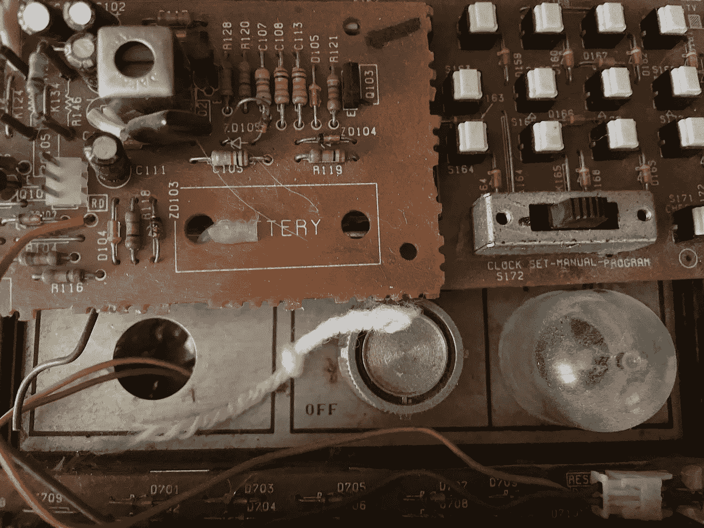
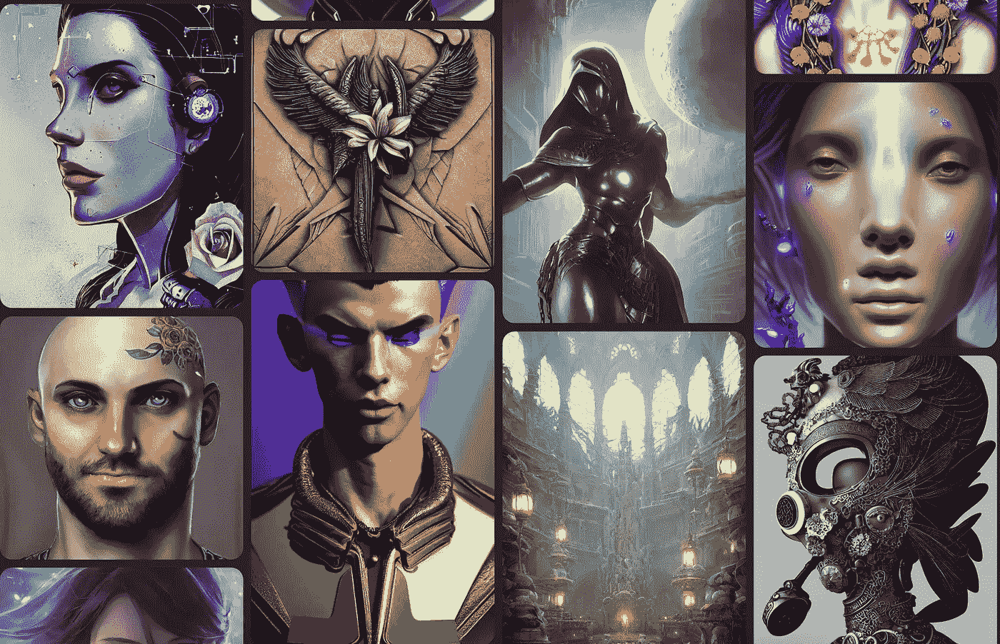
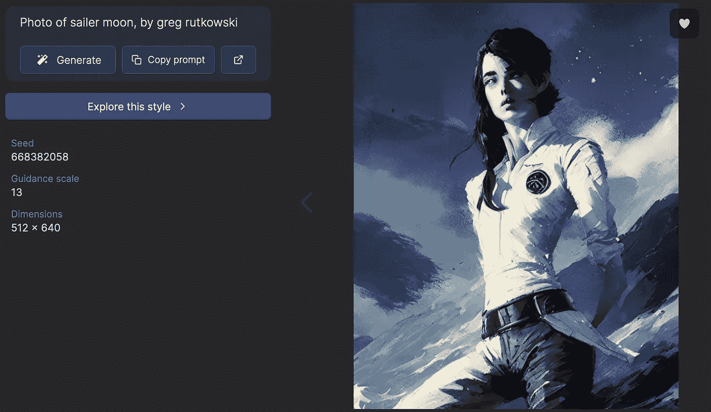
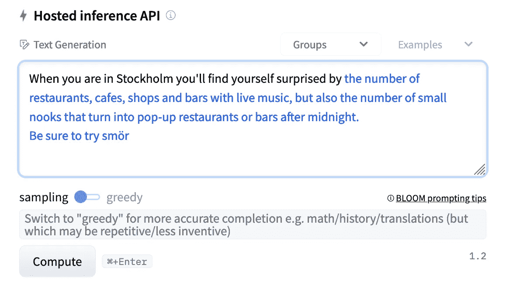

# OCI 的生成人工智能

> 原文：<https://medium.com/oracledevs/generative-ai-in-oci-c0467e1a68f7?source=collection_archive---------0----------------------->

过去两年的人工智能发展非常疯狂，因为我们似乎经常有一个新的模型超越了以前的模型。像语言的 GPT-3 或布鲁姆，图像的 DALL-E 3 或稳定扩散，编程的 codex 或 alphacode，以及最近的视频和 3D 模型生成。

很难跟上现在可用的所有工具，但我们必须不断学习，否则就会落后。

为此，我想创建自己的环境，以便手边有一些生成工具。所以，我做了一个 terraform 脚本，在 OCI 上创建了一个 **GPU 机器，它有一个稳定的扩散和开花模型。此外，为了我的娱乐(希望你也是)，我添加了 dreambooth，这是一个允许你在稳定的扩散模型上进行训练的工具，使用你自己的图像进行训练，结果令人惊讶。我肯定你也想测试它们。**

先说一些定义，我会给你一切的说明。

**稳定扩散**是一种最先进的文本到图像模型，可以从文本生成图像。

[https://lexica.art](https://lexica.art/) screenshot

你可以放一个你想要的描述，模型会给你创造一些东西。示例:

> 赛勒·穆恩的照片，作者格雷格·鲁特考斯基

Example generated image from the page [https://lexica.art](https://lexica.art/)

人工智能使用文本提示生成图像，这些模型图像生成的关键是“修改器”，就像“greg rutkowski”描述中的短语一样。

如果你想更深入地挖掘，去 https://lexica.art/[查看图片示例和你需要使用的提示来得到那些结果。](https://lexica.art/)

**Bloom** 是一个开放的多语言大型语言模型，拥有 1760 亿个参数，它使用 NVIDIA AI 平台进行训练，具有 46 种语言和 13 种编程语言的文本生成。

通常你可以输入一些文字，人工智能会尝试完成这个短语。示例:

> 当你在斯德哥尔摩时，你会惊讶于

像写博客、网页、数学文章、编码文章等一样开始一个句子。而布鲁姆会产生一个连贯的后续。(在许多语言中不仅仅是英语！)

**Dreambooth** 允许您微调稳定的扩散模型，以根据少量图像样本生成新标签。这个想法是你可以用 20-30 张图片来训练这个模型，这样它就可以产生一些新的东西。

下一组图像是在我用自己的 20 张图像训练模型后生成的。

Generated images on stable diffusion of “me”

你可以生成动画图像，一张 Funko 照片，你和龙猫，你在《星球大战》或《权力的游戏》,任何你想要的。

图像稳定扩散，语言绽放，Dreambooth 微调。

你可以通过使用我一直在开发的 GitHub repo 来获得这些工具。repo 包含一个 terraform 脚本，该脚本在安装了这三个工具的 Oracle Cloud 中创建一个 GPU 实例。

安装了稳定扩散和 Bloom，可以直接使用。

如果您想将 Dreambooth 用于您自己的图像，您将需要训练模型(可能需要一个小时左右)，并按照下面的说明来构建图像数据集。

*   所有图像必须为 512 x 512
*   确保照片里只有你一个人
*   穿着不同的衣服
*   不同的面部表情
*   不同的背景
*   不同的角度
*   3-5 张全身照片
*   5–7 张半个身体的照片
*   10-15 张你脸部的特写照片

所有的构建说明都在 GitHub 上，你需要半个小时来启动并运行机器。

 [## GitHub-Carl gira/OCI-generative-ai:Terraform 脚本来安装一个稳定扩散、dreambooth 和…

### 使用 OCI 的 nvidia GPU 在计算实例中启动稳定扩散、bloom 和 dreambooth 的 Terraform 脚本…

github.com](https://github.com/carlgira/oci-generative-ai) 

我希望它对你有所帮助，我希望你能创造自己的精彩故事和图片。

谢谢！

如果你对 Oracle 开发人员在他们的自然环境中发生的事情感到好奇，请加入我们的公共休闲频道！我们不介意成为你的鱼缸🐠