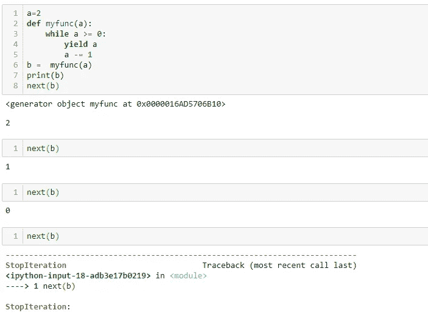
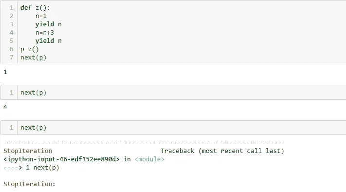

# Python 中的生成器是什么，如何使用？

> 原文：<https://medium.com/edureka/generators-in-python-258f21e3d3ff?source=collection_archive---------0----------------------->


Generators in Python — Edureka

生成可重复项或允许跳过它们的对象被认为是一项繁重的任务。但是，在 Python 中，这个痛苦任务的实现变得非常顺利。因此，让我们继续深入了解 Python 中的生成器。

以下是本文涵盖的所有主题的列表:

*   发电机是什么？
*   使用发电机的优势
*   正常功能与发电机功能
*   使用生成器函数
*   带回路的发电机
*   生成器表达式
*   用例

1.  生成斐波那契数列
2.  生成数字

让我们开始吧。:)

# Python 中的生成器是什么？

生成器基本上是返回可遍历对象或项目的函数。这些函数不会一次生成所有项目，而是一次生成一个项目，并且只在需要时生成。每当包含 for 语句来迭代一组项目时，就会运行一个生成器函数。发电机也有许多优点。

# 使用发电机的优势

*   如果没有 Python 中的生成器，生成 iterables 是极其困难和冗长的。
*   生成器易于实现，因为它们自动实现 __iter__()、__next__()和 StopIteration，否则需要显式指定。
*   与普通的 Python 函数不同，在需要时生成项目，从而节省了内存。当您需要创建大量迭代器时，这个事实变得非常重要。这也被认为是发电机最大的优势。
*   可以用来生产无限多的物品。
*   它们还可以用于管道化许多操作

## **正常功能与发电机功能:**

Python 中的生成器就像使用“def”关键字创建普通函数一样。但是，生成器函数使用 yield 关键字而不是 return。这样做是为了通知解释器这是一个迭代器。不仅如此，生成器函数在调用 next()函数时运行，而不是像普通函数那样按其名称运行。考虑下面的例子来更好地理解它:

**举例:**

```
def func(a):
    yield a
a=[1,2,3]

b=func(a)
next(b)
```

**输出:**【1，2，3】

正如您所看到的，在上面的输出中，func()使用 yield 关键字和 next 函数来执行它。但是，对于正常功能，您将需要以下代码:

**举例:**

```
def func(a):
    return a
a=[1,2,3]
func(a)
```

**输出:**【1，2，3】

如果你看上面的例子，你可能想知道为什么使用一个生成器函数，而普通函数也返回相同的输出。所以让我们继续，看看如何在 Python 中使用生成器。

# 使用生成器函数:

如前所述，Python 中的生成器一次生成一个可迭代对象。看一下下面的例子:

**示例:**

```
def myfunc(a):
    while a>=3:
        yield a
        a=a+1
b =  myfunc(a)
print(b)
next(b)
```

当您执行以下函数时，您将看到以下输出:

**输出:** 4

这里，返回了一个满足 while 条件的 iterable 对象。执行后，控制权将转移给调用者。如果需要更多项，需要通过调用 next()函数再次执行相同的函数。

```
next(b)
```

**输出:** 5

在进一步执行时，该函数将返回 6，7 等。Python 中的生成器函数自动实现 __iter__()和 __next__()方法。因此，只需使用 next()方法就可以遍历对象。当项目生成应该终止时，生成器函数在内部实现 **StopIteration** ，而不必担心调用者。这是另一个例子:

**举例:**

```
a=2
def myfunc(a):
    while a >= 0:
        yield a
        a -= 1
b =  myfunc(a)
print(b)
next(b)
```

**输出:**



上面的图像显示了我们的程序需要多次执行。如果再次尝试调用下一个函数，它会返回一条消息，描述 ***StopIteration*** 已经实现。如果您尝试用普通函数来做这件事，返回的值将不会改变或迭代。看看下面的例子:

**示例:**

```
def z():
    n=1
    yield n
    n=n+3
    yield n
p=z()
next(p)
```

**输出:**



# 带回路的发电机:

如果你想立刻执行相同的功能，你可以使用' for '循环。这个循环帮助迭代对象，在所有实现之后，它执行 StopIteration。

**例如:**

```
def z():
    n=1
    yield n
    n=n+3
    yield n
for x in z():
    print(x)
```

**输出:**

1
4

还可以指定表达式来生成可迭代对象。

## **生成器表达式:**

还可以将表达式与 for 循环一起使用来产生迭代器。这通常会使生成可迭代对象变得容易得多。生成器表达式类似于列表理解，且像 lambda 函数一样，生成器表达式创建匿名生成器函数。

看看下面的例子:

**例如:**

```
a=range(6)
print("List Comprehension", end=':')
b=[x+2 for x in a] 
print(b)
print("Generator expression", end=':n')
c=(x+2 for x in a) 
print(c)
for y in c:
    print(y)
```

**输出:**

列表理解:[2，3，4，5，6，7]

生成器表达式:

<generator object="">at 0x0000016362944480 ></generator>

2
3
4
5
6

正如您所看到的，在上面的输出中，第一个表达式是在[]括号中指定的列表理解。列表理解一次产生完整的项目列表。下一个是生成器表达式，它返回相同的项，但一次只返回一项。它是用()括号指定的。

生成器函数也可以在其他函数中使用。例如:

**例如:**

```
a=range(6)
print("Generator expression", end=':n')
c=(x+2 for x in a) 
print(c)
print(min(c))
```

**输出:**

生成器表达式
2

当上述表达式应用于 a 的值时，上面的程序打印最小值。

# 使用案例:

让我们使用 Python 中的生成器来:

*   生成斐波那契数列
*   生成数字

## 生成斐波那契数列:

众所周知，斐波那契数列是一系列数字，其中每个数字都是前面两个数字的和。前两个数字是 0 和 1。下面是一个生成斐波那契数列的生成器程序:

**举例:**

```
def fibo():
    first,second=0,1
    while True:
        yield first
        first,second=second,first+second
for x in fibo():
    if x>50:
        break
    print(x, end=" ")
```

**输出:**

```
0 1 1 2 3 5 8 13 21 34
```

上面的输出显示了值小于 50 的斐波那契数列。现在让我们来看看如何生成一个数字列表。

# 生成数字:

如果您想要生成指定的列表编号，您可以使用生成器函数来实现。看一看下面的例子:

**举例:**

```
a=range(10)
b=(x for x in a) 
print(b)
for y in b:
    print(y)
```

**输出:**

<generator object="">在 0x 000001 CB 1602 de 0 ></generator>

0
1
2
3
4
5
6
7
8
9

**示例:**

```
a=range(2,10,2)
b=(x for x in a) 
print(b)
for y in b:
    print(y)
```

**输出:**

<generator object="">at 0x 000001 CBE 1623138 >
2
4
6
8</generator>

上面的程序已经返回了从 2 到 10 的偶数。这就把我们带到了这篇关于 Python 中的生成器的文章的结尾。我希望你已经理解了所有的主题。

确保你尽可能多的练习，恢复你的经验。

如果你想查看更多关于人工智能、DevOps、道德黑客等市场最热门技术的文章，那么你可以参考 [Edureka 的官方网站。](https://www.edureka.co/blog/?utm_source=medium&utm_medium=content-link&utm_campaign=generators-in-python)

请留意本系列中的其他文章，它们将解释 Python 和数据科学的各个方面。

> 1.[Python 中的机器学习分类器](/edureka/machine-learning-classifier-c02fbd8400c9)
> 
> 2. [Python Scikit-Learn 备忘单](/edureka/python-scikit-learn-cheat-sheet-9786382be9f5)
> 
> 3.[机器学习工具](/edureka/python-libraries-for-data-science-and-machine-learning-1c502744f277)
> 
> 4.[用于数据科学和机器学习的 Python 库](/edureka/python-libraries-for-data-science-and-machine-learning-1c502744f277)
> 
> 5.[Python 中的聊天机器人](/edureka/how-to-make-a-chatbot-in-python-b68fd390b219)
> 
> 6. [Python 集合](/edureka/collections-in-python-d0bc0ed8d938)
> 
> 7. [Python 模块](/edureka/python-modules-abb0145a5963)
> 
> 8. [Python 开发者技能](/edureka/python-developer-skills-371583a69be1)
> 
> 9.[哎呀面试问答](/edureka/oops-interview-questions-621fc922cdf4)
> 
> 10.[Python 开发者简历](/edureka/python-developer-resume-ded7799b4389)
> 
> 11.[Python 中的探索性数据分析](/edureka/exploratory-data-analysis-in-python-3ee69362a46e)
> 
> 12.[用 Python 的乌龟模块做的蛇游戏](/edureka/python-turtle-module-361816449390)
> 
> 13. [Python 开发者工资](/edureka/python-developer-salary-ba2eff6a502e)
> 
> 14.[主成分分析](/edureka/principal-component-analysis-69d7a4babc96)
> 
> 15. [Python vs C++](/edureka/python-vs-cpp-c3ffbea01eec)
> 
> 16.[刺儿头教程](/edureka/scrapy-tutorial-5584517658fb)
> 
> 17. [Python SciPy](/edureka/scipy-tutorial-38723361ba4b)
> 
> 18.[最小二乘回归法](/edureka/least-square-regression-40b59cca8ea7)
> 
> 19. [Jupyter 笔记本小抄](/edureka/jupyter-notebook-cheat-sheet-88f60d1aca7)
> 
> 20. [Python 基础知识](/edureka/python-basics-f371d7fc0054)
> 
> 21. [Python 模式程序](/edureka/python-pattern-programs-75e1e764a42f)
> 
> 22.[用 Python 进行网页抓取](/edureka/web-scraping-with-python-d9e6506007bf)
> 
> 23. [Python 装饰器](/edureka/python-decorator-tutorial-bf7b21278564)
> 
> 24. [Python Spyder IDE](/edureka/spyder-ide-2a91caac4e46)
> 
> 25.[Python 中使用 Kivy 的移动应用](/edureka/kivy-tutorial-9a0f02fe53f5)
> 
> 26.[十大最佳学习书籍&练习 Python](/edureka/best-books-for-python-11137561beb7)
> 
> 27.[用 Python 实现机器人框架](/edureka/robot-framework-tutorial-f8a75ab23cfd)
> 
> 28.[使用 PyGame 的 Python 中的贪吃蛇游戏](/edureka/snake-game-with-pygame-497f1683eeaa)
> 
> 29. [Django 面试问答](/edureka/django-interview-questions-a4df7bfeb7e8)
> 
> 30.[十大 Python 应用](/edureka/python-applications-18b780d64f3b)
> 
> 31.[Python 中的哈希表和哈希表](/edureka/hash-tables-and-hashmaps-in-python-3bd7fc1b00b4)
> 
> 32. [Python 3.8](/edureka/whats-new-python-3-8-7d52cda747b)
> 
> 33.[支持向量机](/edureka/support-vector-machine-in-python-539dca55c26a)
> 
> 34. [Python 教程](/edureka/python-tutorial-be1b3d015745)

*原载于 2019 年 7 月 15 日*[*【https://www.edureka.co】*](https://www.edureka.co/blog/generators-in-python/)*。*