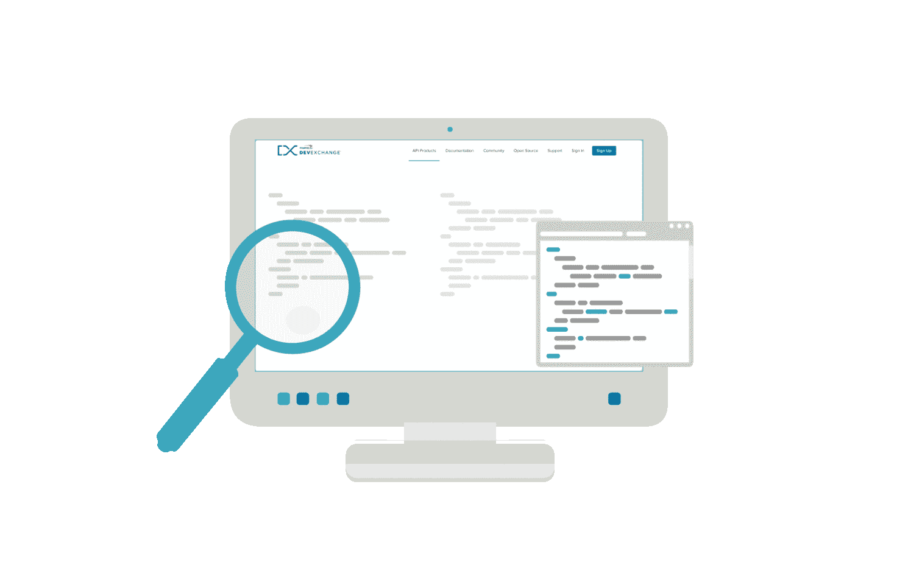

# Swift 中的通用数据源

> 原文：<https://medium.com/capital-one-tech/generic-data-sources-in-swift-c6fbb531520e?source=collection_archive---------1----------------------->

在我开发的绝大多数 iOS 应用中，表格视图和收藏视图是最常用的 UI 组件。由于设置一个表视图或集合视图需要大量的样板文件，我最近花了一些时间寻找一种避免一遍又一遍地编写相同代码的好方法。我的努力集中在试图通过一组抽象来封装所需的样板文件。随着时间的推移，许多其他开发人员已经在解决这个问题，随着最近对 Swift 的改进，已经开发了许多有趣的方法。

在这篇文章中，我将展示我已经使用了一段时间的方法，来减少在我的应用程序中设置集合视图所需的样板文件的数量。

# 表格视图与集合视图

*“为什么只谈集合视图而不谈表格视图？”*有些人可能会问。

在过去的几个月里，我在以前可以使用表视图的每个实例中使用集合视图。到目前为止，它一直工作得很好！它帮助我避免了由于使用两个几乎*相似但又不完全相同的概念而产生的二元性。我做出这一决定的理由如下:*

*   任何表视图都可以作为一个包含一列的集合视图来实现/重构。
*   表格视图在大屏幕上不太好用(例如:iPad)。

我想指出的是，我并不是建议您检查您的代码库，并将所有的表视图重新实现为集合视图。我的建议是，如果您需要添加一个需要显示项目列表的新特性，您应该考虑使用集合视图而不是表格视图。特别是如果你正在开发一个通用的应用程序，因为集合视图可能会通过动态调整布局来使所有屏幕尺寸的工作变得更容易。

# Swift 泛型和对有用抽象的探索

我一直是泛型编程的粉丝，所以你可以想象当苹果在 Swift 中引入泛型时我是多么兴奋。然而，泛型和协议已经有一段时间不能很好地协同工作了。然后，随着 Swift 2.x 中[相关类型](https://www.natashatherobot.com/swift-what-are-protocols-with-associated-types/)的引入，创建通用协议变得更加容易，许多开发人员开始尝试它们。

我将要介绍的抽象是从使用泛型，特别是泛型协议的实验开始的。这种抽象允许我封装设置集合视图所需的样板文件，并将为集合视图创建数据源所需的代码减少到两行简单用例的代码。

我想指出的是，我所建立的不是银弹。我实现的抽象专注于解决一组特定的用例。对于这些情况，它们在简化设置集合视图所需的代码方面做得相当好。对于一些更复杂的用例，可能需要额外的代码。我主要关注隐藏与集合视图相关的最常见的功能。如果需要的话，可以封装更多的功能，但这不是我的特定用例所需要的。

出于本文的目的，我将给出一些抽象概念，涵盖使用集合视图时通常需要的功能。这应该是一个很好的起点，来说明使用泛型，尤其是泛型协议可以构建什么。

# 集合视图单元抽象

在实现集合视图时，我通常采取的第一步是创建我将用来显示所需数据的单元格。在集合视图中处理单元格时，总是需要:

*   将单元格出队
*   配置单元

为了简化上述任务，我创建了两个协议:

*   ***可重用单元***
*   **可配置单元 **

让我们来看看上述抽象的细节。

# ReusableCell

***重用单元*** 协议要求您定义一个 ***重用标识符*** ，该标识符将在单元出列时使用。在我的应用程序中，我通常采用单元格标识符与单元格类名相同的惯例。因此，通过创建一个协议扩展，使 ***重用标识符*** 返回一个带有类名的字符串，可以很容易地将这个抽象掉:

# 可配置单元

***可配置单元*** 协议要求您实现一个方法，该方法将用于使用特定类型的实例来配置单元，该实例被声明为泛型类型 ***T*** :

加载单元内容时，将使用 ***可配置单元*** 协议。我稍后会谈到它的一些细节。目前，我只想强调几件事:

1.  ***可配置单元*** 扩展 ***可重用单元***

2.关联类型(***associated type T***)的使用将 ***可配置单元*** 定义为通用协议

# 抽象数据源:CollectionDataProvider

现在，让我们暂时回过头来看看设置集合视图需要什么。为了让集合视图显示任何内容，我们需要符合***uicollectionview data source***协议。通常需要的第一步是指定:

*   节数: ***节数(中:***
*   每节的行数: ***集合视图(_:numberOfItemsInSection:)***
*   如何加载单元格内容:***collection view(_:cellForItemAt:)***

以上步骤实现了委托，确保我们能够显示特定集合视图的单元格。因此，对我来说，这看起来是一个构建抽象的好地方。

为了抽象和封装上述步骤，我创建了以下通用协议:

协议中的前三种方法是:

*   ****numberOfItems(in:)****
*   ****项(at:)****

*它们映射了实现上面列出的***uicollectionview data source***的委托方法所需的内容。因为在一些用例中，我还需要基于一些用户交互来更新数据源，所以我最终添加了第四个方法 ***(updateItem(at:，value:)】***，它允许您在需要时更新底层数据源。因此，***collection data provider***中声明的方法足以封装符合***uicollectionview data source***所需的通用功能。*

# *封装样板文件:CollectionDataSource*

*有了上述抽象，就有可能开始实现一个基类，该基类将封装为集合视图创建数据源所需的通用样板文件。这里是大部分*【神奇】*将要发生的地方！该类的主要职责是利用特定的***collection data provider***和***uicollectionview cell***来实现符合***uicollectionview data source***协议所需的内容。它还将通过遵守***uicollectionview delegate***协议来封装一些常见的单元功能。*

*下面是类声明:*

*这里发生了很多事情:*

1.  *该类具有 open access 属性，因为它将被扩展以提供一个具体的实现，该实现将与特定的 CollectionDataProvider 一起工作。*
2.  *这是一个通用类，它需要通过定义它将使用的 ***【集合数据提供者】*** 和单元格***(uicollectionview Cell)***的特定实例来进一步规范。*
3.  *该类扩展了***n object***并符合***uicollectionview data source***和***uicollectionview delegate***来实现和封装样板代码。*
4.  *该类在 where 子句中声明了几个特定的约束:*

*   *它接受的***uicollectionview Cell***必须符合***configurable Cell***协议(***Cell:******configurable Cell***)。*
*   *对于单元和提供者( ***提供者)，特定类型 ***T*** 必须相同。T == Cell。T*** )。*

*设置和初始化***collection data source***类所需的代码如下:*

*代码相当简单:***collection data source***需要知道它将作用于哪个集合视图实例，以及通过哪个特定的提供者。这两个元素都作为 ***init*** 方法的参数传递。在初始化阶段，***collection data source***将自己设置为***uicollectionview data source***和***uicollectionview delegate***(在 ***设置*** 方法中)的委托。*

*现在，让我们看看实现***uicollectionview data source***委托的样板代码。*

*代码如下:*

*上面的代码片段显示了主***uicollectionview data source***委托通过***collection data provider***实例的实现，如前所述，该实例封装了数据源实现的细节。每个委托使用特定的***collection data provider***方法来抽象与数据源的交互。*

*请注意，***collection view(_:cellForItemAt:)***方法有一个 open access 属性。这允许它扩展它，以防任何子类在单元内容初始化阶段需要更多的定制。*

*现在，在集合视图中显示单元格的功能已经就绪，让我们再添加几个特性。*

*对于第一个附加功能，用户应该能够点击一个单元格并触发一些动作。要实现这一点，一个简单的解决方案是定义一个自定义闭包，如果指定了闭包，当用户点击单元格时执行闭包。*

*处理单元格点击的自定义闭包如下所示:*

*现在，我们可以声明一个属性来存储闭包，并实现 ***的***collection view(_:didSelectItemAt:)***方法，以便在用户点击单元格时执行指定的闭包:****

*对于第二个附加特性，我将实现一些样板文件来处理***collection data source***中的多个头和节。这就需要实现***uicollectionview data source***的***viewforsupplementaryelementof kind***委托方法。因为我想在***collection data source***中封装设置委托的所有逻辑，为了让子类能够定制***view for supplementaryelementofkind***，委托方法应该用一个开放的属性访问器声明，以使它在任何子类中都是可重写的:*

*一般来说，这适用于所有的委托方法。如果需要被子类覆盖，需要在***collection data source***中实现，并使用开放的属性访问器声明。*

*实现相同目标的不同策略是使用自定义闭包，如单元格点击处理***(CollectionItemSelectionHandlerType)***所示。*

*我的实现的这个特殊方面是软件工程中的一个典型的折衷。一方面——为视图集合设置数据源的大部分细节将被隐藏(并被抽象掉)。另一方面，没有作为样板文件的一部分提供的所有功能都不是“开箱即用”的，需要额外的定制。添加新功能并不太复杂，但是需要实现更多的定制代码，如上面两个例子所示。*

# *实现具体的 collection data provider:array data provider*

*既然样板文件已经设置好了，集合视图的数据源就通过 ***集合数据源*** 来处理了。让我们看看如何在一个非常常见的用例中利用它。为此，让我们暂时回到 ***集合数据提供者*** 协议。为了能够创建***collection data source***的实例，需要提供***collection data provider***的具体实现。涵盖大多数常见用例的基本实现可以简单地利用数组类型来表示包含要在集合视图单元格中显示的数据的项目列表。作为数据源抽象实验的一部分，我将这个实现变得更加通用，能够表示:*

*   *列表的数组，其中数组中的每个列表代表集合视图的一个部分的内容。*
*   *单个项目列表，表示集合视图单元格的数据，这相当于只有一个部分(没有标题)。*

*上述实现的代码包含在泛型类***array data provider***中:*

*这负责抽象最常见用例中访问数据源的细节，在这些用例中，线性数据结构可以表示单元格的内容。*

# *将所有内容包装在一起:CollectionArrayDataSource*

*有了***collection data provider***协议的具体实现，就很容易创建***collection data source***的子类，利用它来覆盖需要显示一个简单项目列表的非常常见的用例。*

*让我们从类声明开始:*

*这个声明定义了相当多的东西:*

1.  *该类具有开放访问属性，因为它将被扩展以最终为一个***UICollectionView***实例创建一个数据源实例。*
2.  *这是一个泛型类，它需要通过定义特定的类型*来进一步规范，该类型将表示单元格内容和单元格，基于它将使用的***uicollectionview Cell***。**

**3.这个类扩展了***collection data source***来提供进一步的特定行为。**

**4.表示单元格内容的特定类型 ***T*** 将通过***array data provider<T>***实例进行访问。**

**5.该类有几个特定的约束，在 where 子句中声明:**

*   **它接受的***uicollectionview Cell***必须符合 ***ConfigurableCell*** 协议(Cell:***configurable Cell***)。**
*   **单元格和***array data provider<T>(单元格的具体类型 T 必须相同。*T = = T)**。**

**该类的主体相当简单:**

**它只提供了几个初始化器和方法来透明地与提供者实例交互，以从数据源读取项或向数据源写入项。**

# **设置基本收藏视图**

**可以扩展***CollectionArrayDataSource***基类，为任何可以用项目数组表示的集合视图创建特定的数据源。以下是一个例子(摘自 [GitHub repo](https://github.com/andrea-prearo/GenericDataSource) 中的照片列表样本):**

**声明相对简单:**

1.  **该类扩展了***CollectionArrayDataSource***。**
2.  **该类将***PhotoViewModel***指定为表示单元格内容的特定类型 ***T*** ，可通过***array data provider<PhotoViewModel>***实例访问，并将 ***PhotoCell*** 指定为它将与之一起工作的***UICollectionViewCell***。**

**请注意， ***光电池*** 必须符合 ***可配置电池*** 协议，由 ***集合数据源*** 声明指定，并且能够从***PhotoViewModel***的实例中配置其属性。**

**创建***photo data source***的实例相当简单。它只需要被传递它将要处理的集合视图和代表每个单元格内容的***PhotoViewModel***项的数组:**

*****集合视图*** 参数通常是指向故事板中集合视图的 outlet(***@ IBOutlet 弱 var 集合视图:UICollectionView！*** )。**

**就是这样！两行代码足以设置基本集合视图的数据源。**

# **设置带有标题和节的集合视图**

**对于更高级和复杂的用例，您可以查看一下 [GitHub repo](https://github.com/andrea-prearo/GenericDataSource) 中的 ***任务列表*** 示例。因为内容已经很长了，所以我不打算在本文中详细介绍这个示例。我可能会在下一篇文章中更深入地探讨主题*“带有标题和节的集合视图”*。关于这一点，如果你对这样一个话题感兴趣，不要犹豫让我知道，这样我就可以优先考虑接下来写什么。想和我联系，请在这个帖子上留下评论或者发邮件到:[andrea.prearo@gmail.com](mailto:andrea.prearo@gmail.com)。**

# **结论**

**在这篇文章中，我展示了我构建的一些抽象，以简化使用通用数据源的集合视图。提议的实现是基于用例，这些用例符合我在构建 iOS 应用程序的过程中遇到的循环模式。一些更高级的用例可能需要进一步定制。我相信有可能修改现有的抽象，或者构建新的抽象来简化不同集合视图模式的工作。但是这超出了这篇文章的范围。**

**通用数据源和示例应用程序的所有代码都可以在 GitHub 上的 MIT 许可下获得，并且可以自由地重用和修改。我们欢迎并非常感谢所有反馈以及建议的贡献。如果有足够的兴趣，我很乐意添加所需的配置，以使代码与 Cocoapods 和 Carthage 一起工作，并允许使用这种依赖管理工具导入通用数据源。或者，这可能是为这个项目做贡献的一个好的起点。**

## **有关系的**

*   **[Swift 中的引用和值类型](/capital-one-developers/reference-and-value-types-in-swift-de792db330b2)**
*   **[在 UITableView 和 UICollectionView 中平滑滚动](/capital-one-developers/smooth-scrolling-in-uitableview-and-uicollectionview-a012045d77f)**
*   **[用 iOS 10 预取 API 提升平滑滚动](/capital-one-developers/boost-smooth-scrolling-with-ios-10-pre-fetching-api-818c25cd9c5d)**
*   **[通用协议类型擦除的替代方案](/capital-one-developers/an-alternative-to-type-erasure-for-generic-protocols-a9a48e96618a)**

*****披露声明:以上观点为作者个人观点。除非本帖中另有说明，否则 Capital One 不属于所提及的任何公司，也不被其认可。使用或展示的所有商标和其他知识产权都是其各自所有者的所有权。本文为 2017 首都一。*****