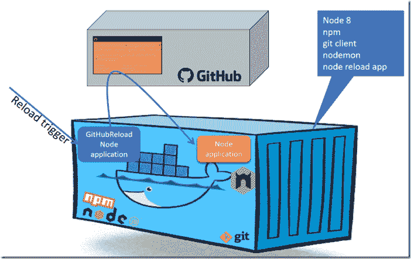
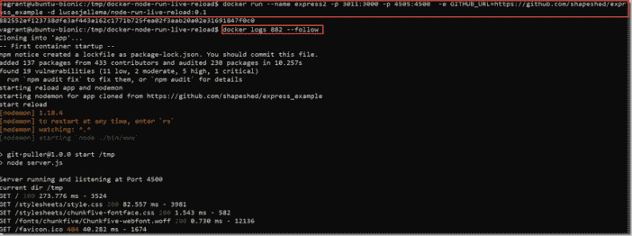
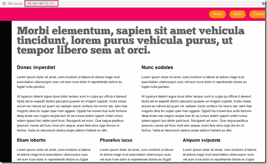
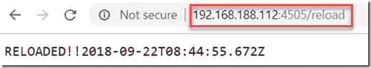
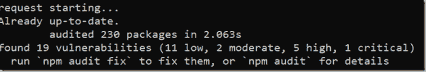
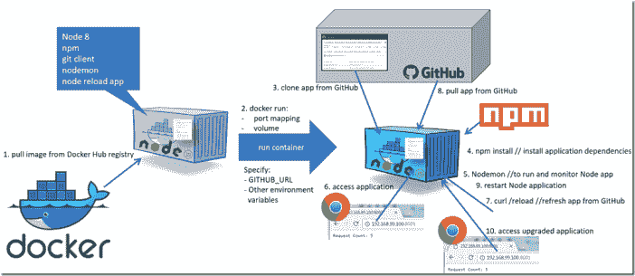

# 基于 GitHub Repo 运行和实时重新加载节点应用程序的通用 Docker 容器映像

> 原文：<https://medium.com/oracledevs/generic-docker-container-image-for-running-and-live-reloading-a-node-application-based-on-a-github-66777bf6e7a8?source=collection_archive---------0----------------------->

我的愿望是:找到一种使用通用 Docker 容器从 Git(Hub)存储库中运行节点应用程序的方法，并且能够在 repo 中的源代码更新时动态刷新运行中的容器。在某些情况下，包括快速开发/测试周期和实时演示，为每个应用程序和应用程序的每次更改生成容器的过程过于繁琐和耗时。我正在寻找一种方便的方法，在任何可以运行 Docker 容器的地方运行节点应用程序，而不必构建和推送容器映像，并在几秒钟而不是几分钟内持续更新正在运行的应用程序。本文描述了我为满足这一需求而创建的内容。

故事中的关键成分:node mon——一个工具，它监视文件系统中 node.js 应用程序的任何更改，并在出现此类更改时自动重启服务器。我不得不把这些放在一起:

基于官方节点映像的通用 Docker 容器——内部有 npm 和 git 客户端

*   添加 nodemon(监视应用程序源)
*   添加一个后台节点应用程序，该应用程序可以根据一个明确的请求、基于一个作业调度并由 Git webhook 触发，从 Git 存储库中刷新
*   为节点应用程序的源 Git 存储库的 URL 定义一个环境变量 GITHUB_URL
*   添加一个启动脚本，该脚本在容器第一次运行时运行(从通过 GITHUB_URL 指定的 Git repo 克隆，并使用 *nodemon* 运行应用程序)或重启时运行(仅使用 *nodemon* 运行应用程序)



我一直在努力学习 Docker 语法和操作(CMD vs RUN vs ENTRYPOINT)以及 Linux bash shell 脚本——我确信我的结果可以改进。

构建包含所有通用元素的 Docker 容器的 Docker 文件如下所示:

```
FROM node:8 
#copy the Node Reload server - exposed at port 4500 
COPY package.json /tmp 
COPY server.js /tmp 
RUN cd tmp && npm install 
EXPOSE 4500 
RUN npm install -g nodemon 
COPY startUpScript.sh /tmp 
COPY gitRefresh.sh /tmp 
CMD ["chmod", "+x", "/tmp/startUpScript.sh"] 
CMD ["chmod", "+x", "/tmp/gitRefresh.sh"] 
ENTRYPOINT ["sh", "/tmp/startUpScript.sh"]
```

随意挑选任何其他节点基础映像—例如来自 https://hub.docker.com/_/node/.[的节点:10。](https://hub.docker.com/_/node/.)

每当启动容器时执行的 startUpScript 负责将节点应用程序从 Git(Hub) URL 初始克隆到目录/tmp/app，并使用 nodemon 运行该应用程序，如下所示。请注意这个技巧(受 [StackOverflow](https://stackoverflow.com/questions/37836764/run-command-in-docker-container-only-on-the-first-start) 的启发)只在容器第一次运行时运行脚本。

```
#!/bin/sh CONTAINER_ALREADY_STARTED="CONTAINER_ALREADY_STARTED_PLACEHOLDER" 
if [ ! -e $CONTAINER_ALREADY_STARTED ]; 
then 
  touch $CONTAINER_ALREADY_STARTED 
  echo "-- First container startup --" 
  # YOUR_JUST_ONCE_LOGIC_HERE 
  cd /tmp 
  # prepare the actual Node app from GitHub 
  mkdir app 
  git clone $GITHUB_URL app 
  cd app 
  #install dependencies for the Node app 
  npm install 
  #start both the reload app and (using nodemon) the actual Node app  
  cd .. 
  (echo "starting reload app") & (echo "start reload";npm start; echo "reload app finished") & 
  cd app; 
  echo "starting nodemon for app cloned from $GITHUB_URL"; 
  nodemon 
else 
  echo "-- Not first container startup --" 
  cd /tmp 
  (echo "starting reload app and nodemon") & (echo "start reload";npm start; echo "reload app finished") & 
  cd app; 
  echo "starting nodemon for app cloned from $GITHUB_URL"; 
  nodemon 
fi
```

启动脚本在后台运行 live reloader 应用程序—使用(echo“start reload”；npm 开始)&。最后一个&符号负责在后台运行命令。这个 *npm start* 命令运行/tmp 中的 server.js 文件。该服务器在端口 4500 监听请求。当在/reload 收到请求时，应用程序将执行 *gitRefresh.sh* shell 脚本，该脚本在/tmp/app 目录中执行 git pull，该目录是存储库的 git 克隆的目标。

```
const RELOAD_PATH = '/reload' 
const GITHUB_WEBHOOK_PATH = '/github/push'var http = require('http'); 
var server = http.createServer(function (request, response) { 
  console.log(`method ${request.method} and url ${request.url}`)if (request.method === 'GET' && request.url === RELOAD_PATH) {
    console.log(`reload request starting at ${new Date().toISOString()}...`);
    refreshAppFromGit();
    response.write(`RELOADED!!${new Date().toISOString()}`);
    response.end();
    console.log('reload request handled...');
  }
    else if (request.method === 'POST' && request.url === GITHUB_WEBHOOK_PATH) {
    let body = [];
    request.on('data', (chunk) => { body.push(chunk);})
           .on('end', () => {
              body = Buffer.concat(body).toString();
              // at this point, `body` has the entire request body stored in it as a string
              console.log(`GitHub WebHook event handling starting ${new Date().toISOString()}...`);
              ... (see code in GitHub Repo [https://github.com/lucasjellema/docker-node-run-live-reload/blob/master/server.js](https://github.com/lucasjellema/docker-node-run-live-reload/blob/master/server.js)              
              console.log("This commit involves changes to the Node application, so let's perform a git pull ")
              refreshAppFromGit();
              response.write('handled');
              response.end();
              console.log(`GitHub WebHook event handling complete at ${new Date().toISOString()}`);
            });
         }else { // respond 
    response.write('Reload is live at path '+RELOAD_PATH);
    response.end(); 
  } 
}); 
server.listen(4500); 
console.log('Server running and listening at Port 4500'); 
var shell = require('shelljs'); 
var pwd = shell.pwd() 
console.info(`current dir ${pwd}`) 
function refreshAppFromGit() { 
  if (shell.exec('./gitRefresh.sh').code !== 0) { 
    shell.echo('Error: Git Pull failed'); 
    shell.exit(1); 
  } 
  else { } 
}
```

# 使用节点-运行-实时-重新加载映像

既然你已经对图像的内部工作原理有了一些了解，让我来告诉你如何使用它(同样参见这里的说明:【https://github.com/lucasjellema/docker-node-run-live-reload】T4)。

要自己构建映像，克隆 GitHub repo 并运行

```
docker build -t "node-run-live-reload:0.1" .
```

如果你喜欢，当然可以使用你自己的图像标签。我已经将图像推送到 Docker Hub，作为 lucasjellema/node-run-live-reload:0.1。你可以像这样使用这个图像:

```
docker run --name express -p 3011:3000 -p 4505:4500  -e GITHUB_URL=https://github.com/shapeshed/express_example -d lucasjellema/node-run-live-reload:0.1
```

在终端窗口中——我们可以使用

```
docker logs express --follow
```



从 GitHub 克隆应用程序后，npm 安装了依赖项，nodemon 启动了应用程序，我们可以在 <host>:3011 访问它(因为 *docker run* 命令中的端口映射):</host>



当 GitHub 存储库中的应用程序源被更新时，我们可以使用一个 GET 请求(来自 CURL 或浏览器)到 <host>:4505，用最新的应用程序定义刷新容器:</host>



来自容器的日志表明执行了 git pull 并且没有返回新的源:



因为没有已更改的文件，所以在这种情况下， *nodemon* 不会重启应用程序。

此时这个通用容器工作的一个要求是节点应用程序在其根目录中有一个 package.json 和一个 scripts.start 条目；nodemon 希望该条目作为如何运行应用程序的指令。这个 package.json 与 *npm install* 一起使用，为节点应用程序安装所需的库。

# 摘要

下图给出了本文所介绍内容的概述。如果您想运行一个节点应用程序，它的源代码可以在 GitHub 存储库中找到，那么您只需要一个 Docker 主机，以下是您的步骤:

1.  拉 Docker 镜像:Docker pull lucasjellema/Node-run-live-reload:0.1(此镜像目前包含 Node 8 运行时、npm、nodemon、一个 git 客户端和 reloader 应用程序)
    或者:自己构建并标记容器。
2.  运行容器映像，传递包含节点应用程序的 repo 的 GitHub URL 为节点应用程序和重新加载程序指定所需的端口映射(端口 4500):docker run–name express-p 3011:3000-p 4500:4500-e GITHUB _ URL =<git hub="" repo="" url="">-d lucasjellema/Node-run-live-reload:0.1</git>
3.  当容器启动时，它将从 GitHub 克隆节点应用程序
4.  使用 *npm install* ，安装应用程序的依赖项
5.  使用 *nodemon* 启动应用程序(并监控源代码，以便在发生变化时重启应用程序)
6.  现在，可以在运行 Docker 容器的主机上访问该应用程序，按照 docker run 命令映射端口
7.  通过对/reload 端点的 HTTP 请求，容器中的 reloader 应用程序被指示
8.  git 从 GitHub 存储库中提取源代码，并运行 npm install 来获取任何更改或添加的依赖项
9.  如果更改了任何源，nodemon 现在将自动重启节点应用程序
10.  可以访问升级的节点应用程序

注意:或者，可以配置 WebHook 触发器。这使得在提交 GitHub repo 时自动触发应用程序重新加载功能成为可能。就像常规的 CD 管道一样，这意味着正在运行的节点应用程序可以自动升级。



# 后续步骤

我正在考虑使用这个通用容器映像的一些后续步骤——我欢迎您的拉取请求——包括:

*   允许通过容器上的环境变量(和/或通过调用重新加载应用程序上的端点)配置自动定期应用程序刷新，指示重新加载程序每 X 秒进行一次 git 拉取。
*   使用 https://www.npmjs.com/package/simple-git 的[而不是 shelljs 加本地 Git 客户端(这可以允许使用更轻的基础映像——比如用 node-slim 代替 node)](https://www.npmjs.com/package/simple-git)
*   强制重启节点应用程序—即使它根本没有更改
*   除了在应用程序的根目录下运行 package.json 中的 scripts.start 条目之外，还允许其他应用程序启动场景

# 资源

包含本文所需资源的 GitHub 资源库—包括构建容器的 docker 文件:[https://github.com/lucasjellema/docker-node-run-live-reload](https://github.com/lucasjellema/docker-node-run-live-reload)

关于我之前尝试从 GitHub 创建用于运行节点应用程序的通用 Docker 容器的文章:[https://technology . amis . nl/2017/05/21/running-Node-js-applications-from-GitHub-in-generic-Docker-container/](https://technology.amis.nl/2017/05/21/running-node-js-applications-from-github-in-generic-docker-container/)

关于 nodemon 的文章和文档:[https://medium . com/lucjuggery/docker-in-development-with-nodemon-d 500366 e 74 df](/lucjuggery/docker-in-development-with-nodemon-d500366e74df)和[https://github.com/remy/nodemon#nodemon](https://github.com/remy/nodemon#nodemon)

允许从节点应用程序执行 shell 命令的 NPM 模块 shelljs:[https://www.npmjs.com/package/shelljs](https://www.npmjs.com/package/shelljs)

*原载于 2018 年 9 月 22 日*[*technology . amis . nl*](https://technology.amis.nl/2018/09/22/generic-docker-container-image-for-running-and-live-reloading-a-node-application-based-on-a-github-repo/)*。*