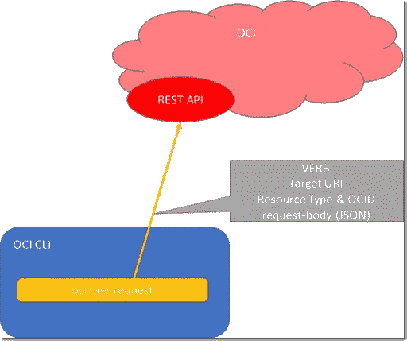

# 使用 OCI CLI 原始请求进行通用 OCI 资源操作

> 原文：<https://medium.com/oracledevs/generic-oci-resource-manipulation-with-oci-cli-raw-request-55610477d831?source=collection_archive---------1----------------------->

我本该意识到这一点——但我没有。通用 [OCI CLI 原始请求选项](https://docs.oracle.com/en-us/iaas/tools/oci-cli/3.6.2/oci_cli_docs/cmdref/raw-request.html) —通过 OCI CLI 对任何 OCI 资源进行查询或操作的统一方法。对于原始请求，每个调用如下所示:

```
oci raw-request -http-method POST -target-uri API-ENDPOINT/API-PATH/resourcetype/resource-OCID -request-body file://request.json
```



With raw-request we can easily invoke any OCI REST APIs through OCI CLI