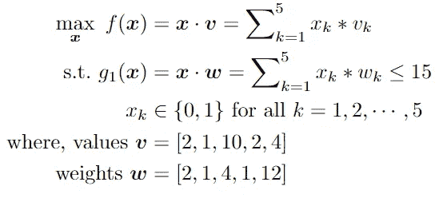

# 遗传算法揭秘—第一部分

> 原文：<https://medium.com/walmartglobaltech/genetic-algorithm-demystified-part-1-776e0f53703f?source=collection_archive---------4----------------------->


[Photo Credit](https://spin.atomicobject.com/2017/10/09/genetic-algorithm-example/)

O 优化是指以获得最佳输出值的方式找到输入值。输入可以采用的所有可能的解或值的集合构成了搜索空间。优化的目的是在搜索空间中找到一个点或一组点，给出最优解。在机器学习的热潮中，优化的重要性经常被忽视。然而，优化是机器学习算法配方中的关键成分。它从定义某种损失/成本函数开始，以最小化该函数结束。例如，在最小二乘回归方法中，目标是通过最小化误差平方和来获得最佳拟合线。


多年来，已经开发了各种类型的方法来解决各种各样的优化问题。遗传算法(GA)就是这样一种方法，它能够在传统算法可能无法提供解决方案的大规模问题中“足够快地”提供“足够好”的解决方案。它是一种基于遗传学和自然选择原理的搜索算法，对于解决子集选择、调度类型的问题特别有用。在本文中，对遗传算法过程的介绍性概述以及子集选择问题类型的几个例子进行了解释。

在本文结束时，您将了解:

*   优化问题如何公式化的概述，
*   解决优化问题的挑战以及遗传算法的帮助，
*   单目标优化问题中 GA 的结构，
*   使用 python 库实现 GA，并以房地产用例为例。

# 1.最优化问题导论

只有一个目标的优化问题具有以下数学形式:


这里，长度为 *n* 的向量**xT5 是优化问题的决策变量，函数 *f* 是目标函数，函数 *g_1、g_2、...，g_p* 为不等式约束函数， *h_1，h_2，...，h_q* 是等式约束函数。每个决策变量还可以单独服从其他约束，例如下限( *l_k* )和/或上限( *u_k* )以及离散或连续值的约束等。值得一提的是，上述最小化问题也可以通过反转目标函数 *f* 的符号转换为最大化问题。**

让我们以一个著名的组合优化问题[‘0–1 背包问题’](https://en.wikipedia.org/wiki/Knapsack_problem)为例。这个问题出现在各种各样的现实世界的决策过程中，如资源分配，投资和投资组合的选择等。


[Image Credit: Wikipedia](https://en.wikipedia.org/wiki/Knapsack_problem)

让我们假设你要进行一次徒步旅行，你想在你的背包(包)中携带一些有用的物品。有五个项目可供选择，你知道所有项目的值( *v* )和权重( *w* )。此外，你不能把它们都带走，因为背包有最大承重能力。所以，现在你必须决定哪些项目要挑选，哪些要省去。目标是在不超过重量限制的情况下，最大化所选商品的总价值。在数学上，上述背包项目选择问题将具有以下形式:



这里，决策变量 *x_k* 可以是 1，也可以是 0，分别表示是否拾取第 *k* 个项目。这类数学形式的优化问题被称为“二元规划”，它是“[整数规划”](https://en.wikipedia.org/wiki/Integer_programming)的一个特例。接下来，我们将深入探讨在解决优化问题时可能出现的挑战。

# **2。解决优化问题的挑战**

首先，让我们尝试使用称为“蛮力”的最简单的方法来解决组合背包问题，其中我们从搜索空间中穷尽地尝试决策变量 ***x*** 的所有可能组合，基于权重约束计算相应的目标函数值和可行性，并相应地确定最佳解决方案。在这种情况下，对于 5 个项目中的每一个，我们有 2 个可能的决策/输入；1 或 0。从组合学理论中，我们知道可能组合的总数是 2^5=32.迭代遍历所有组合后，我们发现最优解是***×=【1，1，1，1，0】，得出总价值为 15 美元，总重量为 8 公斤。***

然而，随着你不断增加问题的规模，也就是项目的数量( *n* )，计算复杂度将呈指数增长。例如，对于 *n* =40 个项目，我们将有总共 1 万亿种组合！即使是世界上最好的超级计算机也需要数年时间来评估所有这些问题。因此，很明显，“强力”方法在大多数现实世界的优化问题中是不可行的。因此，数学家们多年来一直在开发不同类型的技术来解决复杂的优化问题。此外，没有一种“放之四海而皆准”的方法可以保证你对所有不同类型的问题都有最佳的解决方案。算法的选择取决于问题的类型，因为各种算法都是针对特定的问题开发的，具有特定的结构。我们鼓励读者阅读此[链接](https://machinelearningmastery.com/tour-of-optimization-algorithms/)中的文章，以获得不同类别优化算法的概述，并了解哪种算法适合在哪些场景中使用。

优化算法可以根据目标是否是可微函数这一事实进行广泛分类。可微函数是这样一种函数，其中可以计算输入空间中任意给定点的梯度(导数或斜率)。这将算法分为可以利用计算的梯度信息的算法和不能利用计算的梯度信息的算法。所谓的“经典”优化算法如二分法、牛顿法、梯度下降法等。使用导数信息以获得最佳解决方案。尽管基于梯度的方法在平滑函数上比无梯度方法收敛得快得多，但基于梯度的算法存在以下问题:

*   难以应用于不可微或不连续的目标函数。
*   当目标函数是非凸的(即，多个谷和峰)时，陷入局部最优的固有趋势


因此，考虑到现实世界问题场景的复杂性，无梯度算法常常被证明是更好的选择。遗传算法来自一类称为“进化或群体算法”的算法，它们不需要目标函数的梯度。该方法可用于解决各种不太适合标准优化算法的优化问题，包括目标函数不连续、不可微、随机或高度非线性的问题。接下来，我们将使用背包示例来完成传统遗传算法的不同步骤。

# **3。单目标遗传算法的结构**

首先，熟悉一些与遗传算法相关的基本术语是很重要的。


GA terminology

*   **染色体**——染色体是给定问题的一种特殊解决方案。染色体的大小由决策变量 ***x*** 的大小决定。
*   **基因**—基因是染色体的一个元素位置，即决策变量的一个元素。
*   **等位基因**——它是基因在特定染色体上的值。例如，在背包问题中，等位基因可以是 1 或 0。
*   **群体**——是给定问题所有可能解决方案的子集。在候选解可以被表示为个体的意义上，遗传算法的群体类似于人类的群体。GA 的一个重要参数是受问题复杂性影响的`population_size`。在所有世代中，种群的规模保持不变。我们需要优化的参数越多，群体越大越好。


Flowchart of the genetic algorithm process

**人口初始化:**有两种初始化方法-

1.  *随机-* 填充完全随机的解决方案。
2.  *启发式-* 使用问题的已知启发式进行填充。

建议不要用启发式方法初始化整个群体，因为这会导致群体具有相似的解和非常小的多样性。已经通过实验观察到，随机解是将群体推向最优的解。因此，使用启发式初始化，我们只是用几个好的解决方案播种种群，用随机解决方案填充其余的。

**适应度函数:**适应度函数评估一个候选解决方案对问题的“适合”程度。适应值的计算在 GA 中重复进行，因此它应该足够快。

在大多数情况下，适应度函数和目标函数是相同的，因为目标是最大化或最小化给定的目标函数。然而，对于具有多个目标和约束的更复杂的问题，可能需要不同的技术来设计适应度函数，例如多个目标函数的加权求和、将违反约束视为惩罚等。


对于我们的背包问题，让我们设置`population_size=4`并初始化种群(世代=0 ),如上图所示。可以观察到，第三候选解决方案的适合度得分为 0。这是因为，根据第三个解决方案，如果选择了项目#3 和项目#5，则总重量将是 16，这违反了重量能力约束，从而使其成为不良/不可行的解决方案。

**亲本选择:**在这个步骤中，从当前世代中选择亲本解决方案，它们交配并重组以产生下一代的子代。父代选择对遗传算法的收敛速度至关重要，因为好的父代会驱使个体找到更好、更合适的解。然而，保持种群中良好的多样性对于遗传算法的成功也是至关重要的，因此一个非常合适的解决方案可以防止在几代内控制整个种群。

不同选择技术的细节可以在[这里](https://www.tutorialspoint.com/genetic_algorithms/genetic_algorithms_parent_selection.htm)找到。举个例子，我们应用“轮盘赌选择”技术。在这种技术中，每个个体都可以以与其适合度成比例的概率成为父母。概率是个体适应度与群体总适应度的比值。因此，更健康的个体有更高的机会交配并将其基因传播给下一代。


**杂交:**这类似于繁殖和生物杂交。这里，通常选择两个亲本(染色体),通过亲本基因的杂交产生一个或多个后代。因此，子代通过继承父母双方的好基因，可能比他们的父母更优秀，同样地，通过获得坏基因，子代可能更差。该操作由一个名为`crossover_probability`的参数控制，该参数通常设置为接近 1 的很高的值。父代选择和交叉操作重复多次，直到下一代的解的数量达到`population_size`。

这里描述了不同的交叉方法[。例如，在“一点交叉”方法中，选择一个随机交叉点，交换其两个父节点的尾部，以获得两个新的非弹簧。在下图中，交叉操作产生了一个适应度值为 14 的较好解决方案，以及一个适应度值仅为 3 的较差解决方案。](https://www.tutorialspoint.com/genetic_algorithms/genetic_algorithms_crossover.htm)


**突变:**它可以被定义为染色体中的一个小的随机调整，以获得一个新的解决方案。它用于维持和引入群体中的多样性，通常应用较低的`mutation_probability`(例如< 0.1)。各种变异技术可以在[这里](https://www.tutorialspoint.com/genetic_algorithms/genetic_algorithms_mutation.htm)找到。在上面的例子中，我们应用了“比特翻转突变”，我们选择一个或多个随机比特并翻转它们。这是用于二进制编码的气体。在这里，我们可以观察到，只有一个染色体中的一位发生了翻转，这导致了适应值从 3 到 13 的显著提高。

**终止:**当满足以下标准之一时，算法终止:

*   如果达到了已知的最佳或可接受的解决方案水平
*   如果已经执行了最大数量的生成
*   如果给定数量的代没有出现适应性改进

像遗传算法的其他参数一样，终止条件也是高度特定于问题的。在迭代过程终止后，我们从种群的最后一代返回最佳解。

# **4。使用 GA** 在 Python 中存储站点选择

为了演示如何使用 python 包实现遗传算法，我们考虑一个来自房地产用例的新问题。让我们假设，你是一家零售公司的战略决策领导者，你的公司正期待着通过开设新店来扩大业务。你选择一个合适的区域，并找到一些可能的地点/位置来建设新的商店，其中`NUM_LOC`表示潜在位置的总数。与背包问题类似，在这里你必须决定在不同的财务限制(稍后讨论)下，哪些是建造新店的最佳地点，就像重量容量限制一样。然而，你不仅要决定地点，还要决定在某个特定地点建立何种形式/类型的商店，这里的`NUM_FMT`表示可能的形式数量。所以背包问题的不同之处在于，我们的决策现在是二维的:哪个位置和什么格式。决策变量 ***x*** 可以用两种方式定义:

1.  变量的长度仅由位置数决定，使得 ***x*** = [ *x_1，x_2，…，x_NUM_LOC* ]，其中 *x_k* 表示第 *k* 个位置的决定。 *x_k* 的可能值取决于格式的数量，因此 *x_k* 可以取 0 到`NUM_FMT`之间的任何整数值。例如， *x_k=0* 表示不选择第 *k* 个位置， *x_k=1* 表示选择第 *k* 个位置用于建立格式#1 的商店，以此类推。这种方法将把问题变成“整数规划”。
2.  如果我们想像背包问题一样将问题框架为“0–1 整数规划”，那么我们必须对我们的输入(候选解)进行编码，如下所示。因此， ***x*** = `NUM_LOC*NUM_FMT`的长度。为了这个例子，让我们采用这种方法。


Encoding of a sample solution from two-dimensional decision to one-dimension

该问题考虑了四(4)个财务估算作为输入——销售、成本、净现值和在给定位置建立特定商店形式的蚕食影响。为了与决策变量的结构保持一致，我们还需要将财务变量编码为一维数组。

```
import numpy as npNUM_LOC = 3 # Numebr of possible store locations
NUM_FMT = 3 # Number of store formats/types
## Matrices for Financial Estimates (in Millions)
# Sales
S_mat = np.array([[75, 50, 25], [70, 40, 20], [65, 35, 15]])
# Costs 
C_mat = np.array([[35, 20, 10], [35, 20, 10], [30, 18, 8]])     
# NPV
N_mat = np.array([[10, 6, 4], [10, 5, 3], [9, 5, 3]])
# Impact
I_mat = np.array([[3, 2, 1], [3, 2, 1], [3, 2, 1]])
# Vector Representations
sales, cost, npv, impact = S_mat.flatten(), C_mat.flatten(), N_mat.flatten(), I_mat.flatten()
```

此外，还设置了以下业务约束。

*   所选店铺的总成本≤ `CAPEX_LIMIT`
*   所选店铺的总销售额≥ `MIN_MARKET_SALES`
*   每个位置只允许一种商店格式(如果选择了位置)

```
# Business Constraint (in Millions)
CAPEX_LIMIT = 55    # Capital Expenditure Limit                            MIN_MKT_SALES = 105  # Minimum Sales from market
```

现在所有的变量都已经设置好了，我们可以将我们的问题定义为一个类对象。在这个演示中，我们将使用一个名为" [pymoo](https://pymoo.org/index.html) "的包来通过 g a 解决这个问题。首先，我们用不同的参数初始化“问题”类，例如决策变量的大小(`n_var`)、目标函数的数量(`n_obj`)、约束的数量(`n_constr`)、决策变量的上限和下限(`xu,xl`)以及变量的类型。

```
#%% Importing Libraries
from pymoo.factory import get_algorithm, get_crossover, get_mutation, get_sampling
from pymoo.optimize import minimize
from pymoo.core.problem import Problem#%% Problem Definiton
class MyProblem(Problem):
    # Definition of a store site selection problem
    def __init__(self):
        super().__init__(n_var = NUM_LOC*NUM_FMT,
                         n_obj = 1,
                         n_constr = NUM_LOC+2,
                         xl = 0,
                         xu = 1,
                         type_var = int)
```

接下来，我们定义目标函数和约束。在这个问题场景中，我们的目标是最大化(`NPV of selected stores — Imapct of selected stores`)的值，并将其设置为我们的适应度函数。

```
con_mat = np.zeros((NUM_FMT*NUM_LOC, NUM_LOC), dtype=int)
for i in range(NUM_LOC):    
     con_mat[i*NUM_FMT:(i+1)*NUM_FMT,i] = 1def _evaluate(self, X, out, *args, **kwargs):
      # Objective and Constraint functions
      out["F"] = -np.sum(X*(npv-impact), axis=1)  # Objetive Value
      g1 = np.sum(X*cost, axis=1)- CAPEX_LIMIT  # CAPEX constraint
      g2 = -(np.sum(X*sales, axis=1) - MIN_MKT_SALES)#SALES constraint
      g3 = (X@con_mat) -1 # max 1 store format per location
      out["G"] = np.column_stack([g1, g2, g3])
```

最后，我们调用 GA 来解决这个自定义问题。我们设置`pop_size=20, crossover_probability=1`和`number of total genreation=30`来终止过程。

```
#%% Solution
method = get_algorithm("ga",                       
             pop_size=20,
             sampling=get_sampling("int_random"),
             crossover=get_crossover("int_sbx", prob=1.0, eta=3.0),
             mutation=get_mutation("int_pm", eta=3.0),
             eliminate_duplicates=True,)res = minimize(MyProblem(),
               method,
               termination=('n_gen', 30),
               seed=1,
               save_history=True) 
print("Best solution found: %s" % res.X)
print("Function value: %s" % res.F)
print("Constraint violation: %s" % res.CV)
=================================================================# Result:
Best solution found: [0 0 1 0 0 1 1 0 0]
Function value: [-11.]
Constraint violation: [0.]
```

全部代码可在[这里](https://github.com/samrat-nath/python-tests/blob/main/Optimization/store_site_selection_GA.py)获得。在我们对结果进行解码之后，很明显，这个玩具示例的最佳解决方案是在位置 1 建立一个格式 3 商店，在位置 2 建立一个格式 3 商店，在位置 3 建立一个格式 1 商店。

# **5。结论**

遗传算法是在短时间内找到困难问题的最优或近似最优解的有效工具。虽然该算法已被证明更适合于调度和子集选择等优化问题，但该方法的效率主要取决于问题通过染色体定义的程度以及解决方案跨代进化的程度。在下一部分中，我们将了解遗传算法的不同变体，以及在解决多目标优化问题时结构是如何不同的。

# 6.参考

[](https://en.wikipedia.org/wiki/Knapsack_problem) [## 背包问题-维基百科

### 背包问题是组合优化中的一个问题:给定一组项目，每个项目都有一个重量和一个值…

en.wikipedia.org](https://en.wikipedia.org/wiki/Knapsack_problem) [](https://en.wikipedia.org/wiki/Integer_programming) [## 整数编程-维基百科

### 整数规划问题是一个数学优化或可行性计划，其中一些或所有的…

en.wikipedia.org](https://en.wikipedia.org/wiki/Integer_programming) [](https://machinelearningmastery.com/tour-of-optimization-algorithms/) [## 如何选择一个优化算法——机器学习精通

### 最优化是寻找一个目标函数的一组输入的问题，这个目标函数产生一个最大值或最小值…

machinelearningmastery.com](https://machinelearningmastery.com/tour-of-optimization-algorithms/) [](https://www.tutorialspoint.com/genetic_algorithms/index.htm) [## 遗传算法教程

### 本教程涵盖了遗传算法的主题。从本教程中，你将能够了解基本的…

www.tutorialspoint.com](https://www.tutorialspoint.com/genetic_algorithms/index.htm) [](https://pymoo.org/index.html) [## pymoo:Python 中的多目标优化

### 概述 pymoo 0.5.0 中有一些突破性的变化。模块 pymoo.models 已被重命名为 pymoo.core

pymoo.org](https://pymoo.org/index.html)