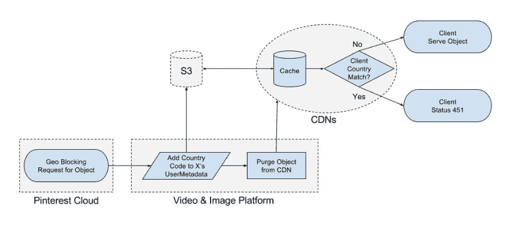

# Pinterest 上的地理屏蔽媒体内容

> 原文：<https://medium.com/pinterest-engineering/geo-blocking-media-content-at-pinterest-ea11c8f8c2b7?source=collection_archive---------3----------------------->

nick de chant & Kynan la lone | Pinterest 工程师，视频和图像平台及流量

Pinterest 工程师的任务是向 Pinners 展示与其兴趣相关的最佳创意，包括考虑位置等信号。作为这些努力的一部分，我们建立了一个[视频和图像平台](/@Pinterest_Engineering/building-pinterests-video-platform-2338dd1d213)，以支持围绕 Pinterest 上的媒体内容的强大基础设施、新功能和工具。在本帖中，我们将重点介绍我们构建的最新工具之一——新的地理封锁 API。

地理封锁是一种行业标准做法，它在出于各种原因的特定位置向用户显示特定内容，同时允许无缝体验并遵守当地法律和保护。在设计这些 API 时，我们将其创建为类似于乐高积木——易于我们所有团队使用，因此他们可以快速移动并将产品交付给品商，而不是花费时间学习新工具。我们的目标是使 API 尽可能简单明了，并记录过程，使跟踪哪个动作在哪个介质上执行变得简单。我们还利用 AWS S3 API 和我们的 CDN 提供商的快速清除 API 来设计它们。

在 API 端，当视频和图像平台收到地理封锁或解除封锁请求时，最初会发生一些事情:

1.  验证成功后，我们会记录该媒体在 Kafka 中的指定国家/地区“进行中”。
2.  然后，我们创建一个特定于地理封锁或地理解除封锁的作业(两者遵循相似的流程)。这允许作业使用视频和图像平台的定位 API 来定位存储在 S3 的媒体的所有变体。
3.  接下来，我们获取 S3 ObjectMetadata，并添加或删除自定义的 UserMetadata，以指示不应提供媒体服务的国家。
4.  该作业调用平台的 CDN 清除 API 来清除我们的 CDN 提供商上的媒体，以便他们使用更新的元数据再次获取媒体对象。
5.  然后，在指定的国家/地区，媒体在 Kafka 中被记录为“成功”。

我们的流量团队管理从客户端到源的请求路径，我们的 CDN 平台允许我们在边缘安装逻辑。当客户端从 CDN 请求图像时，边缘节点首先尝试从 CDN 缓存中获取对象。因为清除 API 已经使对象键无效，所以 CDN 必须进行原点提取。现在，我们在 HTTP 响应头中有了 S3 元数据，可以缓存该对象以供将来的客户端请求使用。最后，对客户端的连接 IP 地址执行地理查找，并与缓存对象的响应标头中以逗号分隔的响应 ISO 3166-1 alpha-2 国家/地区代码列表进行比较。如果找到匹配，客户端将获得一个 HTTP 451 状态代码。

如果特定的 URL 在某些国家被阻止，我们希望保持透明，因此 Pinners 会看到一个简短的解释，说明他们为什么不能访问这些内容，其中可能包括从版权到许可问题的所有内容(这比含糊不清的 404 响应更有用)。

展望未来，我们将迎接新的技术挑战，改进我们的视频和图像基础设施，专注于将 Pinners 放在第一位，让他们无缝体验发现和做自己喜欢的事情。敬请关注我们分享的进展！