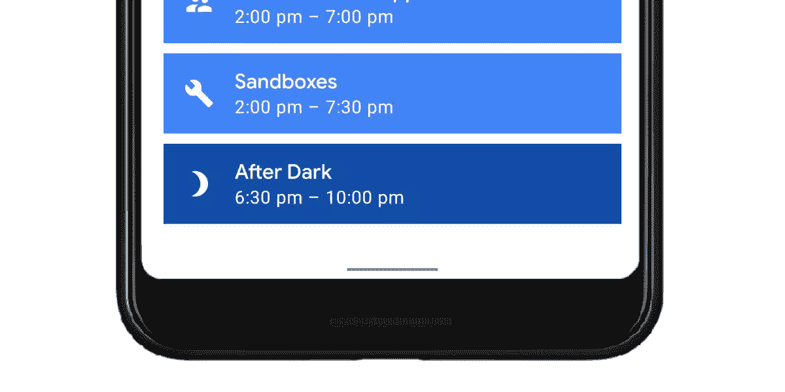

# 手势导航:从边缘到边缘(一)

> 原文：<https://medium.com/androiddevelopers/gesture-navigation-going-edge-to-edge-812f62e4e83e?source=collection_archive---------0----------------------->

Cover image by [Virginia Poltrack](/@VPoltrack)

这是我们手势导航系列的第一篇文章。如果你想跳到另一篇文章，你可以在下面找到它们:

 [## 手势导航:处理视觉重叠(二)

### 这是我的手势导航系列的第二篇文章。如果你错过了，这是目前其他的:

medium.com](/androiddevelopers/gesture-navigation-handling-visual-overlaps-4aed565c134c)  [## 手势导航:处理手势冲突(三)

### 这是我们博客系列的第三篇文章，我们讨论了如何在更新应用程序后处理视觉重叠…

medium.com](/androiddevelopers/gesture-navigation-handling-gesture-conflicts-8ee9c2665c69)  [## 手势导航:沉浸式模式(四)

### 在这个关于手势导航的博客系列的第三篇文章中，我们讨论了如何处理手势冲突…

medium.com](/androiddevelopers/gesture-navigation-immersive-modes-43f2d37a925d) 

您可以收听我们在 2019 年 Android 开发峰会上的演讲:

Going Edge-to-Edge with Gesture Navigation (Android Dev Summit ‘19)

Android 10 增加了新的系统导航模式，允许用户向后导航，导航到主屏幕，并通过手势触发设备助手。

Demo of the new gesture in Android 10

通过转向手势模式进行系统导航，我们可以为您的应用提供更多的屏幕。这有助于应用为您的用户创造更多身临其境的体验。

用户将能够在大多数设备上选择自己喜欢的导航模式。现有的 3 按钮导航模式(包含后退、主页、最近)将继续存在。从 Android 10 开始的所有设备都需要它。

你可以在 Android 系统 UI 产品经理的这篇博客中阅读更多关于手势导航的研究和决策:

 [## 手势导航:背景故事

### Android 10 最大的变化之一是引入了新的手势导航。简单回顾一下——使用新的…

android-developers.googleblog.com](https://android-developers.googleblog.com/2019/08/gesture-navigation-backstory.html) 

这篇文章是一个小系列的第一篇，重点是开发者如何在应用中支持手势导航。该系列将涵盖以下主题:

1.  边缘到边缘，让您的应用程序能够在整个屏幕上绘制
2.  处理与系统用户界面的视觉重叠
3.  处理与系统手势冲突的手势
4.  常见场景，以及如何支持它们

让我们从应用程序如何实现“边缘到边缘”开始…

# 边对边

我使用“边到边”这个术语来描述应用程序将窗口扩展到整个屏幕，以实现更加身临其境的外观。默认情况下，应用程序位于顶部状态栏的下方，底部导航栏的上方(统称为系统栏)。

通过边缘到边缘，应用程序将被放置在系统栏的后面。这是为了让你的应用程序内容闪闪发光，为你的用户创造一个更加身临其境的体验。

实际上，这意味着应用程序需要考虑两件事:

## 导航栏后面的绘图

支持手势导航的第一点，也是最重要的一点，是在导航栏后面绘图。由于导航栏的大小和突出程度已经缩小，现在*强烈*建议应用程序在 Android 10+上运行时绘制在导航栏后面，以获得更加引人注目和现代的 UX。

当在 Android Pie 或更低版本的设备上运行时，在导航栏后面绘图是可选的，允许应用程序决定什么是有意义的。也就是说，几乎所有必要的 API 都可以回溯到 API 21(或者由 AndroidX 处理差异)，因此支持 API 29 之前的设备所需的额外工作是最少的。API 29 之前的设备上的用户也受益于更加身临其境的体验。我们认为它是可选的，只是为了最小化所需的工作和测试的数量。

## 在状态栏后面绘图

其次，我们看屏幕顶部的状态栏。如果对你的内容和布局有意义的话，现在推荐你在状态栏*后面画。那么我们这是什么意思呢？适合在状态栏后面绘制的布局的一个例子是全幅图像。对于开发者来说，这意味着你使用的是类似于 [AppBarLayout](https://developer.android.com/reference/com/google/android/material/appbar/AppBarLayout.html) 的东西，它位于并固定在屏幕的顶部。*

Example of an app with full-width imagery behind the status bar

另一方面，如果你的 UI 由一个固定位置的项目列表组成，工具栏在顶部，在状态栏后面绘制可能没有意义。同样的规则也适用于导航栏:在 Android 10 之前的设备上运行时，它完全是可选的。

# 履行

实施“边对边”绘图有三个关键步骤:

## 1.请求全屏显示

第一步是告诉系统将我们的应用程序放置在系统栏后面(在 y 轴上)。我们使用的 API 是窗口上的[setdecoritsystemwindows()](https://developer.android.com/reference/androidx/core/view/WindowCompat#setDecorFitsSystemWindows(android.view.Window,%20boolean)):`WindowCompat.setDecorFitsSystemWindows(window, false)`。

之后，我们的视图将全屏显示在导航栏后面。

Our app is now laid out full screen, behind the navigation bar

## 2.更改系统栏颜色

由于我们的应用程序现在是全屏显示，我们现在需要改变系统栏的颜色，让我们能够看到它们背后的内容。

**Android 10** 在 Android 10 上运行时，我们唯一的任务就是将系统栏颜色设置为全透明:

在 Android 10 上，系统现在负责在所有导航模式下处理导航栏内容(拖动手柄、按钮等)的所有视觉保护。这意味着我们不再需要自己动手。在实践中，这意味着系统将做两件事之一:

**动态颜色适配** 系统栏内容根据后面的内容改变颜色。因此，如果手柄高于浅色内容，它会变成深色。反之亦然，当在暗的内容前面时，改变为亮的。这就是我们所说的动态色彩适应。

Dynamic color adaptation in Android 10

**半透明稀松布** 或者，系统可以在系统杆后面应用半透明稀松布。最大的警告是，只有当你的应用程序声明`targetSdkVersion`为 29 时，这种情况才会发生。如果您的应用程序面向 SDK 28 或更低版本，将不会显示自动稀松布，给您留下一个透明的导航栏。

System-provided scrim in button navigation mode on Android 10

这两个动作的发生是为了确保用户总是能够看到系统栏的内容。系统选择使用哪个选项取决于几个因素。如果出现以下情况，将使用稀松布:

*   启用其中一种按钮模式(2 按钮或 3 按钮)。
*   在手势导航模式下，并且设备制造商已经选择禁用动态颜色适应。一个可能的原因是设备的性能不足以处理颜色适应。

Example of scrim being used with gesture navigation

否则，将使用动态颜色适应。列出的原因是今天使用的，但它们在未来可能会改变。

**在 Android 10 上禁用系统栏保护** 如果你不想让系统执行任何自动内容保护，你可以通过在你的主题中设置`android:enforceNavigationBarContrast`和/或`android:enforceStatusBarContrast`为`false`来禁用它们。

## 安卓派及以下

如果您决定在 pre-Q 设备上也使用窄边框，您应该设置半透明的系统栏颜色来保护内容。不透明度为 70%的黑色稀松布是开始使用深色系统条的主题的好地方:

您可能需要根据后面显示的内容上下调整不透明度。对于浅色的主题，你也需要设置一个半透明的颜色(例如:`#B3FFFFFF`)。

Example showing a both appropriate scrims in both dark and light themes

## 3.视觉冲突

完成这些之后，您可能已经注意到，您的一些重要视图现在被放置在系统栏的后面。我们的第三步也是最后一步是处理任何视觉重叠，我们将在下面的下一篇博文中讨论。

 [## 手势导航:处理视觉重叠

### 这是我的手势导航系列的第二篇文章。如果你错过了，这是目前其他的:

medium.com](/androiddevelopers/gesture-navigation-handling-visual-overlaps-4aed565c134c)