# 手势导航:处理手势冲突(三)

> 原文：<https://medium.com/androiddevelopers/gesture-navigation-handling-gesture-conflicts-8ee9c2665c69?source=collection_archive---------0----------------------->

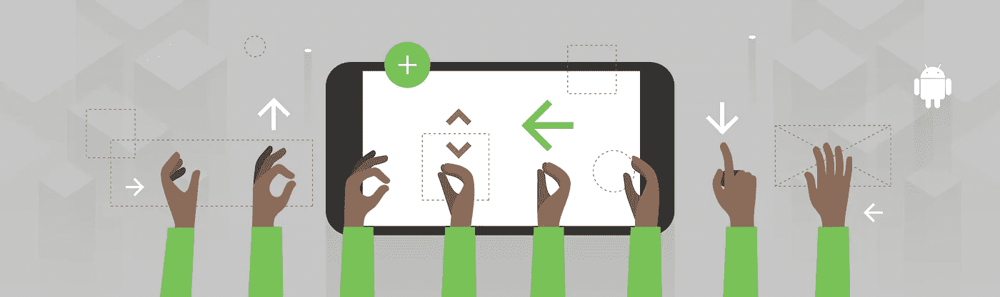

Cover image by [Virginia Poltrack](/@VPoltrack)

这是我们手势导航系列的第三篇文章。如果你想跳到另一篇文章，你可以在下面找到它们:

 [## 手势导航:从边缘到边缘(一)

### Android Q 增加了一个新的系统导航模式，允许用户导航回主屏幕…

medium.com](/androiddevelopers/gesture-navigation-going-edge-to-edge-812f62e4e83e)  [## 手势导航:处理视觉重叠(二)

### 这是我的手势导航系列的第二篇文章。如果你错过了，这是目前其他的:

medium.com](/androiddevelopers/gesture-navigation-handling-visual-overlaps-4aed565c134c)  [## 手势导航:沉浸式模式(四)

### 在这个关于手势导航的博客系列的第三篇文章中，我们讨论了如何处理手势冲突…

medium.com](/androiddevelopers/gesture-navigation-immersive-modes-43f2d37a925d) 

前一篇文章标志着我们关于画到边缘的讨论的结束。在第三篇文章中，我们将介绍如何处理你的应用程序和 [Android 10](https://www.android.com/android-10/) 中新的[系统手势](https://developer.android.com/guide/navigation/gesturenav)之间的任何手势冲突。

我们所说的手势冲突是什么意思？让我们看一个例子。这里我们有一个音乐播放器应用程序，它允许用户通过拖动`[SeekBar](https://developer.android.com/reference/android/widget/SeekBar.html)`来拖动当前歌曲。

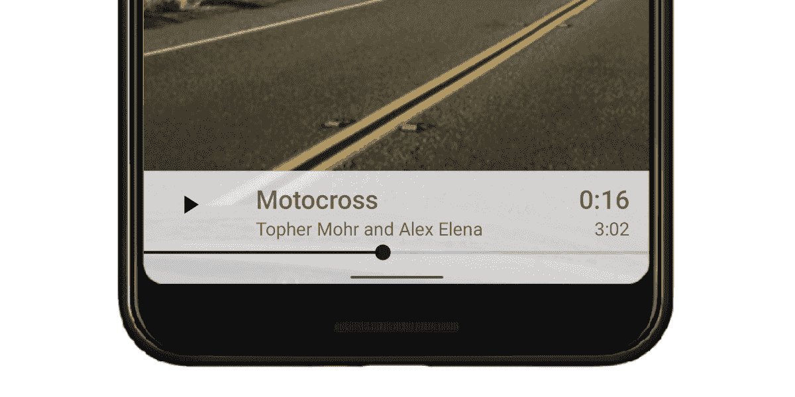

不幸的是，`[SeekBar](https://developer.android.com/reference/android/widget/SeekBar.html)`太靠近主手势区域，导致系统快速切换手势接管并混淆用户。

同样的事情也可能发生在任何带有手势区域的屏幕边缘。有很多常见的例子会引起冲突，比如:[导航抽屉](https://material.io/design/components/navigation-drawer.html) ( `[DrawerLayout](https://developer.android.com/reference/androidx/drawerlayout/widget/DrawerLayout.html)`)、旋转木马`[ViewPager](https://developer.android.com/reference/androidx/viewpager2/widget/ViewPager2.html)`、[滑块](https://material.io/design/components/sliders.html) ( `[SeekBar](https://developer.android.com/reference/android/widget/SeekBar.html)`)、列表上的[滑动动作](https://material.io/design/components/lists.html#behavior)。

这让我们想到了一个问题，“我们如何解决这个问题？”。为了帮助回答这个问题，我们创建了一个流程图来帮助指导其中一个解决方案。

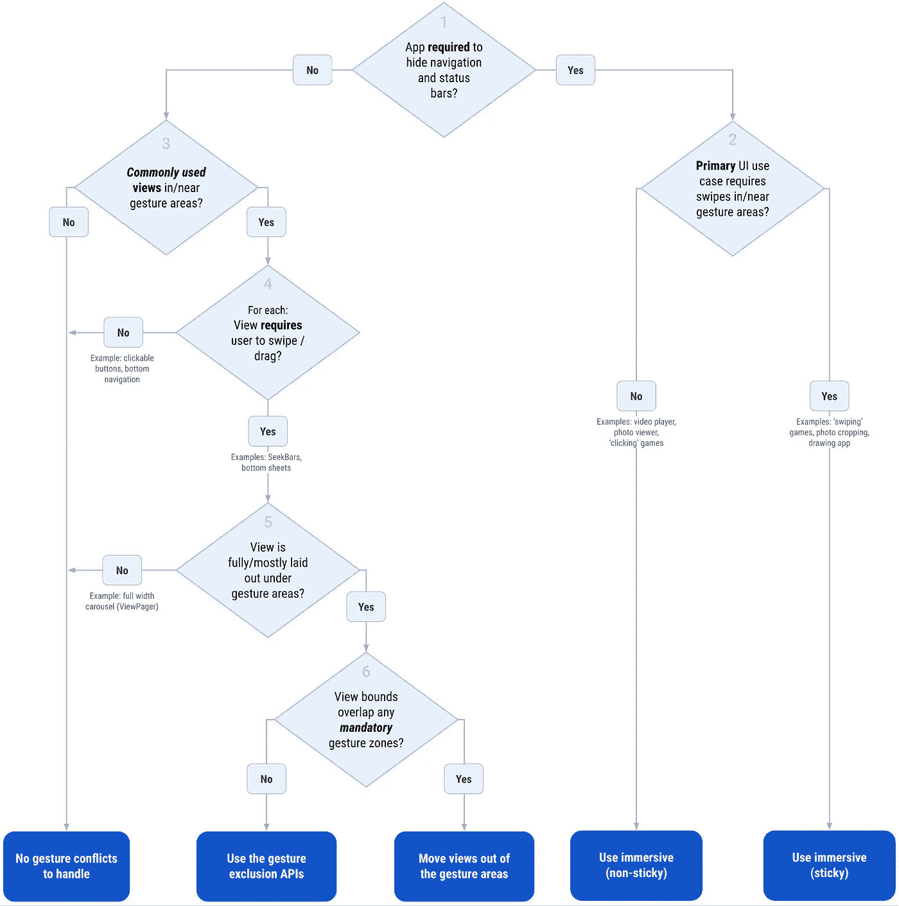

You can find a printable PDF version of the flow chart [**here**](http://bit.ly/gesture-conflict-handling-print).

希望这些问题是不言自明的，但如果你对其中任何一个都不确定，让我们来解释一下:

## 1.隐藏导航条和状态栏需要什么应用？

第一个问题是问你的应用程序的主要用例是否需要**隐藏**导航条和/或状态栏。我们所说的隐藏是指那些系统栏根本看不见。这并不*而不是*意味着你已经让你的应用达到了边缘到边缘，或者类似的效果。

对此问题回答“是”的可能原因如下:

*   您使用`[FLAG_FULLSCREEN](https://developer.android.com/reference/android/view/WindowManager.LayoutParams.html#FLAG_FULLSCREEN)` WindowManager 标志。注意，这也可以通过`[android:windowFullscreen](https://developer.android.com/reference/android/view/WindowManager.LayoutParams.html#FLAG_FULLSCREEN)`主题属性来实现，或者从`Theme.XXX.Fullscreen`主题的一个变体扩展而来。
*   您使用了`[SYSTEM_UI_FLAG_FULLSCREEN](https://developer.android.com/reference/android/view/View.html#SYSTEM_UI_FLAG_FULLSCREEN)`系统用户界面可见性标志。
*   您使用沉浸式模式系统 ui 可见性标志之一:`[SYSTEM_UI_FLAG_IMMERSIVE](https://developer.android.com/reference/android/view/View.html#SYSTEM_UI_FLAG_IMMERSIVE)`或`[SYSTEM_UI_FLAG_IMMERSIVE_STICKY](https://developer.android.com/reference/android/view/View.html#SYSTEM_UI_FLAG_IMMERSIVE_STICKY)`。

回答“是”的应用程序的一些常见例子有游戏、视频播放器、照片浏览器、绘图应用程序。

## **2。主要 UI 用例需要在手势区域内或附近滑动？**

这个问题是问用户界面是否包含任何需要用户滑动的手势区域(back 和 home)中/附近的元素。

游戏通常会回答“是”,原因如下:

*   屏幕上的控件倾向于靠近屏幕的左/右边缘和底部。
*   一些游戏需要在屏幕元素上滑动，这些元素可以在屏幕上的任何地方，例如棋盘游戏应用程序。

在游戏之外，常见的用户界面示例在这里会给出肯定的答案:

*   照片裁剪 UI，其中拖动手柄靠近屏幕的左/右边缘。
*   绘图应用程序，用户可以在覆盖屏幕的画布上绘图。

## **3。手势区域内/附近的常用视图？**

一个简单的问题。这也包括覆盖手势区域的视图，然后扩展到屏幕的更多部分，比如一个`[DrawerLayout](https://developer.android.com/reference/androidx/drawerlayout/widget/DrawerLayout.html)`或大的`[ViewPager](https://developer.android.com/reference/androidx/viewpager2/widget/ViewPager2.html)`。

## **4。视图需要用户滑动/拖动？**

我们在这里稍微改变一下策略，开始关注个人观点。对于第三个答案为“是”的视图，是否需要用户在上面滑动/拖动？

这里有很多你会回答是的例子:`[SeekBars](https://developer.android.com/reference/android/widget/SeekBar.html)`、[、底纸](https://developer.android.com/reference/com/google/android/material/bottomsheet/BottomSheetBehavior.html)，甚至还有一个`[PopupMenu](https://developer.android.com/reference/androidx/appcompat/widget/PopupMenu)`(可以拖开)。

## **5。视图完全/大部分位于手势区域下？**

继问题 4 之后，我们现在要问的是视图是全部还是大部分位于手势区域之下。

如果你的视图在一个可滚动的容器中，比如一个`[RecyclerView](https://developer.android.com/reference/androidx/recyclerview/widget/RecyclerView.html)`，稍微换个角度思考这个问题:*视图是否在所有滚动位置的手势区域下全部/大部分被布局？*如果用户可以将视图滚动到手势区域之外，你就什么都不用做了。

您可能已经看过上面的图表，并看到了全宽传送带(`[ViewPager](https://developer.android.com/reference/androidx/viewpager2/widget/ViewPager2.html)`)的例子，在这里回答“否”，并想知道为什么它导致没有处理。这是因为与视图的宽度相比，左/右手势区域的宽度相对较小(默认:`20dp`)。你典型的[手机屏幕宽度](https://material.io/resources/devices/)在纵向是大约 360dp，留下大约 320dp 宽的可视屏幕，用户的滑动不受阻碍(也就是说*接近* **90%** )。即使有内部填充/边距，用户仍然可以正常滑动转盘。

## 6.视图边界与任何强制手势区域重叠？

最后一个问题询问视图是否被布置在任何强制手势区域下。如果你回想一下我们之前的博文[，你会记得**强制**系统手势区域是屏幕上系统手势*总是*优先的区域。](/androiddevelopers/gesture-navigation-handling-visual-overlaps-4aed565c134c)

Android 10 只有一个强制手势区，位于屏幕底部，允许用户回家或调出他们最近的应用程序。这可能会在未来的平台版本中有所改变，但现在我们只需要考虑屏幕底部的视图。

这里常见的例子有:

*   非模态[底部表单](https://material.io/components/sheets-bottom/)，因为它们倾向于在屏幕底部折叠成小的可拖动视图。
*   屏幕底部的水平滚动的转盘，如贴纸包 UI。

既然我们已经讨论了这些问题，希望您已经找到了其中一个解决方案，那么让我们更详细地讨论一下每个问题。

# 没有要处理的冲突

让我们从最简单的“解决方案”开始，简单地做… *什么也不做*！🙌

可能还有你*可以*进行的优化(见下一节)，但希望在启用手势导航模式的情况下使用你的应用时不会出现大问题。

如果图表带你来到这里，但你仍然觉得有问题，请[让我们知道](http://issuetracker.google.com)。我们可能漏掉了什么。

# 将视图移出手势区域

正如我们在[之前的博客文章](/androiddevelopers/gesture-navigation-handling-visual-overlaps-4aed565c134c)中了解到的，insets 被分派来告诉你的应用程序系统手势区域在屏幕上的位置。我们可以用来解决手势冲突的一种方法是将任何冲突的视图移出手势区域。这对于靠近屏幕底部的视图尤其重要，因为该区域是强制手势区，应用程序不能使用那里的排除 API。

让我们看一个例子。这里我们有一个上面展示过的[音乐播放器 UI](https://github.com/android/uamp) 。它包含一个位于屏幕底部的`[SeekBar](https://developer.android.com/reference/android/widget/SeekBar.html)`，允许用户擦除歌曲。

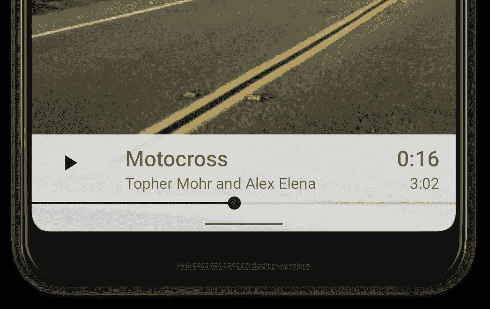

Music player UI with a SeekBar at the bottom of the screen

但是当用户尝试擦除歌曲时，会出现这种情况:

Recording of the system gesture conflicting with the SeekBar

这是因为底部手势区域与 SeekBar 重叠，因此 home 手势优先。以下是直观的手势区域:

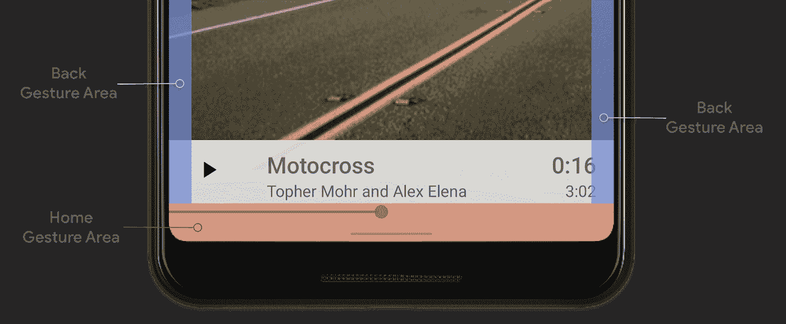

## 简单溶体

这里最简单的解决方案是添加额外的空白/填充，以便 SeekBar 被向上推出手势区域。大概是这样的:

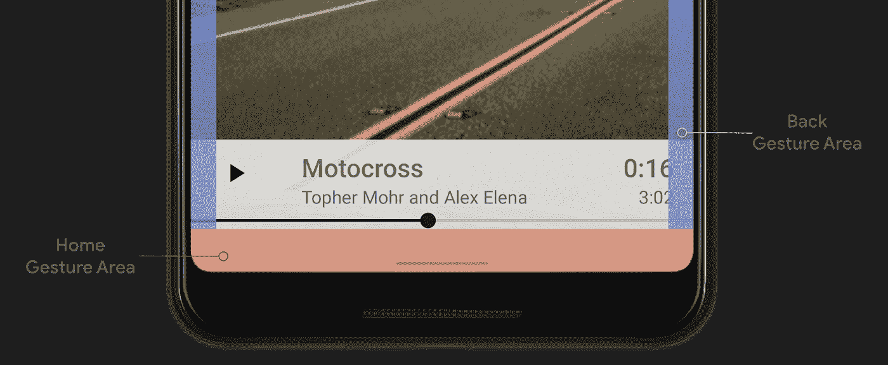

如果我们用这个例子拖动 SeekBar，你会看到我们不再触发 home 手势:

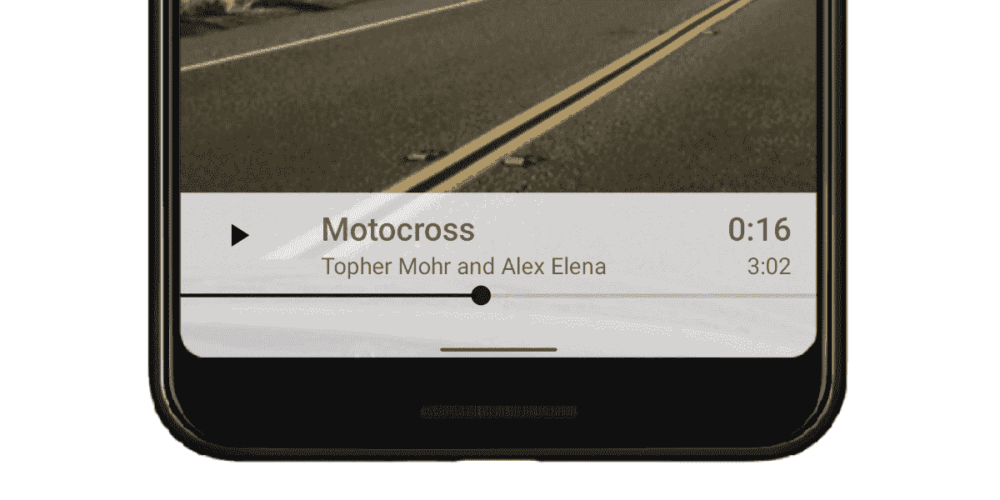

Demo showing the SeekBar no longer conflicting with the bottom system gesture

为了实现这一点，我们需要使用新的[系统手势 insets](https://developer.android.com/reference/androidx/core/view/WindowInsetsCompat.html#getSystemGestureInsets()) ，可在 API 29 和 Jetpack [核心库](https://developer.android.com/jetpack/androidx/releases/core) v1.2.0 中获得(目前在 *alpha* 中)。在示例中，我们增加了`[SeekBar](https://developer.android.com/reference/android/widget/SeekBar.html)`的底部填充，以匹配底部[手势插入](https://developer.android.com/reference/androidx/core/view/WindowInsetsCompat.html#getSystemGestureInsets())值:

你可能有兴趣阅读我们发表的另一篇博文，这篇博文探索了一些让`[WindowInsets](https://developer.android.com/reference/android/view/WindowInsets.html)`更容易使用的方法:

 [## WindowInsets —布局的监听器

### 将我们处理插入的地方移到我们的视图所在的地方，布局文件

medium.com](/androiddevelopers/windowinsets-listeners-to-layouts-8f9ccc8fa4d1) 

## 更进一步

在这一点上，你可能会想:“工作完成了”，对于某些布局来说，这可能是最终的解决方案。但是在我们的例子中，UI 在视觉上已经退化了，在`[SeekBar](https://developer.android.com/reference/android/widget/SeekBar.html)`下面浪费了很多空间。因此，我们可以改变布局，避免浪费空间，而不是简单地填充视图:

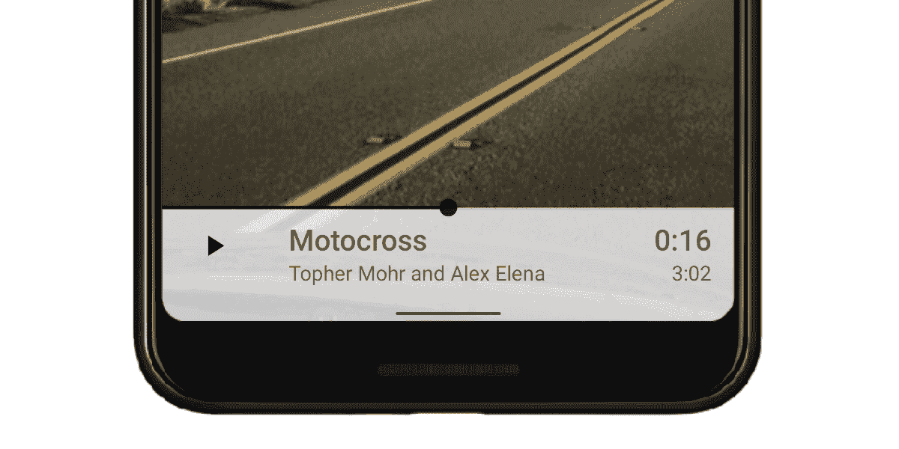

Demo showing the SeekBar moved to the top of the playback bar

在这里，我们将`[SeekBar](https://developer.android.com/reference/android/widget/SeekBar.html)`移到了播放栏的顶部，完全脱离了手势区域。这意味着我们不再需要垫/增加酒吧的高度来容纳`[SeekBar](https://developer.android.com/reference/android/widget/SeekBar.html)`。

*然而，我们应该通过系统栏的高度来填充/增加栏的高度，这样文本就不会明显模糊。这在我们的第二篇博文“* [*处理视觉重叠*](/androiddevelopers/gesture-navigation-handling-visual-overlaps-4aed565c134c) *”中有所涉及。*

# 使用手势排除 API

在我们之前的[博客文章](/androiddevelopers/gesture-navigation-handling-visual-overlaps-4aed565c134c)中，我们提到“*应用能够排除屏幕*某些部分的系统手势”。应用程序这样做的方式是通过系统手势排除 API，这是 Android 10 中的新功能。

系统提供了两种不同的功能来排除区域:`[View.setSystemGestureExclusionRects()](https://developer.android.com/reference/android/view/View.html#setSystemGestureExclusionRects(java.util.List%3Candroid.graphics.Rect%3E))`和`[Window.setSystemGestureExclusionRects()](https://developer.android.com/reference/android/view/Window.html#setSystemGestureExclusionRects(java.util.List%3Candroid.graphics.Rect%3E))`。你使用哪个取决于你的应用:如果你使用 Android `[View](https://developer.android.com/reference/android/view/View.html)`，系统更喜欢 view API，否则使用`[Window](https://developer.android.com/reference/android/view/Window.html)` API。

这两个 API 之间的关键区别在于[窗口 API](https://developer.android.com/reference/android/view/Window.html#setSystemGestureExclusionRects(java.util.List%3Candroid.graphics.Rect%3E)) 期望任何矩形都在窗口坐标空间中。如果使用视图，通常会在视图的坐标空间中工作。[视图 API](https://developer.android.com/reference/android/view/View.html#setSystemGestureExclusionRects(java.util.List%3Candroid.graphics.Rect%3E)) 负责坐标空间之间的转换，这意味着您只需要考虑视图内容。

让我们看一个例子。我们将再次使用我们的音乐播放器的例子，它是`[SeekBar](https://developer.android.com/reference/android/widget/SeekBar.html)`横跨整个屏幕宽度。在上一节中，我们修复了触发 home 手势的`[SeekBar](https://developer.android.com/reference/android/widget/SeekBar.html)`，但是我们仍然需要考虑左右手势区域。

让我们来看看当用户试图在`[SeekBar](https://developer.android.com/reference/android/widget/SeekBar.html)`‘thumb’(圆形拖拽器)位于其中一个边缘附近时拖动歌曲会发生什么:

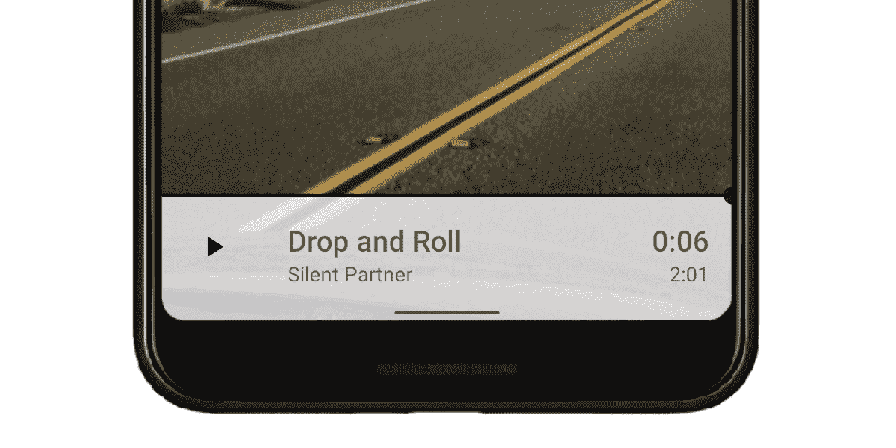

Demo showing the SeekBar conflicting with the back gesture area

由于拇指在右手势区下方，系统认为用户是在打手势后退，所以显示后退箭头。这对用户来说是令人困惑的，因为他们可能并不打算真的回去。我们可以通过使用上面提到的手势排除 API 来排除拇指的边界，从而解决这个问题。

手势排除 API 通常从两个地方调用:`[onLayout()](https://developer.android.com/reference/android/view/View.html#onLayout(boolean,%20int,%20int,%20int,%20int))`当您的视图被布局时，和`[onDraw()](https://developer.android.com/reference/android/view/View.html#onDraw(android.graphics.Canvas))`当您的视图被绘制时。您的视图传入一个`List<Rect>`，包含所有应该被排除的矩形。如前所述，这些矩形需要在视图自己的坐标系中。

通常你会创建一个类似的函数，从`[onLayout()](https://developer.android.com/reference/android/view/View.html#onLayout(boolean,%20int,%20int,%20int,%20int))`和/或`[onDraw()](https://developer.android.com/reference/android/view/View.html#onDraw(android.graphics.Canvas))`中调用:

A full example can be found [here](https://gist.github.com/chrisbanes/4e613a76ebc6a2d3e64d3eee911e1e7d).

一旦我们添加了这个，边缘附近的擦洗工作预期:

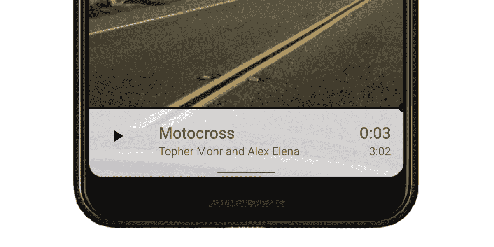

Demo showing the SeekBar working with the back gesture area

> 请注意上面的例子。`[SeekBar](https://developer.android.com/reference/android/widget/SeekBar.html)`实际上在 Android 10 中已经自动为你做到了这一点，所以没有必要自己去做。这只是作为一个例子，向您展示大致的模式。

## 限制

虽然手势排除 API 似乎是解决所有手势冲突的完美解决方案，但实际上并非如此。通过使用手势排除 API，您声明您的应用程序手势比返回的系统动作更重要。这是一个强有力的声明，这就是为什么这个 API 意味着当你不能做任何其他事情时的逃生出口。

> 通过使用手势排除 API，您声明您的应用程序手势比返回的系统动作更重要

由于 API 支持的行为对用户来说是破坏性的，系统限制了它的使用方式:应用程序每条边最多只能排除 **200dp** 。

当开发人员听到这个问题时，他们通常会问:

**为什么有限制？希望上面的解释能给你一点提示。我们认为用户能够持续地从边缘滑动返回是非常重要的。在整个设备上保持一致，而不仅仅是一个应用程序。这个限制可能看起来很严格，但只需要一个应用程序就可以排除屏幕的整个边缘来迷惑用户，导致应用程序卸载或更激烈的事情。**

换句话说，系统导航需要始终一致和可用。

**为什么是 200dp？200dp 背后的想法非常简单。正如我们前面提到的，手势排除 API 旨在作为一个出口，因此限制是作为重要触摸目标的倍数来计算的。触摸目标的最小建议尺寸为`48dp`。4 触摸目标× `48dp` = `192dp`。添加一些填充，我们得到了我们的值`**200dp**`。**

**如果我请求排除超过 200dp 的边缘怎么办？**系统将只接受您请求的最下面的 200dp。

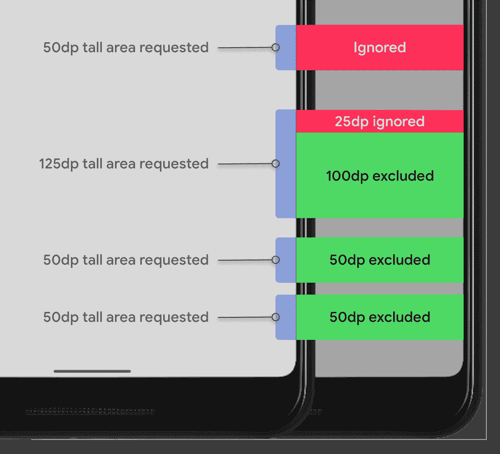

The system honors requests totalling 200dp in height, counted from the bottom edge

**我的视图不在屏幕上，这算不算限制？**否，系统只计算屏幕边界内排除的矩形。类似地，如果视图部分在屏幕上，则只计算所请求矩形的可见部分。

# 沉浸在下一篇文章中

您可能已经到了这里，并且想知道为什么我们没有覆盖流程图的右侧🤔。这些解决方案专门针对需要在整个屏幕上绘制的应用程序。我们将在下一篇博文中讨论这些问题，这篇博文已经发布了👇

 [## 手势导航:沉浸式模式

### 在这个关于手势导航的博客系列的第三篇文章中，我们讨论了如何处理手势冲突…

medium.com](/androiddevelopers/gesture-navigation-immersive-modes-43f2d37a925d)