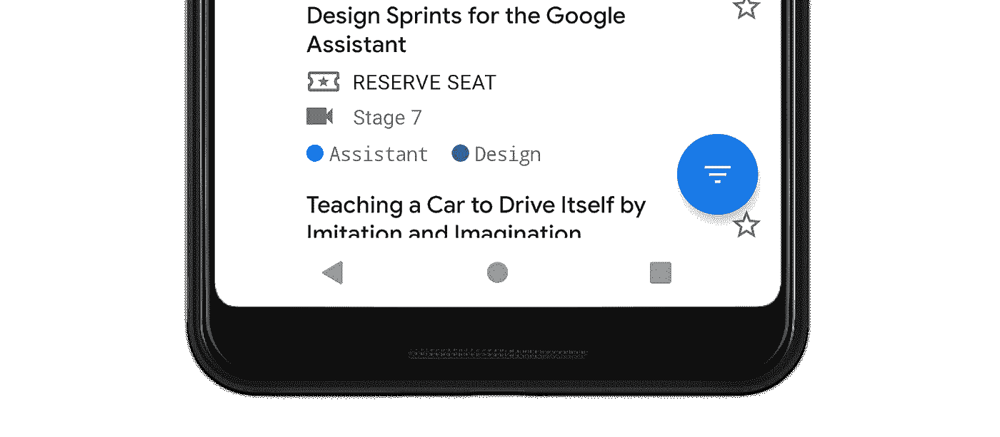
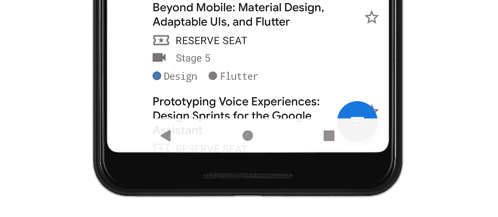
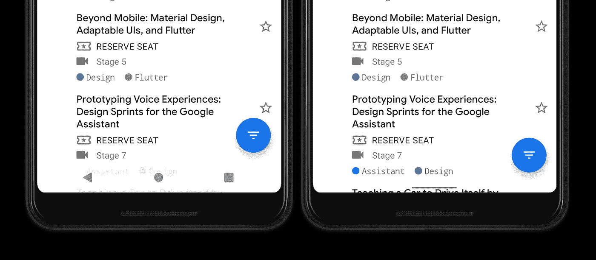
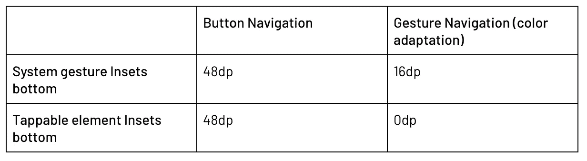
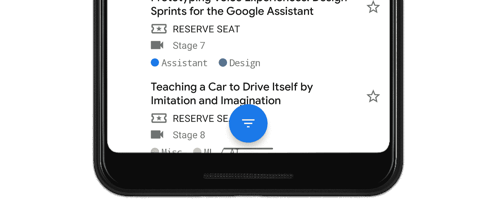
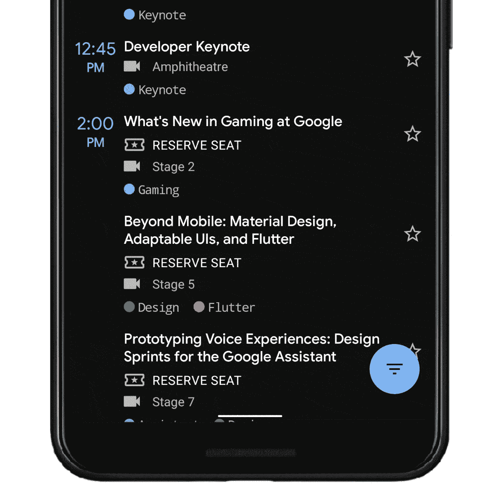

# 手势导航:处理视觉重叠(二)

> 原文：<https://medium.com/androiddevelopers/gesture-navigation-handling-visual-overlaps-4aed565c134c?source=collection_archive---------0----------------------->


Cover image by [Virginia Poltrack](/@VPoltrack)

这是我们手势导航系列的第二篇文章。如果你想跳到另一篇文章，你可以在下面找到它们:

[](/androiddevelopers/gesture-navigation-going-edge-to-edge-812f62e4e83e) [## 手势导航:从边缘到边缘(一)

### Android Q 增加了一个新的系统导航模式，允许用户导航回主屏幕…

medium.com](/androiddevelopers/gesture-navigation-going-edge-to-edge-812f62e4e83e) [](/androiddevelopers/gesture-navigation-handling-gesture-conflicts-8ee9c2665c69) [## 手势导航:处理手势冲突(三)

### 这是我们博客系列的第三篇文章，我们讨论了如何在更新应用程序后处理视觉重叠…

medium.com](/androiddevelopers/gesture-navigation-handling-gesture-conflicts-8ee9c2665c69) [](/androiddevelopers/gesture-navigation-immersive-modes-43f2d37a925d) [## 手势导航:沉浸式模式(四)

### 在这个关于手势导航的博客系列的第三篇文章中，我们讨论了如何处理手势冲突…

medium.com](/androiddevelopers/gesture-navigation-immersive-modes-43f2d37a925d) 

在本系列的第 1 部分中，我们探讨了如何让你的应用程序“边到边”。不幸的是，这会导致您的一些视图被绘制在系统栏的后面，使用户看不到它们。这篇文章探索了我们如何*嵌入*那些视图，将它们从系统栏中移走。

在这篇文章的剩余部分，我将会提到一个叫做“系统用户界面”的东西。这就是我们所说的任何系统在屏幕上提供的 UI，比如导航栏和状态栏。它还包括通知面板之类的东西。

# 插入物

术语 *insets* 往往会让 Android 开发人员感到恐惧，通常来自他们在 Android Lollipop 时代试图隐藏状态栏的经历。比如这个很老的 [StackOverflow 题](https://stackoverflow.com/questions/26440879/how-do-i-use-drawerlayout-to-display-over-the-actionbar-toolbar-and-under-the-st)上的题目就有 ***lot*** 的观点😲。

Insets 告诉你屏幕的哪些部分与系统 UI 相交，比如导航条或状态栏。交叉可能意味着简单地显示在你的内容上面，但它也可以告诉你系统手势。我们可以使用 insets 来尝试和消除任何冲突，例如通过从边缘移动一个视图。

在 Android 上，insets 由`[WindowInsets](https://developer.android.com/reference/android/view/WindowInsets.html)`类表示，在 AndroidX 中由`[WindowInsetsCompat](https://developer.android.com/reference/androidx/core/view/WindowInsetsCompat.html)`表示。有了 Android Q，我们在设计你的应用时有 5 种类型的插件需要考虑。你使用哪种插入类型取决于你所处的情况，所以让我们来看看每种类型，看看…

## 系统窗口插入

**方法:** `[getSystemWindowInsets()](https://developer.android.com/reference/androidx/core/view/WindowInsetsCompat.html#getSystemWindowInsets())`

系统窗口插入是目前最常用的插入类型。从 API 1 开始，它们就以各种形式出现，每当系统 UI 显示在应用程序上方(z 轴)时，它们就被分派到视图层次结构中。常见的例子有状态栏和导航栏，但也包括屏幕键盘(IME)。

让我们看一个使用系统窗口插入的例子。这里我们有一个`[FloatingActionButton](https://developer.android.com/reference/com/google/android/material/floatingactionbutton/FloatingActionButton.html)` (FAB)，放在屏幕的底角，有一个`16dp`的余量(根据[指南](https://material.io/design/components/buttons-floating-action-button.html#specs))。



FAB in the Google I/O app before it was converted to go edge-to-edge

一旦我们完成了[上一篇文章](/androiddevelopers/gesture-navigation-going-edge-to-edge-812f62e4e83e)中的第 1 步和第 2 步，我们的视图现在被展开到导航栏后面:



FAB in the Google I/O app after requesting fullscreen layout

你可以看到我们的会议日程列表现在延伸到导航栏后面，这就是我们想要创造一个更加身临其境的✔️.体验*我们将在以后的文章中更详细地介绍如何处理列表/网格。*

回到示例，您还可以看到 FAB 现在被遮挡，这意味着用户可能无法与视图交互/单击视图。这种视觉冲突是我们想要避免的🚫。当设备被设置为使用按钮导航模式(如图)时，这个例子更明显，因为栏更高。在具有动态颜色适应的手势导航中，它确实有点工作，但请记住，系统可以随时切换到半透明的稀松布，这可能会破坏任何交互。

> 这是指出你应该在所有导航模式下测试你的应用的好时机。

那么我们如何处理视觉冲突呢？这就是**系统窗口插入**发挥作用的地方。它们告诉您系统栏在视图层次结构上的位置，因此我们可以使用这些值将视图从系统栏移开。

在上面的例子中，工厂布置在底部和右侧边缘附近，因此我们可以使用`systemWindowInsets.bottom`和`systemWindowInsets.right`值来增加视图在每个维度上的边距，将其从导航栏上移开。

一旦我们这样做了，我们反而得到以下内容:



*在这篇文章的后面，我们将详细讨论如何实现这一点。*

*TL；DR:* 系统窗口插件最适用于移动/填充视图，这些视图是**可点击的**，并且不应该被系统栏遮挡。

## 可点击元素插入

**方法:** `[getTappableElementInsets()](https://developer.android.com/reference/androidx/core/view/WindowInsetsCompat.html#getTappableElementInsets())`

接下来是 Android Q 中新增的可点击元素插件。这些插件与上面的系统窗口插件非常相似，但对导航栏的不同可见性做出了响应。

**TL；DR**for ' tap table element insets ':忽略它们，使用' system window insets '代替。你可以跳到下面的“手势插图”,或者继续阅读了解更多。🕵️

可点击元素插入定义应用于可点击(可点击)视图的最小**插入。这种情况下的最小值意味着*的值*仍然会导致中的与系统条冲突。这与系统窗口插图不同，后者提供的值总是避免与系统栏冲突。**

让我们用 [FloatingActionButton](https://developer.android.com/reference/com/google/android/material/floatingactionbutton/FloatingActionButton) 的例子来展示值的不同:


Pink = navigation bar bounds. Green = FAB bounds with the specific inset as a bottom margin



> *记住，* ***千万不要*** *硬编码上表中的值，因为导航栏可以改变大小——使用 insets。*

您可以看到，当设备设置为按钮导航时,“可点击元素插入”和“系统手势插入”的作用是相同的。关键区别在于设备何时设置为手势导航*和*启用颜色适应。在这种情况下，导航栏是透明的，这意味着理论上可以在其中放置可点击的视图，这就是它包含底部值 0 的原因。

但是 Insets 不知道视图应该放在哪里，所以当使用 tappable 元素 insets 时，理论上可以得到这样的结果:



这并不理想，因为视图离导航条太近，让用户感到困惑。

**实际上，几乎所有可点击元素插入的用法都由“系统窗口插入”来代替。**

## 手势插图

**方法:** `[getSystemGestureInsets()](https://developer.android.com/reference/androidx/core/view/WindowInsetsCompat.html#getSystemGestureInsets())` & `[getMandatorySystemGestureInsets()](https://developer.android.com/reference/androidx/core/view/WindowInsetsCompat.html#getMandatorySystemGestureInsets())`

我们将讨论的下一种插件是新的系统手势插件，添加到 Android Q 的平台中。概括地说，Android Q 带来了一种新的手势导航模式，允许用户通过两种触摸手势来导航他们的设备:

1.  从显示器的一个边缘水平推送。这触发了后退功能。
2.  从显示屏底部边缘向上滑动。这允许用户去他们的主屏幕或最近的应用程序。



Demo showing gesture navigation on Android Q

系统手势插入表示系统手势优先于应用程序触摸手势的窗口区域。您可能已经注意到，我在上面列出了两种方法。这是因为实际上有两种类型的系统手势插入:一种包含所有手势区域的**和**子集**，包含*强制*系统手势插入。**

**系统手势插图**
首先我们有了系统手势插图。这些插图包含屏幕上所有系统手势优先于应用手势的区域。在 Android Q 上，这意味着插图看起来有点像这样，包含一个 home 手势的底部插图，以及一个 back 手势的左右插图:

```
 0
    +--------------+
    |              |
    |   **System**     |
 40 |   **Gesture**    |  40
    |   **Insets**     |
    |              |
    +--------------+
           60
```

你什么时候会使用系统手势插入？这些插图告诉你系统手势在哪里优先，所以你可以使用它们来主动移动任何需要滑动手势来操作的视图。

常见的例子包括[底层](https://material.io/design/components/sheets-bottom.html)，刷卡游戏互动，旋转木马(ala [ViewPager](https://developer.android.com/reference/androidx/viewpager2/widget/ViewPager2.html) )。一般来说，你应该使用这些插入来移动/填充**可旋转的**视图远离边缘。

**强制系统手势插件** 强制系统手势是系统手势插件的子集，只包含应用程序不能排除的区域(因此得名)。我们已经跳过了下一篇博文，在那里我们将讨论手势冲突的处理，但是为了这篇博文的目的，只需要知道应用程序有能力在屏幕的某些部分排除系统手势。

强制系统手势插入告诉你系统手势**总是**优先的屏幕区域，并且是强制的。在 Android Q 上，目前唯一强制的区域是屏幕底部的 home 手势区域。这是为了让用户能够*总是*退出应用程序。

如果我们来看一个 Android Q 设备的手势插入示例，您可能会得到类似这样的结果:

```
 0                              0  
    +--------------+               +--------------+
    |              |               |   **Mandatory**  |
    |   **System**     |               |   **System**     |
 40 |   **Gesture**    | 40          0 |   **Gesture**    | 0
    |   **Insets**     |               |   **Insets**     |
    |              |               |              |
    +--------------+               +--------------+
           60                             60
```

您可以看到系统手势插入包含左、右和底部，而强制手势只包含 home 手势的底部插入。我们将在下一篇博文中更多地讨论如何排除手势区域。

## 稳定插入

**方法:** `[getStableInsets()](https://developer.android.com/reference/androidx/core/view/WindowInsetsCompat.html#getStableInsets())`

稳定的嵌入是 Android 上可用的最后一种嵌入。它们与手势导航并不特别相关，但是我想为了完整起见，我们会很快介绍它们。

稳定插入与系统窗口插入相关，但它们表示系统 UI *可能*在你的应用程序上显示的位置，而不是系统 UI *显示的位置*。稳定插入主要用于系统 UI 设置为可见性可切换的模式时，例如使用[向后倾斜](https://developer.android.com/training/system-ui/immersive#leanback)或[沉浸式](https://developer.android.com/training/system-ui/immersive#immersive)模式时(常见示例:游戏、照片查看器、视频播放器)。

# 处理插图

希望你现在对不同类型的 insets 有了更好的理解，所以现在让我们看看你是如何在你的应用中使用它们的。

访问`WindowInsets`的主要方法是通过`[setOnApplyWindowInsetsListener](https://developer.android.com/reference/androidx/core/view/ViewCompat.html#setOnApplyWindowInsetsListener(android.view.View,%2520androidx.core.view.OnApplyWindowInsetsListener))`方法。让我们看一个视图的例子，我们想要添加填充，这样它就不会显示在导航栏后面:

这里我们只是将视图的底部填充设置为系统窗口底部插入值。

> ***注意:*** *如果你在一个* `[*ViewGroup*](https://developer.android.com/reference/android/view/ViewGroup.html)` *上做这个，你可能想在它上面设置* `*android:clipToPadding="false"*` *。这是因为默认情况下，所有视图都在填充内裁剪绘图。这个属性通常与* `[*RecyclerView*](https://developer.android.com/reference/androidx/recyclerview/widget/RecyclerView.html)` *一起使用，我们将在后面的帖子中详细介绍。*

不过要确保你的监听器函数是幂等的。如果用相同的 insets 多次调用侦听器，那么每次的结果应该是相同的。下面是一个不幂等的例子:

🙅你不应该在每次调用监听器的时候增加视图的填充。在视图层次结构的生命周期中，窗口插入传递可以在任何时间发生，也可以发生多次。

## 喷气背包

对于 insets 有一点要注意，我建议*总是*使用 [Jetpack](https://developer.android.com/jetpack) 的`[WindowInsetsCompat](https://developer.android.com/reference/androidx/core/view/WindowInsetsCompat.html)`类，不管你的 SDK 最低版本是什么。多年来，WindowInsets API 得到了改进和扩展，compat 版本提供了跨所有 API 级别的一致 API 和行为。

我在 Android Q 中提供了新的 insets 类型，compat 方法提供了一组值，这些值在所有 API 级别上都适用于主机设备。要访问 [AndroidX](https://developer.android.com/jetpack/androidx) 中的新 API，请确保更新到`androidx.core:core:**1.2.0**-xxx`(目前在 alpha 中)或更高版本。最新版本见此处。

# 更进一步

我上面提到的技术是使用`WindowInsets[Compat]`API 的最简单的方法，但是它们会使您的代码非常冗长和重复。今年早些时候，我写了一篇博文，详细介绍了一些使用绑定适配器显著提高处理窗口插件的人体工程学的技术。您可以在此阅读更多信息:

[](/androiddevelopers/windowinsets-listeners-to-layouts-8f9ccc8fa4d1) [## WindowInsets —布局的监听器

### 将我们处理插入的地方移到我们的视图所在的地方，布局文件

medium.com](/androiddevelopers/windowinsets-listeners-to-layouts-8f9ccc8fa4d1) 

在本系列的下一篇博文中，我们将探讨如何处理你的应用程序与系统手势之间的冲突:

[](/androiddevelopers/gesture-navigation-handling-gesture-conflicts-8ee9c2665c69) [## 手势导航:处理手势冲突(三)

### 这是我们博客系列的第三篇文章，我们讨论了如何在更新应用程序后处理视觉重叠…

medium.com](/androiddevelopers/gesture-navigation-handling-gesture-conflicts-8ee9c2665c69)